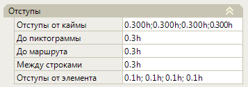
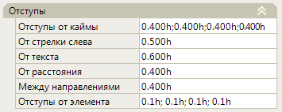
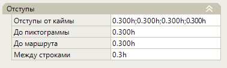
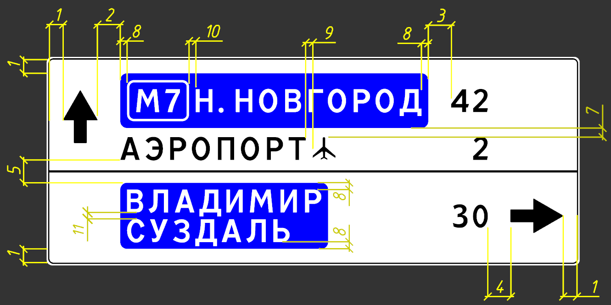
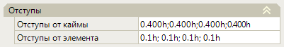
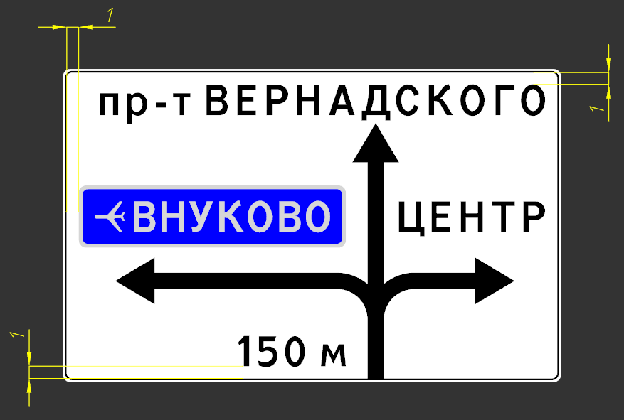
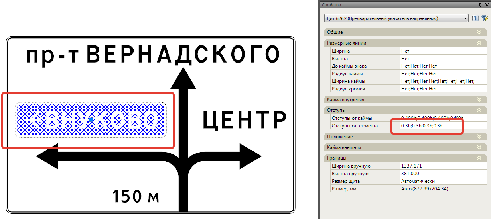
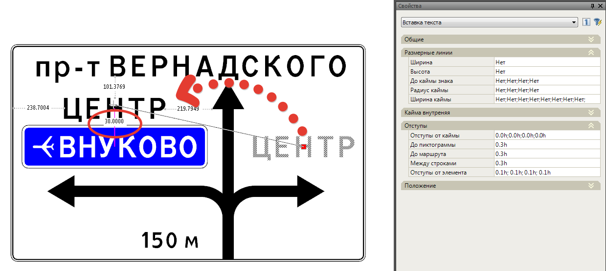

# Отступы

## Общие сведения

Раздел настроек **Отступы** в окне **Свойств** выбранного элемента позволяет настроить расстояния по горизонтали\вертикали между различными элементами щита (**Направлениями**, **Строками**, **Маршрутами** и т.д.):

По умолчанию значения отступов заданы относительно размера высоты прописной буквы. Также имеется возможность значения величины отступа задавать в данных полях в миллиметрах.



Задание **Высоты прописной буквы** для элемента **Щит** см. главу [Щит (общие свойства)](description_common_elements_sign/properties_shield.md).



## Задание отступов для щитов типа 6.10., 6.12. и их элементов

В данном разделе на примере щита типа 6.10. рассмотрим задание Отступов в окне Свойств для элемента Щит и его внутренних элементов (Направление, Вставка и т.д.).

**Отступы для элемента Щит:**

* **1 - Отступы от каймы.** Отсчитывается от внутренней каймы щита до всех ближайших к ней элементов.

  

  Расстояние отступа задается с каждой стороны отдельно через разделитель «;» (точку с запятой) в следующей последовательности - слева, сверху, справа, снизу.

  

* **2 - Отступы от стрелки слева**. Отсчитывается слева от Вставки текста до Стрелки.
* **3 - От текста.** Отсчитывается справа от Вставки текста до Расстояния (Стрелки)
* **4 - От расстояния.** Отсчитывается справа от Расстояния до Стрелки
* **5 - Между направлениями.** Задается вертикальное расстояние между Направлениями.
* **Отступы от элемента.** В случае если Щит находится внутри другого щита (например, при проектирования знака 6.9.1), то задание отступов в данном поле будет определять расстояние срабатывания динамической привязки при перемещении какого либо элемента к данному щиту.

  

  * Пример работы данного отступа показан ниже в текущей главе.
  * Включение динамической привязки при перемещении элементов описано в соответствующей главе [Компоновка элементов на щитах 6.9. и 6.17](structure_sign/arrangement_elements.md).

  

**Отступы для элемента Направление:**

* **7 - Между вставками.** Задается вертикальное расстояние между Вставками текста.

**Отступы для элемента Вставка:**

* **8 - Отступы от каймы.** Отсчитывается от внутренней каймы Вставки до всех ближайших к ней элементов.

  

  Расстояние отступа задается с каждой стороны отдельно через разделитель «;» (точку с запятой) в следующей последовательности - слева, сверху, справа, снизу.

  

* **9 - До пиктограммы.** Отсчитывается от Текстовой надписи до Пиктограммы.
* **10 - До маршрута.** Отсчитывается от Текстовой надписи до Маршрута.
* **11 - Между строками.** Задается вертикальное расстояние между строками Вставки текста.

Все параметры наглядно показаны ниже на рисунке:

## Задание отступов для щитов типа 6.9., 6.17 и их элементов

**Отступы для элемента Щит:**

* **1 - Отступы от каймы**. Отсчитывается от внутренней каймы щита до всех ближайших к ней элементов.

  

  Расстояние отступа задается с каждой стороны отдельно через разделитель «;» (точку с запятой) в следующей последовательности - слева, сверху, справа, снизу.

  

  

* **2- Отступы от элемента**. В случае когда Щит находится внутри другого щита, то задание отступов в данном поле будет определять расстояние срабатывания динамической привязки при перемещении какого либо элемента к данному щиту. Ниже показан пример задания отступов от элемента:

  Рисунок 1. Для элемента Щит, который вставлен внутрь основного щита заданы отступы 0,3h (или 30 мм при величине прописной буквы 100 мм):

  

  Рисунок 2. При перемещении элемента Вставка текста (или любого другого элемента) к данному щиту, срабатывает динамическая привязка на расстоянии 30 мм:

  

  

  Включение динамической привязки при перемещении элементов описано в соответствующей главе [Компоновка элементов на щитах 6.9. и 6.17](structure_sign/arrangement_elements.md)



* Раздел настроек Отступы для остальных элементов щитов типа 6.9 и 6.17 таких как Маршрут, Вставка текста, Пиктограмма, Стрелка и т.д. работают аналогично.