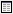
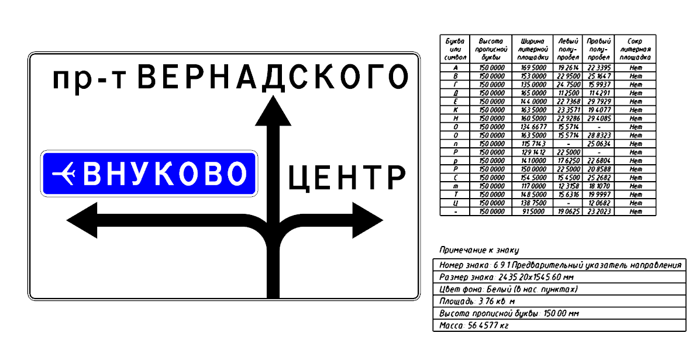

# Вывод дополнительных данных по щиту знака

В программе имеется возможность вывода дополнительной информации по необходимому щиту знака в виде **Таблицы символов** и **Примечания к знаку**.

Для этого:

1. Выберите на **Панели инструментов** соответствующую иконку **Таблица символов**  или **Примечание к знаку** .
2. Левой кнопкой мыши выберете щит по которому необходимо вывести эти данные.
3. Укажите место вставки таблицы.



Так как добавляемые таблицы не являются динамическими, то при изменении каких либо данных на щите знака, таблицы необходимо пересоздать.

