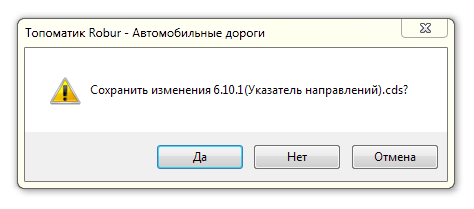
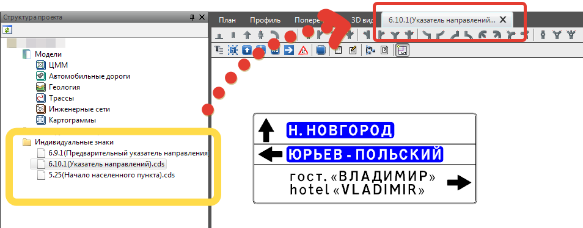

# Сохранение и открытие знаков

По окончанию работы с файлом индивидуального знака и закрытии вкладки программа выдаст запрос о сохранении данных:

Файлы сохраняются в отдельной папке **Индивидуальные знаки**, которая находится в папке проекта.



По умолчанию путь хранения файлов `C:\Users\Пользователь\Documents\Топоматик Robur\ Projects\Имя проекта\Индивидуальные знаки`.



Для того чтобы снова открыть файл индивидуального знака для редактирования, щелкните по соответствующему элементу в окне **Структура проекта** двойным кликом мыши, в результате индивидуальный знак будет открыт в отдельной вкладке и доступен для редактирования:

Для открытия файла индивидуального знака, находящегося в другом проекте или на другом компьютере:

1. Создайте\откройте любой проект **Топоматик Robur**.
2. В окне **Структуры проекта** щелкните правой кнопкой мыши по наименованию проекта или предварительно созданной папке.
3. Из контекстного меню выберите **Добавить - Существующий файл**.
4. После чего найдите данный файл в открывшемся окне и нажмите **Открыть**. Файл добавится в конец **Структуры проекта** или созданную папку.



Тип файла индивидуальных знаков имеет формат **\*cds**.

