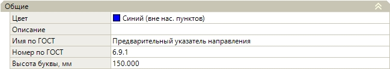
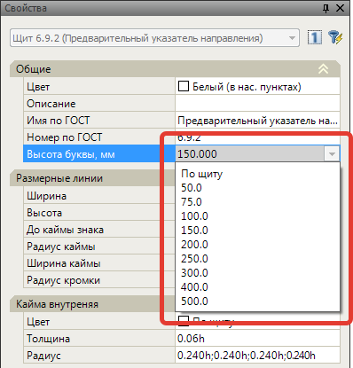
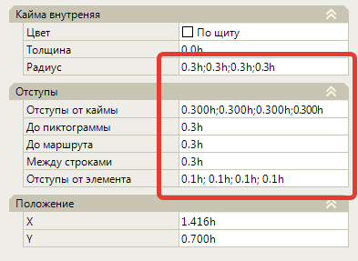
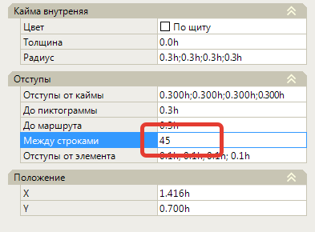
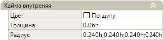
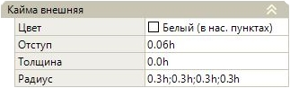
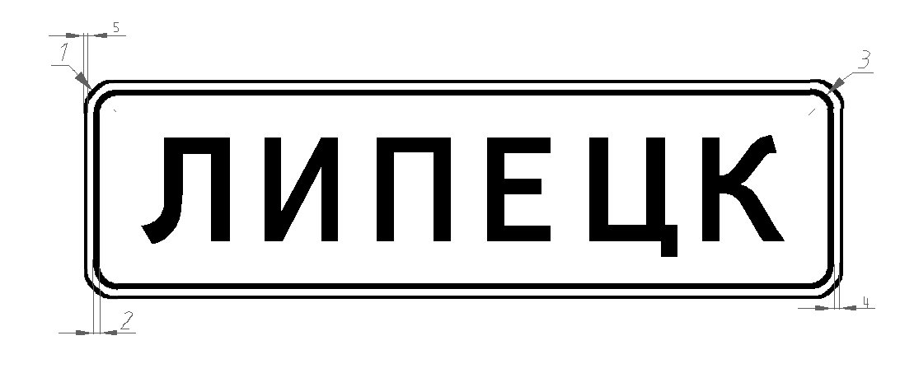
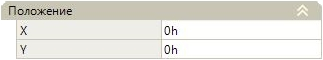
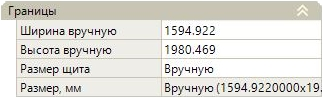

# Щит (общие свойства)

В данном разделе рассмотрены параметры элемента **Щит**, которые одинаковые для всех знаков индивидуального проектирования.



Отличительные особенности параметров щитов других типов знаков будут описаны в соответствующем разделе [Характерные особенности других знаков индивидуального проектирования.](characteristic_peculiarity_other_signs.md)



Для того, чтобы отобразить параметры, выберите щит в **Структуре знака** или в графическом поле. В окне **Свойства** будут отображаться параметры щита. 

## Общие

**Цвет**. В данном выпадающем списке выбирается цвет щита.

**Описание**, **Имя по ГОСТ** и **Номер по ГОСТ**. Данные текстовые поля являются информационными и заполняются по необходимости.

**Высота буквы**. В данном выпадающем списке выбирается высота прописной буквы, в зависимости от которой, *по умолчанию*, определяются параметры щита (параметры каймы, отступов и т.д.), а также размеры всех вложенных в данный щит элементов (маршрут, вставка текста и т.д.).



Размер высоты прописной буквы может быть выбран как из ряда стандартных размеров, так и введен вручную в данное поле. 



Так как параметры щита индивидуального знака (Отступы, Кайма и т. д. и его внутренние элементы) согласно ГОСТ определяются по высоте прописной буквы, то в окне **Свойств** все значения в полях где задается размер, отступы, радиусы и т.д., по умолчанию, имеют вид: 0.3h, 0.06h и т.д., где h - это высота прописной буквы (заданная в Свойствах щита), а впереди стоящее число 0.3, 0.06 и т.д. - это коэффициент на который умножается величина прописной буквы (заданная в Свойствах этого щита).

Таким образом, по умолчанию, размер всех элементов знака задан в зависимости от высоты прописной буквы, что делает удобным задание всех размерных величин, а также автоматическое перестроение элементов в случае если высота прописной буквы в свойствах щита была изменена.

При необходимости размеры также могут быть заданы в миллиметрах, без учета высоты прописной буквы. Для этого введите необходимое числовое значение:



В данном случае высота прописной буквы в параметрах щита будет игнорироваться.



## Размерные линии

Работа с данным полем подробно описана в разделе [Размерные линии](dimension_lines.md).

## Кайма

### Внутренняя

### Внешняя

* **1 - Радиус внешней каймы**.
* **2 - Толщина внутренней каймы**.
* **3 - Радиус внутренней каймы.**
* **4 - Отступ.** Величина отступа от внутренней каймы.
* **5 - Толщина внешней каймы**.

## Отступы

Работа с данным полем подробно расписана в разделе [Отступы](indented.md).

## Положение

Положение щита в рабочем пространстве задается координатами Х и Y.



Если элемент (стрелки, маршруты, текст, и т.д.) вставлен внутрь щита, то началом координат для него является центр этого щита.



## Границы

**Размер щита** - в данном поле выбирается один из способ задания размера.

* **Автоматически** - размер щита определяется автоматически по содержимому с учетом заданных отступов от каймы щита.



Задание **Отступов** подробно описано в соответствующей главе [Отступы](indented.md)



* **Вручную** - размер щита формируется по данным заданным в поле **Ширина\Высота вручную**.
* **По УЗДП** - размер щита подбирается с учетом унифицированного ряда размеров УЗДП.