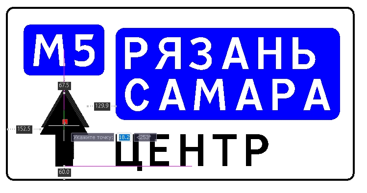

# Компоновка элементов на щитах 6.9. и 6.17

Характерной особенностью шаблонов знаков 6.9 и 6.17 является то, что элементы на щите могут располагаться свободным образом, при этом действующие нормативные методики накладывают ограничения на расстояния между элементами или элементом и каймой. 

Поэтому для соблюдения данных требований по отступам при перемещении элементов (компоновке) на щите предусмотрен специальный режим, при включении которого будут отображаться вспомогательные линии и работать автоматическая привязка к ближайшим элементам, которая позволит автоматически выровнять один элемент относительного другого (по левому\правому краю, середине и т.д.), соблюдая минимально заданные отступы от элемента.



Более подробно задание отступов для элементов будет описано в следующем разделе [Отступы](../indented.md).



Для того чтобы включить режим автоматической привязки щелкните левой кнопкой мыши по иконке  на **Панели инструментов**.

На примере перемещаемого элемента **Стрелка** показана работа функции **Динамической привязки** линиями фиолетового цвета, а также работа динамических отступов.

