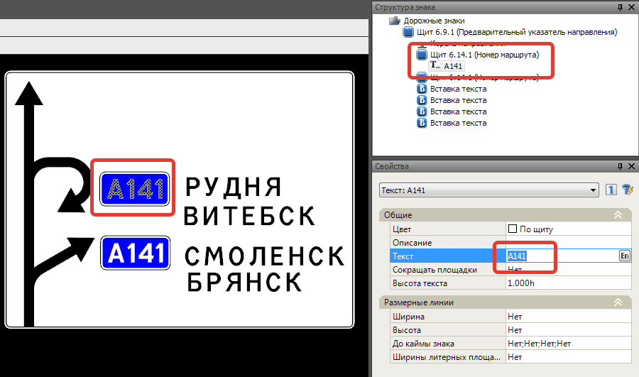
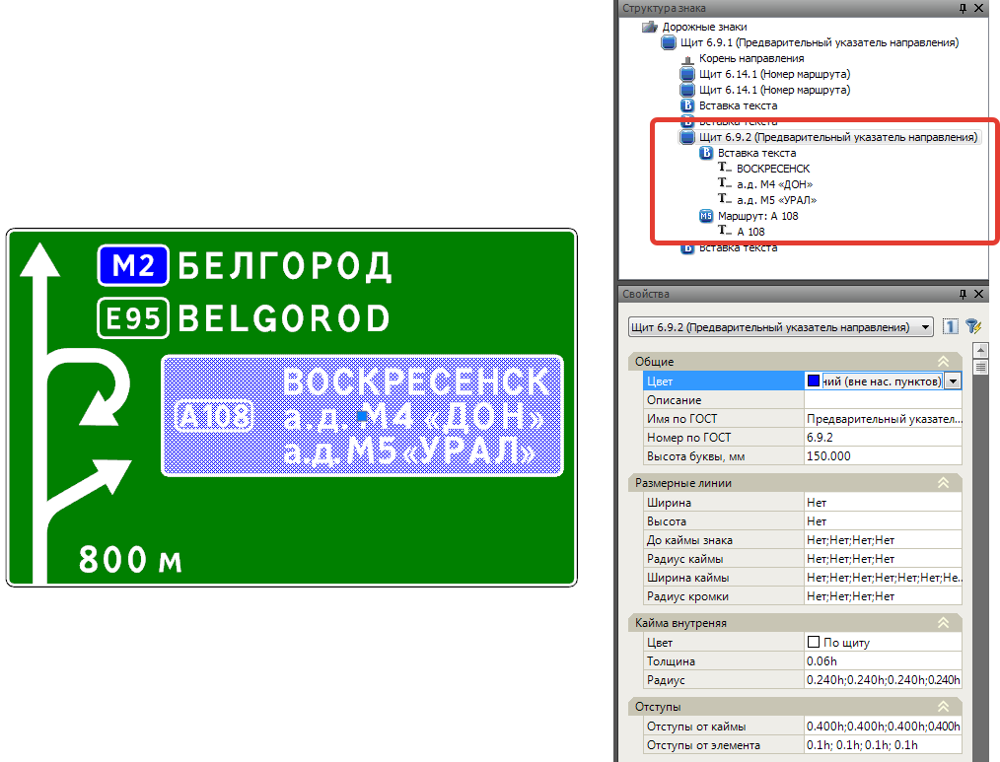
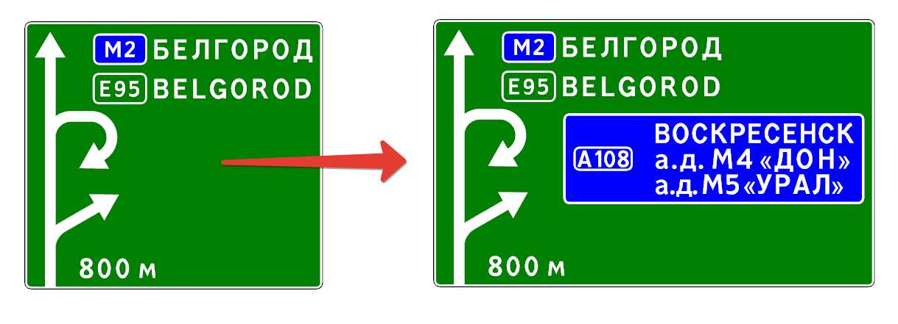
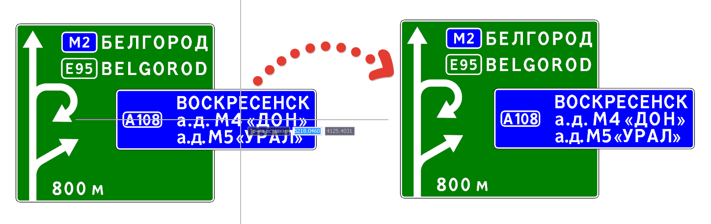
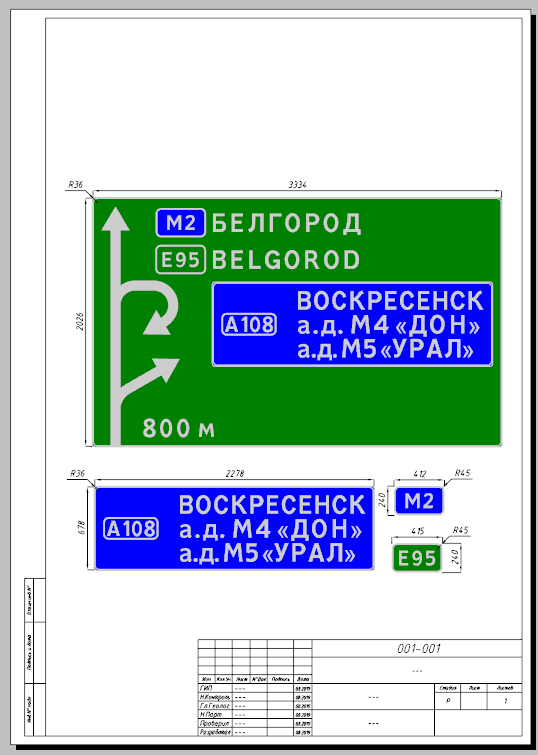
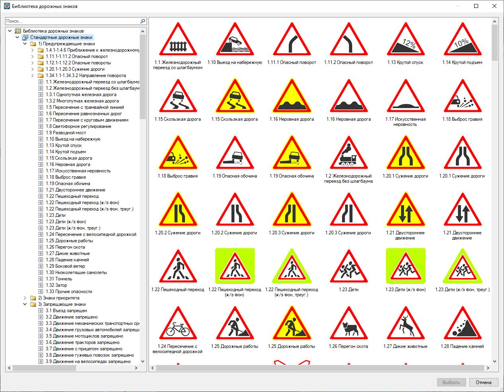

# Вставка и свойства различных элементов в шаблонах щитов типа 6.9. и 6.17

В данном разделе описаны отличительные особенности, механизмы работы и свойства таких элементов как **Вставка текста**, **Номер маршрута**, **Пиктограмма**, **Стрелка** и **Расстояние** для щитов типа 6.9 и 6.17. Также описан механизм вставки щитов других знаков и стандартных дорожных знаков.



Механизмы работы и свойства перечисленных выше элементов в других типах щитах были описаны в [данном разделе](../creation_signs_individual_design.md).



## Добавление элемента Номер маршрута

Для добавления маршрута:

1. Выберите на панели инструментов соответствующую кнопку .
2. Далее укажите левой кнопкой мыши положение на щите.
3. Для того чтобы отредактировать содержимое **Маршрута** выделите элемент **Текст** в **Структуре проекта** либо в Рабочем окне, далее в окне **Свойств** введите необходимые данные:

   



В щитах типа 6.9. и 6.17. элемент **Маршрут** добавляется в качестве отдельного элемента - «щит с текстом». Маршрут является самостоятельным элементом и может располагаться в любом месте щита. В отличие от щитов типа 6.10 элемент **Маршрут** всегда добавляется внутри элемента **Вставка текста**, являясь как бы ее свойством.



## Добавление различных элементов

Добавление таких элементов как **Тект , Расстояние , Стрелка ** и **Пиктограмма ** осуществляется с помощью выбора соответствующих кнопок на **Панели инструментов** и вставки их в щит с помощью указания положения левой кнопкой мыши.

* Элемент **Текст** и **Расстояние** добавляется в качестве [Вставки текста](../description_common_elements_sign/text_insertion.md) свойства которой подробно были описаны в [соответствующем разделе документации](../description_common_elements_sign/text_insertion.md).
* Элементы **Стрелка** и **Пиктограмма** в щитах типа 6.9. и 6.17. добавляются в качестве самостоятельных элементов, т.е. могут располагаться в любом месте щита, в отличие от щитов типа 6.10 где элементы **Стрелка** и **Пиктограмма** всегда добавляются внутри элемента [Направление](../creation_signs_individual_design.md) и [Вставка текста](../description_common_elements_sign/text_insertion.md) соответственно, являясь как бы свойствами этих элементов.



Основные свойства элементов **Стрелка** и **Пиктограмма** в различных шаблонах щитов аналогичны и были подробно описаны в разделе [Редактирование знаков индивидуального проектирования (на примере знака 6.10.1 «Указатель направлений»)](../creation_signs_individual_design.md).



## Добавление щита индивидуального знака

Для щитов типа 6.9. и 6.17 предусмотрена возможность вставки любых других типов щитов индивидуальных знаков, для этого:

1. Воспользуйтесь функцией **Индивидуальный знак**, выбрав на **Панели инструментов** соответствующую иконку .
2. В открывшемся окне библиотеки индивидуальных знаков выберите необходимый щит знака.
3. Далее укажите место вставки щита.

  

**Характерные особенности и способы редактирования:**

* Добавляемый щит будет являться стандартным элементом [Щит](../description_common_elements_sign/properties_shield.md), внутрь него могут быть добавлены свои элементы (**Вставка текста**, **Пиктограмма** и т.д.), т.е. для добавленного щита доступны все описанные в данной документации механизмы редактирования.
* При вставке элемента анализируется положение курсора, т.е. в случае если курсор находился в области имеющегося щита, то добавляемый элемент будет вставлен "внутрь" этого щита где он будет учитываться при определении размера, в случае если размер имеющегося щита определяется Автоматически:

  

* Если в момент добавления щита курсор находился вне границ другого щита, то добавляемый щит вставится как отдельный элемент:

  

* Для элементов предусмотрена возможность копирования **Ctrl+C** и вставки **Ctrl+V** через буфер обмена. Таким образом, для оформительских задач отдельные элементы могут быть вынесены из основного щита и оформлены.

  

## Вставка стандартных дорожных знаков

1. Выберите на панели инструментов соответствующую иконку , щелкнув по ней левой кнопкой мыши.
2. Откроется библиотека дорожных знаков. Выберите искомый знак. Двойным щелчком нажмите на знак, либо воспользуйтесь кнопкой **Выбрать**.

   

3. После укажите место вставки знака на щите.



Добавление стандартных знаков в библиотеку подробно описано в разделе [Добавление дополнительных знаков в библиотеку](../../standard_road_signs_new/adding_additional_characters_to_library.md)

