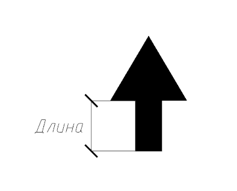
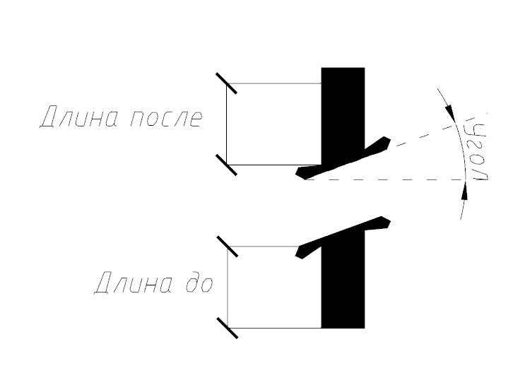
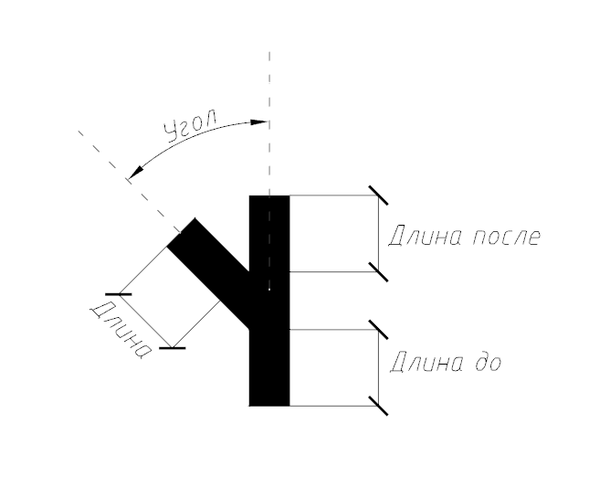
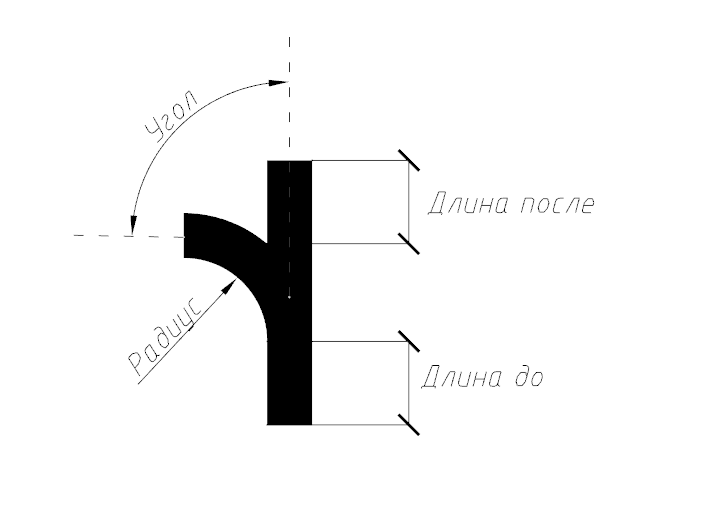
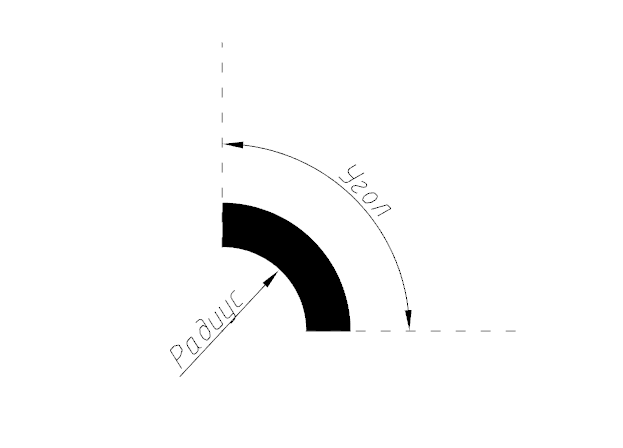
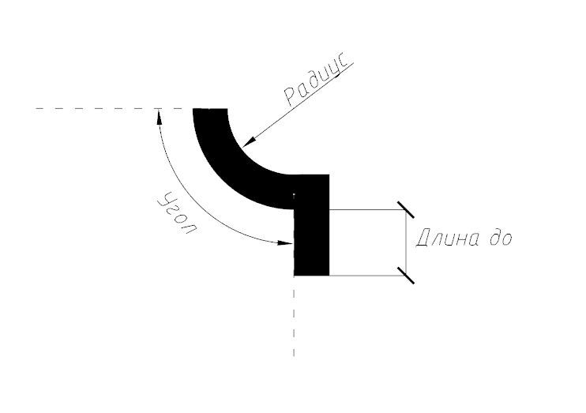
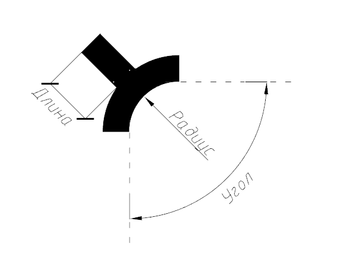
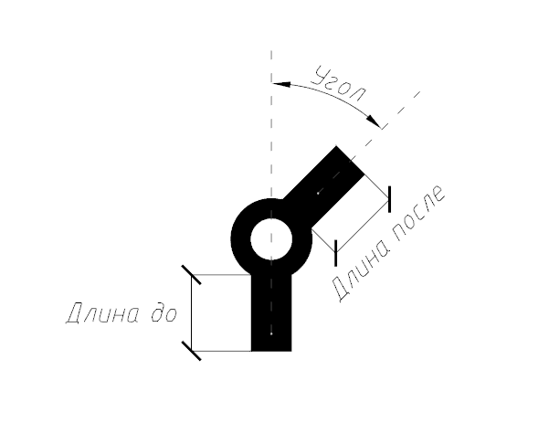

# Редактирование элементов траектории

## Общие сведения

Параметры всех элементов траектории задаются через окно **Свойства** выделенного элемента.

Такие параметры элементов как: **Длина до\ после**, **Радиус** и т.д., по умолчанию, задаются в зависимости от Высоты прописной буквы, которая задана в параметрах [Щита](../description_common_elements_sign/properties_shield.md), но также может быть задана и в миллиметрах.

У элементов, имеющих ответвления есть возможность установить опцию - **Второстепенное**. Это позволяет сделать само ответвление и сопряженные к нему элементы меньшей ширины, а именно производится сужение на 30% согласно ГОСТ.

При добавлении элемента **Стрелка** ее угол определяется автоматически с учетом угла ответвления к которому данная стрелка присоединена.

Ниже подробно рассмотрены свойства характерных элементов траектории.

## Стрелка

Параметры элемента:

**Длина** - задается длина стержня стрелки.

## Отрезок прямой под путепроводом

Параметры элемента:
* **Длина до**. Изменение длины сегмента до путепровода.
* **Длина после**. Изменение длины сегмента после путепровода.
* **Угол**. Поворот элемента задается в градусах.

## Прямое направление с ответвлением налево

Параметры элемента:
* **Длина до**. Изменения длины сегмента до ответвления.
* **Длина после**. Изменения длины сегмента после ответвления.
* **Длина**. Изменения длины сегмента ответвления.
* **Угол**. Угол ответвления в градусах.



Параметры для элементов **Прямое направление с ответвлением направо**, **Направо и налево**, **Прямо направо и налево** задаются аналогично.



## Закругленное ответвление налево

Параметры элемента:
* **Длина до**. Изменения длины сегмента до ответвления.
* **Длина после**. Изменения длины сегмента после ответвления.
* **Длина**. Изменения длины сегмента ответвления.
* **Угол**. Угол ответвления в градусах.
* **Радиус**. Задает значение радиуса закругления.



Параметры для элементов **Закругленное ответвление направо**, **Направо и налево**, **Прямо направо и налево** задаются аналогично.



## Поворот по дуге налево\направо

Параметры элемента:
* **Радиус**. Задает значение радиуса закругления по внутренней границе.
* **Угол**. Задается угол, который описывает дуга.

## Въезд на левостороннее кольцо

Параметры элемента:
* **Радиус поворота**. Задание радиуса кольца.
* **Длина до**. Задание длины ответвления до закругления.
* **Угол поворота**. Задается угол, который описывает дуга.



Параметры элементов **Въезд на правостороннее кольцо**, **Съезд с левостороннего кольца**, **Съезд с правостороннего кольца** задаются аналогично.



## Ответвление на левостороннем кольце

Параметры элемента:
* **Радиус**. Задание радиуса кольца.
* **Угол**. Задается угол, который описывает дуга.
* **Длина**. Задание длины ответвления от закругления.



Параметры элементов **Ответвление на правостороннем кольце**, **Ответвление внутрь на левостороннем кольце**, **Ответвление внутрь на правостороннем кольце** задаются аналогично.



## Проезд через кольцевую развязку (с одним ответвлением)

Параметры элемента:
* **Длина до**. Изменение длины сегмента до кольцевой развязки.
* **Длина после**. Изменение длины сегмента после кольцевой развязки.
* **Угол**. Поворот сегмента после кольцевой развязки в градусах.



Параметры элементов **Проезд через кольцевую развязку с двумя и тремя ответвлениями** задаются аналогично.

