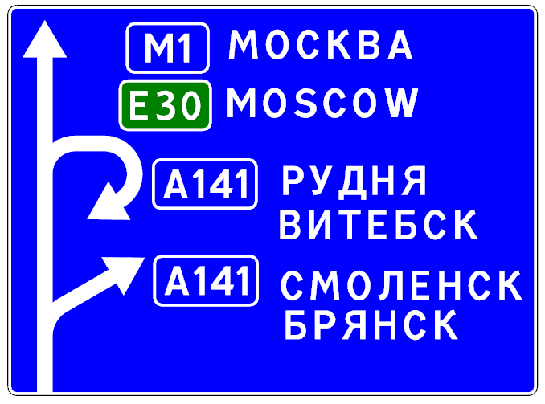
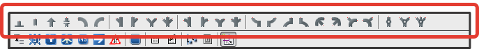
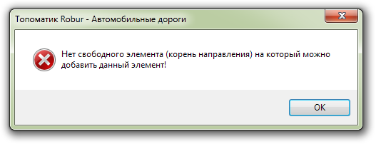
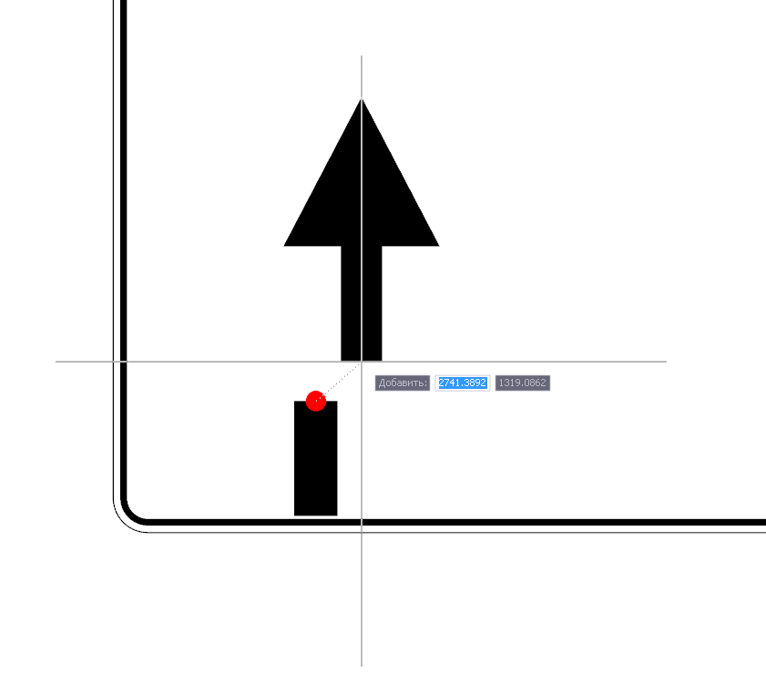
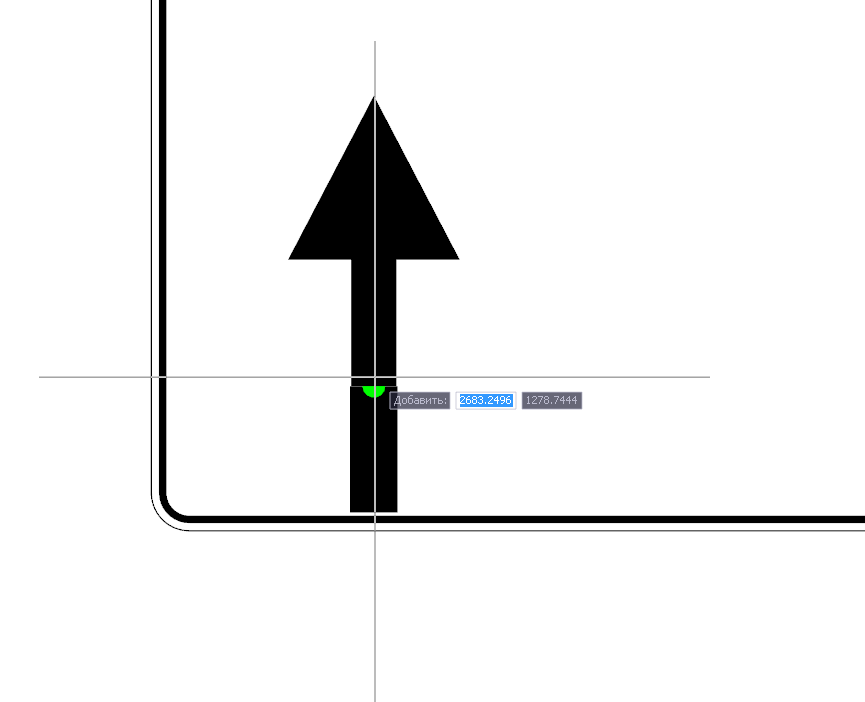
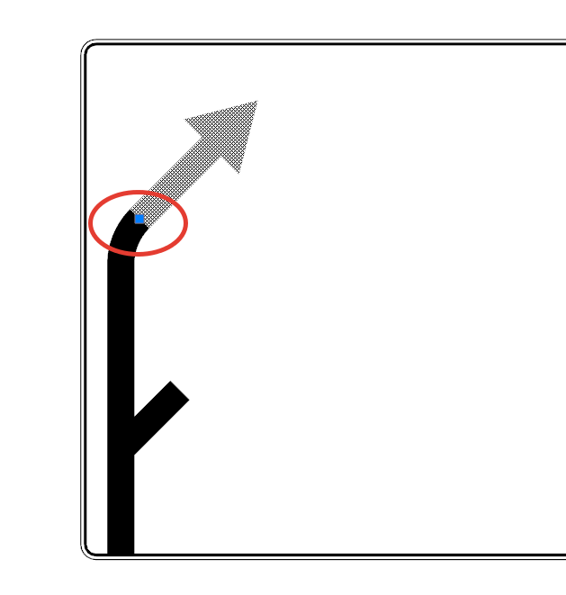
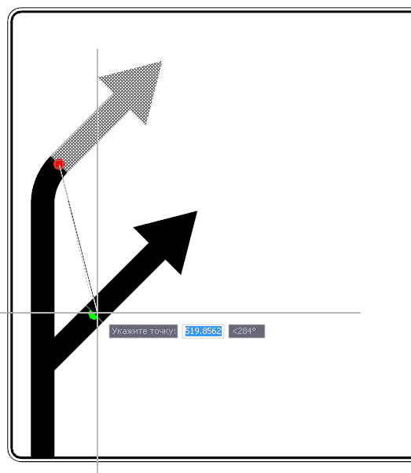
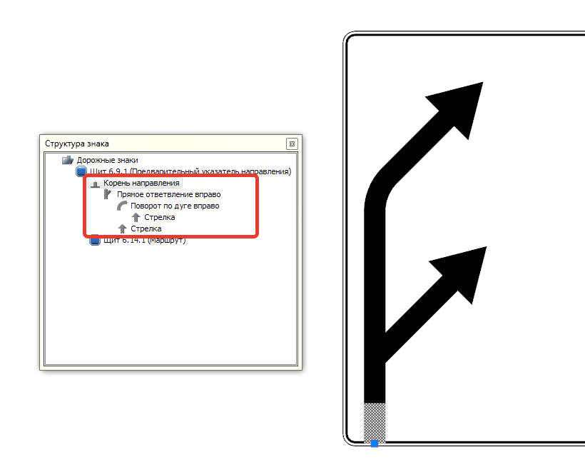

# Элементы траектории

## Общие сведения

Описанный в текущей главе функционал позволяет формировать траектории направления движения, которые характерны для знаков типа 6.9.1:

Для построения траектории используются элементы, которые содержатся в меню **Задачи - Индивидуальные знаки - Элементы знака - Элементы траектории - ...**.

Для удобства вызова все элементы расположены на **Панели инструментов**.

## Добавление элементов. Формирование траектории

Формирование траектории производится путем последовательного добавления необходимых элементов (Поворот налево, Стрелка и т.д.) и задания параметров (Длина после ответвления, Угол, Радиус и т.д.).

В качестве начального элемента траектории всегда используется **Корень направлений**, т.е. данный элемент  должен быть добавлен в первую очередь. Каждый последующий элемент прикрепляется к предыдущему.



1. В случае, если при выборе элемента траектории будет отсутствовать свободный элемент для добавления, то появится предупреждение:

   

2. В щите может быть добавлено несколько элементов типа **Корень направлений**.



В момент добавления каждого элемента срабатывает привязка, т.е. показывается пунктирная линия и появляется точка привязки в виде «красного маркера» у тех элементов к которым можно прикрепить добавляемый элемент:

Подведя курсор мыши к необходимой точке привязки предыдущего элемента, цвет «маркера» поменяется на зеленый и элемент автоматически соединится с предыдущим:

* Далее необходимо подтвердить ввод элемента, щелкнув левой кнопкой мыши.



В случае если левая кнопка мыши была нажата до появления «зеленой лампочки», то элемент не будет добавлен.



## Редактирование траектории

При необходимости **Перемещения** элемента траектории, например, с одного направления на другое:

* Выделите элемент траектории любым доступным образом, далее левой кнопкой мыши выберите точку вставки элемента:

  

* Переместите элемент за точку вставки к другому направлению до появления зеленого маркера:

  

* Нажмите левой кнопкой мыши для подтверждения.

При необходимости **Удаления** элемента траектории, выделите его любым доступным образом и нажмите клавишу DEL.



При добавлении элементов траектории, каждый последующий элемент вкладывается внутрь того элемента, к которому он присоединялся. Это наглядно видно в окне **Структура знака**:

Таким образом создается связанная цепочка элементов, где каждый элемент зависит от добавленного ранее и при попытке удалить или переместить один элемент, перемещение или удаление произойдет и тех элементов которые были присоединены к нему после.

