# Вставка текста

Элемент прямоугольной формы с определенным цветом фона (синий — на дорогах вне населенных пунктах; зеленый — на автомагистралях; белый — в населенных пунктах), который включает в себя **Текст,** а также может содержать в себе пиктограмму и маршрут. 
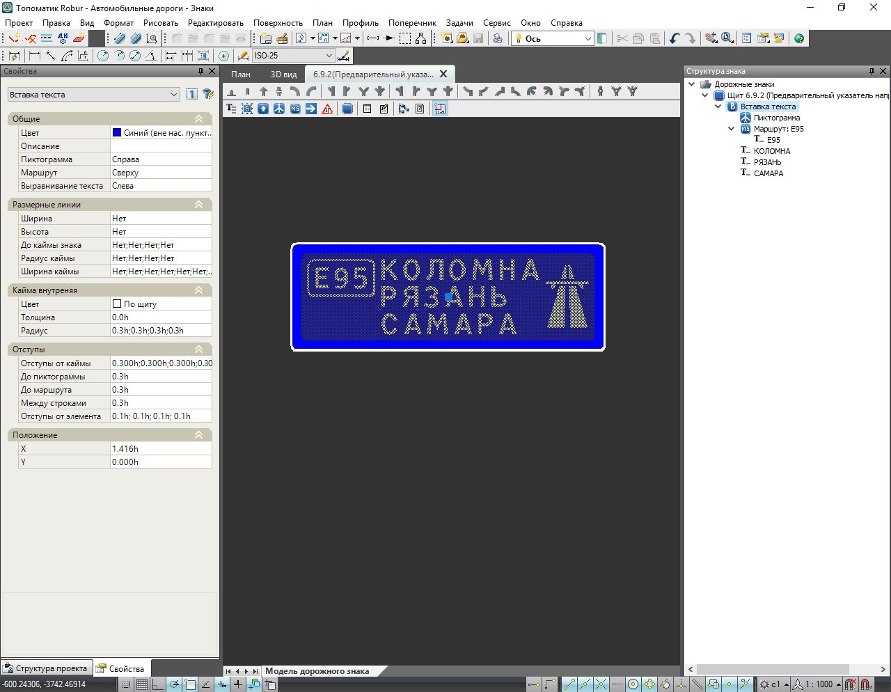

## Добавление Вставки

Для добавления элемента **Вставка** выберите соответствующую кнопку на панели инструментов , далее укажите положение элемента на щите, щелкнув левой кнопкой мыши:

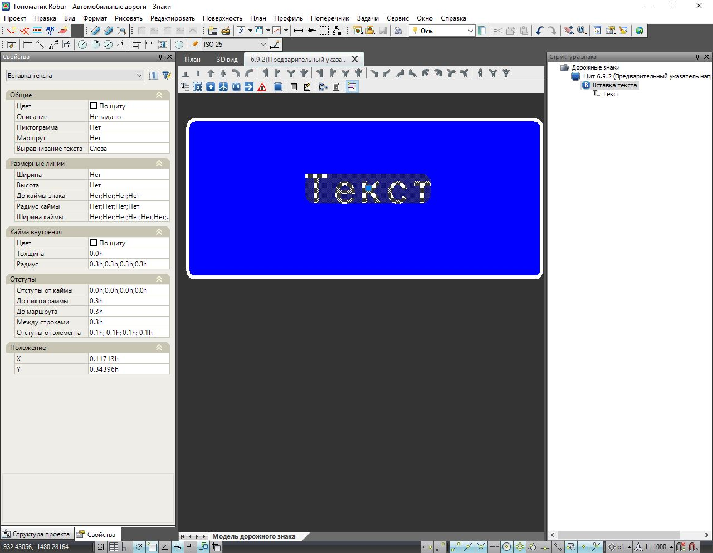

В результате будет добавлен элемент **Вставка** с надписью по умолчанию - "Текст".

При добавлении элемента **Вставка** анализируется положение курсора:

- В случае если при добавлении **Вставки** курсор находился в области **Направления**, то в данное **Направление** будет добавлена новая **Вставка** ниже:

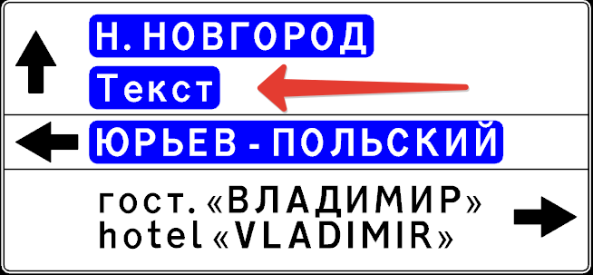

- В случае если при добавлении **Вставки** курсор находился в области уже имеющейся **Вставки**, то в данную **Вставку** будет добавлена новая строка:

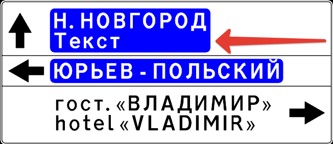



При проектировании щитов знаков с номерами 6.10 и 6.12 элемент **Вставка** может быть добавлен через окно **Структура знака** путем нажатия правой кнопкой мыши по элементу **Направление**: 
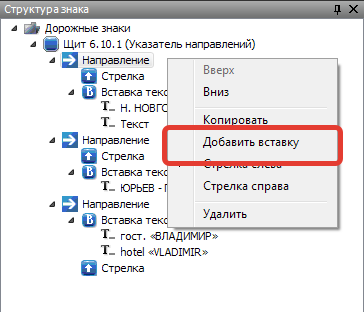



## Свойства элемента Вставка текста

Для отображения и редактирования свойств элемента **Вставка текста**, выберите необходимый элемент любым доступным способом. В окне **Свойства** появятся параметры выбранного элемента.

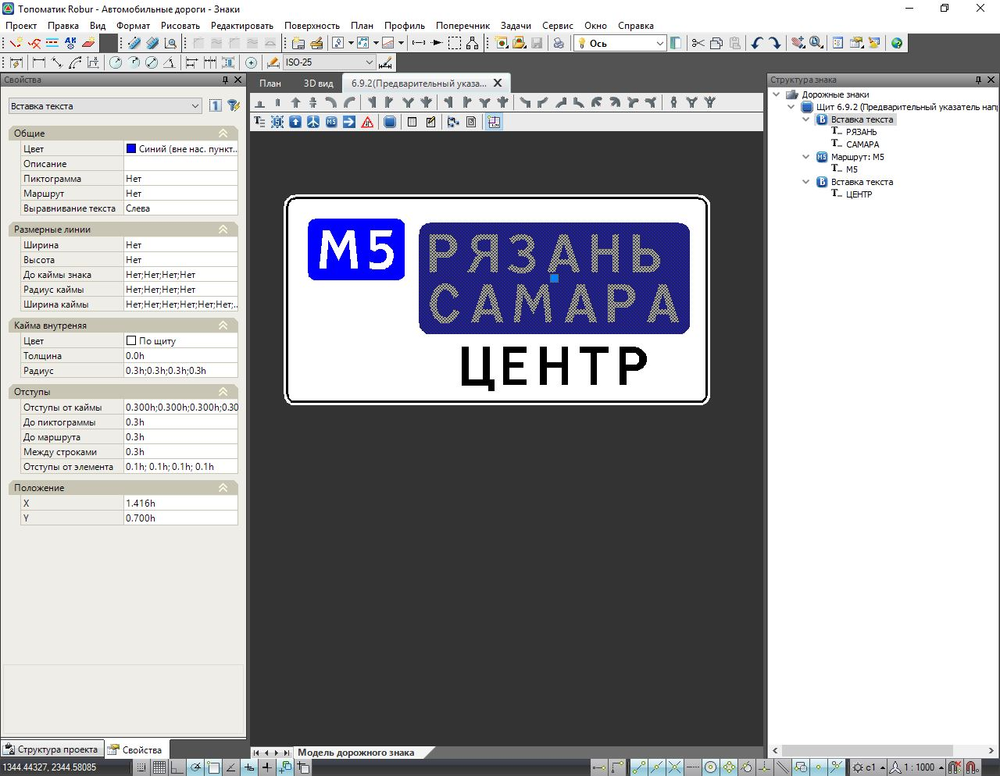

### Общие

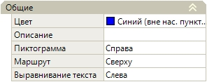

* **Цвет**. В данном выпадающем списке выбирается цвет фона выделенного элемента **Вставка**. Цвет определяется в зависимости от того, где устанавливается знак. Цвет фона:зеленый (на автомагистралях), синий (на дорогах вне населенных пунктах), белый (в населенных пунктах). 



Цвет элемента "По щиту" означает, что цвет для **Вставки текста** будет принят таким который задан в **Свойствах** элемента [Щит](properties_shield.md)



* **Описание**. Текстовое поле предназначенное для дополнительного описания элемента, не является обязательным для заполнения. 

* **Пиктограмма**

В данном выпадающем списке задается наличие и положение элемента **Пиктограмма**.

[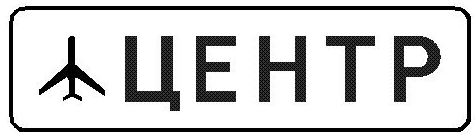]

[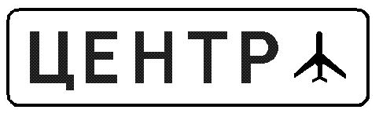]

* **Маршрут**

В данном выпадающем списке задается наличие и выравнивание элемента **Маршрут**

Вертикальное выравнивание маршрута осуществляется в том случае, если **Вставка текста** содержит в себе более, чем одну строку с текстом.

[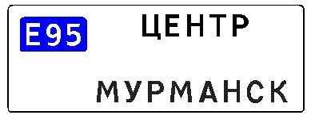]

[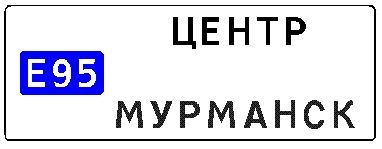]

[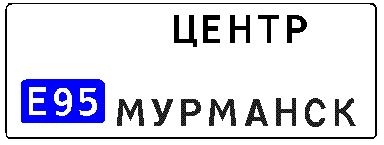]



1. Отображение элементов **Пиктограмма** и **Маршрут** также может быть произведено через контекстное меню в окне **Структура знака**, ниже в текущем разделе документации подробно описан данный механизм.  
   
2. Добавление через **Панель инструментов** и параметры элементов **Маршрут** и **Пиктограмма** подробно описано в главе [Редактирование и создание знаков индивидуального проектирования (на примере знака 6.10.1 «Указатель направлений»)](creation_signs_individual_design.md), а также [Вставка и свойства различных элементов в шаблонах щитов типа 6.9. и 6.17](create_numbers_route.md).



* **Выравнивание текста**. Текст внутри **Вставки** может быть выровнен по: левой стороне, правой и по центру. Выравнивание строк с текстом происходит в том случае, когда на знаке больше одной строки и количество символов в одной из строк меньше, чем в других. ###

[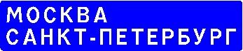]

[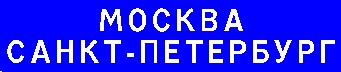]

[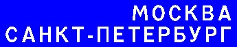]

### Размерные линии

Работа с данными настройками подробно описана в главе [Размерные линии](dimension_lines.md)

### Кайма внутренняя

Параметры внутренней каймы у элемента **Вставка** задаются аналогично как у элемента **Щит**, которые были подробно описаны в главе [Щит (общие свойства)](properties_shield.md)

### Отступы

Работа с данными настройками подробно описана в главе [Отступы](indented.md)

### Положение

Положение вставки текста задается координатами Х и Y. Началом координат является центр щита.

## Опции контекстного меню в окне Структура знака

В окне **Структура знака**, нажав правой кнопкой мыши на элементе **Вставка текста**, откроется контекстное меню с помощью которого доступен следующий функционал:

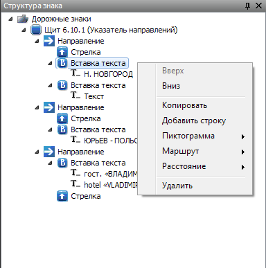

#### Вверх\Вниз

Данные опции предназначены для изменения положения **Вставки** внутри **Направления**.

#### Копировать\Удалить

Опция Копировать позволяет сделать копию элемента **Вставка**

Для удаления элемента **Вставка** выберите опцию **Удалить**.

#### Пиктограмма\Маршрут\Расстояние

С помощью данных опций имеется возможность добавления\скрытия таких элементов как **Пиктограмма**, **Маршрут** и **Расстояние** внутри элемента **Вставка**.

#### Добавление строки и параметры текстовой надписи

Для добавления новой строки необходимо выбрать опцию **Добавить строку**. В результате строка, с содержимым по умолчанию "Текст", будет добавлена внутрь элемента **Вставка**.

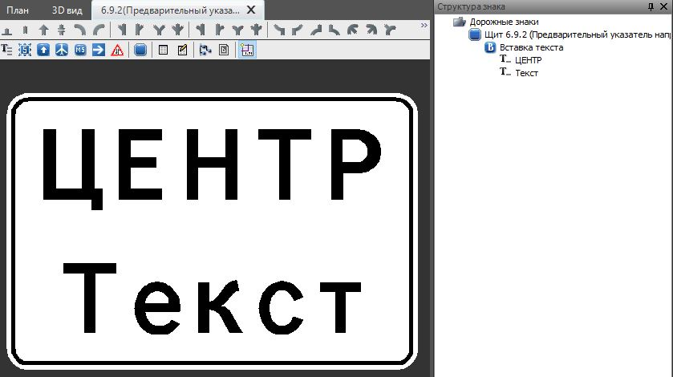



Новая строка может быть добавлена с помощью той же кнопки на **Панели инструментов**, что и добавление **Вставки текста**, подробнее см. выше текущий раздел **Добавление вставки**.



Для изменения параметров добавленной строки и ее содержимого необходимо выделить элемент **Текст** 
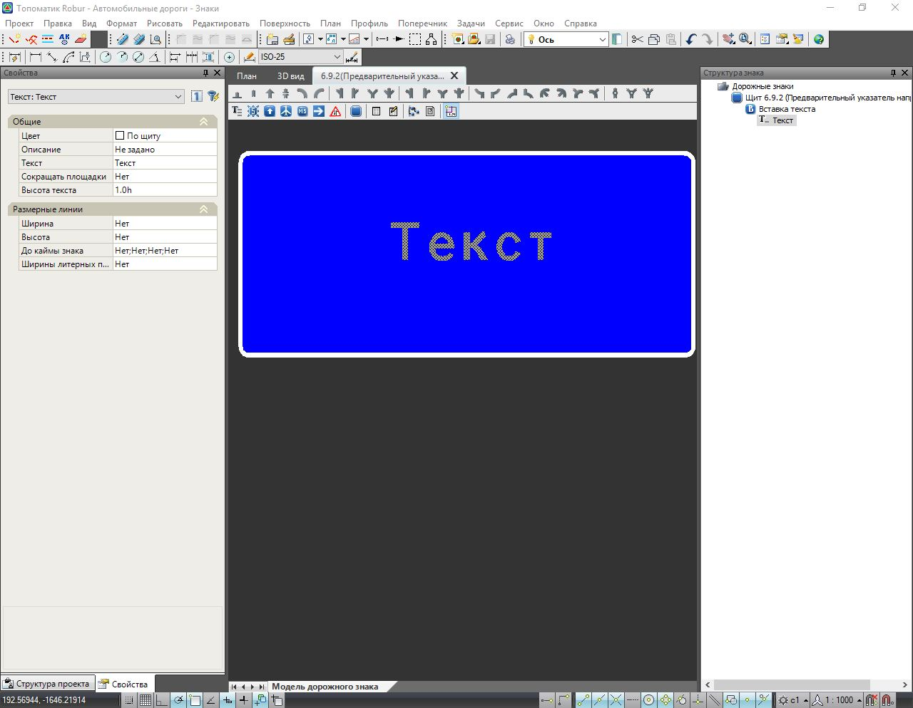.

В окне **Свойства** отобразятся параметры **Текста.** 
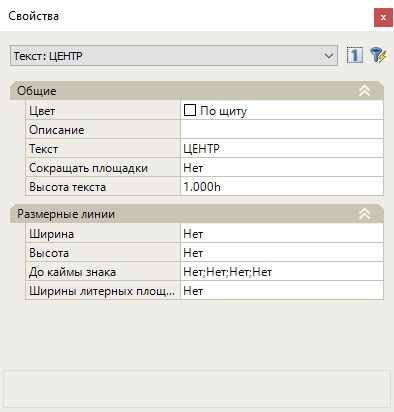

* **Цвет**. В данном выпадающем списке выбирается цвет выделенного элемента **Текст**. 
* **Описание**. Текстовое поле предназначенное для дополнительного описания элемента, не является обязательным для заполнения.
* **Текст**. Содержимое данной текстовой строки отображается на знаке. 
* **Высота текста**. В данном выпадающем списке для выделенной текстовой надписи задается Высота букв, которая может быть выбрана как из ряда стандартных размеров, так и введена вручную в данное поле в миллиметрах. По умолчанию высота текста задана "по щиту" (или 1h), т.е. зависит от высоты прописной буквы заданной в свойствах щита. 



Задание **Высоты прописной буквы** для элемента **Щит** см. главу



* **Сокращать площадки**. Если выбран пункт **Да**, то Ширина литерных площадок автоматически уменьшается на 0,05h с каждой стороны буквы. 