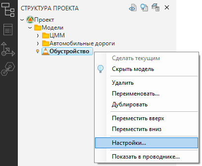
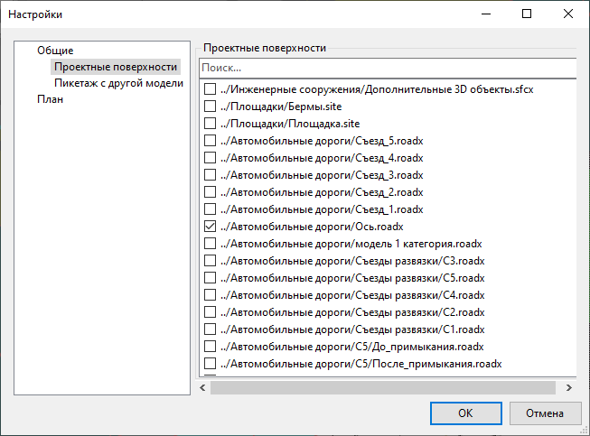
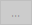
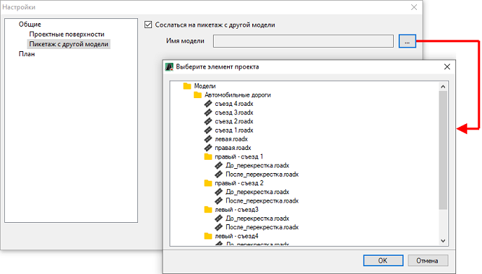
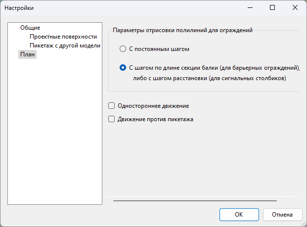

# Предварительные настройки

Для проецирования объектов ТСОДД на выбранные проектные поверхности и привязки их к пикетажу линейного объекта необходимо задать модели **Обустройство** предварительные настройки. Для этого: 

1. В окне **Структура проекта** нажмите ПКМ на наименование соответствующей модели. В открывшемся контекстном меню выберите пункт **Настройки**:

   

2. Откроется окно **Настройки**. В левой его части представлены группы настроек:

   ## Общие

   Раскройте дерево данной группы и выберите наименование **Проектные Поверхности**:

   

   В правой части окна поставьте «галочку» напротив наименования поверхностей, на которые будут спроецированы объекты ТСОДД.

   Чтобы назначить линейный объект, к пикетажу которого будет привязан объект ТСОДД, выберите наименование **Пикетаж с другой модели** и активируйте опцию **Сослаться на пикетаж с другой модели**. Поле **Имя модели** станет активным, далее нажмите кнопку , откроется окно, в котором выберите нужную модель автомобильной дороги и нажмите **ОК**:

   

   ## План

   

   Данная группа настроек актуальна для объектов обустройства реализованных в предыдущих версиях программы (8.х) и оставлена для совместимости.

   

   Функционал для работы данными объектами дорожного обустройства представлен в [Архивных разделах.](../../../annex/index.yaml)

   

3. Выполните необходимы настройки и нажмите **ОК**.