# Механизм работы с автоматической расстановкой ограждений

Для обеспечения правильной работы автоматической расстановки барьерных ограждений и сигнальных столбиков рекомендуется последовательно выполнить следующие шаги:



### {#predvaritelnye-nastrojki}

Необходимо выполнить настройку модели **Обустройство** (назначить пикетаж с другой модели и проектные поверхности). Информацию о настройках можно найти в разделе [Предварительные настройки.](../../../../road_tasks/organizing_road_traffic/pre_settings_model.md)

В модели **Автомобильная дорога**, на пикетаж которой будет ссылаться модель **Обустройство**, необходимо настроить следующие параметры:

* В настройках модели должна быть указана техническая категория дороги описание данной настройки см. в описании вкладки **Общие** в разделе [Настройки подобъекта Автомобильная дорога.](../../../../general_information/setting_subobject.md)

* Для корректной расстановки ограждений и сигнальных столбиков должны быть заполнены некоторые таблицы модели **Автомобильная дорога** в Структуре проекта:

  - Для учета интенсивности движения необходимо заполнить таблицу **Интенсивность движения**.

  - Для того чтобы программа учитывала наличие мостов и водопропускных труб в проекте и могла подобрать подходящие ограждения на основе их параметров, необходимо внести соответствующую информацию о них в таблицы **Мосты** и **Трубы**.

    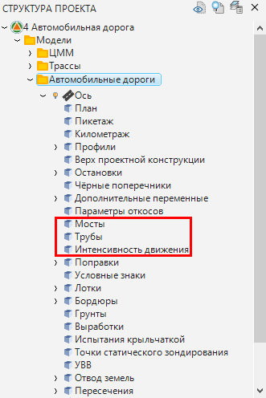

* Границы рабочих участков ограждений и сигнальных столбиков определяются на основе поперечных профилей автомобильной дороги. Соответственно, для более точной расстановки объектов поперечные профили должны быть корректно сконструированы (должны быть запроектированы откосы), располагаться в характерных (переходных) местах и с приемлемым шагом друг от друга. Описание по проектированию поперечных профилей см. [Проектирование поперечных профилей.](../../../../road_crossection/total/general_information.md)





### {#funkciya-avtomaticheskoj-rasstanovki}

Чтобы вызвать функцию автоматической расстановки:

1. На ленте **Ограждения и Направляющие устройства** или в меню **Обустройство - Ограждения и Направляющие устройства** выберите 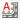 (**Расставить элементы**). Откроется окно, в котором выполните действия:

   * Для расстановки барьерных ограждений и сигнальных столбиков включите опцию **Дорожные ограждения**.

   * Для настройки параметров автоматической расстановки нажмите **Настройки** (описание настроек см. в [Настройке параметров для автоматического расчета](mechanism_of_working.md#nastrojka-parametrov-dlya-avtomaticheskogo-rascheta)).

     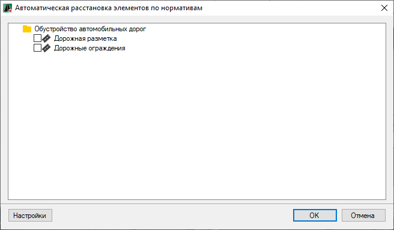

2. Далее нажмите **ОК**.

В результате участки барьерных ограждений и сигнальных столбиков, рассчитанные программой автоматически будут отрисованы в окне **План** и **3D вид**.





### {#nastrojka-parametrov-dlya-avtomaticheskogo-rascheta}

При выборе функции  (**Расставить элементы**) и нажатии в открывшемся окне кнопки **Настройки** (см. описание раздела [Воспользоваться функцией автоматической расстановки](mechanism_of_working.md#funkciya-avtomaticheskoj-rasstanovki)), откроется окно:

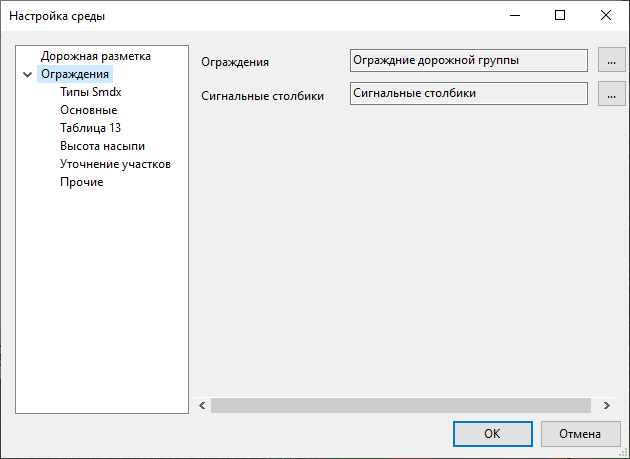

В левой части окна находятся элементы обустройства, подлежащие настройке. При выборе определенного элемента, в правой части окна отобразятся соответствующие параметры для настройки. Далее будут описаны вкладки, которые появляются при раскрытии дерева **Ограждения**.

#### Типы Smdx

В правой части окна отображены назначенные 3D-модели объектам **Ограждения** и **Сигнальные столбики**. Функционал программы позволяет заменить эти назначенные 3D-модели на пользовательские 3D-модели ограждений и сигнальных столбиков. Например, можно взять системную 3D-модель, сохранить ее как пользовательскую модель. В пользовательской 3D-модели можно добавить параметры (например, добавить параметр - подпись выноски), а затем использовать эту модель в дальнейшем.



Описание добавления полей свойств объекту с помощью **Менеджера структуры Smdx** см. в соответствующем разделе.



Чтобы заменить системную 3D-модель на пользовательскую 3D-модель:

1. Предварительно необходимо добавить и настроить пользовательскую 3D-модель в **Библиотеку 3D объектов**.

   

   Описание работы с **Библиотекой 3D объектов** см. **Приложение Е**, разделы [Общие сведения](../../../../../annex/libraries/libraries_info.md) и [Работа с библиотекой 3D объектов](../../../../../annex/libraries/library_3d_models.md).

   

2. Напротив 3D-модели, которую необходимо заменить (например, **Ограждения дорожной группы**), нажмите кнопку 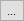, откроется окно, в котором выберите элемент из пользовательской библиотеки и нажмите **ОК**:

   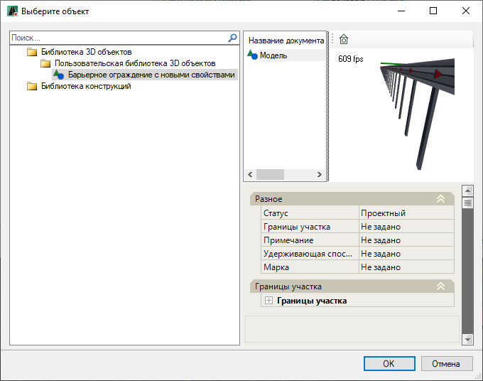

В результате объекту будет назначена пользовательская 3D-модель.

#### Основные

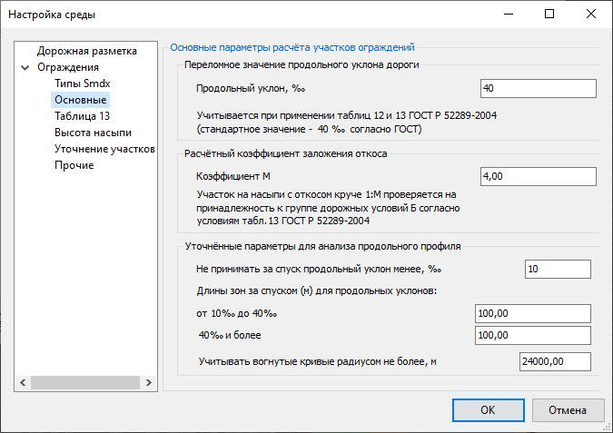

На данной вкладе в полях **Переломное значение продольного уклона дороги** и **Расчетный коэффициент заложения откоса** можно поменять значения параметров используемых в таблицах 12 и 13 **ГОСТ Р 52289-2004**.

В поле **Уточненные параметры для анализа продольного профиля** можно уточнить ряд значений (понятий) из **ГОСТ Р 52289-2004**, которые используются при анализе продольного профиля линейного объекта и могут быть неправильно истолкованы. Например, какой уклон принимать за спуск, учитывать ли вогнутые кривые больших радиусов (по геометрии вогнутая кривая большого радиуса схожа с прямой).

#### Таблица 13

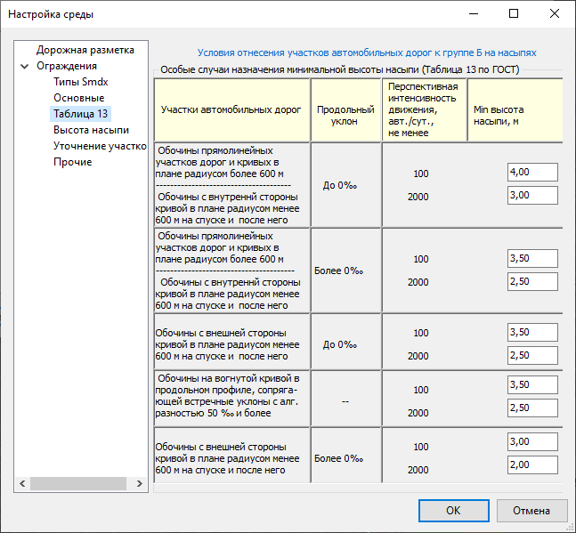

На данной вкладке по аналогии с **таблицей 13 ГОСТ Р 52289-2004** можно с учетом интенсивности задать минимальную высоту насыпи для отнесения участков автомобильных дорог к группе Б.

#### Высота насыпи

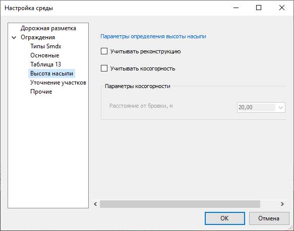

На данной вкладке в поле **Параметры определения высоты насыпи** задаются параметры, с которыми сравнивается фактическая высота насыпи для соответствующей стороны (слева или справа) с целью проверить принадлежность к группе Б.

Например, если на поперечнике фактическая высота насыпи слева больше указанной в таблице и откос слева круче 1:4, то тогда участок будет относиться к группе Б.

В зависимости от комбинации установленных опций возможны несколько схем расчета высоты насыпи:

* Если опции **Учитывать реконструкцию** и **Учитывать косогорность** не установлены, то высота насыпи считается как разность между отметками проектной бровки и подошвы (Нбр - Нпод.). Если на поперечнике запроектирован кювет, то высота насыпи считается как разность между отметками проектной бровки и дна кювета (Нбр - Ндна.к.):

  

* Если опция **Учитывать косогорность** включена, при этом режиме необходимо задать расстояние от бровки до точки Hм (точка на местности до которой рассчитывается уклон рельефа). В результате высота насыпи считается как разность отметок между проектной бровкой и точкой на местности (Нбр - Нм).

  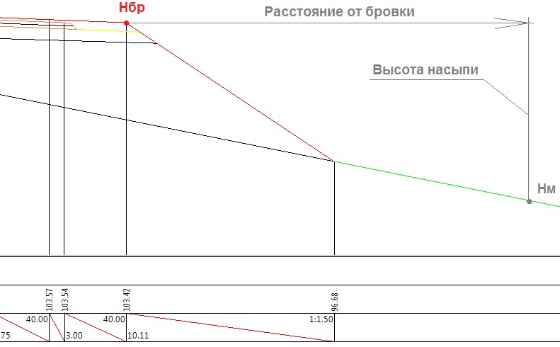

  

  Если значение **Расстояние от бровки** задано больше чем имеющаяся ширина полосы съемки поперечника, то в качестве расчетной точки Hм принимается самая крайняя точка линии черного поперечника.

  Если рассчитанная отметка точки Нм получится меньше чем отметка точек Нпод или Ндна.к. (отметки подошвы или отметки дна канавы\кювета), то высота насыпи рассчитывается как разность между бровкой и подошвой или дном кювета\канавы (Нбр - Нпод или Нбр - Ндна.к).

  

* Если установлена опция **Учитывать реконструкцию**, а опция **Учитывать косогорность** не установлена и проектный откос упирается в откос существующей насыпи (подошва существующего откоса должна иметь код 1), то высота насыпи рассчитывается как разность между проектной бровкой и подошвой существующей насыпи:

  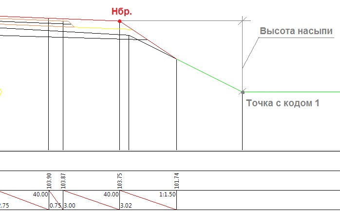

  

  Если опции **Учитывать косогорность** и **Учитывать реконструкцию** установлены одновременно, то в качестве итоговой высоты насыпи, берётся максимальное из рассчитанных значений.

  Если рассчитанная отметка точки существующей подошвы насыпи (точки с кодом 1) получится меньше чем отметка точек Нпод или Ндна.к. (отметки подошвы или отметки дна канавы\кювета), то высота насыпи рассчитывается как разность между бровкой и подошвой или дном кювета\канавы (Нбр - Нпод или Нбр - Ндна.к).

  

#### Уточнение участков

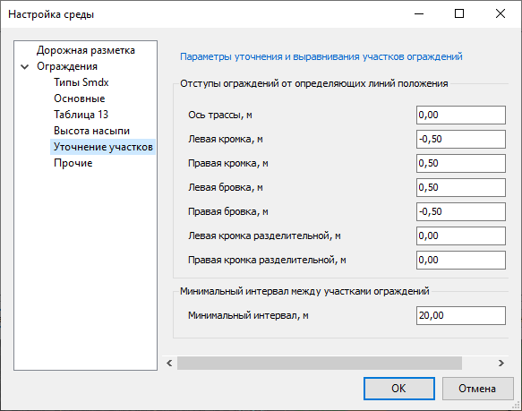

На данной вкладке в поле **Отступы ограждений от определяющих линий положения** задаются значения отступов от основных элементов дороги, принимаемые программой по умолчанию при их расстановке.

#### Прочие

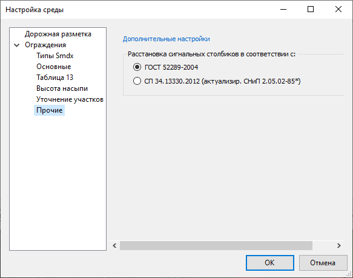

На данной вкладке выбирается нормативный документ, согласно которому будет производиться автоматическая расстановка дорожных столбиков.

