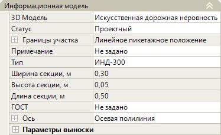
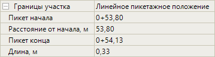
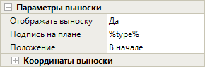

# Редактирование параметров искусственной неровности

Данный раздел содержит описание по редактированию ***уникальных*** параметров объекта обустройства Искусственная неровность.



Описание ***общих*** параметров для всех объектов обустройства (описание групп **Общее** и **Разное** в окне **Свойства**) см. в разделе [Редактирование общих параметров.](general_parameters.md)



Выберите искусственную неровность и откройте окно **Свойства**, далее перейдите в группу полей **Информационная модель**:

## Информационная модель

В данной группе полей представлены параметры свойства искусственной неровности.

### Различные Параметры

* **3D модель** – в данном поле можно заменить введенную искусственную неровность на другую 3D-модель, а так же открыть окно программы **Visual Studio Code**. Поле аналогично такому же полю в разделе [Редактирование параметров барьерных ограждений.](barrier_fences.md)

* **Статус** – в данном поле из списка можно сменить статус объекта. Он учитывается при формировании выходных ведомостей.

* **Границы участка** – в данной группе полей содержится информация о пикетажных значениях начала и конца искусственной неровности, о его длине по пикетажу, а так же расстоянии от начального пикета оси линейного объекта до условного обозначения искусственной неровности. Чтобы просмотреть информацию о границе участка нажмите знак :

  

* **Примечание** - в данном поле можно добавить комментарий, который будет учитываться при формировании выходных ведомостей.

* **ГОСТ** – в этом поле можно ввести название нормативного документа, который будет учитываться в подписи выноски и формировании выходных ведомостей.

* **Ось** – данные поля настроек предназначены для хранения детальных параметров положения введенной искусственной неровности в пространстве рабочего поля. При необходимости они могут быть отредактированы. Для раскрытия поля нажмите знак , для раскрытия группы полей **Вершины** и **Точки** так же нажмите знак .

### Искусственная неровность

* **Тип** – в данном поле из списка можно выбрать вид искусственной неровности и просмотреть его в окне **3D вид**. Выбранный тип отобразится в ведомости.

* **Ширина секции, м/ Высота секции, м/ Длина секции, м** – эти поля показывают геометрические характеристики отдельных секций искусственной неровности, и принимаются в зависимости от выбранного вида в поле **Тип**.

### Параметры выноски

* В данной группе полей можно настроить отображение выноски с подписями в окне **План**. Для раскрытия поля нажмите знак :

  

  Ознакомиться с инструкцией по настройке данных параметров можно в разделе [Редактирование параметров барьерных ограждений.](barrier_fences.md)