# Редактирование параметров барьерных ограждений

Данный раздел содержит описание по редактированию ***уникальных*** параметров барьерных ограждений.



Описание ***общих*** параметров для всех объектов обустройства (описание групп **Общее** и **Разное** в окне **Свойства**) см. в разделе [Редактирование общих параметров.](general_parameters.md)



Выберите ограждение и откройте окно **Свойства**, далее перейдите в группу полей **Информационная модель**:

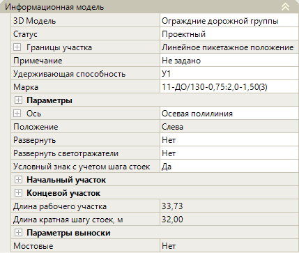

## Информационная модель

В данной группе полей представлены основные свойства барьерного ограждения.

### Различные Параметры

* **3D модель** – в данном поле можно заменить введенное барьерное ограждение на другую 3D-модель, а так же открыть окно программы **Visual Studio Code**. Для этого:

1. Чтобы заменить введенное в рабочее поле дорожное ограждение на другую 3D-модель (например, 3D-модель дорожного ограждения заменить на 3D-модель сигнальных столбиков), выберите поле и нажмите , откроется окно библиотеки с элементами внутри:

   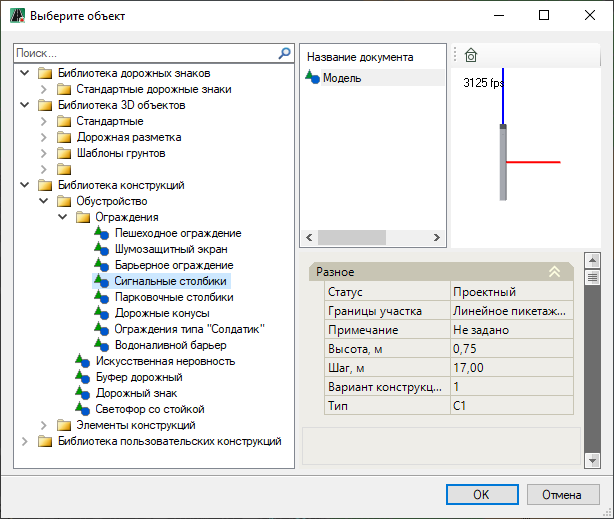

   * В левой части окна отображаются имеющиеся в программе библиотеки с элементами внутри.

   * При выборе элемента, в правой части окна представлены свойства элемента, его 3D вид и окно с сопроводительной документацией к элементу, если таковая имеется.

     Выберите необходимый элемент, например **Сигнальные столбики**, далее нажмите **ОК**.

2. Редактировать имеющиеся или создавать новые параметрические 3D-модели можно при помощи **VS code** (Visual Studio Code), для этого выберите поле и нажмите , откроется окно программы **Visual Studio Code**, далее см. описание соответствующего раздела.

   

   Пиктограмма  будет отображаться в соответствующем поле, только в том случае, если установлена программа **Visual Studio Code**.

   

* **Статус** – по умолчанию статус объекта назначен как **Проектный**. Он учитывается при формировании выходных ведомостей. При необходимости смените этот параметр из выпадающего списка:

  

* **Границы участка** – в данной группе полей отображаются пикетажные значения начала и конца барьерного ограждения, длина ограждения, принятая по пикетажу, а так же расстояние от начального пикета оси линейного объекта до пикета начала ограждения. Для раскрытия поля нажмите знак :

  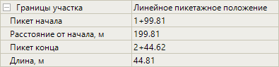

* **Примечание** – в данном поле можно добавить примечание, которое будет учитываться при формировании выходных ведомостей.

* **Ось** – данные поля настроек предназначены для хранения детальных параметров положения введенного объекта в пространстве рабочего поля. При необходимости они могут быть отредактированы. Для раскрытия поля нажмите знак , для раскрытия группы полей **Вершины** и **Точки** так же нажмите знак :

  

  В зависимости от способа ввода объекта (**Вручную, Полилинией, По линейному объекту, По линейному объекту со смещением, По полосе и смещению**) эти параметры могут быть различны.

  

  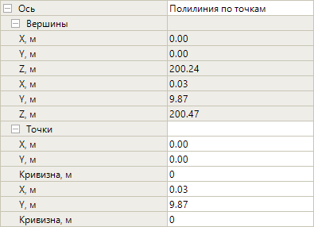

### Барьерное ограждение

* **Удерживающая способность** – в данном поле можно изменить уровень удерживающей способности ограждения.

* **Марка** – данное поле содержит перечень различных барьерных ограждений, доступных для выбора. После выбора марки барьерного ограждения из списка, условное обозначение ограждения будет отображаться в окне **План** с учетом шага стоек. Т.е. фактическое отображение ограждения зависит от его настройки. В окне **3D вид** можно просмотреть модель выбранного барьерного ограждения.

  

  При выборе марки барьерного ограждения программа предлагает только те варианты, которые удовлетворяют заданному уровню удерживающей способности.

  

* **Параметры** – в этой группе полей представлены параметры барьерного ограждения, данные параметров зависит от выбранной марки ограждения в поле **Марка**. Так же в поле **ГОСТ** можно изменить наименование нормативного документа, который будет учитываться в надписи выноски и при формировании выходных ведомостей. Для раскрытия поля нажмите знак :

  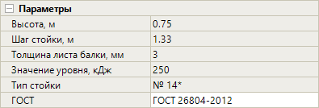

* **Положение** - в данном поле выбирается положение ограждения относительно оси линейного объекта. Данный параметр отобразится в ведомости барьерных ограждений.

  

  Для объектов обустройства введенных методом **Вручную** и **По полосе и смещению** Положение определяется автоматически.

  

* **Развернуть** – лицевая сторона барьерного ограждения определяется порядком указания в момент ввода начальной и конечной точки линии. Если требуется развернуть лицевую сторону барьерного ограждения на противоположную, например при вводе барьерного ограждения с односторонним движением, в данном поле выберите значение **Да**. Изменение можно увидеть в окнах **План** и **3D вид**.

* **Развернуть светоотражатели** – в данном поле можно развернуть направление светоотражателей барьерного ограждения в противоположную сторону, например при одностороннем движении. Для этого в поле выберите значение **Да**. Изменение можно увидеть в окне **3D вид**.

* **Условный знак с учетом шага стоек** – если в данном поле выбрано значение **Нет**, то в окне **План** условный знак барьерного ограждения будет отображаться без учета шага стоек.

* **Длина рабочего участка** – в данном информационном поле отображается фактическая длина выбранного дорожного ограждения. Это значение не доступно для редактирования и будет учитываться при формировании выходных ведомостей.

* **Длина кратная шагу стоек, м** – в данном поле показана общая длина ограждения, определенная шагом между стойками. Это значение не доступно для редактирования и будет учитываться при формировании выходных ведомостей.

* **Мостовые** – если в поле **Марка** из списка была выбрана марка мостового ограждения, то в этом поле будет значение **Да**, если выбрано дорожное ограждение то, значения поля будет **Нет**.

* В зависимости от выбранной **Марки** ограждения могут появляться дополнительные параметры ограждения. Например при выборе марки **11-ДО/300-0,75:1,5-1,00(3)** появляется дополнительный параметр **Тип профиля**. В данном поле можно выбрать тип металлического профиля стоек дорожного ограждения. При выборе значения **По-умолчанию** будет принят **П-образный тип стоек**, при выборе **С-образный** будет принят соответствующий тип стоек. Изменения можно увидеть в окне **3D вид**.

### Начальный участок/ Концевой участок

* В данной группе полей задаются параметры соответствующих участков ограждения. Для раскрытия поля нажмите знак :

  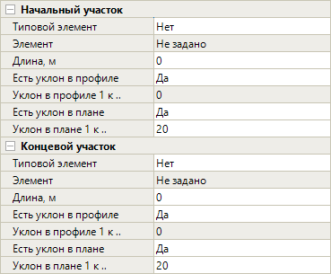

  Если ограждение не имеет начального и конечного участков (их длины равны 0), то по умолчанию **3D вид** таких участков будет отображаться так:

  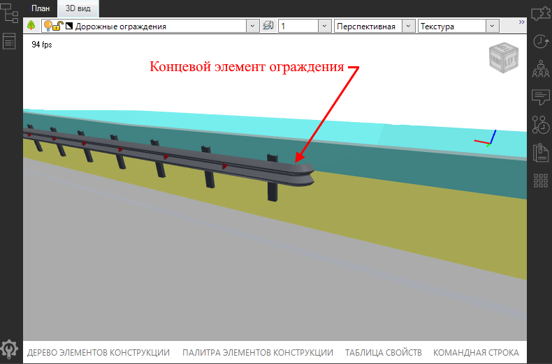

  Функционал программы позволяет задать начальный и конечный участки ограждения различного вида.

  * Если в поле **Типовой элемент** стоит значение **Нет**, то задать начальный и концевой участки можно, используя параметры **Длина, м**, **Есть уклон в профиле**, **Есть уклон в плане**, **Уклон в плане 1 к..**. Если же в поле выбрано значение **Да**, то эти параметры недоступны, доступен только параметр **Элемент**.

  * При доступном поле **Элемент** нажмите кнопку , откроется окно **Элемент**, в котором назначьте необходимый элемент и нажмите **ОК**. Данный механизм подробно описан в разделе [Замена стандартного начального/ концевого участка барьерного ограждения на пользовательскую 3D-модель.](../replacement_3d_model_fence_section.md)

  * **Длина, м** – в данном поле задается длина стандартного начального/ концевого участка ограждения, отображение этих участков можно просмотреть в окнах **План** и **3D вид**.

  * **Есть уклон в профиле** – по умолчанию в данном поле стоит значение **Да**, это значит, что начальный/ концевой участок будет понижен в соответствии с уклоном, полученным в поле **Уклон в профиле 1 к..**. Если в поле установлено значение **Нет**, то начальный/ концевой участок не будет понижен. Изменение можно увидеть в окне **3D вид**.

  * **Уклон в профиле 1 к..** – данное поле показывает уклон в «заложениях», который получается соотношением фиксированной высоты ограждения (0,594 м) и заданной длины начального/ концевого участка ограждения (значение в поле **Длина, м**).

     Ниже приведен пример отображения в окне **3D вид** ограждение с конечным участком длиной **12 м**, пониженным до земли с уклоном **1:20,20**:

     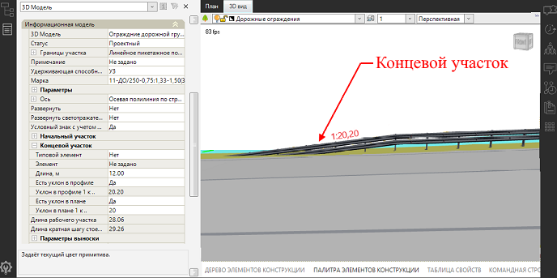

  * **Есть уклон в плане** – если в поле выбрано значение **Да**, то отгон начального/ концевого участка относительно рабочей части ограждения будет установлен с учетом заданного значения в поле **Уклон в плане 1 к..** Например, ограждения, устанавливаемые на обочине имеют отгон **1:20** к бровке земляного полотна. Изменение можно увидеть в окне **3D вид**.

     Ниже приведен пример отображения в окне **3D вид** ограждения с конечным участком с отгоном в плане **1:20**:

     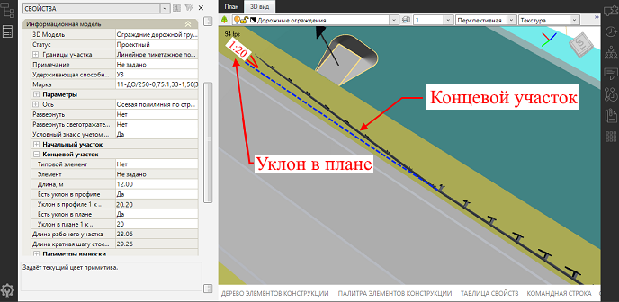

### Параметры выноски

* В данной группе полей можно настроить отображение выноски с подписями в окне **План**. Для раскрытия поля нажмите знак :

  

  * **Отображать выноску** – при выборе в поле значения **Да** в плане выноска будет отображена , при выборе значения **Нет** выноска будет скрыта.

  * **Подпись на плане** – в данном поле можно редактировать содержимое подписи используя ссылку на тег того или иного свойства объекта. Чтобы отобразить содержимое свойства в надписи, необходимо заключить наименование тега в специальный символ - `%`.

     Например, в данном случае вставлена ссылка на тег поля **Марка** - `%mark%`, это значит, что содержимое поля **Марка** отобразится в подписи выноски ограждения:

     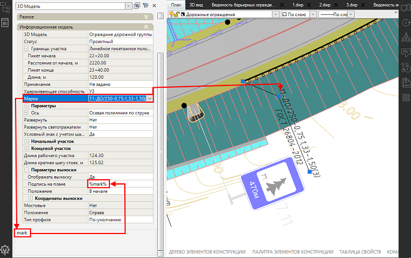

  * **Положение** – поле содержит список, из которого можно выбрать положение линии выноски относительно ограждения (**В начале, По середине, В конце**) или отобразить выноску с подписями с интервалом (выбрано значение **С шагом**) заданным в появившемся поле **Шаг**.

  * **Координаты выноски** – в данной группе полей отображаются значения смещения точки по осям **X** и **Y** в начале (поле **Точка 1**) и в конце (поле **Точка 2**) полки выноски относительно базовой точки объекта. Для раскрытия полей нажмите знак :

    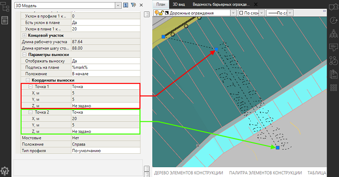