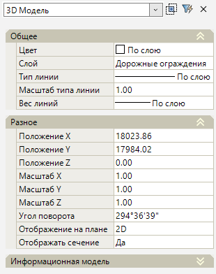
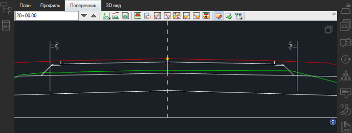

# Редактирование общих параметров

К ***общим*** параметрам редактирования относят параметры в окне **Свойства** групп **Общее** и **Разное**. В данном разделе приведены описания параметров этих групп.



К ***уникальным*** параметрам каждого объекта обустройства относятся параметры группы **Информационная модель**. Описание параметров данной группы для каждого объекта представлено в соответствующих празделах.



Выберите объект и откройте окно **Свойства**:

## Общее

* В данном подразделе в поле **Слой** можно изменить слой линейного объекта обустройства.

## Разное

* В полях **Положение X/ Положение Y/ Положение Z** можно изменить координаты базовой точки вставки объекта обустройства. Изменение координат **X,Y** приведет к смещению объектов обустройства, созданных методами **Полилинией, По линейному объекту, По линейному объекту со смещением**, а так же к смещению выноски у объектов, созданных методами **Вручную** и **По полосе и смещению**. Координаты базовой точки могут задаваться графически. Для этого выделите поле с соответствующей координатой (**X** или **Y**) и нажмите кнопку , курсор будет привязан к точке вставки объекта, укажите требуемое положение точки.

* **Масштаб X/ Масштаб Y/ Масштаб Z** - в данных полях задаются значения масштабного коэффициента объекта обустройства. Влияет на его размер по координатным осям **X,Y,Z**.

* В поле **Угол поворота** можно изменить угол поворота базовой точки относительно оси Х. Изменение значения угла базовой точки приведет к повороту объектов обустройства, созданных методами **Полилинией, По линейному объекту, По линейному объекту со смещением**. А так же к повороту выноски у объектов, созданных методами **Вручную** и **По полосе и смещению**. Угол поворота также можно задать визуально, для этого выделите поле и нажмите кнопку , курсор будет привязан к точке вставки объекта. Определите сторону поворота и нажмите ЛКМ.

* В поле **Отображения на плане** имеется возможность выбрать способ отображения объекта в окне **План**. Отображение может быть представлено в виде условного знака (если выбран параметр **2D**) или в виде трехмерной модели (при выборе параметра **3D**).

* **Отображать сечение** – данная опция позволяет включать (если выбрано значение **Да**) и выключать (если выбрано значение **Нет**) отображение объекта обустройства на продольном и поперечных профилях.

  

  Сечение объекта обустройства на профилях отображается фактическое, т.е. путем сечения «реальной» 3D модели. Т.е. например, чтобы в окне Поперечник увидеть сечение например *Сигнального столбика*, или *Барьерного ограждения со стойкой*, положение поперечного профиля должно совпадать с положением столбика или серединой стойки барьерного ограждения, ниже пример сечения:

  

  