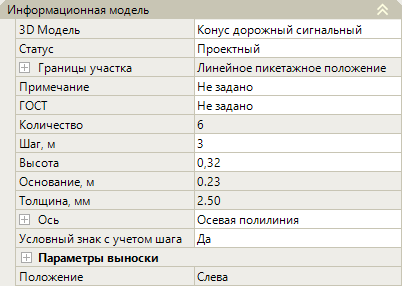
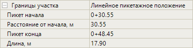
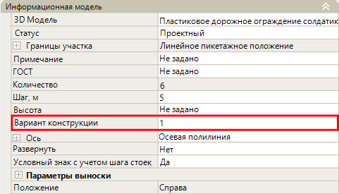
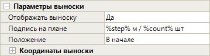

# Редактирование параметров направляющих устройств

В данном разделе описывается редактирование ***уникальных*** параметров направляющих устройств обустройства, таких как **Парковочные столбики, Дорожные конусы, Ограждение типа «Солдатик», Водоналивной барьер**.



Описание ***общих*** параметров для всех объектов обустройства (описание групп **Общее** и **Разное** в окне **Свойства**) см. в разделе [Редактирование общих параметров.](general_parameters.md)



Вышеперечисленные объекты имеют идентичные свойства, поэтому их описание объединено.

Настройка параметров описана на примере объекта **Дорожные конусы**. Для начала выберите объект и откройте окно **Свойства**, далее перейдите в группу полей **Информационная модель**:

## Информационная модель

В данной группе полей представлены основные свойства направляющих устройств.

### Различные Параметры

* **3D модель** – в данном поле можно заменить введенные дорожные конусы на другую 3D-модель, а так же открыть окно программы **Visual Studio Code**. Поле аналогично такому же полю в разделе [Редактирование параметров барьерных ограждений.](barrier_fences.md)

* **Статус** – в данном поле из выпадающего списка можно сменить стату дорожных конусов. Статус учитывается при формировании выходных ведомостей.

* **Границы участка** – в данной группе полей содержится информация о пикетажных значениях начала и конца участка дорожных конусов, о его длине по пикетажу, а так же расстоянии от начального пикета оси линейного объекта до первого дорожного конуса. Чтобы просмотреть информацию о границе участка нажмите знак :

  

* **Примечание** - в данном поле можно добавить комментарий, который будет учитываться при создании выходных ведомостей.

* **ГОСТ** – в данном поле можно внести наименование нормативного документа, которое будет учитываться в надписи выноски и формировании выходных ведомостей.

* **Ось** – данные поля настроек предназначены для хранения детальных параметров положения введенного участка дорожных конусов в пространстве рабочего поля. При необходимости они могут быть отредактированы. Для раскрытия поля нажмите знак , для раскрытия группы полей **Вершины** и **Точки** так же нажмите знак .

### Дорожный конус

* **Количество** – в этом поле отображается число конусов на участке, которое зависит от заданного интервала в поле **Шаг, м**. Количество конусов, отображаемых в окнах **План** и **3D вид**, соответствует значению в поле.

* **Высота** – в данном поле из списка можно выбрать высоту конусов, модель конуса, соответствующую выбранной высоте, можно посмотреть в окне **3D вид**.

* **Основание, м/ Толщина, мм** – в данных полях показаны соответствующие размеры конуса.

  

  После параметра **Высота** у объекта **Ограждение типа «Солдатик»** имеется поле **Вариант конструкции**, в котором можно из списка выбрать вид столбика ограждения и просмотреть его в окне **3D вид**.

  

  

* **Условный знак с учетом шага** – если в поле выбрано значение **Да**, то в окнах **План** и **3D вид** при отображении условного знака участка конусов будет учитываться интервал между конусами. В противном случае, если выбрано значение **Нет**, то условный знак будет отображен без учета шага между конусами.

* **Положение** – в этом поле выбирается сторона расположение участка дорожных конусов относительно оси линейного объекта. Данная информация отобразится в ведомости направляющих устройств.

  

  Для объектов обустройства введенных методом **Вручную** и **По полосе и смещению** Положение определяется автоматически.

  

### Параметры выноски

* В данной группе полей можно настроить отображение выноски с подписями в окне **План**. Для раскрытия поля нажмите знак :

  

  Ознакомиться с инструкцией по настройке данных параметров можно в разделе [Редактирование параметров барьерных ограждений.](barrier_fences.md)