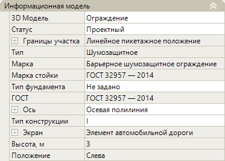
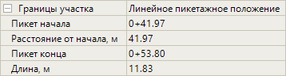
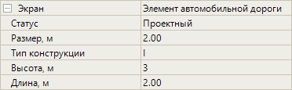

# Редактирование параметров шумозащитных экранов

Данный раздел содержит описание по редактированию ***уникальных*** параметров шумозащитных экранов.



Описание ***общих*** параметров для всех объектов обустройства (описание групп **Общее** и **Разное** в окне **Свойства**) см. в разделе [Редактирование общих параметров.](general_parameters.md)



Выберите шумозащитный экран и откройте окно **Свойства**, далее перейдите в группу полей **Информационная модель**:

## Информационная модель

В данной группе полей представлены основные свойства шумозащитного экрана.

### Различные Параметры

* **3D модель** – в данном поле можно заменить введенный шумозащитный экран на другую 3D-модель, а так же открыть окно программы **Visual Studio Code**. Поле аналогично такому же полю в разделе [Редактирование параметров барьерных ограждений.](barrier_fences.md)

* **Статус** – в данном поле из списка можно сменить статус объекта. Он учитывается при формировании выходных ведомостей шумозащитных экранов.

* **Границы участка** – в данной группе полей содержится информация о пикетажных значениях начала и конца участка шумозащитного экрана, о его длине по пикетажу, а так же расстоянии от начального пикета оси линейного объекта до пикета начала экрана. Чтобы просмотреть информацию о границе участка нажмите знак :

  

* **ГОСТ** – в данном поле отображается номер нормативного документа с техническими требованиями к акустическим экранам. Номер документа будет учтен при формировании ведомости.

* **Ось** – данные поля настроек предназначены для хранения детальных параметров положения введенного участка шумозащитных экранов в пространстве рабочего поля. При необходимости они могут быть отредактированы. Для раскрытия поля нажмите знак , для раскрытия группы полей **Вершины** и **Точки** так же нажмите знак .

### Шумозащитный экран

* **Тип/ Марка/ Марка стойки** – в данных полях отображаются сведения о шумозащитном экране, которые отобразятся в ведомости.

* **Тип фундамента** – в этом поле можно выбрать тип фундамента, на котором будет установлен шумозащитный экран (**Ленточный** или **Свайный**). Выбранный тип фундамента будет учтен при формировании ведомости.

* **Тип конструкции** – по умолчанию выбран тип конструкции шумозащитного экрана **I**, в данном поле можно изменить на другую модель конструкции. Выбранный тип конструкции будет учтен при формировании ведомости, модель конструкции можно увидеть в окне **3D вид**.

* **Экран** – в данной группе полей отображаются настроенные параметры шумозащитного экрана. Чтобы развернуть поле знак :

  

* **Положение** – в этом поле выбирается сторона расположение участка шумозащитных экранов относительно оси линейного объекта. Данная информация отобразится в ведомости шумозащитных экранов.

  

  Для объектов обустройства введенных методом **Вручную** и **По полосе и смещению** Положение определяется автоматически.

  