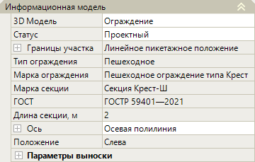
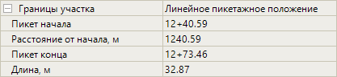
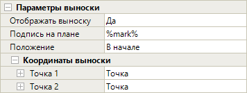

# Редактирование параметров пешеходных ограждений

Данный раздел содержит описание по редактированию ***уникальных*** параметров пешеходного ограждения. 



Описание ***общих*** параметров для всех объектов обустройства (описание групп **Общее** и **Разное** в окне **Свойства**) см. в разделе [Редактирование общих параметров.](general_parameters.md)



Выберите ограждение и откройте окно **Свойства**, далее перейдите в группу полей **Информационная модель**:

## Информационная модель

В данной группе полей представлены основные параметры пешеходного ограждения.

### Различные Параметры

* **3D модель** – в данном поле можно заменить введенное пешеходное ограждение на другую 3D-модель, а так же открыть окно программы **Visual Studio Code**. Поле аналогично такому же полю в разделе [Редактирование параметров барьерных ограждений.](barrier_fences.md)

* **Статус** – по умолчанию статус объекта назначен как **Проектный**. Он учитывается при формировании выходных ведомостей. При необходимости смените этот параметр из выпадающего списка:

  

* **Границы участка** – в данной группе полей отображаются пикетажные значения начала и конца пешеходного ограждения, длина ограждения по пикетажу, а так же расстояние от начального пикета оси линейного объекта до пикета начала ограждения. Для раскрытия поля нажмите знак :

  

* **ГОСТ** – в данном поле отображается наименование нормативного документа, которое будет учитываться при формировании выходных ведомостей.

* **Ось** – данные поля настроек предназначены для хранения детальных параметров положения введенного линейного объекта в пространстве рабочего поля. При необходимости они могут быть отредактированы. Для раскрытия поля нажмите знак , для раскрытия группы полей **Вершины** и **Точки** так же нажмите знак .

  

  В зависимости от способа ввода объекта (**Вручную, Полилинией, По линейному объекту, По линейному объекту со смещением, По полосе и смещению**) эти параметры могут быть различны.

  

### Пешеходное ограждение

* **Тип ограждения/ Марка ограждения/ Марка стойки секции** – в данных полях отображаются соответствующие сведения, которые будут учитываться при формировании выходных ведомостей.

* **Длина секции** – в данном поле отображается длина секции, которая будет учитываться при формировании выходных ведомостей.

* **Положение** – в данном поле можно выбрать сторону расположения ограждения относительно оси линейного объекта. Данный параметр отобразится в ведомости пешеходных ограждений.

  

  Для объектов обустройства введенных методом **Вручную** и **По полосе и смещению** Положение определяется автоматически.

  

### Параметры выноски

* В данной группе полей можно настроить отображение выноски с подписями в окне **План**. Для раскрытия поля нажмите знак :

  

  Ознакомиться с инструкцией по настройке данных полей можно в разделе [Редактирование параметров барьерных ограждений.](barrier_fences.md)