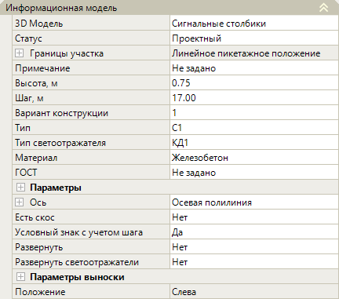
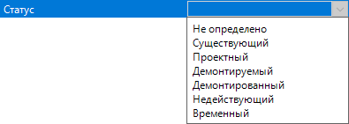
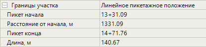
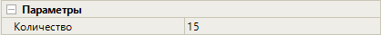
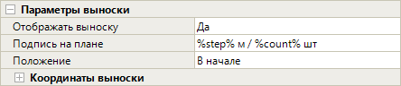

# Редактирование параметров сигнальных столбиков

Данный раздел содержит описание по редактированию ***уникальных*** параметров сигнальных столбиков.



Описание ***общих*** параметров для всех объектов обустройства (описание групп **Общее** и **Разное** в окне **Свойства**) см. в разделе [Редактирование общих параметров.](general_parameters.md)



Выберите сигнальные столбики и откройте окно **Свойства**, далее перейдите в группу полей **Информационная модель**:

## Информационная модель

В данной группе полей представлены основные параметры сигнальных столбиков.

### Различные Параметры

* **3D модель** – в данном поле можно заменить введенные сигнальные столбики на другую 3D-модель, а так же открыть окно программы **Visual Studio Code**. Поле аналогично такому же полю в разделе [Редактирование параметров барьерных ограждений.](barrier_fences.md)

* **Статус** – по умолчанию статус объекта назначен как **Проектный**. Он учитывается при формировании выходных ведомостей. При необходимости смените этот параметр из выпадающего списка:

  

* **Границы участка** – в этой группе полей представлена информация о пикетажных значениях начала и конца участка установки сигнальных столбиков, длина участка по пикетажу, а так же расстояние от начального пикета оси линейного объекта до пикета, где начинается первый сигнальный столбик. Для раскрытия поля нажмите знак :

  

* **Примечание** - в данном поле можно внести примечание, которое будет учтено при создании выходных ведомостей.

* **ГОСТ** – в данном поле можно ввести наименование нормативного документа, которое будет учитываться в надписи выноски и формировании выходных ведомостей.

* **Ось** – данные поля настроек предназначены для хранения детальных параметров положения введенного участка сигнальных столбиков в пространстве рабочего поля. При необходимости они могут быть отредактированы. Для раскрытия поля нажмите знак , для раскрытия группы полей **Вершины** и **Точки** так же нажмите знак .

  

  В зависимости от способа ввода объекта (**Вручную, Полилинией, По линейному объекту, По линейному объекту со смещением, По полосе и смещению**) эти параметры могут быть различны 

  

### Сигнальные столбики

* **Высота, м** – в поле задается расстояние между земной поверхностью и вершиной сигнального столбика.

* **Шаг, м** - в данном поле задается расстояние между сигнальными столбиками. Учитывается при формировании ведомостей, а также при визуализации проекта.

* **Вариант конструкции** – в данном поле перечислены доступные для выбора различные сигнальные столбики в зависимости от их конструкции. В окне **3D вид** можно просмотреть модель выбранной конструкции сигнального столбика.

  

  При выборе варианта конструкции сигнальных столбиков программа предлагает только те варианты, которые удовлетворяют заданному типу сигнальных столбиков.

  

* **Тип** – в данном поле из списка можно выбрать сигнальные столбику по типу (С1, С2, С3), выбранный тип будет учтен при создании ведомостей.

* **Тип светоотражателя** – в данном поле из списка можно выбрать вид световозвращателя (катафоты), который можно увидеть в окне **3D вид**.

* **Материал** – в данном поле можно выбрать материал изготовления сигнальных столбиков. Материал определяется в зависимости от выбранного параметра в поле Тип и будет учтен при создании ведомостей.

* **Параметры** – чтобы раскрыть поле нажмите знак :

  

  В поле **Количество** отображается число сигнальных столбиков на участке, которое зависит от интервала заданного в поле **Шаг, м**.

* **Есть скос** – чтобы отобразить в окне **3D вид** сигнальный столбик, у которого корпус имеет скос в верхней части, выберите в данном поле опцию **Да**. Чтобы верхняя часть столбика не имела скос выберите в поле значение **Нет**.

* **Условный знак с учетом шага** - если в данном поле выбрано значение **Нет**, то условный знак сигнальных столбиков в окне **План** будет отображаться без учета шага стоек.

* **Развернуть** – в данном поле можно развернуть лицевую сторону сигнальных столбиков на противоположную. Например, при расстановке столбиков на одностороннем движении. Для этого в поле выберите значение **Да**. Изменение можно увидеть в окне **3D вид**.

* **Развернуть светоотражатели** – в данном поле можно развернуть положение светоотражателей на сигнальных столбиках в противоположную сторону, например при одностороннем движении. Для этого в поле выберите значение **Да**. Изменение можно увидеть в окне **3D вид**.

* **Положение** – в данном поле можно выбрать положение сигнальных столбиков относительно оси линейного объекта. Данная информация отобразится в ведомости сигнальных столбиков.

  

  Для объектов обустройства введенных методом **Вручную** и **По полосе и смещению** Положение определяется автоматически.

  

### Параметры выноски

* В данной группе полей можно настроить отображение выноски с подписями в окне **План**. Для раскрытия поля нажмите знак :

  

  Ознакомиться с инструкцией по настройке данных полей можно в разделе [Редактирование параметров барьерных ограждений.](barrier_fences.md) 
