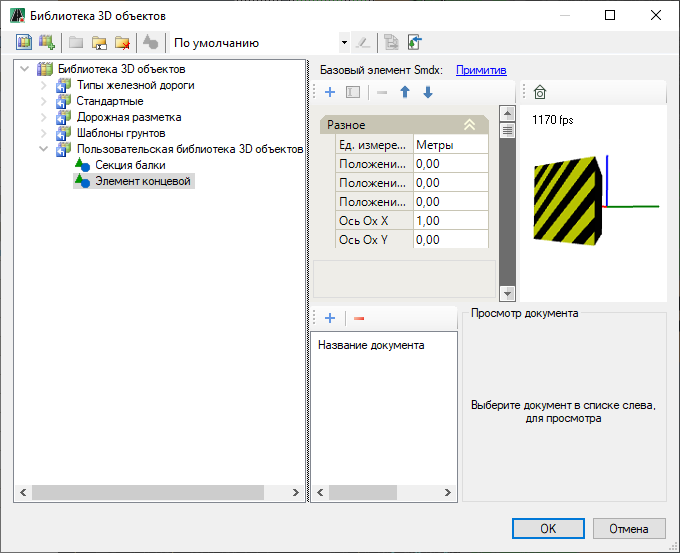
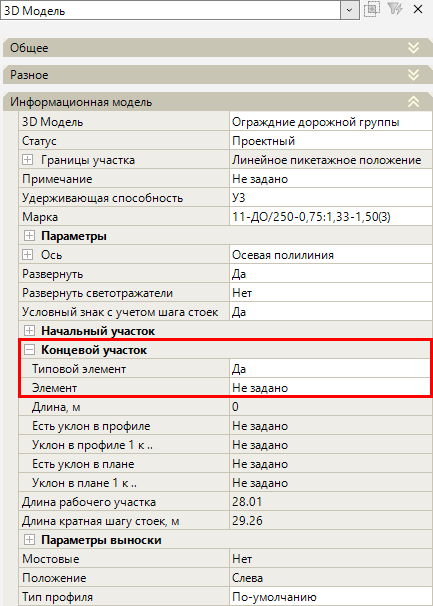
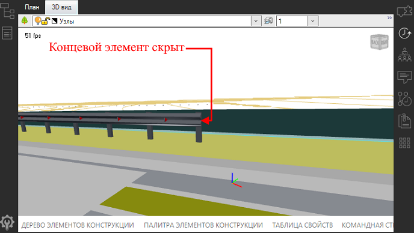
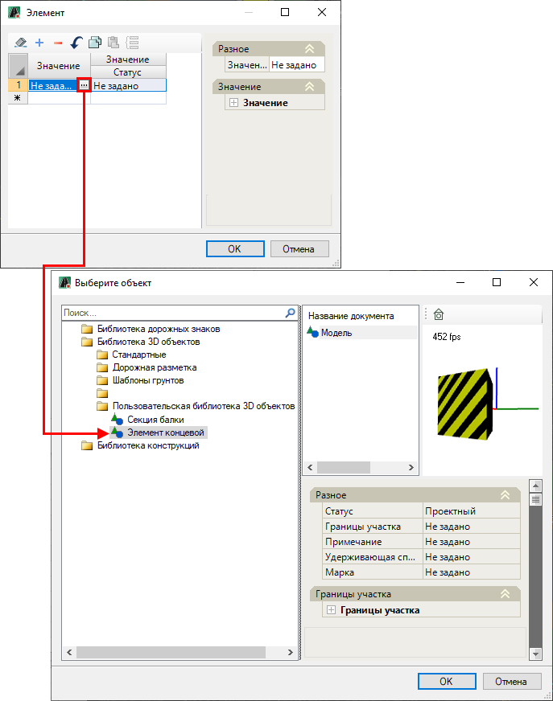
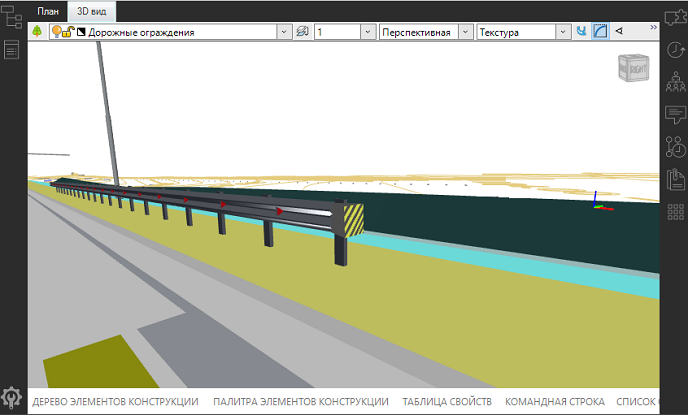
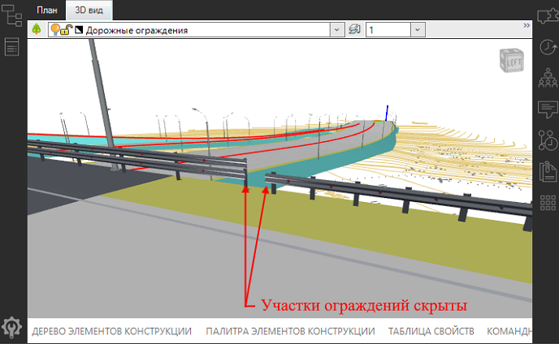
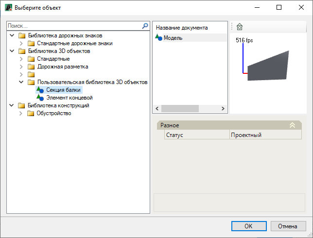
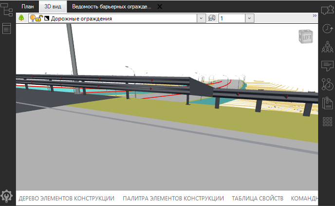

# Замена стандартного концевого участка барьерного ограждения на пользовательскую 3D-модель

Функционал программы позволяет заменить *концевой элемент* барьерного ограждения на другую пользовательскую 3D-модель *концевого элемента*.

В данном разделе описан механизм добавления *концевого элемента* ограждения на его конечном участке, а так же показан пример добавления *секции балки* для сопряжения ограждений, например различных марок.

Для этого:

* <u>Предварительно необходимо добавить пользовательские 3D-модели концевых элементов, для этого:</u>

В **Библиотеке 3D объектов** необходимо создать пользовательскую библиотеку и добавить в нее новые элементы 3D-модели, в данном случае *концевой элемент* и *секцию балки* для сопряжения.



Описание работы с **Библиотекой 3D объектов** см. **Приложение Е**, разделы [Общие сведения](../../../../../annex/libraries/libraries_info.md) и [Работа с библиотекой 3D объектов](../../../../../annex/libraries/library_3d_models.md).



На рисунке ниже отображено окно **Библиотека 3D объектов**, которое показывает пользовательскую библиотеку с добавленными новыми элементами:

* <u>Чтобы добавить *концевой элемент* на конечном участке ограждения:</u>

1. В окне **Свойства** барьерного ограждения разверните поле **Концевой участок** нажав знак . В поле **Типовой элемент** установите значение **Да**:

   

   При этом стандартный концевой элемент ограждения, будет скрыт, изменения можно просмотреть в окне **3D вид**:

   

2. Поле **Элемент** станет доступным, в нем нажмите кнопку , откроется окно, в котором в столбце **Значение** нажмите кнопку , откроется окно, в котором выберите *концевой элемент* из пользовательской библиотеки и нажмите **ОК**:

   

3. Наименование элемента появится в столбце **Значение**. После заданных настроек нажмите **ОК**.

В результате на конечном участке барьерного ограждения добавится пользовательская 3D-модель *концевого элемента*. Результат можно увидеть в окне **3D вид**:

* <u>Чтобы добавить *секцию балки* для сопряжения ограждений:</u>

Алгоритм добавления *секции балки* для сопряжения ограждений идентичен добавлению *концевого элемента* ограждения. 

Рассмотрим пример добавления *секции балки* для сопряжения дорожного и мостового ограждений. Для этого:

1. В окне **Свойства**, нажав знак , разверните поле **Конечный участок** у *дорожного* ограждения и поле **Начальный участок** у *мостового* ограждения. Далее у *мостового* и *дорожного* ограждения в поле **Типовой элемент** установите значение **Да**.

   Концевые элементы у *дорожного* и у *мостового* ограждений будут скрыты, изменения можно просмотреть в окне **3D вид**:

   

2. Далее выберите *дорожное* ограждение и в его свойствах, в поле **Элемент** аналогично **п.2**, описанному в примере добавления концевого элемента на концевом участке ограждения, откройте окно и из пользовательской библиотеки добавьте элемент секции балки (см. описание выше):

   

В результате на конечном участке *дорожного* ограждения добавится 3D-модель *секции балки*, которая соединит два ограждения разных марок. Результат можно увидеть в окне **3D вид**:

