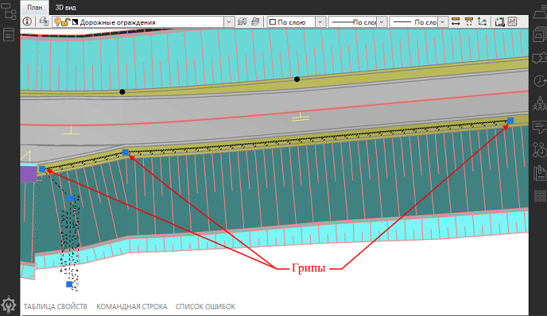
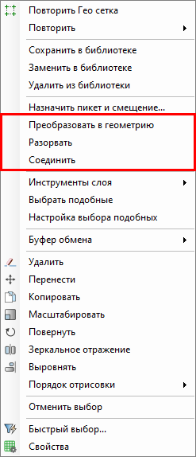

# Редактирование объектов обустройства в рабочем поле

Объекты обустройства в рабочем поле можно редактировать визуально или с помощью опций, находящихся в контекстном меню.

## Визуально

Визуально редактировать объекты обустройства, можно перемещая соответствующие ручки (грипы). Для этого, ЛКМ выделите объект и переместите грип в требуемое место.



Изменяя начальный и конечный грип объекта, автоматически будет пересчитан пикетаж объекта.



## Через контекстное меню

При выделении объекта и нажатии ПКМ, открывается контекстное меню, в котором имеются следующие опции:

### Преобразование объекта в геометрию

Данная функция применяется к объектам, созданным методом **Вручную** или **По полосе и смещению**, она позволяет изменить способ ввода объекта на способ ввода **Полилинией**.

Эта функции полезна, когда требуется изменить геометрию ранее созданного (методом **Вручную** или **По полосе и смещению**) объекта, например, в случае, когда барьерное ограждение проходит вдоль дороги и при добавлении переходно-скоростной полосы требуется изменить геометрию барьерного ограждения путем добавления дополнительной вершины.

Чтобы изменить способ ввода объекта:

1. Выделите объект и нажмите ПКМ, в открывшемся контекстном меню выберите пункт **Преобразовать геометрию**.

В результате у выделенного объекта будет изменен изначальный способ ввода и появятся дополнительные вершины.

### Разорвать объект

Данная функция позволяет разделить объект обустройства на две части в выбранной точке. Для этого:

1. Выделите объект и нажмите ПКМ, в открывшемся контекстном меню выберите пункт **Разорвать**.

2. ЛКМ на объекте укажите точку разрыва.

В результате объект будет разорван в указанной точке.



При разрыве барьерного ограждения длины начальных и конечных получившихся участков ограждения будут сохранены из первоначального (цельного) ограждения.



### Соединить объект

Данная функция позволяет объединить два объекта обустройства в один единый объект, участки этих двух объектов должны стыковаться в одной точке. Для этого:

1. Выделите первую часть объекта и нажмите ПКМ, в открывшемся контекстном меню выберите пункт **Соединить**.

2. Курсор мыши примет форму прицела, ЛКМ выберите вторую часть объекта обустройства.

В результате объединения получится один объект.



Если два объекта имеют разные параметры, то объединенный объект будет иметь параметры, взятые из той части объекта, которую выбрали первой.

