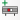
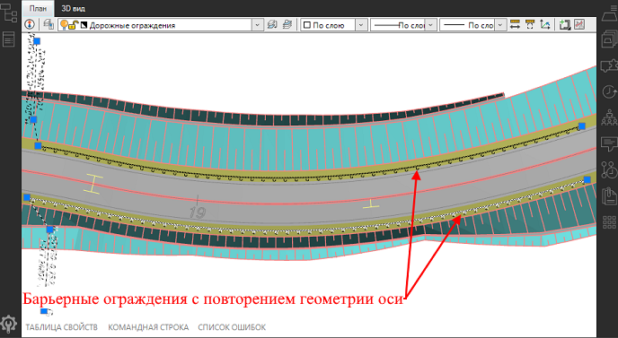
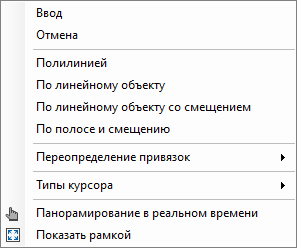
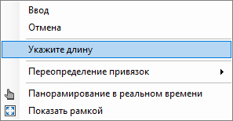

# Ввод объекта обустройства

Чтобы ввести объект обустройства:

1. В **Структуре проекта** сделайте активной соответствующую модель типа **Обустройство**.

  

  Подробное описание см. в разделе [Создание модели Обустройство](../create_traffic_safety_model.md).

  

2. На ленте **Ограждения и Направляющие устройства** или в меню **Обустройство – Ограждения и Направляющие устройства**, в зависимости от задачи, нажмите на одну из следующих пиктограмм:

*  (**Барьерное ограждение**).
*  (**Пешеходное ограждение**).
*  (**Водоналивной барьер**).
*  (**Сигнальные столбики**).
*  (**Парковочные столбики**).
*  (**Дорожный конус**).
*  (**Ограждение типа «Солдатик»**).

  Либо на ленте **Разное** или в меню **Обустройство – Разное**, в зависимости от задачи, нажмите:

*  (**Искусственная неровность**).
*  (**Шумозащитный экран**).

3. Курсор мыши примет форму перекрестья. Для ввода объекта доступны следующие методы:

а) <u>**Вручную**</u> - данный способ позволяет быстро создать объект обустройства на криволинейном участке дороги, при этом указав только начальную и конечную точки (при необходимости можно указывать несколько промежуточных точек). Для этого ЛКМ укажите начальную и конечную точки объекта, для завершения команды нажмите **Enter**. Программа автоматически повторит геометрию оси. На рисунке ниже приведен пример введенного в окне **План** барьерного ограждения с автоматическим повторением геометрии оси линейного объекта.



Программа автоматически повторит геометрию оси, если в предварительных настройках был назначен линейный объект (см. раздел [Предварительные настройки модели.](../pre_settings_model.md)



b) Выбор способа ввода объекта в контекстном меню. Для этого нажмите ПКМ и в открывшемся контекстном меню выберите вариант ввода объекта:

При выборе варианта:

* **Полилинией** - данный способ позволяет создать объект обустройства путем указания его вершин в любом месте рабочего поля. Для этого, в рабочем поле ЛКМ укажите вершины, по которым будет создан объект, для завершения команды нажмите **Enter**.

* **По линейному объекту** - данный способ позволяет создать объект обустройства по любому линейному объекту (например по предварительно отрисованной полилинии). Для этого в рабочем поле ЛКМ выберите линейный объект по которому будет создан объект обустройства.

* **По линейному объекту со смещением** - данный способ позволяет создать объект обустройства по любому линейному объекту (например по предварительно отрисованной полилинии), при этому с возможностью указания пикетажных границ объекта (ПК+ начала и ПК+ конца (или длину участка)), а также смещение (Влево\Вправо) относительно выбранного линейного объекта.

* **По полосе и смещению** - данный способ позволяет создать объект обустройства относительно элемента дороги (например, полосы, кромки, бровки и т.д.), с возможностью указания пикетажных границ объекта (ПК+ начала и ПК+ конца (или длину участка)), а также смещение (Влево\Вправо) относительно выбранного элемента дороги.

  

  1. Для возможности указания элемента дороги (например, полосы, кромки, бровки и т.д.) модели типа Автомобильная дорога, в окне План необходимо, что была включена видимость слоя *Верх покрытия*, а также должны быть заданы *Дополнительные оси* в таблице **Задать параметры конструкции**, ознакомиться более подробно можно [в данном разделе](../../../road_crossection/total/additional_lanes.md).

  2. Добавленный данным способом объект обустройства будет пересчитываться при изменениях линейного объекта или его элементов. Например, если ширина полосы изменилась, то объект обустройства, привязанный к данной полосе, так же изменит своё положение. Подробнее см. раздел [Обновление данных объектов ТСОДД](../updating_road_object_data.md).

  

  Процесс ввода для способов **По линейному объекту со смещением** и **По полосе и смещению** идентичен. Курсор мыши примет форму прицела. ЛКМ выберите линейный объект/ элемент дороги (например, полосу), курсор мыши будет привязан к линейному объекту/ полосе. Укажите положение начальной или конечной точки визуально ЛКМ или задайте ПК+ в динамической строке ввода. Вместо конечной точки можно задать Длину объекта, для этого, укажите начальную точку, а затем нажмите ПКМ и из контекстного меню выберите **Укажите длину**:

  

  После задания длины участка, в динамической строке введите расстояние смещения объекта относительно выбранного линейного объекта/ полосы и нажмите **Enter**.

В результате в рабочем поле появится объект обустройства.