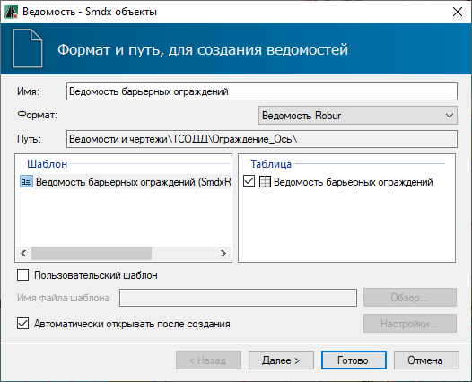
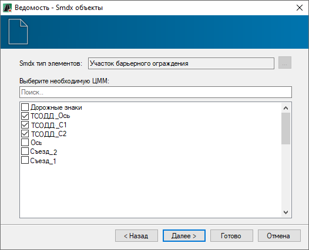
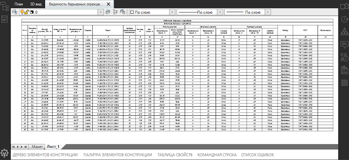

# Формирование выходных ведомостей

Программа позволяет формировать ведомости следующих типов:

* **Барьерных ограждений.**
* **Пешеходных ограждений.**
* **Сигнальных столбиков.**
* **Направляющих устройств.**
* **Искусственных неровностей.**
* **Шумозащитных экранов.**

Представленные типы ведомостей формируются идентично. В данном описании рассмотрен пример создания ведомости **Барьерных ограждений**.

Чтобы создать ведомость:

1. На ленте **Ограждения и Направляющие устройства** нажмите кнопку  (**Создать ведомость**), из выпадающего списка выберите ведомость  **Барьерных ограждений**. Откроется окно стандартного мастера ведомости:

   

2. Выберите формат и шаблон ведомости, нажмите **Далее**.

3. На следующей вкладке активируйте опцию рядом с моделью **Обустройство**, где были установлены барьерные ограждения и нажмите **Далее**:

   

   Если выбрать несколько моделей **Обустройства** с установленными дорожными знаками, то данные по этим знакам так же будут внесены в ведомость.

   

   

4. Выберите формат листов, при необходимости заполните основную надпись и нажмите **Готово**.

5. Откроется окно, в котором введите наименование файла ведомости и нажмите **ОК**.

В результате ведомость будет сформирована и открыта в соответствующем редакторе.

Ниже показан пример ведомости **Барьерных ограждений**, сформированной в формате **Ведомость Robur** и открытой в соответствующем окне:

