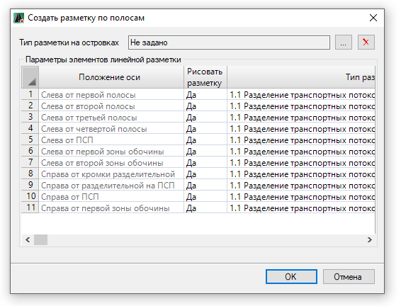
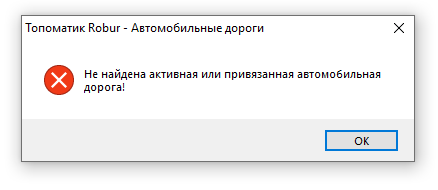
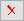
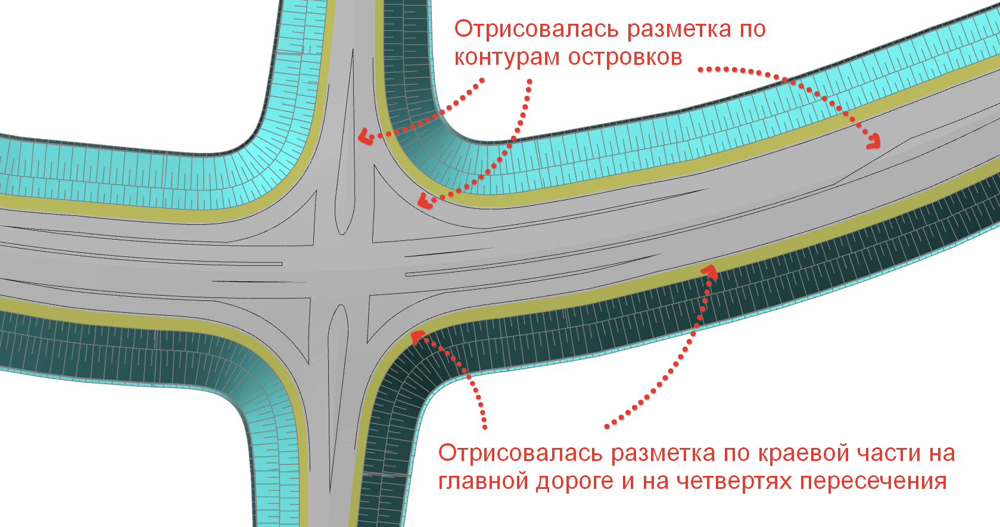

# Автоматическое создание разметки

Данная функция позволяет выполнить групповую отрисовку линий разметок различных типов по полосам проезжей части, а также контурам направляющих островков на пересечениях и примыканиях. Для этого:

1. В **Структуре проекта** сделайте активной соответствующую модель типа **Обустройство**.

   

   Подробное описание см. в разделе [Создание модели Обустройство](../../create_traffic_safety_model.md)

   

2. На ленте **Дорожная разметка** или в меню **Обустройство - Дорожная разметка** нажмите  (**Создать дорожную разметку по полосам**), откроется окно:

   

   

   Если после выбора данной команды появляется сообщение:
   
   
   
   то необходимо в [Предварительных настройках](../../pre_settings_model.md) модели **Обустройство** в разделе **Пикетаж с другой модели** назначить соответствующую модель типа **Автомобильная дорога**.

   

   * В верхней части окна можно назначить тип разметки, которым будут отрисованы контуры островков на пересечениях. Для этого в верхней части данного окна нажмите кнопку , откроется окно **Выберите объект**, в котором выберите тип разметки и нажмите **ОК**. Чтобы сбросить выбранный тип разметки нажмите кнопку . 

   * В нижней части окна каждой границе какой-либо полосы линейного объекта может быть присвоен определенный тип разметки, который выбирается при нажатии кнопки  в столбце **Тип разметки**. 
    

3. Задайте необходимые параметры создания разметки по полосам и нажмите **ОК**.

В результате программа автоматически создаст разметку выбранных типов по заданным полосам и островкам на пересечениях выбранного линейного объекта:



Для того, что бы по островкам, созданных пересечений, автоматически создалась линейная разметка, в [Предварительных настройках](../../pre_settings_model.md) модели **Обустройство** должна быть выбрана модель типа **Автомобильная дорога**, которая является главной дорогой для созданных пересечений (подробнее см. раздел [Создание пересечений](../../../design_single_level_intersections_and_junctionss/creating_crossing.md))

