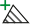
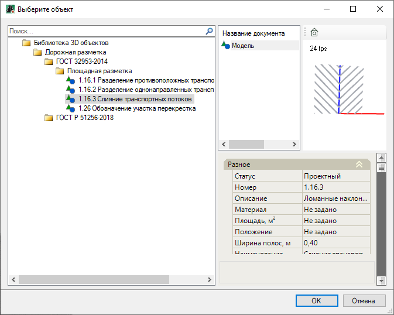
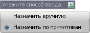
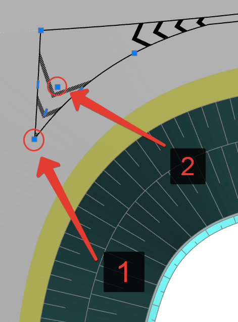
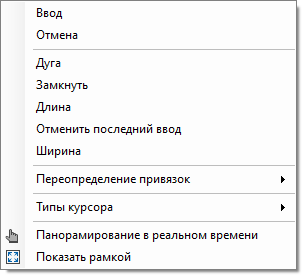
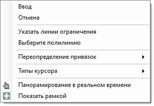
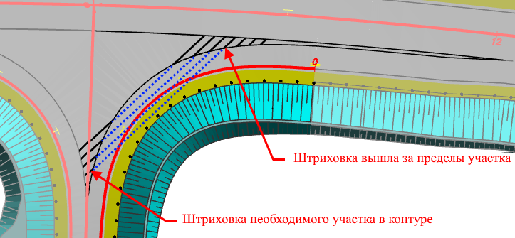
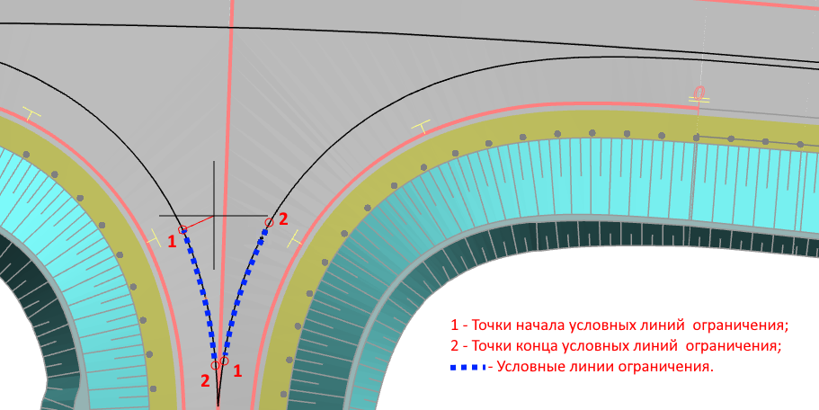
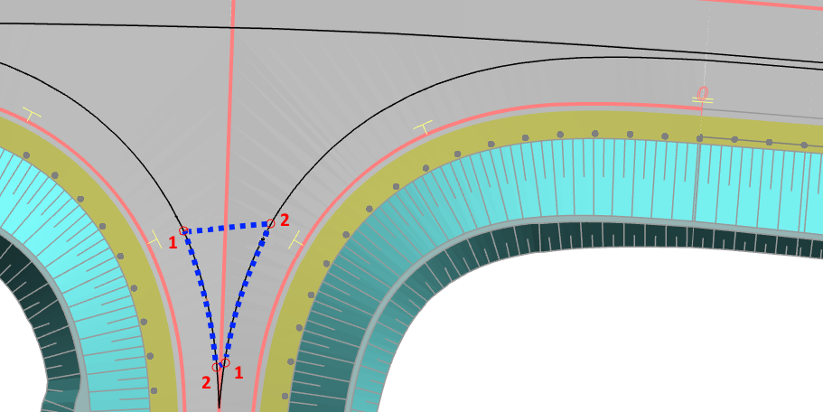
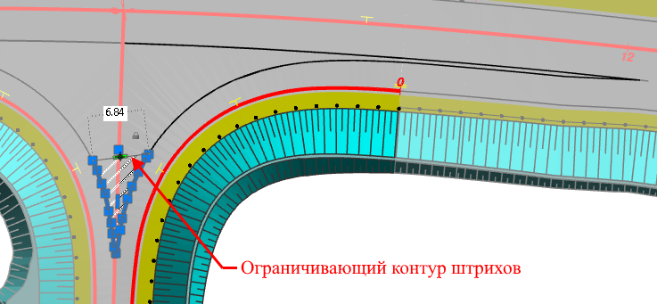

# Площадная разметка

## Ввод площадной разметки

Данная функция позволяет создавать площадную разметку как по ранее созданному контуру островка, так и назначением контура вручную в рабочем поле. Для этого:

1. В **Структуре проекта** сделайте активной соответствующую модель типа **Обустройство**.

   

   Подробное описание см. в разделе [Создание модели Обустройство](../../create_traffic_safety_model.md)

   

2. На ленте **Дорожная разметка** или в меню **Обустройство - Дорожная разметка** нажмите  (**Ввести разметку островка**), откроется окно:

   

   В левой части окна из списка выберите нужный тип разметки и нажмите **ОК**.

   При выборе типа дорожной разметки в правой части окна представлены свойства элемента разметки, ее 3D вид и окно с сопроводительной документацией к элементу, если таковая имеется.

   

   Все типы (элементы) дорожной разметки хранятся в специализированной библиотеке – **Библиотека 3D объектов**. Описание работы с библиотекой см. в разделе [Работа с библиотекой 3D объектов](../../../../../annex/libraries/library_3d_models.md).

   

3. Далее в динамическом вводе выберите способ ввода контура разметки в рабочем поле:

   

   * **Назначить вручную** – выберите данную функцию, если необходимо графически отрисовать контур разметки, для этого в рабочем поле ЛКМ укажите характерные точки контура, нажмите **Enter** для завершения команды.

   * **Назначить по примитивам** – данная функция позволяет выбрать ранее отрисованный контур разметки. В этом случае курсор примет форму прицела, ЛКМ укажите исходный контур островка.

   

   До использования данной функции рекомендуется предварительно отрисовать контуры островков. Для этого может быть использована функция **Создать дорожную разметку по полосам**, описание данной функции см. в разделе [Автоматическое создание разметки.](automatic_creating_markup_bands.md)

   

4. Далее ЛКМ внутри островка укажите первую (угловую) и вторую точку направляющей, относительно которой будут рисоваться линии (штрихи) разметки:

   

В результате, внутри контура будет создана площадная разметка выбранного типа.

## Дополнительные опции при вводе разметки

Функционал программы позволяет задействовать дополнительные функции контекстного меню при вводе площадной разметки одним из способов описанных выше (см. раздел [Ввод площадной разметки](creating_area_markup_new.md#vvod-ploshadnoj-razmetki)).

<u>При выбранном способе ввода площадной разметки **Назначить вручную**:</u>

На этапе ввода характерных точек контура островка нажмите ПКМ, откроется контекстное меню, из которого выберите необходимые функции:

Данные функции аналогичны функциям при создании полилинии, см. описание работы с элементами чертежа, раздел [Создание полилинии](../../../../../rb_survey/dtm/dwg/create_polyline.md).

<u>При выбранном способе ввода площадной разметки **Назначить по примитивам**:</u>

* Функция **Выберите полилинию** позволяет перевыбрать контур островка.

* Функция **Указать линии ограничения** позволяет выбрать не весь указанный контур в качестве контура для штриховки островка, а только его часть. В противном случае указав весь контур островка мы можем получить штриховку, выходящую за пределы необходимого нам контура, см. рисунок ниже:

  

Чтобы создать ограничивающий контур штрихов:

1. При выборе данной функции курсор мыши будет привязан к основному контуру островка, ЛКМ укажите точки начала и конца условных линий ограничения штриховки (всего 4 точки):

   

   Программа замкнет линии ограничения в контур:

   

2. Далее ЛКМ укажите первую (угловую) и вторую точку направляющей штриховки.

В результате будет создана разметка выбранного типа по ограничивающему контуру.

