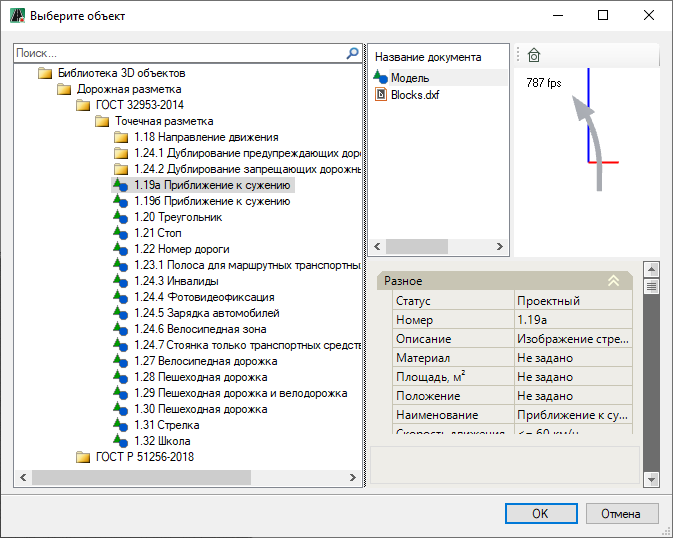
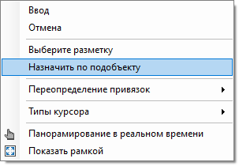
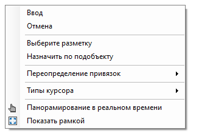
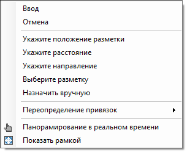
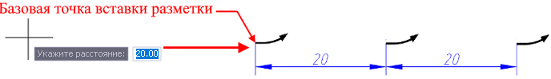

# Точечная разметка

## Ввод точечной разметки

Для ввода точечной разметки в рабочем поле:

1. В **Структуре проекта** сделайте активной соответствующую модель типа **Обустройство**.

   

   Подробное описание см. в разделе [Создание модели Обустройство](../../create_traffic_safety_model.md)

   

2. На ленте **Дорожная разметка** или в меню **Обустройство - Дорожная разметка** нажмите  (**Ввести точечный знак дорожной разметки**), откроется окно:

   

   В левой части окна из списка выберите нужный тип разметки и нажмите **ОК**.

   При выборе типа дорожной разметки в правой части окна представлены свойства элемента разметки, ее 3D вид и окно с сопроводительной документацией к элементу, если таковая имеется.

   

   Все типы (элементы) дорожной разметки хранятся в специализированной библиотеке – **Библиотека 3D объектов**. Описание работы с библиотекой см. в разделе [Работа с библиотекой 3D объектов](../../../../../annex/libraries/library_3d_models.md).

   

3. Далее выберите один из способов ввода точеной разметки в рабочем поле:

   * Ввод точечной разметки **вручную**, для этого ЛКМ укажите базовую точку вставки разметки и ее направление.
   * Ввод точечной разметки **по подобъекту**, для этого нажмите ПКМ и из появившегося контекстного меню выберите **Назначить по подобъекту**:

     

     Курсор мыши будет привязан к оси линейного объекта, назначенного в предварительных настройках (см. раздел [Предварительные настройки модели](../../pre_settings_model.md)) или к оси текущей модели типа Автомобильная дорога. Укажите пикет расположения точечной разметки одним из способов:

     * Графически, для этого ЛКМ укажите точку вставки (базовую точку) разметки. Программа автоматически определит пикетажное положение указанной точки. 
     * Задайте нужный пикет в строке динамического ввода и для подтверждения команды нажмите **Enter**.

В результате точечная разметка появится в рабочем поле.

## Дополнительные опции при вводе разметки

Функционал программы позволяет использовать дополнительные функции в контекстном меню при вводе точечной разметки одним из способов описанном выше (см. подраздел [Ввод точечной разметки](creating_dotty_markup.md#vvod-tochechnoj-razmetki)).

<u>При выбранном способе ввода точечной разметки **вручную**:</u>

Прежде чем указать положение разметки в рабочем поле нажмите ПКМ, откроется контекстное меню:

* Чтобы изменить тип точечной разметки в данном контекстном меню укажите пункт **Выберите разметку**, откроется окно **Выберите объект** (описание данного окна см. **п.1** подраздела [Ввод точечной разметки](creating_dotty_markup.md#vvod-tochechnoj-razmetki)).
* Описание функции **Назначить по подобъекту** см. выше, описание способа ввода точечной разметки в **п.2** раздела [Ввод точечной разметки](creating_dotty_markup.md#vvod-tochechnoj-razmetki).

<u>При выбранном способе ввода точечной разметки **Назначить по подобъекту**:</u>

Курсор мыши будет привязан к оси линейного объекта, для вызова контекстного меню с дополнительными опциями, нажмите ПКМ:

* Функция **Укажите положение разметки** аналогична такой же функции при вводе линейной разметки (см. описание подраздела **Дополнительные опции при вводе разметки** в разделе [Линейная разметка](creating_linear_markup.md)).
* Если необходимо чтобы разметка была отрисована по выбранной полосе через указанное расстояние, выберите пункт **Укажите расстояние** и в строке динамического ввода задайте значение, затем нажмите **Enter**. Далее ЛКМ укажите базовую точку вставки, от которой будет отрисована точечная разметка:

  

* Чтобы задать направление точечной разметке выберите **Укажите направление** и из контекстного меню выберите **По пикетажу** либо **Против пикетажа** будет отрисована разметка.
* Функция **Выберите разметку** позволяет изменить тип точечной разметки, при выборе функции, откроется окно **Выберите объект** (описание данного окна см. **п.1** подраздела [Ввод точечной разметки](creating_dotty_markup.md#vvod-tochechnoj-razmetki)).
* Функция **Назначить вручную** переключает на ручной режим ввода разметки, который был описан выше, в **п.2** подраздела [Ввод точечной разметки](creating_dotty_markup.md#vvod-tochechnoj-razmetki).