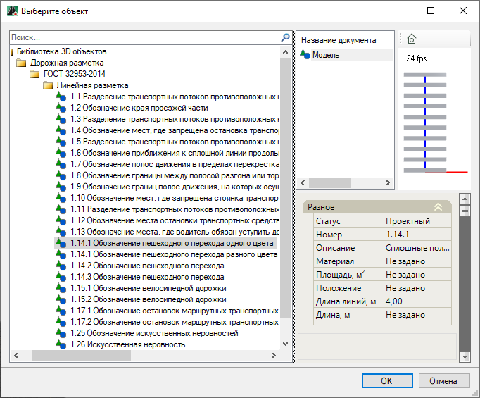
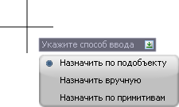
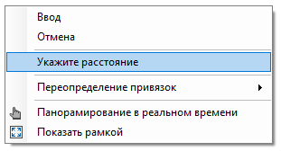
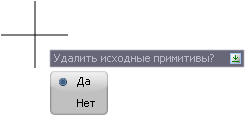
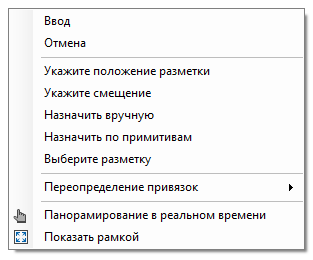
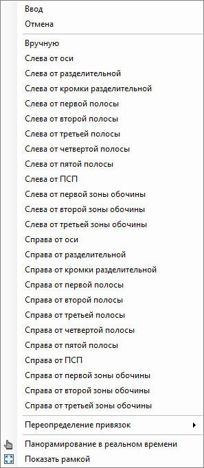
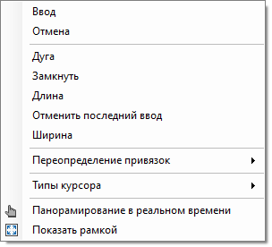
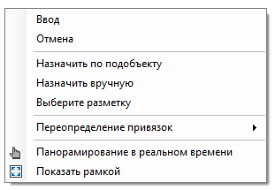

# Линейная разметка

## Ввод линейной разметки

Данная функция позволяет вводить линейную дорожную разметку различными способами. Чтобы отрисовать разметку в рабочем поле:

1. В **Структуре проекта** сделайте активной соответствующую модель типа **Обустройство**.

   

   Подробное описание см. в разделе [Создание модели Обустройство](../../create_traffic_safety_model.md)

   

2. На ленте **Дорожная разметка** или в меню **Обустройство - Дорожная разметка** нажмите  (**Ввести линейную разметку**), откроется окно:

   

   В левой части окна из списка выберите нужный тип разметки и нажмите **ОК**.

   При выборе типа дорожной разметки в правой части окна представлены свойства элемента разметки, ее 3D вид и окно с сопроводительной документацией к элементу, если таковая имеется.

   

   Все типы (элементы) дорожной разметки хранятся в специализированной библиотеке – **Библиотека 3D объектов**. Описание работы с библиотекой см. в разделе [Работа с библиотекой 3D объектов](../../../../../annex/libraries/library_3d_models.md).

   

3. Далее в динамическом вводе выберите вариант ввода разметки:

   

<u>**Назначить по подобъекту**</u>

   Данная функция позволяет вводить линейную разметку с привязкой к оси и полосам линейного объекта, с назначением пикетов и длины разметки.

   

   Данный пункт динамического ввода появится, если в предварительных настройках был назначен линейный объект (см. раздел [Предварительные настройки модели](../../pre_settings_model.md)) или когда ввод линейной разметки будет производиться в текущей модели типа **Автомобильная дорога** или **Трасса**.

   

   При выборе данной функции курсор мыши будет привязан к оси линейного объекта. Начальный и конечный пикеты разметки можно задать несколькими способами:

   * Графически, для этого нажмите ЛКМ в той точке, которая будет являться начальной и конечной для создаваемого участка разметки. Программа автоматически определит пикетажное положение указанных точек. 
   * Путем назначения в строке динамического ввода пикета начала и конца разметки. Для этого введите в строку необходимые значения пикета начала и пикета конца дорожной разметки, затем нажмите **Enter**. 
   * Ввод разметки определенной длины, для этого укажите начальный пикет разметки (одним из выше перечисленных способов), нажмите ПКМ и из контекстного меню выберите **Укажите расстояние**:

     

   Затем в строке динамического ввода задайте длину разметки и нажмите **Enter**. Программа автоматически определит конечный пикет разметки.

<u>**Назначить вручную**</u>

   При выборе данной функции линейную разметку можно вводить произвольно в рабочем поле, для этого укажите ЛКМ характерные точки разметки, для завершения команды нажмите **Enter**. 

<u>**Назначить по примитивам**</u>

   Выберите данный способ, если необходимо назначить разметку из ранее созданного примитива (трассы, границы полосы, полилинии и т.п.). Курсор мыши примет форму прицела, ЛКМ укажите примитив и нажмите **Enter**, в динамическом вводе выберите **Да**, если необходимо удалить исходный контур примитива:

   

   В результате линейная разметка появится в рабочем поле.

## Дополнительные опции при вводе разметки

Функционал программы позволяет задействовать дополнительные функции контекстного меню при вводе линейной разметки одним из способов описанных выше (см. подраздел [Ввод линейной разметки](creating_linear_markup.md#vvod-linejnoj-razmetki)).

<u>При выбранном способе ввода линейной разметки **Назначить по подобъекту**:</u>

Курсор мыши будет привязан к оси линейного объекта, нажмите ПКМ, откроется контекстное меню с дополнительными опциями:

* Чтобы определить местоположение разметки относительно, какой либо полосы линейного объекта выберите пункт **Укажите положение разметки**, откроется контекстное меню, в котором выберите соответствующую полосу:

  

* Если необходимо чтобы разметка была отрисована по выбранной полосе, но при этом была смещена относительно нее на заданное расстояние выберите пункт **Укажите смещение** и в строке динамического ввода задайте нужное значение, затем нажмите **Enter**. 
* Чтобы изменить способ ввода разметки выберите пункт **Назначить вручную** или **Назначить по примитивам** (описание данных способов ввода разметки см. в **п.2** раздела [Ввод линейной разметки](creating_linear_markup.md#vvod-linejnoj-razmetki)). 
* Если на данном шаге необходимо изменить тип разметки укажите пункт **Выберите разметку**, откроется окно **Выберите объект** (описание данного окна см. **п.1** раздела [Ввод линейной разметки](creating_linear_markup.md#vvod-linejnoj-razmetki)). 

<u>При выбранном способе ввода линейной разметки **Назначить вручную**:</u>

На этапе назначения характерных точек линейной разметки нажмите ПКМ, откроется контекстное меню, в котором можно задать дополнительные функции для ввода разметки:

Данные функции аналогичны функциям при создании полилинии, см. описание работы с элементами чертежа, раздел [Создание полилинии](../../../../../rb_survey/dtm/dwg/create_polyline.md).

<u>При выборе способа ввода линейной разметки **Назначить по примитивам**:</u>

Курсор мыши примет форму прицела, для вызова контекстного меню нажмите ПКМ:

Описание функций **Назначить по подобъекту**, **Назначить вручную**, **Выберите разметку** см. выше, в описании дополнительных функций контекстного меню при выборе способа ввода линейной разметки **Назначить по подобъекту**.