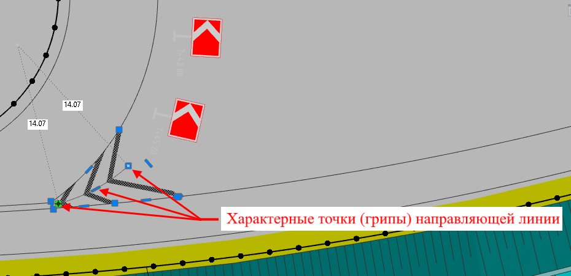
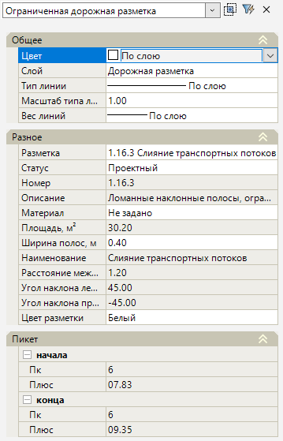

# Редактирование площадной разметки

Редактировать контур площадной разметки в рабочем поле можно с помощью характерных точек (грипов). Имеется возможность изменить местоположение точки (грипа), добавить/ удалить новую характерную точку в контур, преобразовать сегмент контура в дугу. Редактирование контура площадной разметки с помощью грипов аналогично редактированию линейной разметки, см. раздел [Редактирование линейной разметки](edit_linear_markup.md).



Описанные функции по изменению контура площадной разметки так же можно использовать и при изменении направляющей линии разметки. Например, для направляющей линии можно добавить дополнительную вершину или преобразовать ее в дугу, что позволяет откорректировать штрихи разметки на закругленных островках дороги:



При редактировании параметров площадной разметки может быть использовано стандартное окно **Свойства** выбранного объекта:

<u>**Общее**</u>

* Данная группа полей аналогична полям свойств линейной разметки (см. описание окна **Свойства** линейной разметки в разделе [Редактирование линейной разметки](edit_linear_markup.md)).

<u>**Разное**</u>

* В поле **Разметка** можно изменить тип разметки, для этого нажмите кнопку , откроется окно **Выберите объект** (данное окно аналогично окну при создании площадной разметки, см. раздел [Площадная разметка](../create_road_marking/creating_area_markup_new.md)), в котором определите тип разметки и нажмите **ОК**.
* Поле **Ширина полос, м** отображает ширину наклонных линий (штрихов) площадной разметки, данное значение можно изменить.
* В поле **Расстояние между полосами, м** отображено расстояние между наклонными линиями (штрихами) разметки.
* Поля **Угол наклона лево/ Угол наклона право** отображают угол наклона штрихов относительно направляющей линии для разметки типа 1.16.2 или 1.16.3. 
* Остальные поля данного раздела свойств аналогичны полям свойств линейной разметки (см. описание окна **Свойства** линейной разметки в разделе [Редактирование линейной разметки](edit_linear_markup.md)).

<u>**Пикет**</u>

* В полях пикет **начала/ конца** отображается пикетажное значение начальной и конечной наклонной линии (штрихов) площадной разметки. Значения пикетов данных полей отображаются, если в предварительных настройках модели был назначен линейный объект, на пикетаж которого ссылается площадная разметка (см. раздел [Предварительные настройки модели](../../pre_settings_model.md)) или когда ввод площадной разметки производился в текущей модели типа Автомобильная дорога.