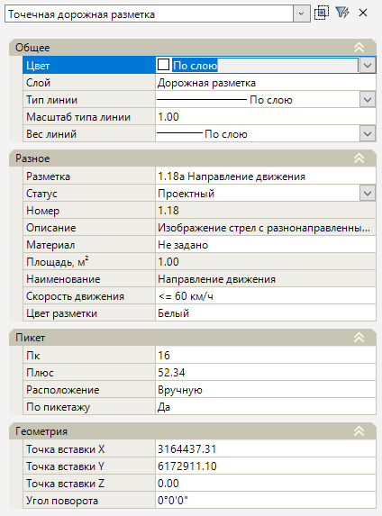

# Редактирование точечной разметки

В рабочем поле точечную разметку можно визуально перемещать за базовую точку (грип), также для точечной разметки доступны основные стандартные функции работы с примитивами чертежа, например такие функции как **Копировать**, **Перенести**, **Повернуть** и т.д.

Для изменения параметров объекта точечной разметки, выделите его ЛКМ и откройте окно **Свойства**:

<u>**Общее**</u>

* Данная группа полей аналогична полям свойств линейной разметки (см. описание окна **Свойства** линейной разметки в разделе [Редактирование линейной разметки](edit_linear_markup.md)).

<u>**Разное**</u>

* В поле **Разметка** можно изменить тип разметки, для этого нажмите кнопку , откроется окно **Выберите объект** (данное окно аналогично окну при создании точечной разметки, см. раздел [Ввод точечной разметки. Дополнительные опции при вводе разметки](../create_road_marking/creating_dotty_markup.md#dopolnitelnye-opcii-pri-vvode-razmetki)), в котором определите тип разметки и нажмите **ОК**.
* Размер некоторых типов точечной дорожной разметки зависит от расчетной скорости движения. В поле **Скорость движения** из списка можно изменить значение расчетной скорости движения выбранной точечной разметки.
* Остальные поля данного раздела свойств аналогичны полям свойств линейной разметки (см. описание окна **Свойства** линейной разметки в разделе [Редактирование линейной разметки](edit_linear_markup.md)).

<u>**Пикет**</u>

* В полях **Пк** и **Плюс** можно изменить пикетажное значение точечной разметки данные поля активны, если в предварительных настройках модели был назначен линейный объект, на пикетаж которого ссылается разметка (см. раздел [Предварительные настройки модели.](../../pre_settings_model.md)) или когда ввод точечной разметки производился в текущей модели типа **Автомобильная дорога**.
* Поле **Расположение** аналогично полю свойств линейной разметки (см. описание группы полей **Пикет** окна **Свойства** линейной разметки в разделе [Редактирование линейной разметки](edit_linear_markup.md)).
* В поле **По пикетажу** задается направление объекта точечной разметки относительно пикетажа линейного объекта. При выборе значения **Да** направление разметки будет по пикетажу, при выборе значения **Нет** – против пикетажа.

<u>**Геометрия**</u>

* В данной группе полей могут быть изменены: координаты базовой точки объекта точечной разметки и угол поворота относительно оси X. Данные параметры могут задаваться визуально с помощью специальной кнопки (  или  ), которая отображается при выборе соответствующего поля.