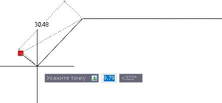
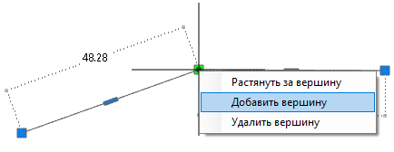
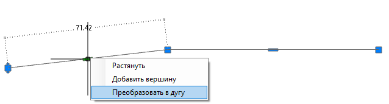
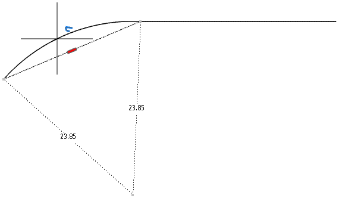
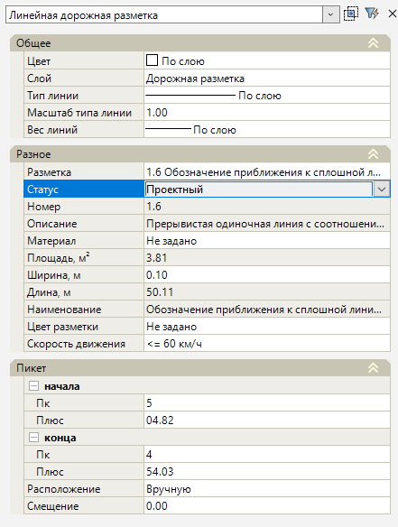

# Редактирование линейной разметки

Функционал программы позволяет редактировать положение и геометрию линейной разметки в рабочем поле с помощью грипов. Для этого выберите нужную разметку и перетащите грип в необходимое место, нажмите ЛКМ:

Чтобы добавить линейной разметке новую вершину нажмите ПКМ на грип, из появившегося контекстного меню выберите **Добавить вершину**, затем укажите положение вершины и нажмите ЛКМ:

* Чтобы удалить вершину нажмите квадратный грип  и выберите **Удалить вершину**.
* Чтобы определенный сегмент линейной разметки преобразовать в дугу, ПКМ нажмите на прямоугольный грип  и из контекстного меню выберите **Преобразовать в дугу**:

Далее визуально укажите местоположение дуги:

Обратным способом можно дугу преобразовать в отрезок.



Так же для видоизменения контуров разметки в рабочем поле могут использоваться все базовые функции редактирования объектов (см. описание по редактированию примитивов [Чертёж](../../../../../rb_survey/dtm/dwg/types_primitives_drawing.md)).



Чтобы редактировать параметры линейной разметки ЛКМ выберите ее и откройте окно **Свойства**:

<u>**Общее**</u>

* В поле **Цвет** можно изменить цвет линейной разметки в рабочем поле. Чтобы выбранный цвет был присвоен разметке, в группе полей **Разное** в поле **Цвет разметки** должно быть установлено значение **По примитиву** (описание данного поля см. ниже).
* В поле **Слой** можно изменить слой линейной разметки.

<u>**Разное**</u>

* В поле **Разметка** можно изменить тип разметки, для этого нажмите кнопку , откроется окно **Выберите объект** (данное окно аналогично окну при создании линейной разметки, см. раздел [Линейная разметка](../create_road_marking/creating_linear_markup.md)), в котором определите тип разметки и нажмите **ОК**.
* **Статус** – в данном поле из списка можно изменить статус дорожной разметки в проекте. По умолчанию статус разметки назначен как **Проектный**.
* В поле **Номер** отображается номер разметки по ГОСТ.
* В поле **Описание** представлено описание линейной разметки по ГОСТ.
* В поле **Материал** можно ввести наименование материала для разметки.
* Поле **Площадь, м2** отображает расчетное значение фактической площади элемента дорожной разметки.
* Поле **Ширина**, м показывает ширину элемента разметки, которую можно изменить.
* Поле **Длина**, м отображает длину всей выделенной разметки.
* Поле **Наименование** показывает имя разметки.
* В поле **Цвет разметки** списком представлены стандартные цвета дорожной разметки (Белый, Оранжевый, Желтый). При выборе значения **По примитиву** цвет разметки будет соответствовать заданному цвету в поле **Цвет** в группе полей **Общие**.
* В поле **Скорость движения** из списка можно изменить значение скорости движения для данного участка. Изменение скорости движения влияет на отображение длины штрихов и пробелов для некоторых типов разметки.

<u>**Пикет**</u>

* В полях пикет **начала/ конца** отображается пикетажное значение линии разметки, которое можно изменить (данные поля активны, если в предварительных настройках модели был назначен линейный объект, на пикетаж которого ссылается линейная разметка (см. раздел [Предварительные настройки модели](../../pre_settings_model.md)) или когда ввод линейной разметки производился в текущей модели типа **Автомобильная дорога**). 
* В поле **Расположение** из списка можно выбрать положение разметки относительно, какой либо полосы линейного объекта.
* Если необходимо чтобы разметка была смещена на заданное расстояние относительно выбранной полосы линейного объекта, в поле **Смещение** введите нужное значение.
