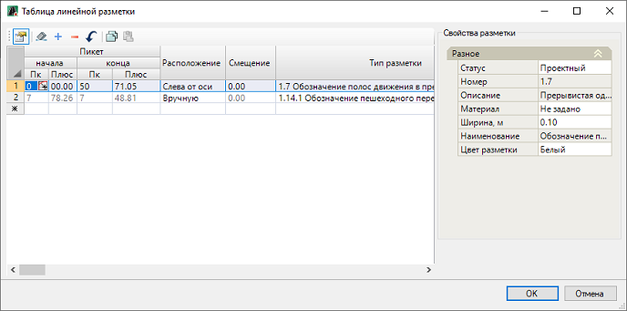
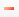
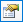

# Таблица линейной разметки

Все объекты линейной дорожной разметки, независимо от того каким способом они создавались, автоматически попадают в **Таблицу линейной разметки**, которую можно редактировать.

Чтобы открыть данную таблицу на ленте **Дорожная разметка** или в меню **Обустройство - Дорожная разметка** нажмите  (**Таблица линейной разметки**), откроется окно:

Каждая строка этой таблицы описывает один объект линейной дорожной разметки.

Удаление объекта разметки в рабочем поле, приводит к удалению соответствующей записи из таблицы и наоборот удаление выбранной строки с помощью кнопки  в таблице приводит к удалению разметки в рабочем поле.

В ячейках столбцов **Пикет начала\ конца** отображаются значения пикетажного положения разметки. Данные столбцы активны, если положение линейной разметки назначено по полосам.

В ячейках столбца **Расположение** из списка можно выбрать положение разметки относительно, какой либо полосы линейного объекта.

Если необходимо чтобы разметка была смещена на заданное расстояние относительно выбранной полосы линейного объекта, в ячейках столбца **Смещение** введите нужное значение.

В правой части окна представлены свойства выбранной разметки, видимость которых регулируется кнопкой . Поля данных свойств аналогичны полям окна **Свойства** линейной разметки (см. описание свойств линейной разметки в разделе [Редактирование линейной разметки](edit_linear_markup.md)).



Для группового изменения, какого либо параметра в данной таблице, например, типа разметки у нескольких объектов одновременно, выделите эти участки в таблице и измените требуемые параметры.

