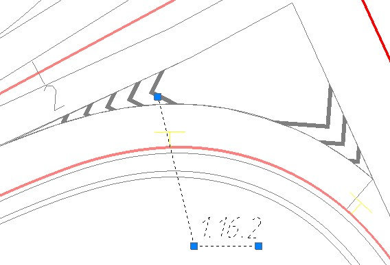
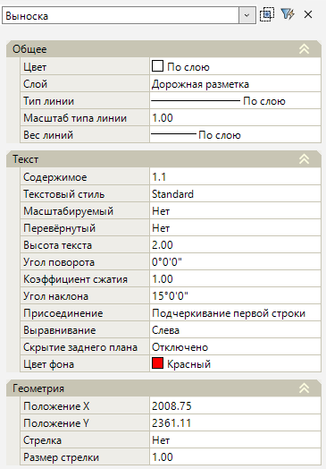

# Редактирование подписи дорожной разметки

Выделив выноску можно изменить ее положение, а также повернуть полку выноски на нужный угол, для этого воспользуйтесь соответствующими синими ручками (грипами):

При необходимости подписи одной выноской нескольких элементов дорожной разметки имеющих одинаковый номер, нажмите ПКМ на соответствующем гриппе и выберите **Добавить вершину**:

Далее укажите место вставки новой выноски:

Для удаления сноски нажмите ПКМ на соответствующем гриппе и выберите пункт **Удалить вершину**:

Так же при выборе выноски ее основные параметры отобразятся в стандартном окне **Свойства**:

В данном окне задаются стандартные настройки выноски и подписи разметки.

* В поле **Присоединение** из списка можно выбрать положение текста относительно сноски, а так же подчеркивание строки.
* В поле **Скрытие заднего плана** из списка можно выбрать заполнения фона текста. Если выбрано значение **Использовать цвет заливки** то цвет фона подписи будет соответствовать выбранному цвету в поле **Цвет фона**. Если выбрано значение **Цвет фона чертежа** то цвет фона подписи будет соответствовать цвету фона рабочего поля. 