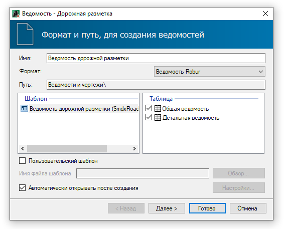
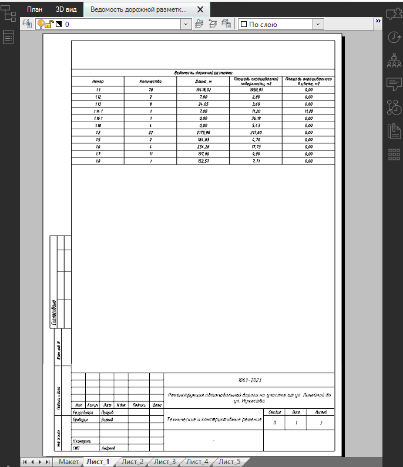

# Формирование выходных ведомостей

Программа позволяет формировать ведомости дорожной разметки следующих типов:

* **Дорожной разметки** – в нее входят общая ведомость с суммарными объемами дорожной разметки и детальная ведомость объемов разметки.
* **Таблицы линейной разметки** - в нее входит описание всех участков линейной разметки каждого типа. 

В данном разделе рассмотрен пример создания ведомости **Дорожной разметки**.

Чтобы создать ведомость:

1. На ленте **Дорожная разметка** нажмите кнопку  (**Создать ведомость**), из списка выберите ведомость  (**Дорожной разметки**). Курсор мыши примет форму прицела, выберите объекты дорожной разметки, например, выделив секущей рамкой область участка, куда попадет необходимая разметка и нажмите **Enter**.
2. Откроется окно мастера ведомости, выберите формат и шаблон ведомости, нажмите **Далее**:

   

3. На следующей вкладке задайте форматы листов ведомости и нажмите **Далее**.

   

   Если шаблон листа выбран **По умолчанию**, программа автоматически подберет формат листа по размеру ведомости.

   

4. На вкладке **Настройки шаблона листа** необходимо заполнить штамп ведомости.
5. После задания всех настроек нажмите кнопку **Готово**, откроется окно, введите наименование файла ведомости и нажмите **ОК**.

В результате ведомость будет сформирована и открыта в соответствующем редакторе.

Ниже отображен пример ведомости **Дорожной разметки**, сформированной в формате **Ведомость Robur** и открытой в соответствующем окне:

