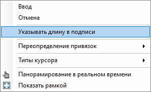
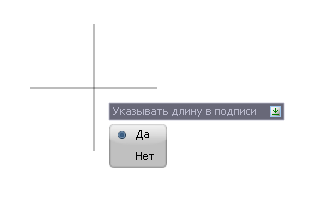
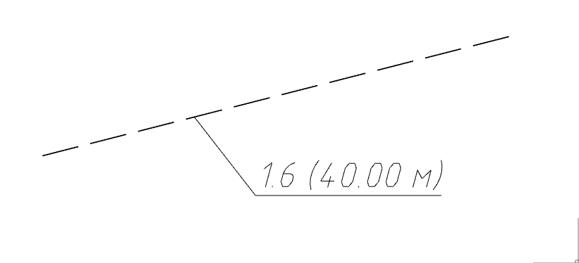

# Подпись дорожной разметки

Для того чтобы подписать в рабочем поле дорожную разметку:

1. На ленте **Дорожная разметка** нажмите кнопку  (**Подписать дорожную разметку**), курсор примет форму прицела.
2. ЛКМ нажмите на разметку в точке прикрепления сноски, далее укажите в рабочем поле местоположение полки выноски.



Чтобы отобразить значение длины в подписи для линейной разметки, перед указанием положения полки выноски нажмите ПКМ и в появившемся контекстном меню выберите **Указывать длину в подписи**:

Откроется контекстное меню, в котором, выберите **Да**:

далее, указав положение подписи в ее содержимом будет указано значение длины выбранной линейной разметки:



В результате в рабочем поле появится сноска с текстом (подписью) разметки.