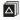
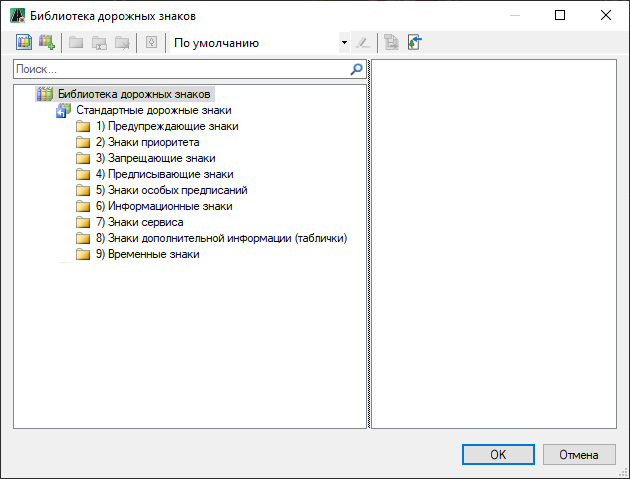
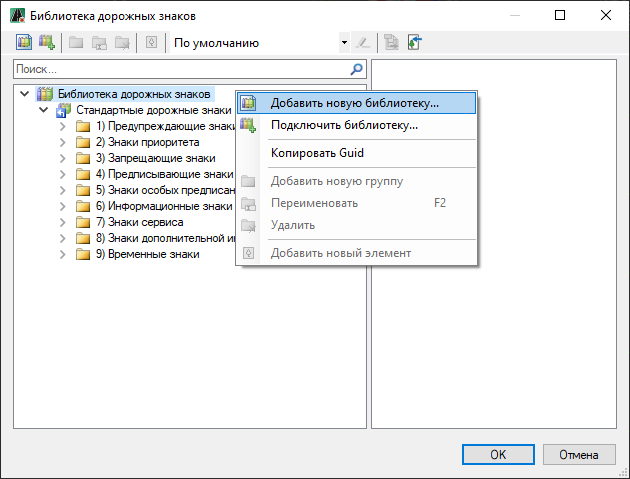
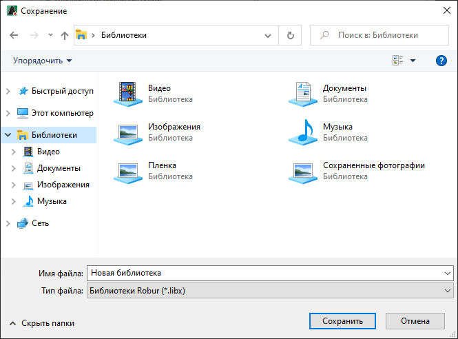
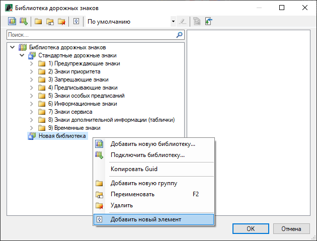
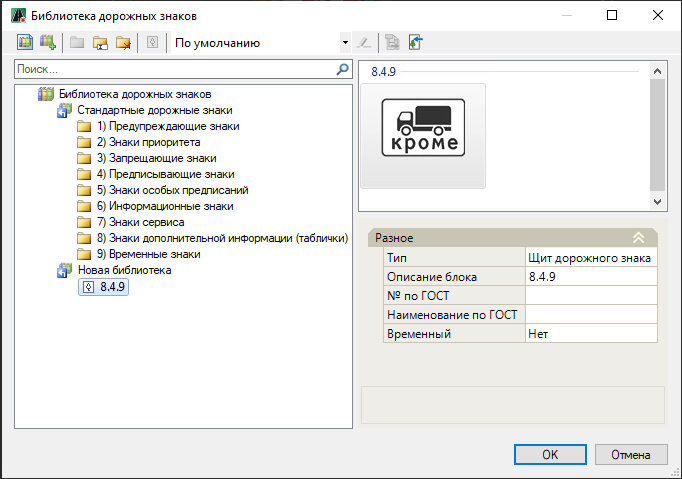

# Добавление дополнительных знаков в библиотеку

Для добавления дорожных знаков в библиотеку:

1. В **Структуре проекта** сделайте активной соответствующую модель типа **Обустройство**.

   

   Подробное описание см. в разделе [Создание модели Обустройство](../create_traffic_safety_model.md)

   

2. На ленте **Знаки и Светофоры** или в меню **Обустройство - Знаки и Светофоры** выберите  (**Библиотека дорожных знаков**), откроется окно библиотеки:

   

   Стандартная библиотека дорожных знаков является не редактируемой, поэтому новые дорожные знаки можно добавлять только в новую созданную библиотеку. Для создания новой библиотеки нажмите правой кнопкой мыши в левой области окна **Библиотеки дорожных знаков**, в контекстном меню выберите **Добавить новую библиотеку**:

   

3. В открывшемся окне укажите название и место сохранения файла новой библиотеки дорожных знаков и нажмите **Сохранить**:

   

4. В результате появится новая добавленная библиотека. Для добавления новых элементов в данную библиотеку нажмите на ней правой кнопкой мыши и выберите пункт меню **Добавить новый элемент**:

   

5. В открывшемся окне выберите элемент который необходимо добавить в библиотеку.

В результате добавленный элемент отобразится в библиотеке дорожных знаков:



В качестве добавляемых элементов в библиотеку щитов дорожных знаков могут быть файлы форматов: Чертежи Robur (**dwp, dwr**); Чертежи AutoCAD (**dwg, dxf**); Чертежи XML (**xml**).
   
 Для правильной загрузки щита, он должен быть отрисован в масштабе, а так же центр вставки щита должен иметь координаты 0:0.

