# Пример создания объекта стойки со знаками и светофором

Дорожный знак/ светофор является составным 3D-объектом и может быть собран из различных типов объектов (стойка, щит дорожного знака, светофор, пользовательская 3D модель и т.д.) таким образом, может быть создана составная конструкция, которую можно сохранить и использовать в дальнейшем.

В данном разделе рассмотрен пример создания объекта, который будет состоять из типовой стойки, с добавлением на нее транспортного и пешеходного светофора, а так же щитов дорожных знаков - *«Главная дорога»* и *«Пешеходный переход»*. Кроме того объекту будет добавлен типовой фундамент. Для наглядности на рисунке ниже прилагается схематическое изображение создаваемого объекта:

Создание объекта включает в себя несколько этапов, таких как:

* Вставка объекта в рабочее поле.
* Добавление элементов на стойку.
* Настройка конструкции объекта.

## Вставка объекта в рабочее поле

Вставьте светофор в рабочее поле одним из способов описанным ранее в разделе [Вставка дорожного знака/ светофора](/insert_road_signs.md). Условный знак светофора появится в рабочем поле:

## Добавление элементов на стойку объекта

Чтобы добавить элементы на стойку:

1. Чтобы добавить светофор выделите вставленный объект, нажмите ПКМ, из появившегося контекстного меню выберите **Добавить элемент – Элементы**:

   

2. В левой части открывшегося окна раскройте папки **Библиотека конструкций – Элементы конструкций** и выберите элемент **Светофор**. Нажмите **ОК**:

   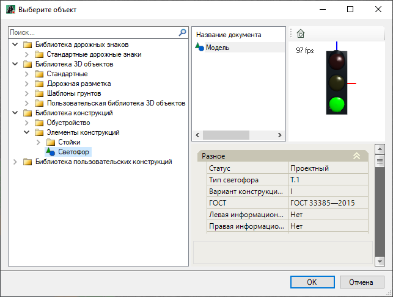

Элемент добавится на стойку светофора, и полученная конструкция в окне **План** будет иметь следующий вид:

   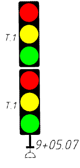

3. Аналогичным способом, описанным в **п.2**, добавляем щиты *2.1 «Главная дорога»* и *5.19.2 «Пешеходный переход»* на стойку светофора. Для этого в открывшемся окне раскройте папки **Библиотека дорожных знаков – Стандартные дорожные знаки**. Для знака *2.1* раскройте папку **Знаки приоритета** и выберите элемент *2.1 Главная дорога*. Для знака *5.19.2* раскройте папку **Знаки особых предписаний** и выберите *5.19.2 Пешеходный переход (ж/з фон)*. В итоге конструкция примет вид:

   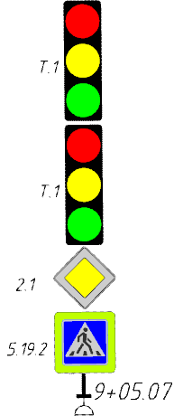

## Настройка конструкции объекта

В данном подразделе описаны настройки выше сформированной конструкции, а именно модификация светофора Т.1, корректировка положения щитов и светофора на стойке, добавление типового фундамента объекту. Для внесения изменений используйте функционал окна **Свойства**, выделите конструкцию и откройте данное окно:

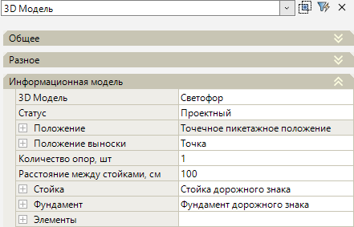

<u>Редактирование конструкции:</u>

1. Заменим светофор **Т.1** на пешеходный светофор **П.1**. Так же определим сторону расположения светофора на стойке. Для этого раскройте поле **Элементы**, а затем поле **Значение** для светофора, нажав знак , откроется группа полей:

   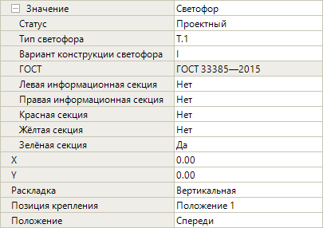

   * В поле **Тип светофора** из списка выберите значение **П.1**:

     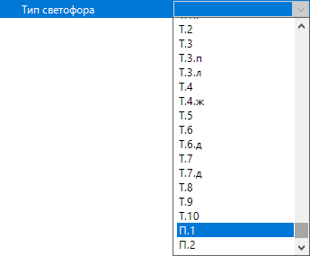

   * В поле **Положение** выберите **Слева**:

     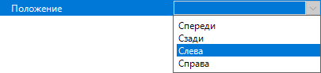

В результате на левой стороне стойки будет вставлен пешеходный светофор **П.1**, а конструкция в окне **План** будет выглядеть следующим образом:

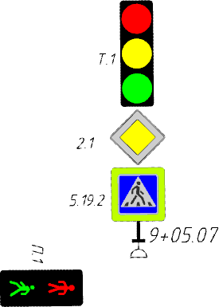

2. Изменим положение щитов и пешеходного светофора на стойке. Для этого перейдите в окно **3D вид**, в котором выше сформированная конструкция будет иметь вид:

   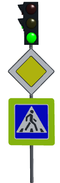

   * Чтобы изменить положение щитов на стойке спереди раскройте поле **Значение** для верхнего щита *2.1 «Главная дорога»*. В поле **Х** введите значение **0,50**, а в поле **Y** введите **0,80**. Щиты (_2.1 «Главная дорога» и 5.19.2 «Пешеходный переход»_) сдвинутся на заданное расстояние, и конструкция в окне **3D вид** будет выглядеть следующим образом:

     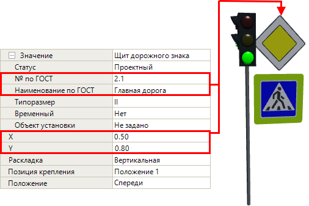

   * Чтобы изменить положение пешеходного светофора на стойке слева раскройте поле **Значение** для пешеходного светофора **П.1**. В поле **Y** введите значение **-0,60**. Пешеходный светофор сдвинется на заданное расстояние, и конструкция в окне **3D вид** примет вид:

     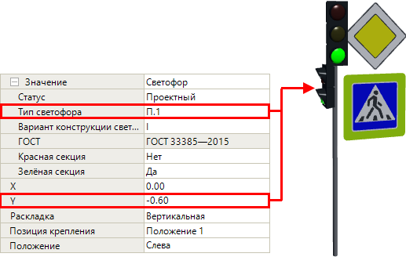

3. Чтобы добавить типовой фундамент конструкции, раскройте поле **Фундамент**:

   

   Этот механизм применяется в случае, если изначально тип фундамента стоит **Бесфундаментный**.

   

   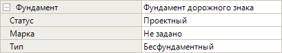

   * В поле **Тип** из списка выберите **Типовой**:

     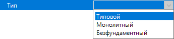

   * В поле **Марка** выберите марку фундаментного блока, например **Ф-2**:

     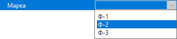

В результате конструкции добавится типовой фундамент, и конструкция в окне **3D вид** примет вид:

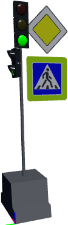