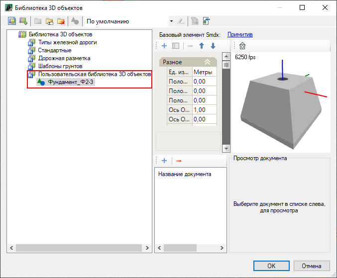
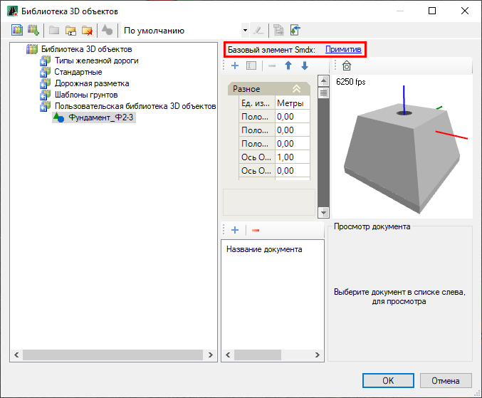
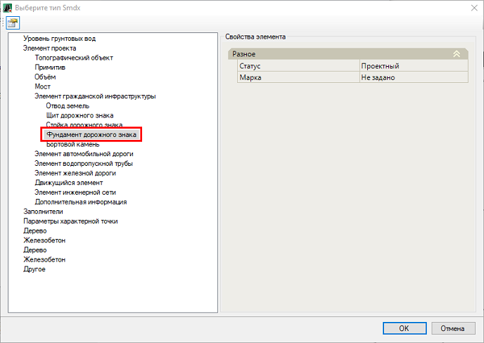
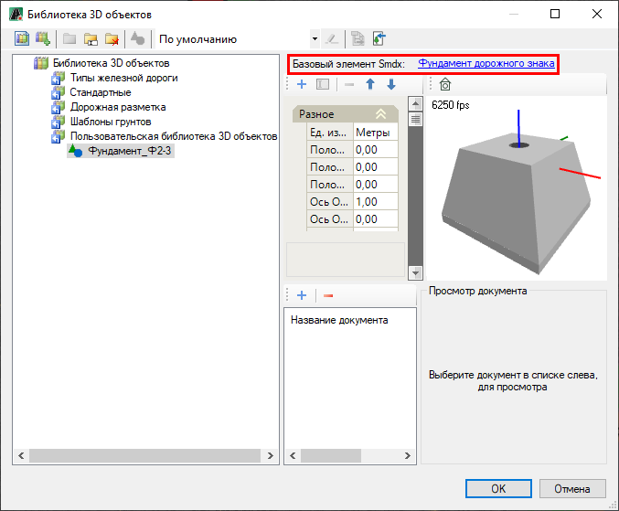
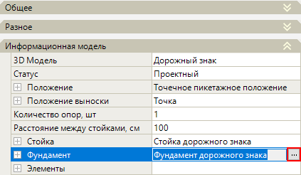
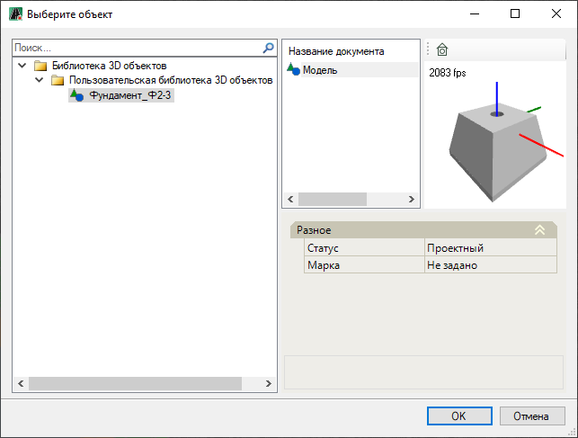
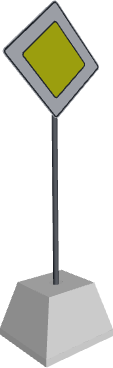

# Замена стандартной стойки или фундамента на пользовательскую 3D-модель

Функционал программы позволяет заменить *стандартную стойку* или *фундамент* дорожного знака/светофора на *пользовательскую 3D-модель* стойки или фундамента.

В данном разделе, в качестве примера, описан механизм настройки и замены 3D-модели *фундамента* дорожного знака, настройка и замена 3D-модели *стойки* идентична.

Для этого:

* Предварительно необходимо добавить и настроить пользовательскую 3D-модель фундамента, для этого:

В **Библиотеке 3D объектов** необходимо создать пользовательскую библиотеку и добавить в нее новый элемент 3D-модели фундамента.



Описание работы с **Библиотекой 3D объектов** см. разделы [Общие сведения](../../../../../annex/libraries/libraries_info.md) и [Работа с библиотекой 3D объектов](../../../../../annex/libraries/library_3d_models.md).



На рисунке ниже представлено окно **Библиотека 3D объектов**, которое показывает пользовательскую библиотеку с добавленным элементом 3D-модели фундамента:

* Добавленному элементу необходимо назначить **Smdx** – тип, для этого:

  1. В окне **Библиотека 3D объектов** выберите добавленный элемент и в верхней части окна, напротив наименования **Базовый элемент Smdx**, нажмите на надпись **Примитив**:

     

  2. В открывшемся окне раскройте дерево **Элемент гражданской инфраструктуры** и выберите **Фундамент дорожного знака**:

     

     

     Если необходимо назначить **Smdx** – тип *стойке* дорожного знака/ светофора выберите пункт **Стойка дорожного знака**.

     

     Нажмите **ОК**, в результате наименование присвоенного **Smdx** – типа будет отображено в верхней части окна напротив наименования **Базовый элемент Smdx**:

     

  3. Для сохранения настроек нажмите **ОК**.

* Чтобы назначить дорожному знаку пользовательскую 3D-модель фундамента:

  1. В окне **Свойства** дорожного знака выберите поле **Фундамент**, в котором нажмите кнопку :

     

     При замене 3D-модели *стойки* дорожного знака/ светофора проведите аналогичные действия в поле **Стойка**.

     

     

  2. Откроется окно, в котором выберите элемент из пользовательской библиотеки и нажмите **ОК**:

     

В результате у дорожного знака 3D-модель фундамента будет изменена на выбранную из пользовательской библиотеки 3D-модель фундамента. Результат можно увидеть в окне **3D вид**:

