# Редактирование параметров дорожных знаков/светофоров

Добавлять щиты дорожных знаков, пользовательские элементы (щиты индивидуальных знаков, 3d модели), менять параметры этих элементов можно через окно Свойств выбранного объекта: 

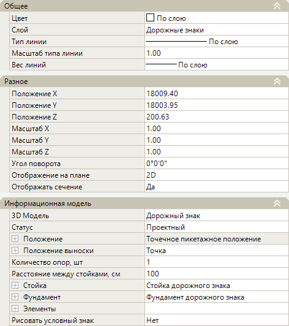

## Общее

В данном подразделе в поле **Слой** можно изменить слой дорожного знака/ светофора.

## Разное

* В полях **Положение X/ Положение Y/ Положение Z** можно изменить координаты фактической точки вставки стойки со знаком/ светофором. Ее изменение приводит к изменению координат, пикетажного положения и смещения самого объекта. Так же координаты фактической точки могут задаваться графически. Для этого выделите поле с соответствующей координатой (**Положение X** или **Положение Y**) и нажмите кнопку , курсор будет привязан к точке вставки объекта, укажите требуемое положение точки.

* **Масштаб X/ Масштаб Y/ Масштаб Z** - в данных полях задаются значения масштабного коэффициента дорожного знака/ светофора. Влияет на его размер по координатным осям X,Y,Z.

* В поле **Угол поворота** можно изменить угол поворота объекта в рабочем поле относительно оси Х. Угол поворота также можно задать визуально, для этого выделите поле и нажмите кнопку 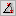, курсор будет привязан к точке вставки объекта. Определите сторону поворота и нажмите ЛКМ.

* В поле **Отображения на плане** имеется возможность выбрать способ отображения объекта в окне **План**. Отображение может быть представлено в виде условного знака (если выбран параметр **2D**) или в виде трехмерной модели (при выборе параметра **3D**).

* **Отображать сечение** – данная опция позволяет включать (если выбрано значение **Да**) и выключать (если выбрано значение **Нет**) отображение дорожного знака/ светофора на продольном профиле и поперечных сечениях.

## Информационная модель

В данной разделе можно настроить параметры каждой составной части дорожного знака/ светофора (стойки, щита, консоли, фундамента и т.д.).

### Различные Параметры

* **3D модель** – в данном поле можно заменить вставленный дорожный знак/ светофор на другую 3D-модель, а так же открыть окно программы **Visual Studio Code**. Для этого:

  1. Чтобы заменить вставленный дорожный знак/ светофор на другую 3D-модель (например, 3D-модель дорожного знака заменить на 3D-модель светофора), выберите поле и нажмите , откроется окно библиотеки с элементами внутри.

     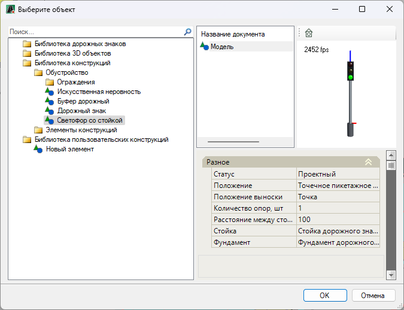

     * В левой части окна отображаются имеющиеся в программе библиотеки с элементами внутри.
     * При выборе элемента, в правой части окна представлены свойства элемента, его 3D вид и окно с сопроводительной документацией к элементу, если таковая имеется.

     Выберите необходимый элемент, например, чтобы выбрать 3D-модель светофора, раскройте папки **Библиотека конструкций – Обустройство** и выберите элемент **Светофор со стойкой**. Далее нажмите **ОК**.

  2. Чтобы открыть программу **VS code** (Visual Studio Code), для редактирования имеющихся или создания новых параметрических 3D-моделей, выберите поле и нажмите 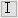, откроется окно программы **Visual Studio Code**, далее см. описание соответствующего раздела.

     

     Пиктограмма  будет отображаться в соответствующем поле, только в том случае, если установлена программа **Visual Studio Code**.

     

* **Статус** – по умолчанию статус объекта назначен как **Проектный**. При необходимости смените этот параметр из выпадающего списка:

  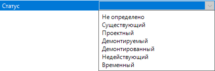

* **Положение** – в данной группе полей отображается фактическое пикетажное положение, расстояние от начала оси, смещение от оси и координаты точки вставки стойки со знаком/ светофором. Для просмотра данных раскройте данное поле, нажав знак :

  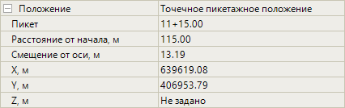

* **Положение выноски** - в данной группе полей можно изменить смещение условного знака (по осям X,Y) относительно исходной точки вставки дорожного знака/ светофора. Для этого раскройте данное поле, нажав на знак , при необходимости измените значения в полях:

  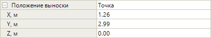

* Функционал программы позволяет добавить к одному объекту несколько однотипных опор. Число опор можно изменить в поле **Количество опор, шт**, а расстояние между ними задается в поле **Расстояние между стойками, см**. 

### Стойка

В этой группе полей представлены параметры стойки дорожного знака/ светофора, набор параметров зависит от выбранного типа стойки. Некоторые параметры стойки будут учтены при формировании ведомости. Так же параметры влияют на отображение стойки в окнах **3D вид** и **План**. Для раскрытия поля нажмите знак :

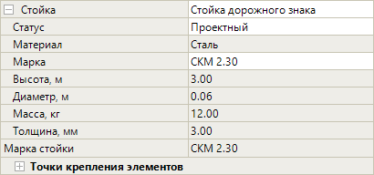

В программе уже имеется библиотека с элементами стоек, которые имеют свой набор параметров. Чтобы выбрать нужный тип стойки, в поле **Стойка** нажмите , в открывшемся окне в папке **Библиотека конструкций**, затем **Элементы конструкций – Стойки** выберите нужный тип стойки. Далее нажмите **ОК**:



Функционал программы позволяет добавлять в пользовательскую библиотеку 3D-модель стойки, подробное описание данного механизма см. в разделе [Замена стандартной стойки или фундамента на пользовательскую 3D-модель.](replacement_3d_model_rack_foundation.md)



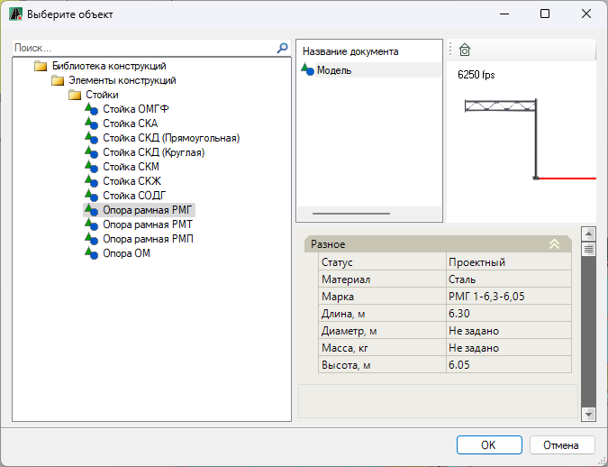

* В поле **Статус** определите статус стойки.
* В поле **Материал** отображается наименование материала стойки в зависимости от выбранного типа стойки.
* В поле **Марка** из выпадающего списка можно выбрать марку стойки. Программа предлагает только те варианты, которые соответствуют выбранному типу стойки.

  В зависимости от выбранного типа стойки в поле **Марка** появляется значение **Пользовательская**. При выборе этого значения некоторые поля (например, **Высота, м, Диаметр, м, Толщина, мм** и др.) становятся активными, в них можно задать параметры стойки.

  При выборе определенных типов стоек, могут появиться дополнительные поля с характеристиками стойки. Например, при выборе стойки типа **Опора рамная РМГ**, добавятся поля **Диаметр трубы опорной стойки, м** и **Диаметр трубы рамного ригеля, м**.

* Группа полей **Точки крепления элементов** показывает значения точек расстановки элементов на стойке/ консоли. Данные поля носят преимущественно информационный характер.

### Фундамент

Данная группа полей содержит параметры фундаментного блока для стойки дорожного знака/ светофора, часть параметров можно изменить. Некоторые параметры фундамента будут учтены при формировании ведомости. Так же параметры влияют на отображение фундамента в окне **3D вид**. Раскройте данное поле, нажав на знак :

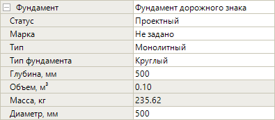

* В поле **Фундамент** можно заменить 3D-модель фундамента на другую 3D-модель фундамента, для этого выберите поле и нажмите , в открывшемся окне выберите элемент из пользовательской библиотеки и нажмите **ОК**. Подробное описание данного механизма см. в разделе [Замена стандартной стойки или фундамента на пользовательскую 3D-модель.](replacement_3d_model_rack_foundation.md)
* В поле **Статус** выберите статус фундамента в проекте.
* При выборе в поле **Тип** значение **Типовой**, в выпадающем списке в поле **Марка** для выбора будет доступен список типовых фундаментных блоков - **Ф1, Ф2, Ф3**. В полях ниже будут отображаться параметры выбранного фундамента.

  При выборе типа **Бесфундаментный** стойка будет установлена без использования фундамента.

  При выборе типа фундамента **Монолитный** появится поле **Тип фундамента**, где можно выбрать **Прямоугольный** или **Круглый** тип блока. В соответствии с выбранным типом будут доступны поля, в которых можно задать размеры блока (например, при выборе круглого блока, будут доступны поля **Высота, мм и Радиус, мм**).

  Объем прямоугольного блока рассчитывается по формуле:

  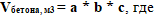

  **a** – высота, м.
  **b** – длина, м.
  **c** – ширина, м.

  Объем круглого блока рассчитывается по формуле:

  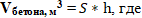

  **S** – площадь основания блока.
  **h** – высота, м.

  Масса блока рассчитывается по формуле:

  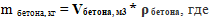

  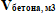 - объем бетона, м3.
  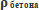 - средняя плотность — 2400 кг/м3.

### Элементы

В данном разделе производится добавление, удаление и изменение параметров уже добавленных объектов. Например, в данном разделе можно добавить щит дорожного знака\светофора, изменить типоразмер, поменять текстовую подпись знака и т.д. Задаваемые параметры могут быть учтены в выходной документации, окне **План** и **3D вида** и в **Информационной модели**.

##### Добавление нового объекта на стойку

Выберите поле **Элементы**, нажмите кнопку , откроется окно с таблицей, в которой будут отображаться ранее добавленные объекты:

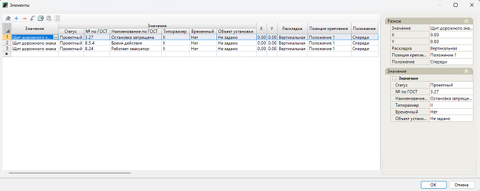

Нажмите кнопку  (или нажмите на пустую строку таблицы двойным кликом ЛКМ), откроется окно Библиотеки.

В левой части окна раскройте папку **Библиотека дорожных знаков**, затем раскройте **Стандартные дорожные знаки**. Отобразятся папки с разными типами дорожных знаков. Выберите нужный тип, например, **Предписывающие знаки**. Далее раскройте выбранную папку и найдите элемент из списка, например щит *4.1.2 «Движение направо»*. Так же для поиска элемента можно воспользоваться строкой поиска в верхней части данного окна:

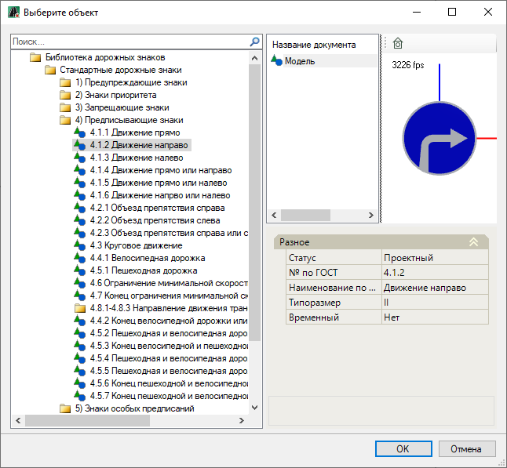



По мимо стандартных щитов дорожных знаков\светофоров функционал программы позволяет добавлять на стойку так же и любые пользовательские элементы (Щиты пользовательских\индивидуальных дорожных знаков и 3D модели), для этого элементы должны быть предварительно добавлены в библиотеку **Дорожных знаков** или **Библиотеку 3D моделей**. Подробное описание см. в разделе документации [Добавление дополнительных знаков в библиотеку](../adding_additional_characters_to_library.md). Описание работы с **Библиотекой 3D объектов** см. раздел [Общие сведения](../../../../../annex/libraries/libraries_info.md).



Выберите необходимый объект в окне Библиотеки и нажмите **ОК**.

В результате в таблице **Элементы** добавится новая строка, нажмите **ОК**, и в результате на стойку будет добавлен выбранный элемент.



Добавить элемент на стойку можно также и через контекстное меню, для этого:

Выделите дорожный знак/ светофор, нажмите ПКМ, из появившегося контекстного меню выберите **Добавить элемент -> Элементы**:

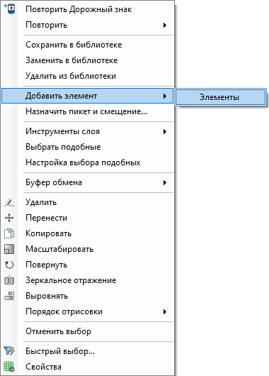

Далее, в открывшемся окне **Библиотеки** выберите необходимый элемент и нажмите **ОК**, в результате на стойку будет добавлен выбранный элемент.



##### Удаление объектов и редактирование параметров

Для примера рассмотрим настройку параметров элементов следующей конструкции дорожного знака:

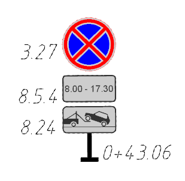

Параметры данной конструкции в окне **Свойства** будут такими:

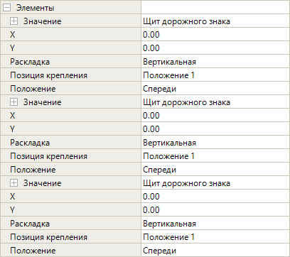

Чтобы раскрыть данное поле необходимо нажать знак 

Перечень элементов (щитов) расположенных на стойке приведен в специальной таблице. Чтобы ее открыть выберите поле **Элементы** и нажмите кнопку , откроется окно с таблицей:

В данной таблице можно управлять элементами на стойке. Чтобы менять положение элементов на стойке относительно друг друга, воспользуйтесь кнопками 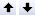. Чтобы добавить новый элемент на стойку нажмите кнопку  (или нажмите на пустую строку таблицы), откроется окно библиотеки, в котором выберите нужный элемент и нажмите **ОК**. Для удаления элемента со стойки выделите необходимую строку и нажмите кнопку 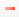. 

Так же таблица содержит общие свойства элементов, которые можно изменить:

* Чтобы изменить тип элемента на стойке выберите строку с щитом, который необходимо заменить и в столбце **Значение** нажмите , откроется окно библиотеки с элементами внутри

  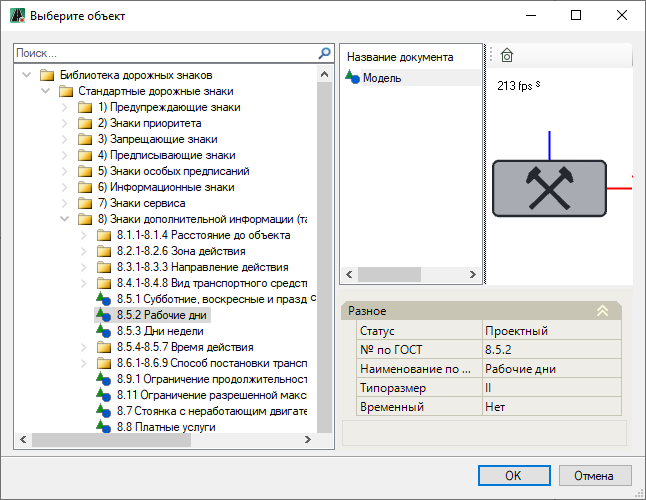

  Из соответствующего раздела выберите элемент из списка или воспользуйтесь строкой поиска в верхней части данного окна. Нажмите **ОК**.

  * В столбце **Статус** из выпадающего списка можно изменить параметр элемента. Он учитывается при формировании выходных ведомостей.
  * В столбцах **№ по ГОСТ** и **Наименование по ГОСТ** прописывается наименование и номер щита по ГОСТ.
  * В столбце **Типоразмер** из выпадающего списка можно выбрать необходимый типоразмер знака по изготовлению. Данный параметр влияет на размер изображения знака в окнах **План** и **3D вид**, а также учитывается при формировании выходных ведомостей.
  * В столбце **Временный** отображен признак дорожного знака. Данный параметр учитывается при формировании выходных ведомостей.

    

    Если в библиотеки был выбран дорожный знак из подгруппы **Временные знаки**, то в этом столбце будет установлено значение **Да**.

    

  * **Объект установки** – в этом столбце можно внести наименование объекта, на который будет установлен элемент. Например, для щита дорожного знака можно ввести *шумозащитный экран* в качестве объекта установки. Введенные данные будут учтены при создании ведомости.

* В столбцах **X** и **Y** настраивается положение элемента относительно стойки (или консоли) по оси X и Y. Для этого введите значение в ячейке, элемент сдвинется на заданное расстояние. Смещение элемента можно увидеть в окне **3D вид**.

  

  При вводе значения смещения верхнего щита это так же приведет к смещению щитов, находящихся ниже (т.е. под этим щитом).

  

* **Раскладка** – в данном столбце из списка можно выбрать конфигурацию расположения элементов на стойке/ консоли.

  Если у двух и более элементов выбрана раскладка **Горизонтальная** (например, у щитов *2.4 «Уступите дорогу»* и *3.11 «Ограничение массы»*), в то время как у других щитов используется **Вертикальная** раскладка (например, у щита *5.7.1 «Выезд на дорогу с односторонним движением»*), то конструкция в окнах **План** и **3D вид** будет иметь следующий вид:

  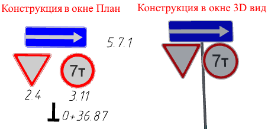 

* **Позиция крепления** – в данном столбце из списка можно выбрать вариант размещения элемента на стойке. Позиции крепления предназначены для стоек, у которых имеются различные варианты размещения элементов на них, например, для стоек типа ОМГФ, ОСДГ, РМГ и других. Для стоек типа СКМ, СКА и т.д. все позиции находятся в одном месте. Ниже на рисунке схематично показаны различные варианты расположения элемента на стойке типа ОМГФ:

  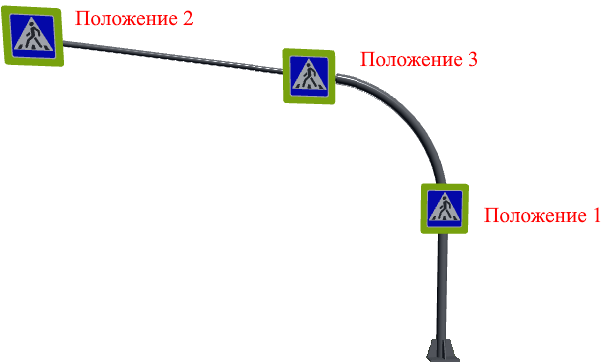

* Элементы могут быть размещены на разных сторонах стойки. В столбце **Положение** из списка можно определить сторону расположения элемента на стойке.

  При выборе значения **Спереди** элементы будут размещены на лицевой стороне стойки. Ниже в окне **План** представлен пример схематического изображения дорожного знака *3.27 «Остановка запрещена»*, к которому были добавлены щиты *8.24 «Работает эвакуатор»* и *8.5.4 «Время действия»* на передней стороне стойки:

  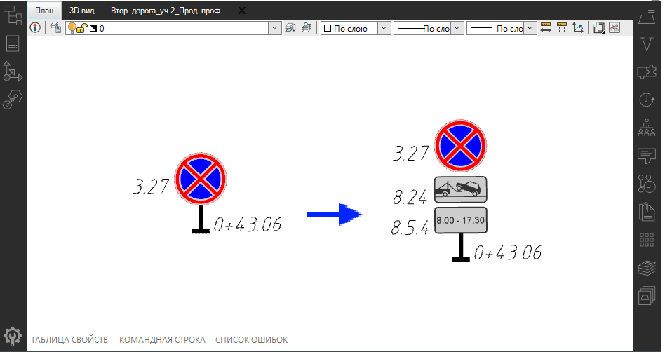  

  При выборе значения **Сзади** элементы будут размещены на обратной стороне стойки, предназначенной для встречного направления. Ниже в окне **План** представлен пример схематического изображения дорожного знака *5.19.1 «Пешеходный переход»*, к которому был добавлен щит *5.19.2 «Пешеходный переход»* на обратной стороне стойки:

  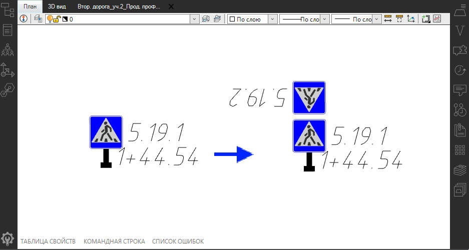

  При выборе значения **Слева** или **Справа** элемент будет расположен соответственно на левой или правой стороне стойки относительно лицевой стороны знака. На схематическом рисунке ниже в окне **План** показан пример расположения на стойке дорожного знака *5.19.1 «Пешеходный переход»* и пешеходного светофора *«П.1»*, добавленного в одном случае с левой, а в другом - с правой стороны стойки:

  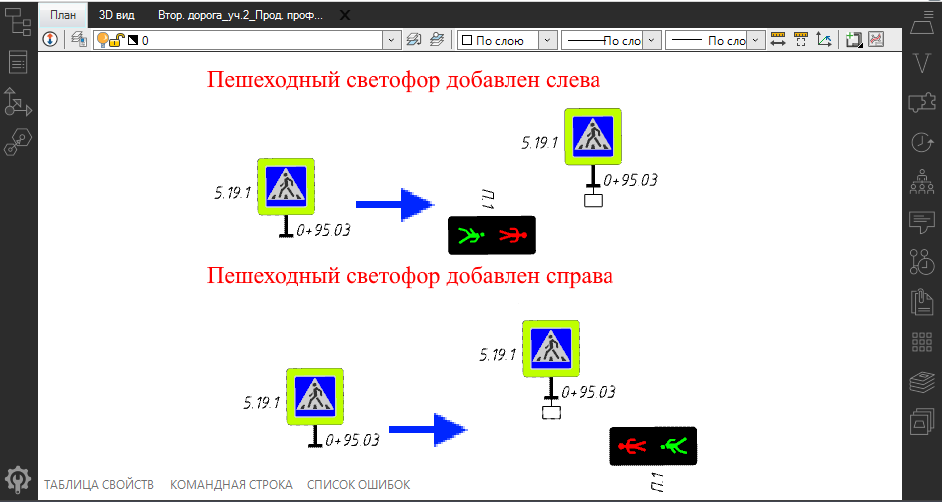 

Кроме того настроить параметры каждого элемента можно в поле **Значение**. Чтобы раскрыть это поле для каждого элемента нажмите знак , после чего группа полей будет раскрыта и будет иметь вид:

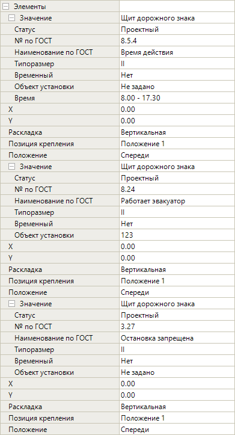

Поля **Статус, № по ГОСТ, Наименование по ГОСТ, Типоразмер, Временный, Объект установки, X** и **Y**, **Раскладка, Позиция крепления, Положение** идентичны столбцам с таким же наименованием в таблице с перечнем элементов (см. описание выше).

Если на стойку добавлен щит дорожного знака, содержащий текстовое значение (например, в данном случае это знак *8.5.4 «Время действия»*), то в свойствах будет добавлено дополнительное поле (поле **Время**), в котором можно изменить этот текст (в данном примере текст **8.00-17.30**). Наименование поля зависит от выбранного типа дорожного знака:

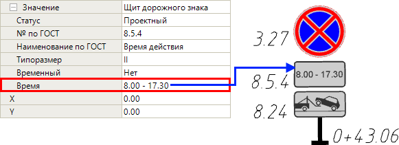

<u>В случае если на стойку добавлен светофор, то ниже приведены его параметры.</u>

В данном примере описаны отличительные настройки добавленного светофора на стойку. Описание идентичных настроек приведено выше, в описании детальной настройки параметров элементов на стойке.

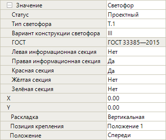

* **Тип светофора** - данное поле содержит список различных видов светофора, доступных для выбора.
* **Вариант конструкции светофора** можно выбрать в соответствующем поле.
* **Левая информационная секция/ Правая информационная секция** - если выбрать значение **Да** в этих полях, то под основными секциями светофора будут добавлены информационные световые секции слева/ справа, ниже приведен пример светофора с добавленными секциями слева и справа в окне **3D вид**:

  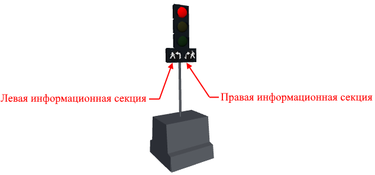

* Чтобы установить цвет необходимой секции выберите значение **Да** в полях **Красная секция/ Желтая секция/ Зеленая секция**.