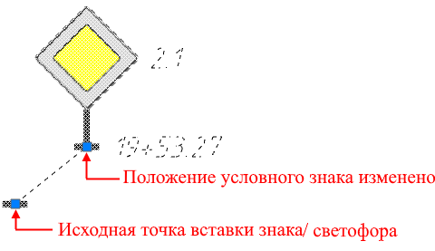
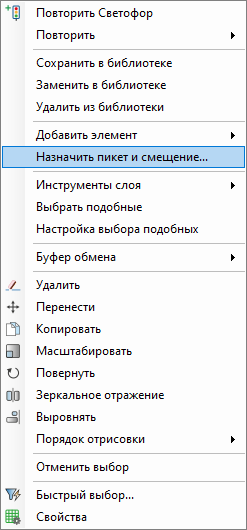
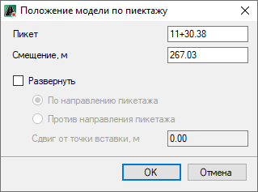

# Редактирование положения дорожных знаков/ светофоров в рабочем поле

Положение дорожного знака/ светофора в рабочем поле можно редактировать визуально или с помощью опции, находящейся в контекстном меню.

## Визуально при помощи ЛКМ

Для визуального изменения положения, выделите объект ЛКМ, на нем отобразится характерная точка (грип ).

Чтобы изменить положение условного знака нажмите ЛКМ на грип, курсор мыши примет форму перекрестья и будет привязан к исходной точке вставки знака/ светофора. ЛКМ укажите точку вставки условного знака. В результате условный знак изменит своё положение и будет привязан выноской к исходной точке вставки знака/ светофора. При этом координаты, пикетаж и смещение знака/ светофора останутся неизменными.

Чтобы изменить положение исходной точки вставки знака/ светофора ( при этом координаты, пикетаж и смещение знака/ светофора изменятся) нажмите ЛКМ на соответствующий грип, далее ЛКМ укажите точку вставки. В результате положение исходной точки изменится, а так же изменится положение условного знака.



Так же для редактирования знаков/ светофоров в рабочем поле могут использоваться некоторые базовые функции редактирования объектов (повернуть, масштаб и т.д.). Описание по редактированию примитивов см. раздел [Чертёж.](../../../../../rb_survey/dtm/dwg/types_primitives_drawing.md)



## Через контекстное меню

Чтобы изменить положение вставленного в рабочее поле дорожного знака/светофора, указав значение ПК+ относительно оси линейного объекта:

1. Выделите дорожный знак/ светофор и нажмите ПКМ, из появившегося контекстного меню выберите **Назначить пикет и смещение**:

   

2. Откроется окно, в котором задайте необходимые параметры и нажмите **ОК**:

   



Данное окно аналогично окну, которое открывается при вставке дорожного знака/ светофора в рабочее поле, см. описание **п.4** (подпункта **b**) раздела [Вставка дорожного знака/ светофора.](../insert_road_signs.md)

