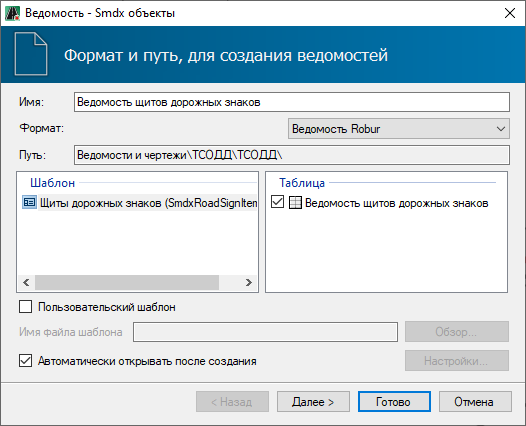
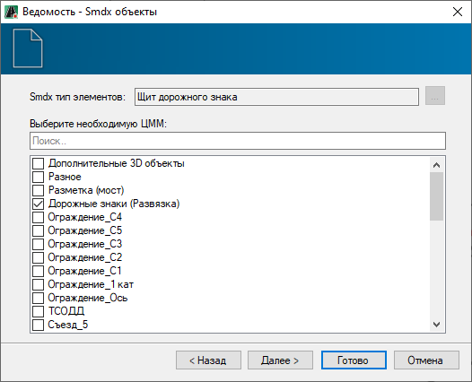
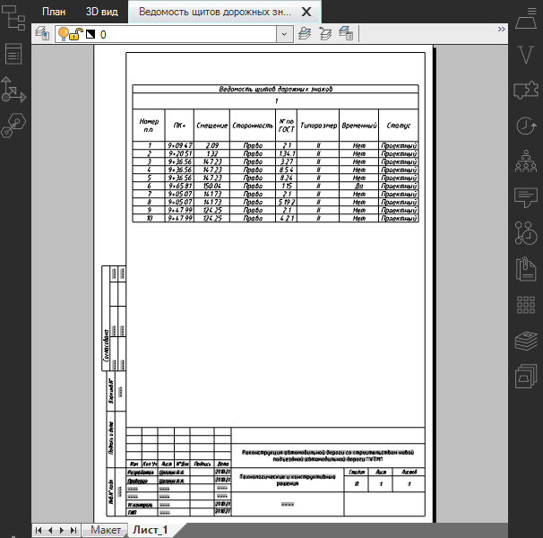

# Формирование выходных ведомостей

Программа позволяет формировать ведомости следующих типов:

* **Щитов дорожных знаков.**
* **Светофоров.**
* **Стоек.**
* **Фундаментов.**

Представленные типы ведомостей формируются идентично. В данном разделе рассмотрен пример создания ведомости **Щитов дорожных знаков**.

Чтобы создать ведомость:

1. На ленте **Знаки и Светофоры** нажмите кнопку  (**Создать ведомость**), из выпадающего списка выберите ведомость  **Щитов дорожных знаков**. Откроется окно стандартного мастера ведомости:

   

2. Выберите формат и шаблон ведомости, нажмите **Далее**.

3. На следующей вкладке активируйте опцию рядом с моделью **Обустройство**, где были установлены дорожные знаки и нажмите **Далее**:

   

   Если выбрать несколько моделей **Обустройства** с установленными дорожными знаками, то данные по этим знакам так же будут внесены в ведомость.

   

   

4. Выберите формат листов, при необходимости заполните основную надпись и нажмите **Готово**.
5. Откроется окно, в котором введите наименование файла ведомости и нажмите **ОК**.

В результате ведомость будет сформирована и открыта в соответствующем редакторе.

Ниже отображен пример ведомости **Щитов дорожных знаков**, сформированной в формате **Ведомость Robur** и открытой в соответствующем окне:

