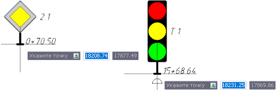
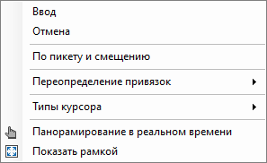

# Вставка дорожного знака/ светофора

Чтобы вставить дорожный знак или светофор в рабочее поле:

1. В **Структуре проекта** сделайте активной соответствующую модель типа **Обустройство**.

   

   Подробное описание см. в разделе [Создание модели Обустройство](../create_traffic_safety_model.md)

   

2. На ленте **Знаки и Светофоры** или в меню **Обустройство – Знаки и Светофоры** выберите одну из следующих команд:

   *  (**Дорожный знак**) - для вставки дорожного знака.
   *  (**Светофор**) - для вставки светофора.

3. Курсор мыши примет форму перекрестья с привязанным к центру знаком или светофором:

   

4. Далее выберите один из способов вставки объекта в рабочее поле:

   

   В текущей модели **Обустройство** должен быть назначен линейный объект, на пикетаж которого ссылается дорожный знак/ светофор, см. раздел [Предварительные настройки модели.](../pre_settings_model.md)

   

   a) В рабочем поле ЛКМ укажите точку вставки дорожного знака/ светофора (в случае необходимости можно задать координаты точки вставки в динамической строке).

   Дорожный знак/ светофор автоматически установится параллельно оси в соответствии с направлением движения. Если точка вставки указана справа от оси, то объект будет повернут лицевой стороной к направлению движения. Если точка вставки указана слева от оси, то объект будет развернут на 180º. Программа автоматически определит пикетажное положение и смещение от оси указанной точки.

   b) Нажмите ПКМ и из контекстного меню выберите **По пикету и смещению**:

   

   Откроется окно, в котором задайте необходимые параметры и нажмите **ОК**:

   

   * В полях **Пикет** и **Смещение, м** уточните пикетажное положение и смещение фактической точки вставки дорожного знака/ светофора относительно оси линейного объекта.

   * Чтобы повернуть дорожный знак/ светофор в нужном направлении пикетажа, активируйте опцию **Развернуть** и выберите:

     **По направлению пикетажа** - знак/ светофор при вставке будет повернут параллельно оси линейного объекта, по направлению пикетажа.
     **Против направления пикетажа** - знак/ светофор при вставке будет повернут параллельно оси линейного объекта, против направления пикетажа.
     **Сдвиг от точки вставки, м** – в данном поле можно задать смещение дорожного знака/ светофора от его точки вставки.

В результате вставленный дорожный знак/ светофор отобразится в рабочем поле в окне **План**.