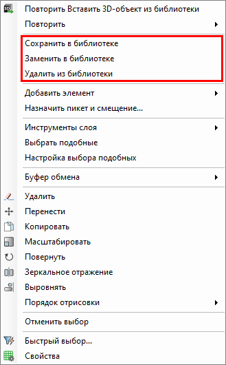
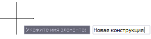
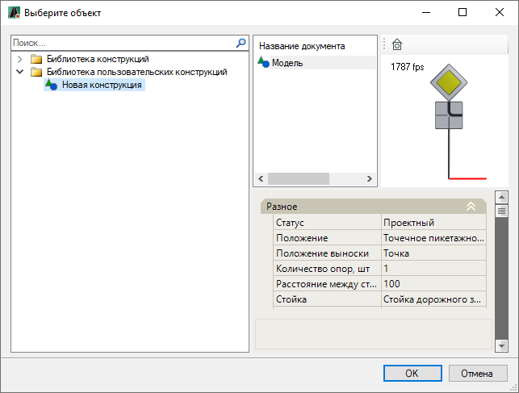
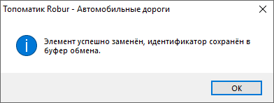
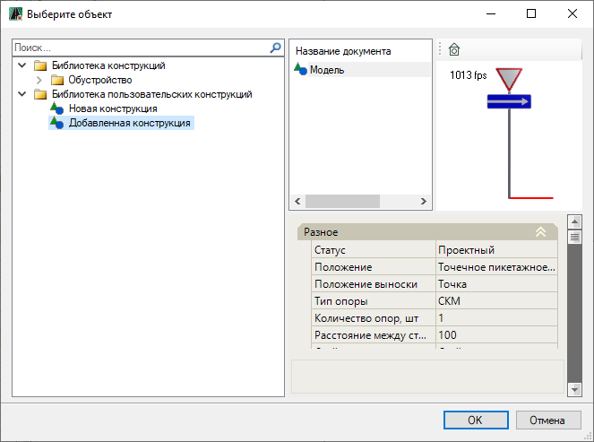
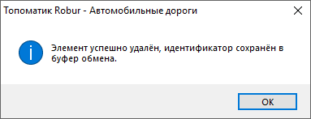

# Работа с настроенной конструкцией дорожного знака/ светофора

После редактирования параметров дорожного знака/ светофора функционал программы позволяет сохранить настроенную конструкцию в библиотеку пользовательских конструкций. Это позволит в дальнейшем вставлять пользовательскую конструкцию в необходимые места плана или другие проекты.

В данном разделе рассматриваются инструменты для работы с настроенной конструкцией дорожного знака/ светофора, а именно:

* **Сохранение пользовательской конструкции в библиотеку.**
* **Замена пользовательской конструкции в библиотеке на другую.**
* **Удаление пользовательской конструкции из библиотеки.**
* **Вставка пользовательской конструкции в план.**

Сохранение, замена конструкции в библиотеке, а так же ее удаление производится через контекстное меню, чтобы его вызвать ЛКМ выделите настроенный объект и нажмите ПКМ, откроется контекстное меню:

## Сохранение пользовательской конструкции в библиотеку

Для добавления настроенной конструкции в библиотеку:

1. Из контекстного меню выберите пункт **Сохранить в библиотеке**.
2. В динамической строке введите имя элемента и нажмите **Enter**:

   

В результате в библиотеку в папку **Библиотека пользовательских конструкций** будет добавлен элемент конструкции.

## Замена пользовательской конструкции в библиотеке на другую

Чтобы заменить пользовательскую конструкцию в библиотеке на другую конструкцию:

1. Из контекстного меню выберите пункт **Заменить в библиотеке**.
2. Откроется окно библиотеки, выберите элемент, в котором надо заменить конструкцию и нажмите **ОК**:

   

В результате в библиотеке элемент с пользовательской конструкции будет заменен на другую конструкцию. Программа уведомит об этом всплывающим окном, для завершения команды нажмите **ОК**:

## Удаление пользовательской конструкции из библиотеки

Чтобы удалить элемент пользовательской конструкции из библиотеки:

1. Из контекстного меню выберите пункт **Удалить из библиотеки**.
2. Откроется окно библиотеки, в котором выберите элемент для удаления и нажмите **ОК**:

   

В результате из библиотеки будет удален элемент пользовательской конструкции, программа уведомит об этом всплывающим окном, для завершения команды нажмите **ОК**:

## Вставка пользовательской конструкции в план

Чтобы вставить пользовательскую конструкцию в план:

1. На ленте **Разное - Утилиты** или в меню **Обустройство - Разное** выберите  (**Вставить 3D объект из библиотеки**).
2. Откроется окно, в котором раскройте папку **Библиотека пользовательских конструкций** и выберите элемент конструкции, далее нажмите **ОК**:

   

3. Прицел примет форму перекрестья с привязанной к центру пользовательской конструкцией, далее укажите положение элемента на плане любым описанным ранее способом.

В результате пользовательская конструкция отобразится в рабочем поле.