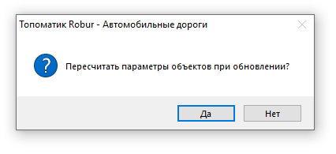

# Обновление данных объектов ТСОДД

При изменении проектных решений в линейном объекте, на пикетаж которого ссылаются объекты ТСОДД, функционал программы позволяет обновлять данные объектов ТСОДД в соответствии с этими изменениями. Например, при изменении планового положения оси трассы, пикетажа, ширин полос и т.д., свойства или положение объектов ТСОДД могут быть пересчитаны с учетом этих изменений.

Для этого:

1. В **Структуре проекта** сделайте активной соответствующую модель типа **Обустройство**. 

   

   Подробное описание см. в разделе [Создание модели Обустройство](create_traffic_safety_model.md)

   

2. Выберите меню **Вид – Освежить**, откроется окно:

   

   Нажмите **Да** для пересчета параметров и положения всех объектов, находящихся в текущей модели **Обустройство**.

   

   1. Пересчет параметров объектов осуществляется по пикетажу линейного объекта который выбран в настройках модели **Обустройство**. Подробнее см. в разделе [Предварительные настройки](pre_settings_model.md).

   2. Пересчет параметров объектов **Обустройства** возможен только в случае если эти объекты были введены способом - **По подобъекту** (и способом - **по Полосе и Смещению**), т.е. с привязкой к «пикетажу и полосам» модели типа **Автомобильная дорога**.

   3. Объекты модели **Обустройство** могут учитывать изменения проектных решений по разному, например у объектов типа **Знаки и Светофоры** производится только пересчет значения свойства **ПК+**, а например **Линейная** и **Точечная разметка**, а также другие объекты обустройства, добавляемые как линейные (**Ограждения**, **Столбики** и т.д.) перестраиваются и меняют свое положение с учетом изменившихся проектных решений.

   4. В зависимости от количества и протяженности объектов процесс пересчета может занимать различное время

   

   Нажмите **Нет** если пересчитывать свойства и геометрические параметры объектов обустройства не требуется.

   

   Выбрав **Нет**, будет произведен пересчет данных необходимых только для отрисовки объектов обустройства в окне 3D вида.

   