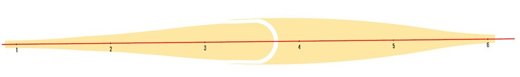
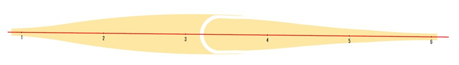
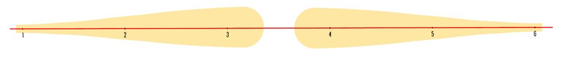
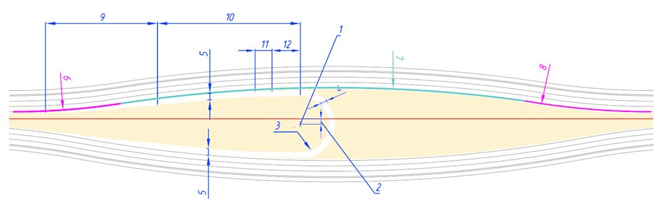
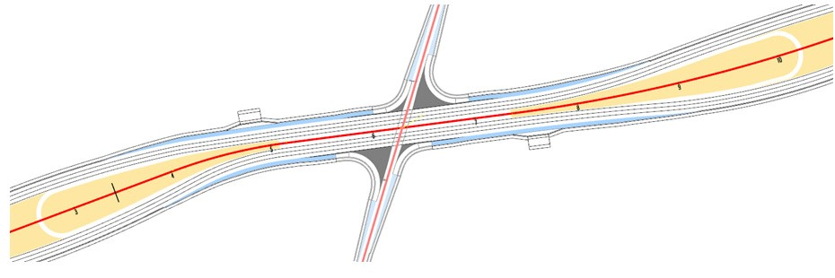
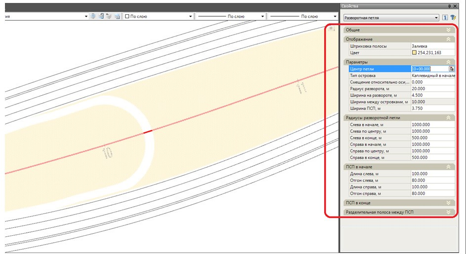
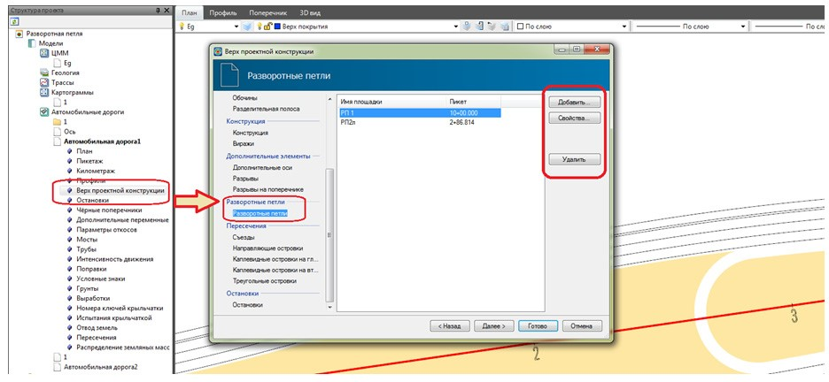

# Создание разворотных петель

Данный блок функций позволяет запроектировать **Разворотные петли** со всеми дополнительными элементами (псп, островки и т.д.), которые встраивается в разделительную полосу, и используются совместно при проектировании одноуровневых пересечений и примыканий, преимущественно на дорогах первой категории.

Для создания разворотной петли:

1. Выберите элемент меню **Задачи – Пересечения – Создать разворотную петлю**, откроется диалоговое окно:

   

   В поле **Наименование** задается имя создаваемого элемента (разворотной петли).

   В выпадающих списках **Цвет** и **Штриховка** задаются параметры отображения.

   В выпадающем списке **Тип островка** можно выбрать три типа разворотной петли:

   #|
   ||Каплевидный в начале|||
   ||Каплевидный в конце|||
   ||Каплевидный с обеих сторон|||
   |# {wide-content}

   Ниже на схеме показаны задаваемые элементы островка:

   

   * 1 – Центр петли (островка).
   * 2 – Смещение островка относительно оси (влево или вправо).

     

     1. Смещение влево задается отрицательным значением (со знаком «–»)
     2. При задании смещения островка относительно оси, граница островка слева и справа (в начале и в конце) могут не совпадать.

     

   * 3 – Радиус разворота.
   * 4 – Ширина полосы на развороте.
   * 5 – Ширина переходно-скоростной полосы (ПСП).
   * 6 – Радиус, вписываемый в начале островка.
   * 7 - Радиус, вписываемый в середине островка.
   * 8 - Радиус, вписываемый в конце островка.

     

     В соответствующих полях данные задаются для левой и правой стороны относительно пикетажа.

     

   * 9 – Длина отгона ПСП.
   * 10 – Длина ПСП.

     

     В соответствующих полях данные задаются для левой и правой стороны относительно пикетажа.

     

   * 11 – Длина отгона разделительной полосы.
   * 12 – Длина разделительной полосы.

     

     В соответствующих полях данные задаются для левой и правой стороны относительно пикетажа.

     

2. Задайте необходимые параметры и нажмите **ОК**. В результате будет отрисована разворотная петля:

   



1. На рисунке показан пример совместного использования элемента Разворотная петля с функционалом по проектированию одноуровневых пересечений\ примыканий и остановок.
2. Особенность расчета геометрии разворотной петли на криволинейном участке заключается в том, что в качестве исходных данных, для расчета сопряжений, принимается прямолинейный участок, на котором производится замер ширин островка (относительно оси), и по которым в дальнейшем производится построение островка на криволинейном участке.



Для редактирования параметров разворотной петли предусмотрена возможность изменения ее параметров через окно **Свойств выделенного объекта**:

А также через таблицу **Верх покрытия**, которая находится в **Структуре проекта** в дереве таблиц подобъекта, на который была добавлена разворотная петля:

На открывшейся вкладке **Разворотные петли** содержится список добавленных островков.

Выберите кнопку **Добавить** для создания разворотной петли с помощью мастера.

Для удаления необходимой разворотной петли нажмите **Удалить**.

Для изменения параметров созданного островка нажмите кнопку **Свойства**.
