# Редактирование конструкции (расширенный вид)

Создание и редактирование конструктивных слоев дорожной одежды также можно осуществлять в окне расширенного вида.

Для перехода в данный режим необходимо нажать кнопку **Развернуть** в правой верхней части основного окна программы:

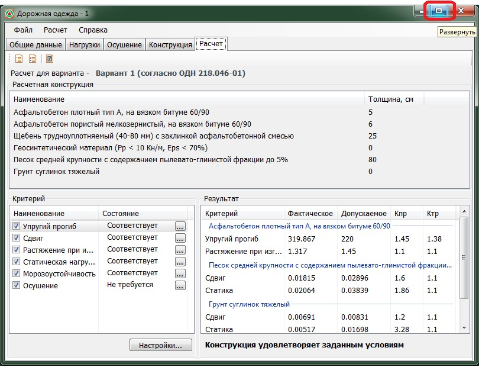

В результате раскроется окно следующего вида:

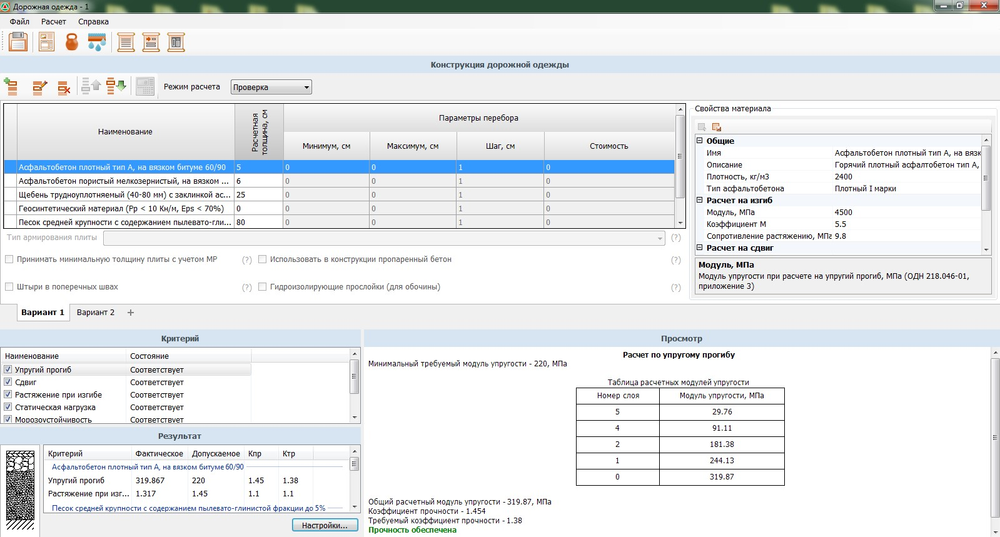



Эти два режима взаимосвязаны между собой, т.е. для возвращения к основному окну программы достаточно лишь нажать кнопку **Свернуть в окно** в окне расширенного вида.



Далее рассмотрим особенности работы с окном расширенного вида.

Данный режим может быть удобен за счет вывода на экран одновременно нескольких полей. В них можно редактировать параметры дорожной конструкции, при этом в других полях сразу же отражается результат расчета.

В верхней части окна с помощью указанных ниже кнопок можно также выполнять быстрый доступ к вкладкам основного окна программы:

* **Сохранение** - нажатие кнопки  выполняет сохранение текущего расчета.
* **Общие данные** - нажатие данной кнопки  открывает соответствующие окно программы: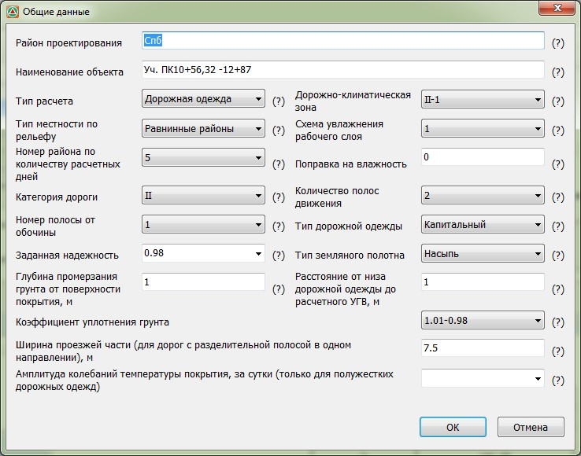

При необходимости задайте или измените уже имеющиеся данные и закройте это окно, нажав кнопку **ОК**.

Аналогичным образом с помощью вышеуказанных кнопок могут быть открыты окна **Нагрузки** и **Осушение**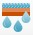.

Нажатие кнопки **Простой отчет**  и **Отчет по шаблону** открывают соответствующие информационные окна. 



Параметры, задаваемые на вкладках [Общие данные](../choice_calculation/archive_calculation_new/common_data.md?tabs=general-information-archive_odn-218-046-01), [Нагрузки](../choice_calculation/archive_calculation_new/loads.md?tabs=loads-archive_odn-218-046-01), [Осушение](../choice_calculation/archive_calculation_new/draining.md?tabs=draining-archive_odn-218-046-01), а также способы формирования выходных отчетов были описаны ранее.



Рассмотрим назначение основных полей окна расширенного вида:



В данном поле также можно [создавать, удалять, перемещать и редактировать](../choice_calculation/archive_calculation_new/construction?tabs=construction-archive_odn-218-046-01#218-046-01-redaktirovanie) конструктивные слои. Доступна функция подбора толщины слоя конструкции дорожной одежды по критерию минимальной стоимости:



Данный функционал был подробно описан ранее в соответствующих разделах. Функция подбора конструкции будет описана ниже (см. раздел [Режим расчета](../choice_calculation/archive_calculation_new/construction?tabs=construction-archive_odn-218-046-01#218-046-01-rezhim-rascheta)).





{#properties-material}

Здесь отображаются расчетные характеристики слоя, выбранного в поле **Конструкция дорожной одежды**. При необходимости расчетные характеристики могут быть отредактированы:

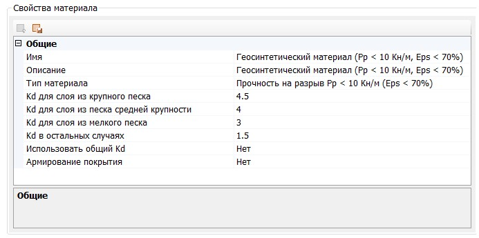

После редактирования характеристик материала происходит автоматический перерасчет конструкции дорожной одежды. При отличии от нормативной измененная характеристика выделяется жирным шрифтом, а напротив материала, в котором были внесены изменения, в поле Конструкция ставится символ "звездочка":

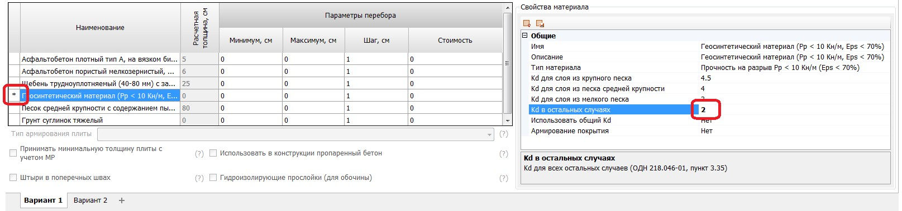

Кнопка **Восстановить значения по умолчанию**, расположенная в левом верхнем углу окна Свойств выделенного материала, позволяет отменить значения расчетных характеристик слоя, которые были изменены пользователем, и вернуть для него их нормативные значения:

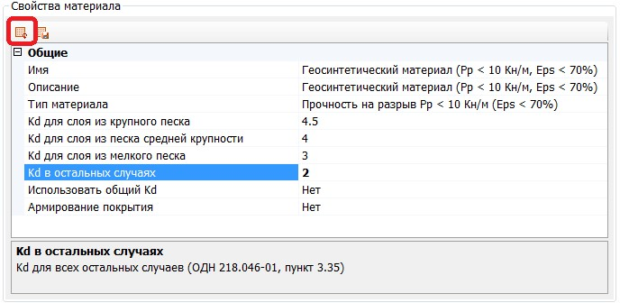

**Имя** – поле, расположенное в нижней части окна **Свойств выделенного материала**. В нем отображается информация о выделенной характеристике материала. Дается ссылка на нормативный документ, согласно которому она была принята.



Если значение прочностной характеристики редактировалось пользователем, то оно выделяется жирным шрифтом, и в данном случае будет уже не соответствовать ссылке на нормативный документ, указанный в поле Имя.



Кнопка **Добавить в библиотеку**, расположенная в левом верхнем углу окна Свойств выделенного материала, позволяет сохранить материал с измененными характеристиками в Библиотеку, в раздел Дополнительные материалы, и использовать добавленный материал в дальнейших расчетах:

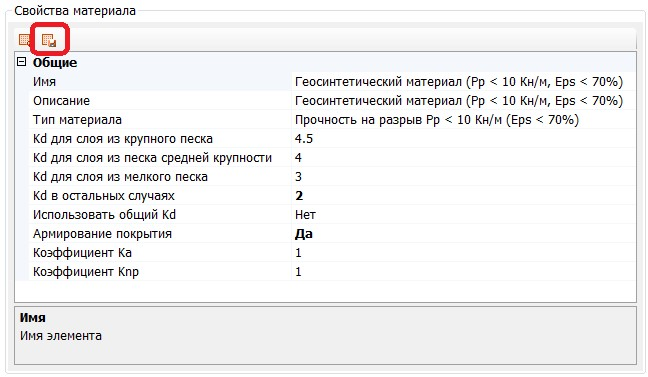



Подробное описание работы с Библиотеками данных описано ниже в соответствующем разделе.







В данном поле отображаются наименования всех производимых программой прочностных расчетов.

При выделении какого-либо расчета в колонке **Наименование** его результаты сразу же отображаются в поле **Просмотр**.

Для отключения какого-либо критерия из общего списка расчетов необходимо снять соответствующую опцию, расположенную слева от его наименования:

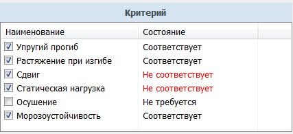

Также в данном поле в соответствующем столбце показывается состояние расчета по каждому критерию. Возможны следующие варианты:

* **Соответствует** - Прочность конструкции по данному критерию расчета обеспечена;
* **Не соответствует** - Прочность конструкции по данному критерию расчета не обеспечена;
* **Не требуется** - этот статус расчета устанавливается, если данный критерий был самостоятельно отключен пользователем или расчет не требуется с учетом исходных данных. К примеру, если у расчетного автомобиля расчетная нагрузка на ось превышает 120 КН, не требуется расчет по критерию упругого прогиба.





В этом поле отображается результат расчета по критерию, который на данный момент выделен в поле **Список расчетов**:

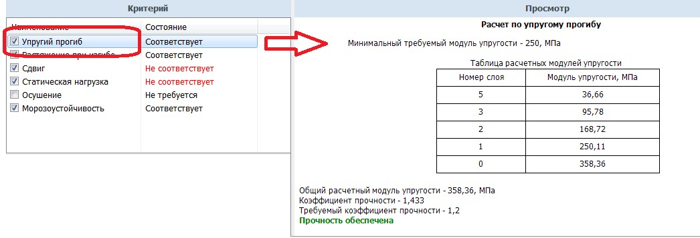





В данном поле отображается схема слоев конструкции дорожной одежды и основные прочностные характеристики по всем критериям расчета:

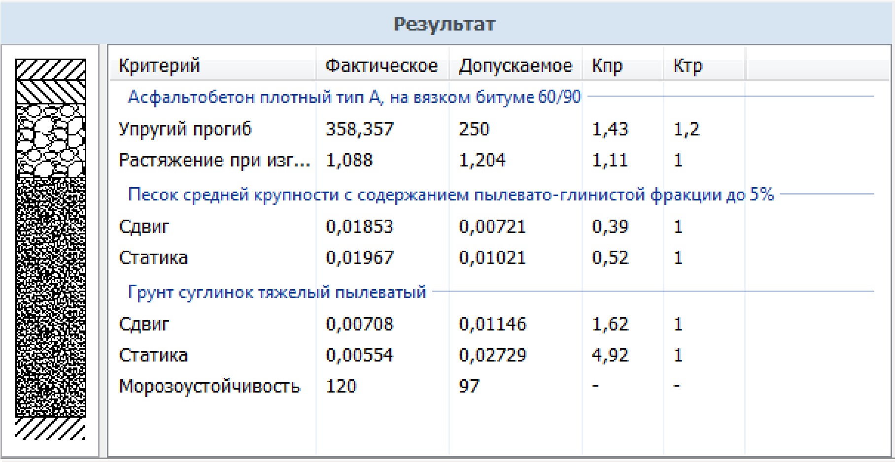


