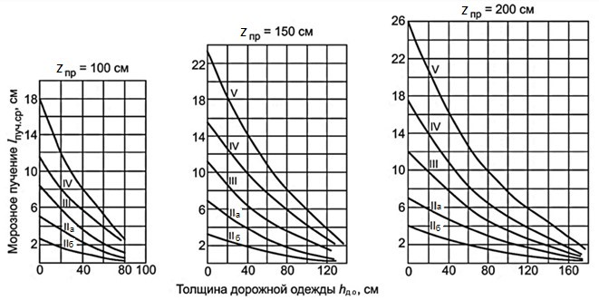
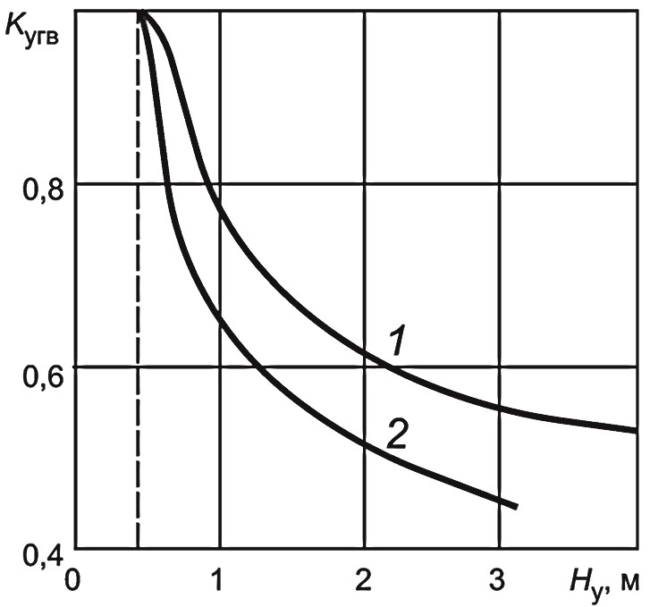
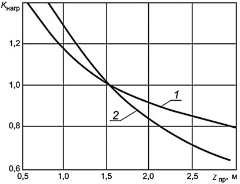

# Расчет на морозоустойчивость



- ГОСТ Р 71404-2024 {#gost-71404-2024}

  В районах сезонного промерзания грунтов на участках дорог, находящихся в неблагоприятных грунтово-гидрологических условиях, наряду с требуемой прочностью должна быть обеспечена достаточная морозоустойчивость дорожных одежд и земляного полотна.

  Конструкция удовлетворяет требованиям по морозоустойчивости при соблюдении условия
  $$l_{пуч} ≤ l_{доп}$$
  где:
    * $l_{пуч}$ – расчетное (ожидаемое) морозное пучение грунта земляного полотна;
    * $l_{доп}$ – допустимая величина морозного пучения в соответствии с ГОСТ Р 59120.

  В соответствии с ГОСТ Р 59120 при сроке службы дорожной одежды между капитальными ремонтами до 10 лет расчетное значение пучения от воздействия низких температур не должно превышать предельно допустимого значения морозного пучения, а при сроке службы дорожной одежды между капитальными ремонтами более 10 лет расчетное значение пучения на поверхности покрытия от воздействия низких температур не должно превышать 80 % предельно допустимого значения морозного пучения.

  Не требуется специальных мер по защите дорожных одежд от морозного пучения в следующих случаях:
    * в районах с глубиной промерзания грунтов менее 0,6 м;
    * при земляном полотне, сложенном на всю глубину промерзания из непучинистых или слабопучинистых грунтов;
    * если общая толщина дорожной одежды превышает 2/3 глубины промерзания дорожной конструкции (согласно 10.8 ГОСТ Р 71404 – 2024 ).
  Группы грунтов по степени пучинистости представлены в ГОСТ 33063.

  Основные мероприятия, способствующие обеспечению требуемой морозоустойчивости дорожной одежды и земляного полотна:
    * применение непучинистых или слабопучинистых грунтов в соответствии с классификацией ГОСТ 33063 для сооружения рабочего слоя земляного полотна автомобильных дорог в районах сезонного промерзания;
    * ограничение поступления влаги в промерзающие слои земляного полотна за счет: достаточного возвышения покрытия над уровнями грунтовых или поверхностных вод (см. таблицы 9, 10 ГОСТ Р 71404 – 2024 ); сооружения различных конструкций дренажей; устройства капилляропрерывающих, дренирующих и гидроизолирующих прослоек в дорожных конструкциях;
    * устройство теплоизолирующих слоев, исключающих промерзание грунта земляного полотна под дорожными одеждами или ограничивающих ее глубину до пределов, обеспечивающих допускаемое поднятие покрытия, с учетом типа дорожных одежд в соответствии с классификацией по ГОСТ Р 59120.

  Оптимальное решение принимают на основании технико-экономического сравнения вариантов применяемых мероприятий по обеспечению требуемой морозоустойчивости дорожной одежды и земляного полотна.

  Таблица 9 – Возвышение поверхности покрытия над уровнем грунтовых или поверхностных вод

  #|
  ||  **Грунт рабочего слоя**  {.cell-align-center}|  **Наименьшее возвышение поверхности покрытия в пределах ДКЗ, м** {.cell-align-center}| > | > | > ||
  ||  ^  |  II  {.cell-align-center}|  III  {.cell-align-center}|  IV  {.cell-align-center}|  V  {.cell-align-center}||
  ||Мелкий песок, легкая крупная супесь, легкая супесь  |  $\frac{1,1}{0,9}$  {.cell-align-center}| $\frac{0,9}{0,7}$ {.cell-align-center}| $\frac{0,75}{0,55}$ {.cell-align-center}| $\frac{0,5}{0,3}$ {.cell-align-center}||
  ||Пылеватый песок, пылеватая супесь  |  $\frac{1,5}{1,2}$  {.cell-align-center}|  $\frac{1,2}{1,0}$ {.cell-align-center}|  $\frac{1,1}{0,8}$ {.cell-align-center}|  $\frac{0,8}{0,5}$ {.cell-align-center}||
  ||Легкий суглинок, тяжелый суглинок, глины  |  $\frac{2,2}{1,6}$  {.cell-align-center}|  $\frac{1,8}{1,4}$  |  $\frac{1,5}{1,1}$  {.cell-align-center}|  $\frac{1,1}{0,8}$  {.cell-align-center}||
  ||Тяжелая пылеватая супесь, легкий пылеватый суглинок, тяжелый пылеватый суглинок  {.cell-align-center}|  $\frac{2,4}{1,8}$  {.cell-align-center}|  $\frac{2,1}{1,5}$  {.cell-align-center}|  $\frac{1,8}{1,3}$  {.cell-align-center}|  $\frac{1,2}{0,8}$  {.cell-align-center}||
  |#

  

  В числителе - возвышение поверхности покрытия над УГВ, верховодки или длительно (более 30 сут) стоящих поверхностных вод, в знаменателе – то же над поверхностью земли на участках с необеспеченным поверхностным стоком или над уровнем кратковременно (менее 30 сут) стоящих поверхностных вод.

  

  Схему увлажнения грунта рабочего слоя земляного полотна определяют по таблице 10.

  #|
  ||  **Схема увлажнения рабочего слоя**  |  **Источники увлажнения**  |  **Условия отнесения к данному типу увлажнения**  ||
  ||  1  {.cell-align-center}| Атмосферные осадки  | Для насыпей на участках 1-го типа местности по условиям увлажнения. ||
  ||  ^  |  ^  | Для насыпей на участках местности 2-го и 3-го типов по условиям увлажнения при возвышении поверхности покрытия над расчетным УГВ и уровнем поверхностных вод или над поверхностью земли, более чем в 1,5 раза превышающем требования таблицы 9 ГОСТ Р 71404-2024 . ||
  ||  ^  |  ^  | Для насыпей на участках 2-го типа при расстоянии от уреза поверхностной воды (отсутствующей не менее 2/3 летнего периода) более 5 - 10 м при супесях; 2 - 5 м при легких пылеватых суглинках и 2 м при тяжелых пылеватых суглинках и глинах (меньшие значения принимают для грунтов с бо́льшим числом пластичности; при залегании различных грунтов следует принимать наибольшее значение). ||
  ||  ^ |  ^  | В выемках в песчаных и глинистых грунтах при уклонах кюветов более 20 % (в ДКЗ I, II и III) и при возвышении поверхности покрытия над расчетным УГВ, более чем в 1,5 раза превышающем требования таблицы 9 ГОСТ Р 71404-2024 .||
  ||  ^  |  ^  |При применении специальных методов регулирования водно-теплового режима (капилляропрерывающие, гидроизолирующие, теплоизолирующие и армирующие прослойки, дренаж и т. п.), назначаемых по специальным расчетам. ||
  ||  2  {.cell-align-center}| Кратковременно стоящие (до 30 сут) поверхностные воды, атмосферные осадки  | Для насыпей на участках 2-го типа местности по условиям увлажнения при возвышении поверхности покрытия не менее требуемого по таблице 16 и не более чем в 1,5 раза превышающего эти требования и при крутизне откосов не менее 1:1,5 и простом (без берм) поперечном профиле насыпи. ||
  ||  ^  |  ^  | Для насыпей на участках 3-го типа местности при применении специальных мероприятий по защите от грунтовых вод (капилляропрерывающие и гидроизолирующие слои, дренаж), назначаемых по специальным расчетам, при отсутствии длительно (более 30 сут) стоящих поверхностных вод и выполнении условий, указанных в предыдущем абзаце. ||
  ||  ^  |  ^  | В выемках в песчаных и глинистых грунтах при уклонах кюветов менее 20 % (ДКЗ II) и возвышении поверхности покрытия над расчетным УГВ, более чем в 1,5 раза превышающем требования таблицы 9 ГОСТ Р 71404-2024  ||
  || 3  {.cell-align-center}| Грунтовые или длительно (более 30 сут) стоящие поверхностные воды, атмосферные осадки |Для насыпей на участках 3-го типа местности по условиям увлажнения при возвышении поверхности покрытия, отвечающем требованиям таблицы 9 ГОСТ Р 71404-2024 , но не превышающем их более чем в 1,5 раза.||
  ||  ^  |  ^  |То же для выемок, в основании которых имеется УГВ, расположение которого по глубине не превышает требования таблицы 9 ГОСТ Р 71404-2024  более чем в 1,5 раза.||
  |#

  Дорожные одежды рассчитывают на морозоустойчивость для характерных участков дороги, сходных по грунтово-гидрологическим условиям, подстилаемых одинаковыми грунтами, имеющими одну и ту же конструкцию земляного полотна (насыпь, нулевые отметки или выемка).

  Требуемую по критерию морозоустойчивости толщину дорожных одежд определяют по номограммам (см. рисунок 6), предварительно определив ординату морозного пучения при осредненных условиях $l_{пуч.ср}$  по формуле

  $$l_{пуч.ср}=l_{доп}⁄(K_{угв}K_{пл}K_{гр}K_{нагр}K_{вл}K_{(z пр)})$$

  где:
    * $l_{доп}$ – допустимая величина морозного пучения (в соответствии с ГОСТ Р 59120);
    * $K_{угв}$ – коэффициент, учитывающий влияние расчетной глубины залегания уровня грунтовых или длительно стоящих поверхностных вод (см. рисунок 7). При отсутствии влияния грунтовых или длительно стоящих поверхностных вод следует принимать: для супеси тяжелой и пылеватой и суглинка – 0,53; для песка и супеси легкой и крупной –0,43;
    * $K_{пл}$ – коэффициент, зависящий от степени уплотнения грунта рабочего слоя (см. таблицу 11);
    * $K_{гр}$ – коэффициент, учитывающий влияние гранулометрического состава грунта основания насыпи, принимаемый: для песков – 1,0; супесей – 1,1; суглинков – 1,3; глин – 1,5; 
    * $K_{нагр}$ – коэффициент, учитывающий влияние нагрузки от собственного веса вышележащей конструкции на грунт в промерзающем слое (см. рисунок 8); 
    * $K_{вл}$  –  коэффициент, зависящий от относительной влажности грунта (см. таблицу 12);
    * $K_{(z пр)}$ – коэффициент, зависящий от глубины промерзания дорожной конструкции, принимаемый равным 1 при глубине промерзания до 2,0 м включительно и определяемый по формуле (25) при глубине промерзания свыше 2,0 до 3,0 м.

  Таблица 11 – Коэффициент $K_{пл}$, зависящий от степени уплотнения грунта рабочего слоя

  #|
  ||  **Коэффициент уплотнения $К_{упл}$**  {.cell-align-center}|  **$K_{пл}$ для грунта**  {.cell-align-center}| > ||
  ||  ^  |  пылеватого песка, легкой супеси, пылеватой супеси, тяжелой пылеватой супеси, легкого и тяжелого суглинка, легкого и тяжелого пылеватого суглинка, глины   |  легкой крупной супеси, песка  ||
  ||  От 1,00 до 1,03 включ.  |  0.8  {.cell-align-center}|  1.0  {.cell-align-center}||
  ||  От 0,98 до 0,99 включ.  |  1.0  {.cell-align-center}|  1.0  {.cell-align-center}||
  ||  От 0,95 до 0,97 включ.  |  1.2  {.cell-align-center}|  1.1  {.cell-align-center}||
  ||  От 0,90 до 0,94 включ.  |  1.3  {.cell-align-center}|  1.2  {.cell-align-center}||
  ||  Менее 0,90  |  1.5  {.cell-align-center}|  1.3  {.cell-align-center}||
  |#

  Таблица 12 – Коэффициент $K_{вл}$, зависящий от относительной влажности грунта $W/W_т$

  #|
  ||  **Расчетная относительная влажность грунта  $W/W_т$**  |  0,6 и менее  |  0.7  |  0.8  |  0.9  ||
  ||  $K_{вл}$  |  1.0  {.cell-align-center}|  1.1  |  1.2  |  1.3  ||
  |#

  #|
  ||  ||
  || Цифры на кривых – группа грунта по степени пучинистости ||
  |#

  Для грунта группы II по степени пучинистости кривую IIа выбирают при 2-й и 3-й схемах увлажнения грунта рабочего слоя, кривую IIб – при 1-й схеме увлажнения грунта рабочего слоя

  Рисунок 6 – Графики для определения требуемой толщины дорожной одежды $h_{д.о}$ по критерию морозоустойчивости в зависимости от глубины промерзания $z_{пр}$

  

  1 – пылеватая супесь, тяжелая пылеватая супесь, легкий и тяжелый суглинок, легкий и тяжелый пылеватый суглинок, глина;
  2 – песок, легкая крупная супесь, легкая супесь

  Рисунок 7 – Зависимость коэффициента $K_{угв}$ от расстояния от верха дорожной одежды до расчетного уровня $H_у$ (УГВ или УПВ)

  

  1 – пылеватая супесь, тяжелая пылеватая супесь, легкий и тяжелый суглинок, легкий и тяжелый пылеватый суглинок, глина;
  2 – песок, легкая крупная супесь, легкая супесь

  Рисунок 8 – Зависимость коэффициента $K_{нагр}$ от глубины промерзания $z_{пр}$ от поверхности покрытия

  Для существующей дорожной конструкции расчетное (ожидаемое) морозное пучение грунта земляного полотна lпуч вычисляют по формуле

  $$l_{пуч} = l_{пуч.ср}K_{z_{пр}}K_{угв}K_{пл}K_{гр}K_{нагр}K_{вл}$$

  Если $l_{пуч}>l_{доп}$, то морозоустойчивость дорожной конструкции не обеспечена и требуется разработка мероприятия по уменьшению величины пучения (увеличение толщины дорожной одежды, замена грунта рабочего слоя земляного полотна на непучинистый грунт или другие мероприятия) при капитальном ремонте или реконструкции автомобильной дороги.

  Глубину промерзания дорожной конструкции zпр допускается вычислять по формуле

  $$z_{пр}=1,38 z_{пр.ср}$$

  где $z_{пр.ср}$ –глубина сезонного промерзания грунта, определяемая по данным инженерно-геологических изысканий в соответствии с требованиями СП 22.13330 в зависимости от типов грунтов, подстилающих дорожную одежду. При отсутствии данных инженерно-геологических изысканий $z_{пр.ср}$ принимают равной средней глубине промерзания грунтов для данного района, определяемой с использованием карт изолиний [см. ГОСТ Р 71244 – 2024 (приложение Д)]. 

  Коэффициент, зависящий от глубины промерзания дорожной конструкции, принимают равным 1 при глубине промерзания $z_{пр}$ до 2,0 м включительно и определяемым при глубине промерзания свыше 2,0 до 3,0 м по формуле:

  $$K_{z_{пр}} = a+ b(z_{пр}-c)$$

  где а, b, с – коэффициенты, которые при глубине промерзания дорожной конструкции zпр св. 2,0 до 2,5 м равны 1,00; 0,16 и 2,00 соответственно, а при глубине промерзания дорожной конструкции zпр  св. 2,5 до 3,0 м равны 1,08; 0,08 и 2,50 соответственно.

  Допускается дополнительно выполнять расчет на морозоустойчивость в соответствии с иными нормативными документами и технической документацией в данной области.

  Расчет дорожной одежды с применением теплоизолирующих материалов выполняют по методикам, приведенным в соответствующих нормативных документах и технической документации.

- ПНСТ 1006-2025 {#pnst-1006-2025}

  Согласно **ПНСТ 1006-2025** п 7.6 Расчет дорожной конструкции на морозоустойчивость выполняют согласно ГОСТ Р 71404—2024 (раздел 10). Допустимую величину морозного пучения и расчетное значение пучения на поверхности покрытия назначают согласно ГОСТ Р 59120—2021 (пункты 7.3.1 и 7.3.3).

  В районах сезонного промерзания грунтов на участках дорог, находящихся в неблагоприятных грунтово-гидрологических условиях, наряду с требуемой прочностью должна быть обеспечена достаточная морозоустойчивость дорожных одежд и земляного полотна.

  Конструкция удовлетворяет требованиям по морозоустойчивости при соблюдении условия

  $$l_{пуч} ≤ l_{доп}$$

  где:

  * $l_{пуч}$ – расчетное (ожидаемое) морозное пучение грунта земляного полотна;
  * $l_{доп}$ – допустимая величина морозного пучения в соответствии с ГОСТ Р 59120.

  В соответствии с ГОСТ Р 59120 при сроке службы дорожной одежды между капитальными ремонтами до 10 лет расчетное значение пучения от воздействия низких температур не должно превышать предельно допустимого значения морозного пучения, а при сроке службы дорожной одежды между капитальными ремонтами более 10 лет расчетное значение пучения на поверхности покрытия от воздействия низких температур не должно превышать 80 % предельно допустимого значения морозного пучения.

  Не требуется специальных мер по защите дорожных одежд от морозного пучения в следующих случаях:

  * в районах с глубиной промерзания грунтов менее 0,6 м;
  * при земляном полотне, сложенном на всю глубину промерзания из непучинистых или слабопучинистых грунтов;
  * если общая толщина дорожной одежды превышает 2/3 глубины промерзания дорожной конструкции (согласно 10.8 ГОСТ Р 71404 – 2024 ).

  Группы грунтов по степени пучинистости представлены в ГОСТ 33063.

  Основные мероприятия, способствующие обеспечению требуемой морозоустойчивости дорожной одежды и земляного полотна:

  * применение непучинистых или слабопучинистых грунтов в соответствии с классификацией ГОСТ 33063 для сооружения рабочего слоя земляного полотна автомобильных дорог в районах сезонного промерзания;
  * ограничение поступления влаги в промерзающие слои земляного полотна за счет: достаточного возвышения покрытия над уровнями грунтовых или поверхностных вод (см. таблицы 9, 10 ГОСТ Р 71404 – 2024 ); сооружения различных конструкций дренажей; устройства капилляропрерывающих, дренирующих и гидроизолирующих прослоек в дорожных конструкциях;
  * устройство теплоизолирующих слоев, исключающих промерзание грунта земляного полотна под дорожными одеждами или ограничивающих ее глубину до пределов, обеспечивающих допускаемое поднятие покрытия, с учетом типа дорожных одежд в соответствии с классификацией по ГОСТ Р 59120.

  Оптимальное решение принимают на основании технико-экономического сравнения вариантов применяемых мероприятий по обеспечению требуемой морозоустойчивости дорожной одежды и земляного полотна.

  Таблица 9 – Возвышение поверхности покрытия над уровнем грунтовых или поверхностных вод

  #|
  || **Грунт рабочего слоя** {.cell-align-center}| **Наименьшее возвышение поверхности покрытия в пределах ДКЗ, м** {.cell-align-center}|>|>|>||
  || ^ | II {.cell-align-center}| III {.cell-align-center}| IV {.cell-align-center}| V {.cell-align-center}||
  || Мелкий песок, легкая крупная супесь, легкая супесь | $\frac{1,1}{0,9}$ {.cell-align-center}| $\frac{0,9}{0,7}$ {.cell-align-center}| $\frac{0,75}{0,55}$ {.cell-align-center}| $\frac{0,5}{0,3}$ {.cell-align-center}||
  || Пылеватый песок, пылеватая супесь | $\frac{1,5}{1,2}$ {.cell-align-center}| $\frac{1,2}{1,0}$ {.cell-align-center}| $\frac{1,1}{0,8}$ {.cell-align-center}| $\frac{0,8}{0,5}$ {.cell-align-center}||
  || Легкий суглинок, тяжелый суглинок, глины | $\frac{2,2}{1,6}$ {.cell-align-center}| $\frac{1,8}{1,4}$ {.cell-align-center}| $\frac{1,5}{1,1}$ {.cell-align-center}| $\frac{1,1}{0,8}$ {.cell-align-center}||
  || Тяжелая пылеватая супесь, легкий пылеватый суглинок, тяжелый пылеватый суглинок | $\frac{2,4}{1,8}$ {.cell-align-center}| $\frac{2,1}{1,5}$ {.cell-align-center}| $\frac{1,8}{1,3}$ {.cell-align-center}| $\frac{1,2}{0,8}$ {.cell-align-center}||
  |#

  

  В числителе - возвышение поверхности покрытия над УГВ, верховодки или длительно (более 30 сут) стоящих поверхностных вод, в знаменателе – то же над поверхностью земли на участках с необеспеченным поверхностным стоком или над уровнем кратковременно (менее 30 сут) стоящих поверхностных вод.

  

  Схему увлажнения грунта рабочего слоя земляного полотна определяют по таблице 10.

  #|
  || **Схема увлажнения рабочего слоя** {.cell-align-center}| **Источники увлажнения** {.cell-align-center}| **Условия отнесения к данному типу увлажнения** {.cell-align-center}||
  || 1 {.cell-align-center}| 2 {.cell-align-center}| 3 {.cell-align-center}||
  || 1 {.cell-align-center}| Атмосферные осадки | Для насыпей на участках 1-го типа местности по условиям увлажнения. ||
  || ^ | ^ | Для насыпей на участках местности 2-го и 3-го типов по условиям увлажнения при возвышении поверхности покрытия над расчетным УГВ и уровнем поверхностных вод или над поверхностью земли, более чем в 1,5 раза превышающем требования таблицы 9 ГОСТ Р 71404-2024 . ||
  || ^ | ^ | Для насыпей на участках 2-го типа при расстоянии от уреза поверхностной воды (отсутствующей не менее 2/3 летнего периода) более 5 - 10 м при супесях; 2 - 5 м при легких пылеватых суглинках и 2 м при тяжелых пылеватых суглинках и глинах (меньшие значения принимают для грунтов с бо́льшим числом пластичности; при залегании различных грунтов следует принимать наибольшее значение). ||
  || ^ | ^ | В выемках в песчаных и глинистых грунтах при уклонах кюветов более 20 % (в ДКЗ I, II и III) и при возвышении поверхности покрытия над расчетным УГВ, более чем в 1,5 раза превышающем требования таблицы 9 ГОСТ Р 71404-2024 . ||
  || ^ | ^ | При применении специальных методов регулирования водно-теплового режима (капилляропрерывающие, гидроизолирующие, теплоизолирующие и армирующие прослойки, дренаж и т. п.), назначаемых по специальным расчетам. ||
  || 2 {.cell-align-center}| Кратковременно стоящие (до 30 сут) поверхностные воды, атмосферные осадки | Для насыпей на участках 2-го типа местности по условиям увлажнения при возвышении поверхности покрытия не менее требуемого по таблице 16 и не более чем в 1,5 раза превышающего эти требования и при крутизне откосов не менее 1:1,5 и простом (без берм) поперечном профиле насыпи. ||
  || ^ | ^ | Для насыпей на участках 3-го типа местности при применении специальных мероприятий по защите от грунтовых вод (капилляропрерывающие и гидроизолирующие слои, дренаж), назначаемых по специальным расчетам, при отсутствии длительно (более 30 сут) стоящих поверхностных вод и выполнении условий, указанных в предыдущем абзаце. ||
  || ^ | ^ | В выемках в песчаных и глинистых грунтах при уклонах кюветов менее 20 % (ДКЗ II) и возвышении поверхности покрытия над расчетным УГВ, более чем в 1,5 раза превышающем требования таблицы 9 ГОСТ Р 71404-2024 ||
  || 3 {.cell-align-center}| Грунтовые или длительно (более 30 сут) стоящие поверхностные воды, атмосферные осадки | Для насыпей на участках 3-го типа местности по условиям увлажнения при возвышении поверхности покрытия, отвечающем требованиям таблицы 9 ГОСТ Р 71404-2024 , но не превышающем их более чем в 1,5 раза. ||
  || ^ | ^ | То же для выемок, в основании которых имеется УГВ, расположение которого по глубине не превышает требования таблицы 9 ГОСТ Р 71404-2024 более чем в 1,5 раза. ||
  |#

  Дорожные одежды рассчитывают на морозоустойчивость для характерных участков дороги, сходных по грунтово-гидрологическим условиям, подстилаемых одинаковыми грунтами, имеющими одну и ту же конструкцию земляного полотна (насыпь, нулевые отметки или выемка).

  Требуемую по критерию морозоустойчивости толщину дорожных одежд определяют по номограммам (см. рисунок 6), предварительно определив ординату морозного пучения при осредненных условиях $l_{пуч.ср}$ по формуле

  $$l_{пуч.ср}=l_{доп}⁄(K_{угв}K_{пл}K_{гр}K_{нагр}K_{вл}K_{(z пр)})$$

  где:

  * $l_{доп}$ – допустимая величина морозного пучения (в соответствии с ГОСТ Р 59120);
  * $K_{угв}$ – коэффициент, учитывающий влияние расчетной глубины залегания уровня грунтовых или длительно стоящих поверхностных вод (см. рисунок 7). При отсутствии влияния грунтовых или длительно стоящих поверхностных вод следует принимать: для супеси тяжелой и пылеватой и суглинка – 0,53; для песка и супеси легкой и крупной –0,43;
  * $K_{пл}$ – коэффициент, зависящий от степени уплотнения грунта рабочего слоя (см. таблицу 11);
  * $K_{гр}$ – коэффициент, учитывающий влияние гранулометрического состава грунта основания насыпи, принимаемый: для песков – 1,0; супесей – 1,1; суглинков – 1,3; глин – 1,5;
  * $K_{нагр}$ – коэффициент, учитывающий влияние нагрузки от собственного веса вышележащей конструкции на грунт в промерзающем слое (см. рисунок 8);
  * $K_{вл}$ – коэффициент, зависящий от относительной влажности грунта (см. таблицу 12);
  * $K_{(z пр)}$ – коэффициент, зависящий от глубины промерзания дорожной конструкции, принимаемый равным 1 при глубине промерзания до 2,0 м включительно и определяемый по формуле (25) при глубине промерзания свыше 2,0 до 3,0 м.

  Таблица 11 – Коэффициент $K_{пл}$, зависящий от степени уплотнения грунта рабочего слоя

  #|
  || **Коэффициент уплотнения** **$К_{упл}$** {.cell-align-center}| **$K_{пл}$** **для грунта** {.cell-align-center}|>||
  || ^ | пылеватого песка, легкой супеси, пылеватой супеси, тяжелой пылеватой супеси, легкого и тяжелого суглинка, легкого и тяжелого пылеватого суглинка, глины | легкой крупной супеси, песка ||
  || От 1,00 до 1,03 включ. | 0.8 {.cell-align-center}| 1.0 {.cell-align-center}||
  || От 0,98 до 0,99 включ. | 1.0 {.cell-align-center}| 1.0 {.cell-align-center}||
  || От 0,95 до 0,97 включ. | 1.2 {.cell-align-center}| 1.1 {.cell-align-center}||
  || От 0,90 до 0,94 включ. | 1.3 {.cell-align-center}| 1.2 {.cell-align-center}||
  || Менее 0,90 | 1.5 {.cell-align-center}| 1.3 {.cell-align-center}||
  |#

  Таблица 12 – Коэффициент $K_{вл}$, зависящий от относительной влажности грунта $W/W\_т$

  #|
  || **Расчетная относительная влажность грунта $W/W_т$** | 0,6 и менее | 0.7 | 0.8 | 0.9 ||
  || $K_{вл}$ | 1.0 {.cell-align-center}| 1.1 | 1.2 | 1.3 ||
  |#

  #|
  || **** ||
  || Цифры на кривых – группа грунта по степени пучинистости ||
  |#

  Для грунта группы II по степени пучинистости кривую IIа выбирают при 2-й и 3-й схемах увлажнения грунта рабочего слоя, кривую IIб – при 1-й схеме увлажнения грунта рабочего слоя

  Рисунок 6 – Графики для определения требуемой толщины дорожной одежды $h_{д.о}$ по критерию морозоустойчивости в зависимости от глубины промерзания $z_{пр}$

  

  1 – пылеватая супесь, тяжелая пылеватая супесь, легкий и тяжелый суглинок, легкий и тяжелый пылеватый суглинок, глина; 
  2 – песок, легкая крупная супесь, легкая супесь

  Рисунок 7 – Зависимость коэффициента $K_{угв}$ от расстояния от верха дорожной одежды до расчетного уровня $H_у$ (УГВ или УПВ)

  

  1 – пылеватая супесь, тяжелая пылеватая супесь, легкий и тяжелый суглинок, легкий и тяжелый пылеватый суглинок, глина;
  2 – песок, легкая крупная супесь, легкая супесь

  Рисунок 8 – Зависимость коэффициента $K_{нагр}$ от глубины промерзания $z_{пр}$ от поверхности покрытия

  Для существующей дорожной конструкции расчетное (ожидаемое) морозное пучение грунта земляного полотна lпуч вычисляют по формуле

  $$l_{пуч} = l_{пуч.ср}K_{z_{пр}}K_{угв}K_{пл}K_{гр}K_{нагр}K_{вл}$$

  Если $l_{пуч}>l_{доп}$, то морозоустойчивость дорожной конструкции не обеспечена и требуется разработка мероприятия по уменьшению величины пучения (увеличение толщины дорожной одежды, замена грунта рабочего слоя земляного полотна на непучинистый грунт или другие мероприятия) при капитальном ремонте или реконструкции автомобильной дороги.

  Глубину промерзания дорожной конструкции zпр допускается вычислять по формуле 

  $$z_{пр}=1,38 z_{пр.ср}$$

  где $z_{пр.ср}$ –глубина сезонного промерзания грунта, определяемая по данным инженерно-геологических изысканий в соответствии с требованиями СП 22.13330 в зависимости от типов грунтов, подстилающих дорожную одежду. При отсутствии данных инженерно-геологических изысканий $z_{пр.ср}$ принимают равной средней глубине промерзания грунтов для данного района, определяемой с использованием карт изолиний [см. ГОСТ Р 71244 – 2024 (приложение Д)].

  Коэффициент, зависящий от глубины промерзания дорожной конструкции, принимают равным 1 при глубине промерзания $z_{пр}$ до 2,0 м включительно и определяемым при глубине промерзания свыше 2,0 до 3,0 м по формуле:

  $$K_{z_{пр}} = a+ b(z_{пр}-c)$$

  где а, b, с – коэффициенты, которые при глубине промерзания дорожной конструкции zпр св. 2,0 до 2,5 м равны 1,00; 0,16 и 2,00 соответственно, а при глубине промерзания дорожной конструкции zпр св. 2,5 до 3,0 м равны 1,08; 0,08 и 2,50 соответственно.

  Допускается дополнительно выполнять расчет на морозоустойчивость в соответствии с иными нормативными документами и технической документацией в данной области.

  Расчет дорожной одежды с применением теплоизолирующих материалов выполняют по методикам, приведенным в соответствующих нормативных документах и технической документации.

- ГОСТ Р 71244-2024 {#gost-71244-2024}

  Проверку на морозоустойчивость следует выполнять только для дорожных одежд переходного типа. Проверку дорожных одежд низшего типа на морозоустойчивость не осуществляют.

  Проверку на морозоустойчивость дорожных одежд переходного типа допускается не выполнять при следующих условиях:

  * в районах с глубиной промерзания менее 0,6 м;
  * при земляном полотне, сложенном на всю глубину промерзания из непучинистых грунтов или слабопучинистых грунтов;
  * когда общая толщина дорожной одежды превышает 2/3 глубины промерзания конструкции согласно 7.3.8.

    

    Группы грунтов по степени пучинистости представлены в ГОСТ 33063.

    

  Конструкцию дорожной одежды следует считать морозоустойчивой, если соблюдено условие

  $$L_{пуч} ≤ L_{доп}$$

  где:

  * $L_{пуч}$ — расчетное (ожидаемое) пучение грунта земляного полотна;
  * $L_{доп}$ = Ю см — допускаемое пучение грунта дорожной одежды переходного типа, в соответствии с ГОСТ Р 59120.

    В условиях типов местности 1 и 2 по характеру и степени увлажнения (см. СП 34.13330.2021, приложение В, таблица В.1) при устройстве регулирующих слоев (см. 3.27 настоящего стандарта), стабилизации либо укреплении грунтов рабочего слоя земляного полотна пучинистость грунтов необходимо определять не с подтоком воды по ГОСТ 28622—2012 (раздел 7), а с учетом следующих условий:

  * для грунтов существующей насыпи — при их естественной влажности;
  * для грунтов, используемых для устройства проектируемых насыпей (в том числе и грунтов от разборки существующей насыпи), — с учетом требований СП78.13330.2012 (пункты 7.3.8—7.3.10).

    

    Ширину устройства регулирующих слоев, стабилизации либо укрепления грунтов рабочего слоя земляного полотна следует выполнять «от бровки до бровки».

    

  Проверка дорожной одежды переходного типа на морозоустойчивость должна сводиться к определению толщины слоев из стабильных материалов $Z_{CT}$ (дорожная одежда + морозозащитный слой), при которых морозное пучение на поверхности покрытия не превысит допускаемое значение.

  Толщину слоев из стабильных материалов ZCT (дорожная одежда по прочности + морозозащитный слой) для дорожной одежды переходного типа вычисляют по формуле 

  $$Z_{CT}=Z_{пр}-Z_{ДОП}$$

  где:

  * $Z_{пр}$ — глубина промерзания дорожной конструкции;
  * $Z_{ДОП}$ — допустимая глубина промерзания грунта земляного полотна.

  Для определения толщины слоев из стабильных материалов необходимо определить допустимую глубину промерзания грунта земляного полотна $Z_{ДОП}$ по формуле

  $$Z_{ДОП}=L_{ДОП}-\varepsilon_{fh}$$

  где:

  * $L_{ДОП}$ — допустимая величина морозного пучения;
  * $\varepsilon_{fh}$ — относительная деформация морозного пучения, определяемая как отношение деформации морозного пучения к глубине промерзания по ГОСТ 28622.

  При отсутствии результатов лабораторных испытаний по ГОСТ 28622 допускается принимать относительную деформацию морозного пучения по ГОСТ 33063—2014 (таблица Г.2).

  Глубину промерзания следует определять по данным натурных измерений. Если данные натурных наблюдений отсутствуют, глубину промерзания дорожной конструкции Znp допускается определять по формуле:

  $$Z_{пр}=1.38-Z_{пр(ср)}$$

  где:

  * $Z_{пр(ср)}$ — средняя глубина промерзания для данного района, устанавливаемая на основании результатов многолетних наблюдений, либо, при их отсутствии, с использованием карты изолиний, приведенной в приложении Д.

  Толщину дополнительного морозозащитного слоя $Z_{Д}$ вычисляют по формуле 

  $$Z_Д=Z_{ст}-Z_{д.о}$$

  где:

  * $Z_{д.о}$ — толщина дорожной одежды по условиям прочности с учетом изменения толщины по проверкам на колееобразование и износ покрытия.

  Если по результатам расчета толщина дополнительного морозозащитного слоя будет отрицатель ной или равна нулю, то морозозащитный слой можно не устраивать. Толщина дорожной одежды должна быть равна толщине, определяемой по условиям прочности с учетом изменения толщины по про веркам на колееобразование и износ покрытия.

