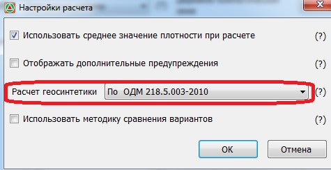
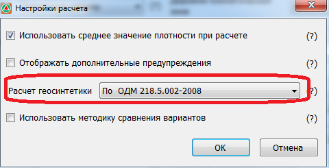
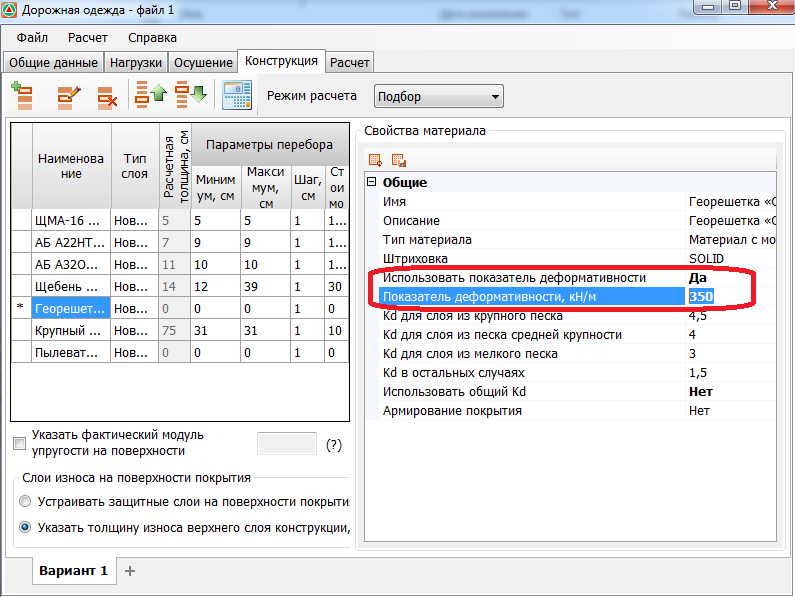

# Учет геосинтетических материалов



Для всех актуальных расчетных методик отключен учет наличия геосинтетических материалов в конструкции согласно ОДМ 218.5.002-2008, ОДМ 218.05.001 - 2009, ОДМ 218.5.003 - 2010 в связи с их отменой.



Геосинтетические материалы могут учитываться при расчете на сдвигоустойчивость и на растяжение монолитных слоев при изгибе, в зависимости от их деформационных характеристик и расположения в конструктивных слоях дорожной одежды.

{#stability}

 Наличие геосинтетики не увеличивает общий модуль упругости слоев на уровне его заложения. Но напряженное состояние изменяется и учитывается коэффициентом Кд, отражающим особенности работы конструкции на границе песчаного слоя с нижним слоем несущего основания, который принимается равным:

 **Учет по методике ОДН 218.046-01, п.3.35:**

 * 4,5 - при использовании в песчаном слое крупного песка; 
 * 4,0 - при использовании в песчаном слое песка средней крупности; 
 * 3,0 - при использовании в песчаном слое мелкого песка; 
 * 1,0 - во всех остальных случаях.**  При включенной опции использовать МОДН 2-2001, п.3.35:

 * 4,5 - для песка крупного;
 * 4,0 –для песка средней крупности;
 * 3,0 –для песка мелкого;
 * 2 - при устройстве нижнего слоя несущего основания из неукрепленных материалов и без разделительной прослойки;
 * 1 - для подстилающего дорожную одежду глинистого грунта земляного полотна.

 Данный коэффициент Кд учитывается при расчете предельного активного напряжения сдвига (формула 3.14)

 $$
 T_{np} = k_д(cN + 0,1* \gamma_{cp} *z_{on}*tg* \phi_{ст}),
 $$

 

 Если в настройках расчета (меню: Расчет-Настройки расчета) в поле Расчет геосинтетики установлен вариант-По ОДМ 218.5.002-2008, то значение коэффициента Кд всегда принимается равным- 2

 

 **Учет по методике ПНСТ 542-2021, п.9.3.4:**

 * 1,0 - нижний слой основания из укрепленных материалов, глинистый грунт (связный);
 * 4,5 - для крупного песка и ПГС нижний слой основания из укрепленных материалов, песчаный грунт (несвязный);
 * 4,0 – для среднего песка нижний слой основания из укрепленных материалов, песчаный грунт (несвязный);
 * 3,0 – для мелкого песка и легкой крупной супеси нижний слой основания из укрепленных материалов, песчаный грунт (несвязный);
 * 1,0 - нижний слой основания из неукрепленных материалов, глинистый грунт (связный);
 * 2,0 - нижний слой основания из неукрепленных материалов, песчаный грунт (несвязный), в т.ч. легкая крупная супесь.Также при расчете дополнительного слоя из песка или ПГС.

    

{#flexure}

 Наличие армирующей прослойки в асфальтобетонном покрытии согласно **ОДМ 218.05.001 - 2009** учитывается за счёт введения двух коэффициентов, величина которых зависит от прочности и деформативности георешетки:

 * коэффициент $k_а$ - учитывает повышение сопротивления растяжения при изгибе;
 * коэффициент $k_{Np}$ - учитывает уменьшение влияния усталостных процессов на прочность вследствие армирования асфальтобетонного покрытия.

 При выборе из группы **Материалы от производителя** геосинтетического материала определенной марки, значения этих коэффициентов рассчитываются программой автоматически. Если же пользователь задает геосинтетический материал из стандартной библиотеки программы, без привязки к конкретной марке, то значения этих коэффициентов также задаются им самостоятельно:

 Прочность материала монолитного слоя при многократном растяжении при изгибе RN определяют по формуле 6.б, согласно ОДМ 218.05.001-2009: 

 $$
 R_N=R_o*k_l*k_2*k_a(1-H_r*t)
 $$

 где:

 $R_о$ — нормативное значение предельного сопротивления растяжению (прочность) при изгибе при расчётной низкой весенней температуре при однократном приложении нагрузки, принимаемое по табличным данным (см. таблицу П.3.1 (ОДН 218.046- 01) или таблицу Б.5 (ПНСТ265-2018), в зависимости от используемой методики расчета) для нижнего слоя асфальтобетона;

 $k_1$ — коэффициент, учитывающий снижение прочности вследствие усталостных явлений при многократном приложении нагрузки (согласно (п. 3.42 ОДН 218.046-01) или (формула 19, ПНСТ 265-2018), в зависимости от используемой методики расчета);

 $k_2$ — коэффициент, учитывающий снижение прочности во времени от воздействия погодно-климатических факторов ((см. табл. 3.6, ОДН 218.046-01) или (табл.14, ПНСТ 265-2018), в зависимости от используемой методики расчета);

 $k_а$ — коэффициент, учитывающий увеличение прочности вследствие армирования слоя георешеткой (ОДМ 218.05.001-2009, табл.8)

 $H_r$ — коэффициент вариации прочности на растяжение ((табл. П.3.1, ОДН 218.046-01) или принимаемый 0,1 (согласно п.10.6.1, ПНСТ 265-2018), в зависимости от используемой методики расчета);

 $t$ — коэффициент нормативного отклонения (согласно (Прил. 4, ОДН 218.046-01) или (табл. А4., ПНСТ 265-2018), в зависимости от используемой методики расчета).

 Коэффициент $k_1$, отражающий влияние на прочность усталостных процессов, вычисляют по выражению:  

 $$
 k_1= \frac{a}{ \sqrt[m]{(\sum N_p)* k_{N_p}}}
 $$

 где:

 $\sum N_p$ — расчётное суммарное число приложений расчётной нагрузки за срок службы монолитного покрытия, определяемое (по формуле (3.6) ОДН 218.046-01 или (3.7) ОДН 218.046-01 с учётом числа расчётных суток за срок службы) или (п. 10.6.1, ПНСТ 265-2018) в зависимости от используемой методики расчета;

 $m$ — показатель степени, зависящий от свойств материала рассчитываемого монолитного слоя ((см. таблицу П.3.1, ОДН 218.046-01) или (табл. Б.5, ПНСТ 265-2018), в зависимости от используемой методики расчета);

 $a$ — коэффициент, учитывающий различие в реальном и лабораторном режимах растяжения повторной нагрузкой, а также вероятность совпадения по времени расчётной (низкой) температуры покрытия и расчётного состояния грунта рабочего слоя по влажности, определяемый по (табл.П.3.1, ОДН 218.046-01) или (табл Б.5, ПНСТ 265-2018), в зависимости от используемой методики расчета;

 $k_{N_p}$ — коэффициент, учитывающий уменьшение влияния усталостных процессов на прочность вследствие армирования асфальтобетонного покрытия геосеткой (согласно ОДМ 218.05.001-2009, таблицу 8).

 

 Георешетка при расчете на армирование должна располагаться на любом уровне в слоях асфальтобетона, в том числе она может быть расположена и под нижнем слоем асфальта.

  

 

 {#roadsides} 

  Если в конструкции используются прослойки из геосинтетических материалов, величина расчетного модуля упругости конструкции умножается на коэффициент 1/α, где α - показатель, принимаемый по приложению 1 **ОДН 218.3.039- 2003**.



{#draining}

 В соответствии с п. 7.7.7 и п. 7.7.10 при расчете дорожной конструкции по принципу осушения предусмотрен учет наличия геосинтетического материала, укладываемого на земляное полотно.

 Полная толщина дренирующего слоя, работающего по способу осушения $h_п$, м, вычисляется по формуле (52):

 $$
 h_п=h_{нас}+h_{зап}+Δh
 $$

 где:

 * $h_{нас}$ – толщина слоя, полностью насыщенного водой, м;
 * $h_{зап}$ – дополнительная толщина слоя, зависящая от капиллярных свойств материала: для песков гравелистых, очень крупных, повышенной крупности и крупных 0,1 м; для песков средних – 0,15 м; для песков мелких – 0,2 м;
 * $Δh$ – величина запаса на уменьшение толщины дренирующего слоя вследствие взаимопроникновения частиц между влажным грунтом верхней части земляного полотна и дренирующего слоя, м.

 При этом во всех случаях полную толщину дренирующего слоя следует принимать не менее 0,20 м.

 В случае устройства геосинтетической прослойки, $W_{таб}$<0,65, а также в IV и V ДКЗ, $Δh$= 0, во всех остальных случаях она определяется по формуле (53):

 $$
 Δh=\frac{\sum N_p v_в k_N}{10^8}
 $$

 где:

 * $\sum N_p$ – суммарное количество приложений приведенной расчетной нагрузки;
 * $v_в$ – скорость взаимопроникновения песка дренирующего слоя и грунта земляного полотна, мм/год, принимаемая по таблице 12;
 * $k_N$ – показатель, характеризующий затухание и стабилизацию процесса взаимопроникновения во времени, принимаемый по таблице 13.

 Таблица 12 – Скорость взаимопроникновения песка дренирующего слоя и грунта земляного полотна $v_в$

 #|
 || **Грунт земляного полотна** {.cell-align-center}| **$v_в$ при схеме увлажнения рабочего слоя земляного полотна, мм/год** |>|>||
 || ^ | 1 {.cell-align-center}| 2 {.cell-align-center}| 3 {.cell-align-center}||
 || Пылеватые супеси и суглинки | 4/5 {.cell-align-center}| 5/6 {.cell-align-center}| 6/7 {.cell-align-center}||
 || Песчанистые супеси и суглинки | 2/3 {.cell-align-center}| 3/4 {.cell-align-center}| 4/5 {.cell-align-center}||
 || Примечание – В числителе даны значения для III ДКЗ, в знаменателе – для II ДКЗ. |>|>|>||
 |#

 Таблица 13 – Значения показателя, характеризующего затухание и стабилизацию процесса взаимопроникновения частиц во времени $k_N$

 #|
 || **$\sum N_p$** {.cell-align-center}| **≤500000** {.cell-align-center}| **1000000** {.cell-align-center}| **2000000** {.cell-align-center}| **3000000** {.cell-align-center}| **5000000** {.cell-align-center}||
 || $k_N$ {.cell-align-center}| 1,2 {.cell-align-center}| 1,0 {.cell-align-center}| 0,7 {.cell-align-center}| 0,5 {.cell-align-center}| 0,3 {.cell-align-center}||
 || Примечания: 1. Для промежуточных значений следует использовать линейную интерполяцию. 2. При $\sum N_p$ > 5 000 000 величину $Δh$ следует принимать, как для $\sum N_p$ = 5000000. |>|>|>|>|>||
 |#

 Расчёт толщины слоя, полностью насыщенного водой, $h_{нас}$ работающего по принципу осушения с укладкой на земляное полотно геосинтетического материала, следует проводить в следующей последовательности.

 Вычисляется расчётное значение коэффициента фильтрации геосинтетического материала с учётом заиливания и общих условий его работы в дренирующем слое дорожной одежды по формуле (59)(при условии, что напряжения от транспортных нагрузок на поверхности земляного полотна не превышают допустимых значений).

 $$
 K_{рфг}=K^{исх}_{фг}+K_{усл}
 $$

 где:

 * $K^{исх}_{фг}$ – исходное значение коэффициента фильтрации геосинтетического материала по данным производителя, м/сут;
 * $K_{усл}$ – коэффициент, учитывающий условия работы геосинтетического материала в дорожной конструкции, назначаемый по таблице 14.

 Таблица 14 – Значения коэффициента, учитывающего условия работы геосинтетического материала в дорожной конструкции $K_{усл}$

 #|
 || **Грунт земляного полотна** {.cell-align-center}| **$K_{усл}$ при суммарном количестве приложений расчётной нагрузки** {.cell-align-center}|>|>|>||
 || ^ | 100000… 500000 {.cell-align-center}| 500000… 1000000 {.cell-align-center}| 1000000…5000000 {.cell-align-center}| ≥5000000 {.cell-align-center}||
 || Супеси | 0,9 {.cell-align-center}| 0,8 {.cell-align-center}| 0,65 {.cell-align-center}| 0,5 {.cell-align-center}||
 || Суглинки | 0,8 {.cell-align-center}| 0,65 {.cell-align-center}| 0,55 {.cell-align-center}| 0,4 {.cell-align-center}||
 || Примечание – Для пылеватых суглинков окончательную величину $K_{рфг}$ следует уменьшить на 10 %, для пылеватых супесей на 20 %. |>|>|>|>||
 |#

 Вычисляется исходная глубина фильтрационного потока $h_{исх}$ в зависимости от величины $q_р$ по формуле (60)

 $$
 h_{исх}=-0,068·(10^3·q_р)^2+3,23·(10^3·q_р)
 $$

 Толщина слоя, полностью насыщенного водой hнас, вычисляется по формуле (61)

 $$
 h_{нас}=\frac{L}{3,5}h_{исх}K_i K_{КП} K_{КГ}
 $$

 где:

 * $L$ – длина пути фильтрации, м;
 * $K_i$ – поправка на влияние поперечного уклона земляного полотна, равная 1,0 при уклоне 20 ‰, 0,9 при уклоне 30 ‰ и 0,8 при уклоне 40 ‰;
 * $K_{КП}$ – поправка на фактический коэффициент фильтрации песка, равная 1,0 при коэффициенте фильтрации до 1 м/сут включительно, для других значений коэффициента фильтрации использовать таблицу 15;
 * $K_{КГ}$ – поправка на фактический коэффициент фильтрации геосинтетического материала в дренирующем слое, назначается по таблице 16.

 Таблица 15 – Значения поправки на фактический коэффициент фильтрации песка $K_{КП}$ при $K_ф$ >1 м/сут

 #|
 || **$K_ф$, м/сут** {.cell-align-center}| **$K_{КП}$ при $q_p$** {.cell-align-center}|>|>|>||
 || ^ | 0,001 {.cell-align-center}| 0,008 {.cell-align-center}| 0,012 {.cell-align-center}| 0,018 {.cell-align-center}||
 || 3 {.cell-align-center}| 0,90 {.cell-align-center}| 0,80 {.cell-align-center}| 0,70 {.cell-align-center}| 0,50 {.cell-align-center}||
 || 5 {.cell-align-center}| 0,75 {.cell-align-center}| 0,50 {.cell-align-center}| 0,45 {.cell-align-center}| 0,35 {.cell-align-center}||
 || ≥7 {.cell-align-center}| 0,50 {.cell-align-center}| 0,38 {.cell-align-center}| 0,33 {.cell-align-center}| 0,28 {.cell-align-center}||
 || Примечание – Для промежуточных значений $q_р$ следует использовать линейную интерполяцию. |>|>|>|>||
 |#

 Таблица 16 – Значение поправки на фактический коэффициент фильтрации геосинтетического материала в дренирующем слое $K_{КГ}$

 #|
 || $K_{рфг}$, м/сут | 20 {.cell-align-center}| 40 {.cell-align-center}| 60 {.cell-align-center}| ≥80 {.cell-align-center}||
 || $K_{КГ}$ | 1,0 {.cell-align-center}| 0,86 {.cell-align-center}| 0,55 {.cell-align-center}| 0,40 {.cell-align-center}||
 || Примечания - 1. Для промежуточных значений $K_{рфг}$ следует использовать линейную интерполяцию. 2. При $K_{рфг}$ менее 20 следует брать геосинтетический материал с большим исходным значением $K^{исх}_{фг}$.|>|>|>|>||
 |#



{#odm2010}

 **с модулем деформации 35кН/м ≤E< 60кН/м**

 Учитывается с помощью коэффициента Кд, значения которого были представлены выше.

 Данный вид геосинтетики дополнительно учитывается коэффициентом усиления α, который выбирается по нижнему значению из Таблицы В.3, ОДМ 218.5.003 - 2010. Этот коэффициент используется при расчете по допускаемому упругому прогибу (Согласно ОДМ 218.5.003 - 2010, формула 9.5).

 

 Чтобы данный тип материала учитывался в расчете на сдвигоустойчивость, он должен располагаться на границе слоев «грунт - песчаное основание» или «песчаное основание - щебеночное основание или ЩПС»

 Для учета дополнительного коэффициента усиления α, согласно ОДМ 218.5.003 -2010 необходимо открыть окно настроек расчета (меню Расчет-Настройки расчета) и убедиться что в поле Расчет геосинтетики установлен соответствующий вариант:

 .

 

 **с модулем деформации E≥ 60кН/м**

 Учитывается с помощью коэффициента Кд, значения которого были представлены выше.

 Данный вид геосинтетики дополнительно учитывается коэффициентом усиления α, который выбирается по верхнему значению из Таблицы В3,ОДМ 218.5.003 - 2010. Этот коэффициент используется при расчете по допускаемому упругому прогибу (Согласно ОДМ 218.5.003 - 2010,формула 9.5).

 

 Чтобы данный тип материала учитывался в расчете на сдвигоустойчивость, он должен располагаться на границе слоев «грунт - песчаное основание», либо «песчаное основание - щебеночное основание или ЩПС»

 Для учета дополнительного коэффициента усиления α, согласно ОДМ 218.5.003 -2010 необходимо открыть окно настроек расчета (меню Расчет-Настройки расчета) и убедиться что в поле Расчет геосинтетики установлен соответствующий вариант:

 .

 

 Для добавления геосинтетического материала с целью повышения прочности конструкции на сдвиг или упругий прогиб:

 1. На вкладке **Конструкция** нажмите кнопку **Добавить новый слой**.
 2. Из появившегося стандартного кодификатора выберите группу **Слои геосинтетики** и ее тип по деформативным характеристикам:
 3. Используя кнопки **Переместить слой**, расположите геосинтетический материал в требуемом месте, между определенными конструктивными слоями.

 

 В конструкцию дорожной одежды можно ввести несколько геосинтетических прослоек, к примеру, между слоями основания и слоями асфальтобетона.

 



{#odm2008}

 Учет геосинтетических материалов согласно ОДМ 218.5.002-2008  осуществляется   введением коэффициентов усиления, зависящих от деформативных свойств георешеток, толщин слоев, механических свойств материалов дорожных одежд и грунтов рабочего слоя земляного полотна. Приводимые коэффициенты усиления справедливы для материалов, отвечающих требованиям п. 4.5 и раздела 5. данной методики.

 Коэффициенты усиления вводятся при расчете дорожных одежд по критерию упругого прогиба (п.п. 6.2.3, 6.2.6), критерию сдвигоустойчивости грунта, подстилающего зернистое основание (п.п. 6 .2 .4 ,6 .2 .7 ), и критерию сопротивления материалов монолитных слоев возникающим в них растягивающим напряжениям (п. 6.2.5).

 

 1. Для учета данных коэффициентов усиления согласно ОДМ 218.5.002 -2008 необходимо открыть окно настроек расчета (меню Расчет-Настройки расчета) и убедиться что в поле Расчет геосинтетики установлен соответствующий вариант:

    

 2. Значение показателя деформативности геосетки задается пользователем самостоятельно, в свойствах выбранного материала (поле Свойства материала), согласно прил. Д, ОДМ 218.5.002-2008

    

 

