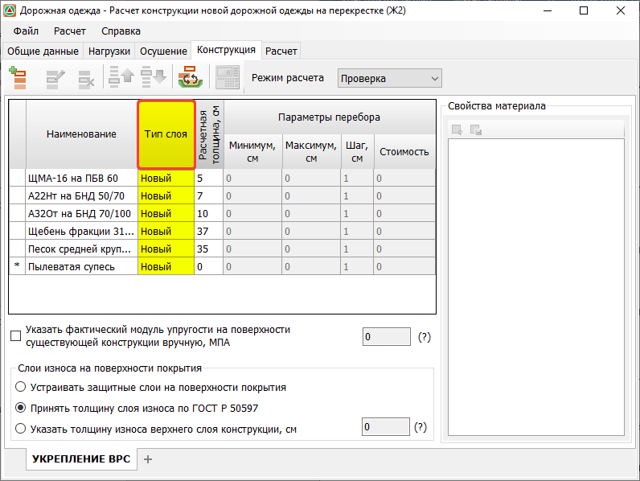
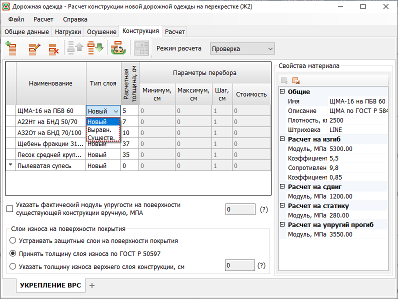
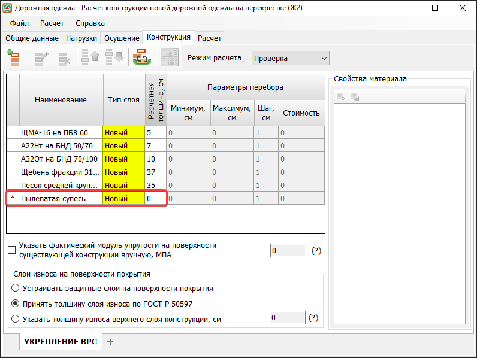
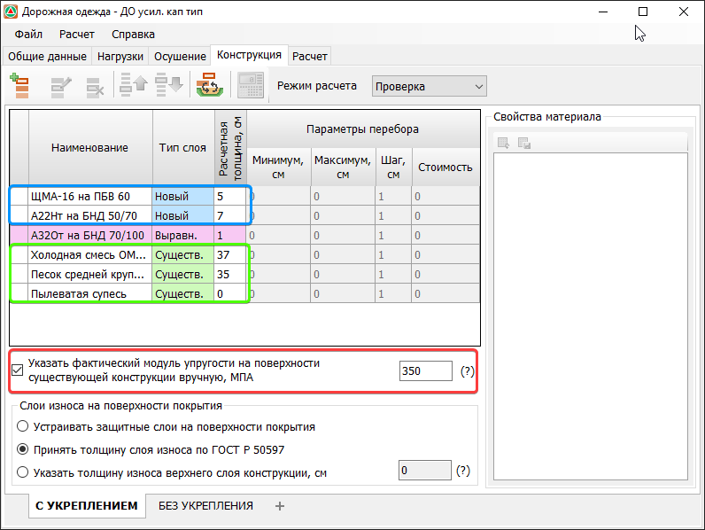
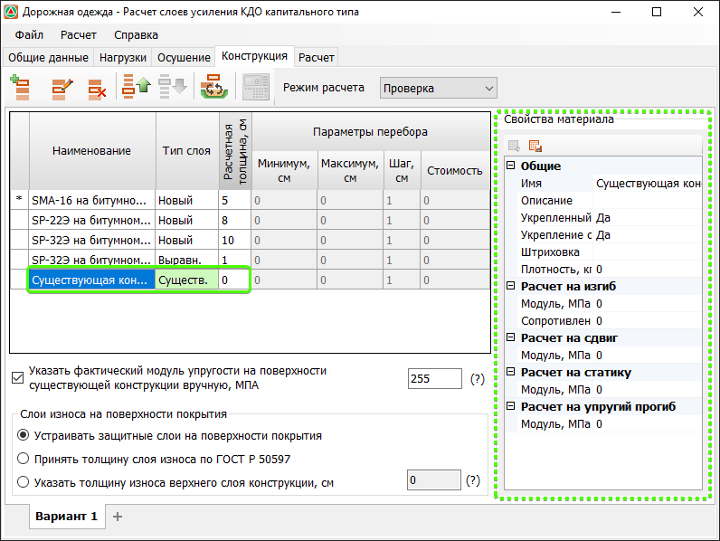
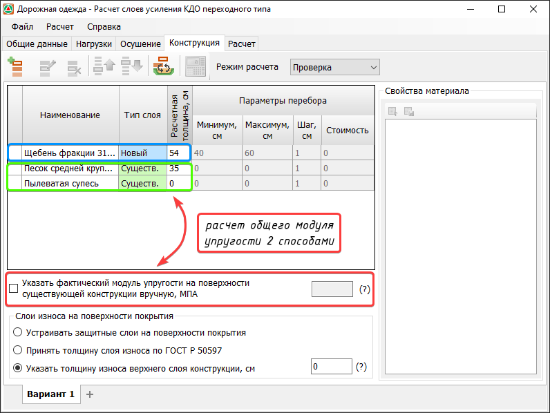
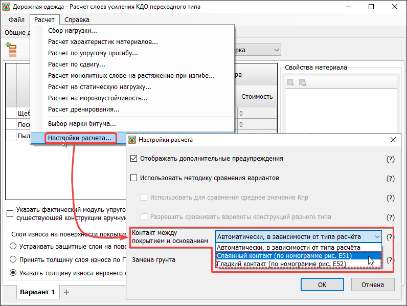

# Особенности расчета новой конструкции дорожной одежды и слоев усиления

Расчет по ГОСТ Р 71404-2024 может быть выполнен как для новой конструкции, так и для слоев усиления существующей. Для корректного определения типа расчета слоям конструкции должно быть присвоено определенное свойство, **Тип Слоя**. Также для усиления разных типов дорожных одежд в программе предусмотрены разные алгоритмы работы.

## Тип слоя

Данное поле служит для идентификации типа рассчитываемой конструкции, новая конструкция или расчет слоев усиления. При наличии того или иного слоя в конструкции она будет восприниматься определённым образом.

Возможны следующие варианты установленных значений: **новый**, **существующий**, **выравнивающий**.

* Тип слоя **Новый** назначается как в новой конструкции, так и в конструкции усиления, при этом при усилении только слои с данным типом воспринимаются как вновь устраиваемые.
* Типы **Существующий** и **Выравнивающий** назначаются только для конструкции усиления. Наличие слоя с типом **Существующий** обязательно в конструкции усиления, в то врем как **Выравнивающий** слой может отсутствовать. Слой с типом **Выравнивающий** не участвует в расчетах, а лишь отображается в списке слоев конструкции.

## Расчет новой конструкции

Для корректного расчета новой конструкции у всех конструктивных слоев должен быть указан **Тип слоя - Новый**. Для грунта рабочего слоя **Тип слоя** также должен быть **Новый**, а толщина 0 см.

## Расчет усиления капитальных и облегченных ДО

Для расчета усиления капитальных и облегченных дорожных одежд:

* должна быть включена опция **Указать фактический модуль упругости на поверхности существующей конструкции вручную, Мпа** и должен быть указан сам модуль упругости;
* должен быть задан минимум один существующий слой;
* слои существующей конструкции должны иметь **Тип слоя - Существующий**, а вновь устраиваемые соответственно **Новый**;
* также в конструкцию может быть добавлен слой с типом **Выравнивающий**.

В таком случае заданная конструкция будет идентифицирована как конструкция усиления.



В случае усиления капитальных и облегченных дорожных одежд в качестве существующей конструкции может быть задан фиктивный слой с типом **Существующий**.



## Расчет усиления переходных ДО



В отличии от усиления капитальных и облегченных дорожных одежд, конструкции переходного типа могут быть рассчитаны на основе материалов обследований. Общий модуль упругости будет рассчитан с использованием существующих слоев, и для них также будут выполнены соответствующие расчеты на прочность.



Для расчета усиления переходных дорожных одежд:

* может быть включена опция **Указать фактический модуль упругости на поверхности существующей конструкции вручную, Мпа** и указан сам модуль упругости или слои существующей конструкции могут быть внесены в список, в таком случае модуль упругости на поверхности существующей конструкции будет рассчитан с их учетом;



При одновременном выборе настройки **Указать фактический модуль упругости на поверхности существующей конструкции вручную, Мпа** и заполненном списке существующих слоев расчет будет вестись относительно фактического указанного модуля.



* должен быть задан минимум один существующий слой;
* слои существующей конструкции должны иметь **Тип слоя - Существующий**, а вновь устраиваемые соответственно **Новый**;
* также в конструкцию может быть добавлен слой с типом **Выравнивающий**.

В таком случае заданная конструкция будет идентифицирована как конструкция усиления.

## Учет характера контакта между существующим покрытием и вновь устраиваемыми слоями

Для того чтобы [характер контакта между существующим покрытием и вновь устраиваемыми слоями](../road_tasks?tabs=road-tasks_gost-71404-2024#71404-2024-kontakt-pokrytie-osnovanie) был учтен корректно, необходимо в **Настройках расчета** (меню **Расчет - Настройки расчета**) вручную установить соответствующую опцию:

