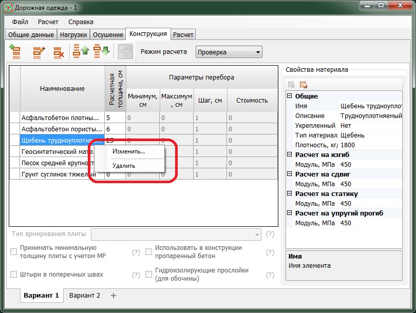

# Работа со слоями через контекстное меню

Выше описанными функциями по редактированию слоев также можно воспользоваться с помощью контекстного меню.

Для этого, щелкните правой кнопкой мыши по наименованию соответствующего слоя конструкции и выберите из контекстного меню требуемую команду:

**Изменить** - данная опция предназначена для замены какого - либо слоя конструкции на другой, путем выбора нового слоя из библиотеки материалов.

**Удалить** - для удаления какого-либо слоя из конструкции дорожной одежды.