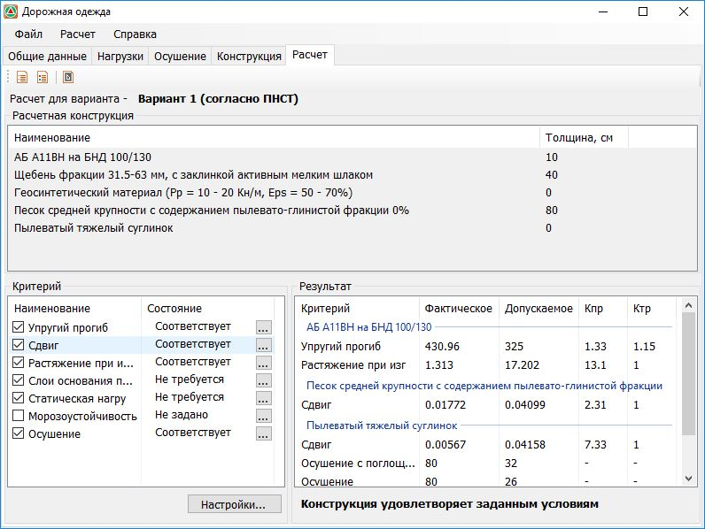
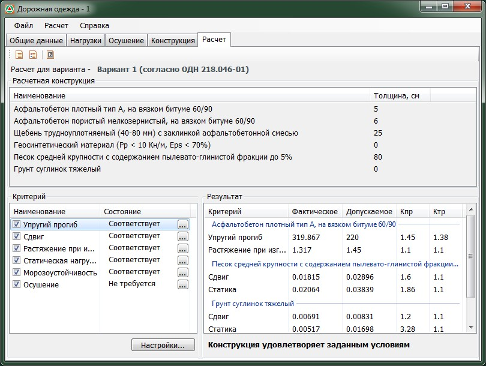
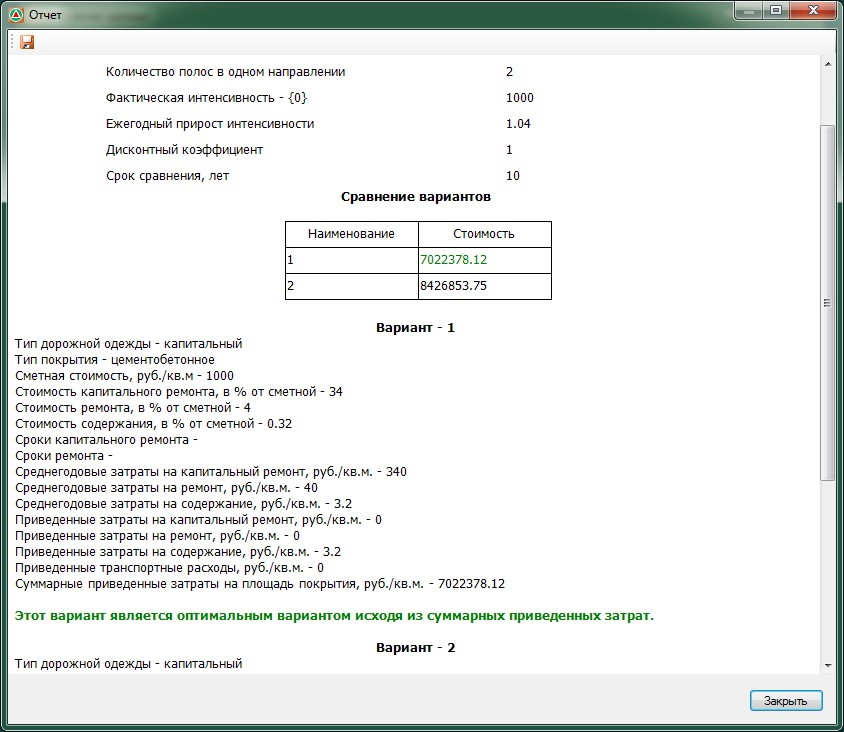
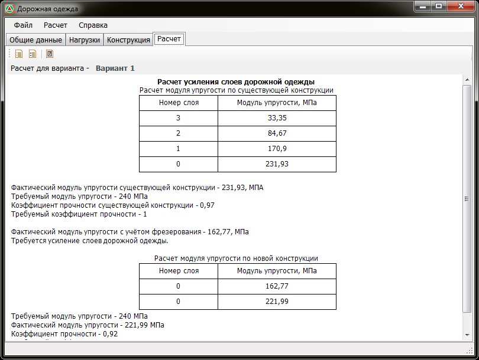

# Расчет



- ПНСТ 542-2021 {#pnst-542-2021}

  

  

  #### Настройки расчета {#raschet-nastroiki}

  Кнопка для быстрого перехода в окно дополнительных [настроек расчета](../../road_tasks?tabs=road-tasks_pnst-542-2021).

- ПНСТ 265-2018 {#pnst-265-2018}

  

  

  #### Настройки расчета {#raschet-nastroiki}

  Кнопка для быстрого перехода в окно дополнительных [настроек расчета](../../road_tasks?tabs=road-tasks_pnst-265-2018).

- ОДН 218.046-01, МР (взамен ВСН 197-91) {#odn-218-046-01}

  
  
  

  #### Настройки расчета {#raschet-nastroiki}

  Кнопка для быстрого перехода в окно дополнительных [настроек расчета](../../road_tasks?tabs=road-tasks_odn-218-046-01).

- ВСН-21-83 {#vsn-21-83}

  

  На вкладке представлены результаты расчетов конструкций и их сравнение. Имеется возможность просмотреть и сохранить выходные отчеты в различных вариациях.

  #### Создание выходной документации {#otchet}

  В программе предусмотрена возможность создания отчетов и чертежей конструкций. Для этого в верхней части окна находятся кнопки:

  *  _простой отчет_ - отчет с ключевой информацией по расчету, без развернутых пояснений и формул, который можно просмотреть в дополнительном окне программы и, при необходимости,  сохранить в формате `.rtf`;
  *  _отчет по шаблону_ - отчет, формируемый по заранее настроенному файлу-шаблону, который сохраняется в формат `.odt`. Содержит более подробную информацию по сравнению с простым отчетом и отражает последовательность расчета, в том числе формулы расчета с арифметической выкладкой.

- ОДН 218.1.052-2002 {#odn-218-1-052-2002}

  
  
  На вкладке представлены результаты по расчету выбранного варианта конструкции. Имеется возможность просмотреть и сохранить выходные отчеты в различных вариациях.

  

