# Общие данные



- ПНСТ 542-2021 {#pnst-542-2021}

  

  На вкладке **Общие данные** задаются основные параметры дороги, а также характеристики района ее проектирования.

  {#542-2021-raion}

  В данном поле вводится название района проектируемого объекта. Его заполнение не является обязательным, т.к. не влияет на результат расчета, а лишь заносится в названия выходных документов и ведомостей.

  

  {#542-2021-obekt}

  В данном поле задается название объекта (участка) рассчитываемой дорожной одежды. Его заполнение также не является обязательным.

  

  {#542-2021-relef}

  Возможны следующие типы местности по рельефу:

  * **Равнинные районы;**
  * **Предгорные районы (до 1000 м над у.м.);**
  * **Горные районы (более 1000 м над у.м.)**

  Учитывается в качестве первой поправки на влажность при определении расчетных характеристик грунта земляного полотна (согласно **ПНСТ 542-2021**, прил. В, формула В.1).

  $$W_p = (\overline{W}_{табл}+Δ + Δ_1 W – Δ_2 W)(1 + V_r t) – Δ_3,$$

  где:

  * $W_{табл}$ — среднее многолетнее значение относительной (в долях от влажности на границе текучести) влажности грунта в наиболее неблагоприятный (весенний) период года в рабочем слое земляного полотна, определяемое по таблице В.1 в зависимости от ДКЗ и подзоны (см. рисунок В.1), схемы увлажнения грунта рабочего слоя и типа грунта;
  * $Δ$ — поправка, равная 0,00 – для участков насыпей и 0,03 - для участков дороги, проходящих в выемке или в низкой насыпи с рабочей отметкой менее руководящей отметки для данного типа грунта и типа местности по характеру увлажнения;
  * $Δ_1 W$ — поправка на особенности рельефа территории, принимаемая для равнинных условий - 0,00, предгорных - 0,03, горных - 0,05;
  * $Δ_2 W$ — поправка на конструктивные особенности проезжей части и обочин, определяемая по таблице В.2;
  * $V_r$ — коэффициент вариации, равный 0,10;
  * $t$ — коэффициент нормированного отклонения, принимаемый в зависимости от уровня надежности $K_н$ (см. таблицу В.3);
  * $Δ_3$ — поправка, учитывающая толщину слоев, превышающую 0,75 м, определяемая по рисунку В.2 (в случае если толщина слоев менее 0,75 м, поправка не принимается).

  

  {#542-2021-klimat}

  Выбор дорожно - климатической зоны осуществляется по карте ( **ПНСТ 542-2021**, прил. В, рис. В.1).

  **Дорожно-климатические зоны и подзоны Российской Федерации**

  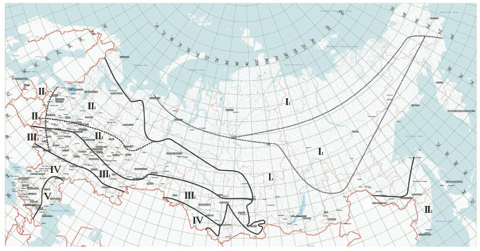

   - Границы дорожно-климатических зон; 
   - Границы дорожно-климатических подзон

  

  1. При обосновании общее дорожно-климатическое районирование территории Российской Федерации может уточнятся в рамках отдельных субъектов.
  2. Кубань и западную часть Северного Кавказа следует относить к III ДКЗ, Крым — IV ДКЗ.
  3. При проектировании участков дорог в приграничных зонах при обосновании данных о грунтово-гидрологических и почвенных условиях, а также исходя из практики эксплуатации дорог в районе, допускается принимать проектные решения как для смежной (северной или южной) зоны.
  4. В горных районах дорожно-климатические зоны следует определять с учетом высотного расположения объектов проектирования, принимая во внимание природные условия на данной высоте.
  5. Разделение на подзоны следует учитывать при определении расчетной влажности при расчетах на прочность и морозоустойчивость дорожных одежд.

  

  

  {#542-2021-raschetnye-dni}

  Принимается согласно **ПНСТ 542-2021** , табл.3 или рис.1. Используется при определении суммарного числа приложений расчетной нагрузки, к точке на поверхности конструкции, за срок ее службы.

  #|
  || **Номера районов на карте** {.cell-align-center}| **Географические границы районов** {.cell-align-center}| **Рекомендуемое количество расчётных дней в году ($Т_{РДГ}$)** {.cell-align-center}||
  || 1 {.cell-align-center} | 2 {.cell-align-center} | 3 {.cell-align-center} ||
  || 1 {.cell-align-center} | Зона распространения вечномёрзлых грунтов севернее семидесятой параллели | 70 {.cell-align-center} ||
  || 2 {.cell-align-center} | Севернее линии, соединяющей Онегу - Архангельск - Мезень - Нарьян-Мар - шестидесятый меридиан - до побережья Европейской части | 145 {.cell-align-center} ||
  || 3 {.cell-align-center} | Севернее линии, соединяющей Смоленск - Калугу - Рязань - Саранск - сорок восьмой меридиан - до линии, соединяющей Онегу - Архангельск - Мезень - Нарьян-Мар | 125 {.cell-align-center} ||
  || 4 {.cell-align-center} | Севернее линии, соединяющей Белгород - Воронеж - Саратов - Самару - Оренбург - шестидесятый меридиан, до линии районов 2 и 3 | 135 {.cell-align-center} ||
  || 5 {.cell-align-center} | Севернее линии, соединяющей Ростов-на-Дону - Элисту - Астрахань - Белгород - Воронеж - Саратов - Самару | 145 {.cell-align-center} ||
  || 6 {.cell-align-center} | Южнее линии Ростов-на-Дону, Элиста, Астрахань для Европейской части, южнее сорок шестой параллели  для остальных территорий, полуостров Крым | 205 {.cell-align-center} ||
  || 7 {.cell-align-center} | Восточная и Западная Сибирь, Дальний Восток (кроме Хабаровского и Приморского краев, Камчатской области), ограниченные с севера семидесятой параллелью, с юга - государственной границей | 130-150 (меньшие значения для центральной части) {.cell-align-center} ||
  || 8 {.cell-align-center}| Хабаровский и Приморский края, Камчатская область | 140 {.cell-align-center} ||
  |#

  

  Значения величины $Т_{РДГ}$ на границах районов следует принимать по наибольшему из значений.

  

  **Карта районирования по количеству расчетных дней в году, $Т_{РДГ}$**

  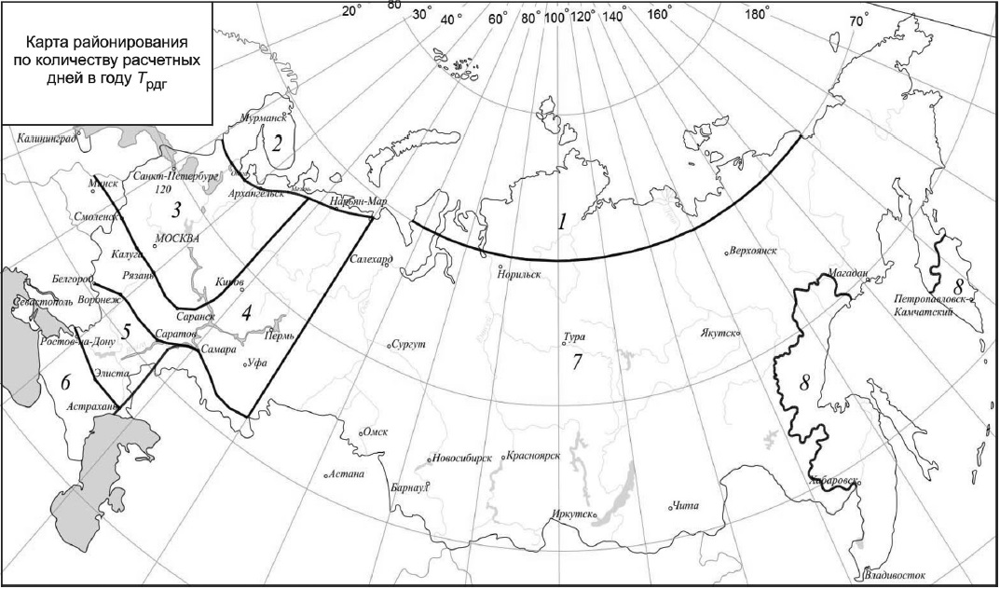

  

  {#542-2021-uvlazhnenie}

  Принимается согласно **ПНСТ 542-2021** , табл. 10. Учитывается при определении расчетной влажности грунта земляного полотна (прил. В, формула В.1).

  Возможны следующие схемы увлажнения:

  1 – **сухие места** (источники увлажнения- атмосферные осадки);
  2 – **сырые места с избыточным увлажнением в отдельные периоды года** (источники увлажнения - кратковременно стоящие (до 30 сут) поверхностные воды, атмосферные осадки);
  3 – **мокрые места с постоянным избыточным увлажнением** (источники увлажнения- грунтовые или длительно стоящие (более 30 сут) поверхностные воды, атмосферные осадки).

  #|
  || **Схема увлажнения рабочего слоя** {.cell-align-center}| **Источники увлажнения** {.cell-align-center}| **Условия отнесения к данному типу увлажнения** {.cell-align-center}||
  || 1 {.cell-align-center} | 2 {.cell-align-center} | 3 {.cell-align-center} ||
  || 1 {.cell-align-center} | Атмосферные осадки | Для насыпей на участках 1-го типа местности по условиям увлажнения. ||
  || ^ | ^ | Для насыпей на участках местности 2-го и 3-го типов по условиям увлажнения при возвышении поверхности покрытия над расчетным УГВ и уровнем поверхностных вод или над поверхностью земли, более чем в 1,5 раза превышающем требования таблицы 9. ||
  || ^ | ^ | Для насыпей на участках 2-го типа при расстоянии от уреза поверхностной воды (отсутствующей не менее 2/3 летнего периода) более 5 - 10 м при супесях; 2 - 5 м при легких пылеватых суглинках и 2 м при тяжелых пылеватых суглинках и глинах (меньшие значения принимают для грунтов с бо́льшим числом пластичности; при залегании различных грунтов следует принимать наибольшее значение). ||
  || ^ | ^ | В выемках в песчаных и глинистых грунтах при уклонах кюветов более 20 % (в ДКЗ I, II и III) и при возвышении поверхности покрытия над расчетным УГВ, более чем в 1,5 раза превышающем требования таблицы 9. ||
  || ^ | ^ | При применении специальных методов регулирования водно-теплового режима (капилляропрерывающие, гидроизолирующие, теплоизолирующие и армирующие прослойки, дренаж и т. п.), назначаемых по специальным расчетам. ||
  || 2 {.cell-align-center} | Кратковременно стоящие (до 30 сут) поверхностные воды, атмосферные осадки | Для насыпей на участках 2-го типа местности по условиям увлажнения при возвышении поверхности покрытия не менее требуемого по таблице 16 и не более чем в 1,5 раза превышающего эти требования и при крутизне откосов не менее 1:1,5 и простом (без берм) поперечном профиле насыпи. ||
  || ^ | ^ | Для насыпей на участках 3-го типа местности при применении специальных мероприятий по защите от грунтовых вод (капилляропрерывающие и гидроизолирующие слои, дренаж), назначаемых по специальным расчетам, при отсутствии длительно (более 30 сут) стоящих поверхностных вод и выполнении условий, указанных в предыдущем абзаце. ||
  || ^ | ^ | В выемках в песчаных и глинистых грунтах при уклонах кюветов менее 20 % (ДКЗ I и II) и возвышении поверхности покрытия над расчетным УГВ, более чем в 1,5 раза превышающем требования таблицы 9 ||
  || 3 {.cell-align-center} | Грунтовые или длительно (более 30 сут) стоящие поверхностные воды, атмосферные осадки | Для насыпей на участках 3-го типа местности по условиям увлажнения при возвышении поверхности покрытия, отвечающем требованиям таблицы 9, но не превышающем их более чем в 1,5 раза. ||
  || ^ | ^ | То же для выемок, в основании которых имеется УГВ, расположение которого по глубине не превышает требования таблицы 9 более чем в 1,5 раза. ||
  |#

  

  {#542-2021-kategoriya}

  Принимается от 1 до 4 по заданию на проектирование. 

  

  Согласно п. 5.9 ПНСТ 542-2021 Дорожные одежды низшего типа рассчитывают в соответствии с ГОСТ Р 58818 и ПНСТ 371 – 2019, капитального и облегченного типов - по настоящему ПНСТ 542-2021 с учетом требований ГОСТ Р 58818.

  

  

  {#542-2021-vlazhnost}

  Принимается согласно **ПНСТ 542-2021**, (прил. В, табл. В.2).

  #|
  || **Конструктивная особенность** {.cell-align-center}| **Поправка $Δ_2W$ в дорожно-климатических зонах** {.cell-align-center}|>|>|>||
  || ^ | II {.cell-align-center} | III {.cell-align-center} | IV {.cell-align-center} | V {.cell-align-center} ||
  || Основание дорожной одежды, включая слои на границе с грунтом рабочего слоя, из укрепленных материалов: {.cell-align-center} |>|>|>|>||
  || крупнообломочного грунта и песка | 0,04 {.cell-align-center} | 0,04 {.cell-align-center} | 0,03 {.cell-align-center} | 0,03 {.cell-align-center} ||
  || песчанистой супеси | 0,05 {.cell-align-center} | 0,05 {.cell-align-center} | 0,05 {.cell-align-center} | 0,04 {.cell-align-center}||
  || пылеватых песков, тяжелого и легкого суглинка и др. | 0,08 {.cell-align-center} | 0,08 {.cell-align-center} | 0,06 {.cell-align-center} | 0,05 {.cell-align-center} ||
  || Укрепление обочин (не менее 2/3 их ширины): {.cell-align-center} |>|>|>|>||
  || асфальтобетоном | 0,05 {.cell-align-center} | 0,04 {.cell-align-center} | 0,03 {.cell-align-center} | 0,02 {.cell-align-center} ||
  || щебнем (гравием) | 0,02 {.cell-align-center} | 0,02 {.cell-align-center} | 0,02 {.cell-align-center} | 0,02 {.cell-align-center} ||
  || Дренаж с продольными трубчатыми дренами | 0,05 {.cell-align-center} | 0,03 {.cell-align-center} | - {.cell-align-center} | - {.cell-align-center} ||
  || Устройство гидроизолирующих прослоек из полимерных материалов | 0,05 {.cell-align-center} | 0,05 {.cell-align-center} | 0,03 {.cell-align-center} | 0,03 {.cell-align-center} ||
  || Устройство теплоизолирующего слоя, предотвращающего промерзание | Снижение расчетной влажности до полной влагоемкости при требуемом коэффициенте уплотнения грунта $К_{упл}$ |>|>|>||
  || Грунт рабочего слоя земляного полотна в «обойме» | Снижение расчетной влажности до оптимальной |>|>|>||
  || Грунт рабочего слоя, уплотненный до значения коэффициента уплотнения более 1,00 в слое толщиной до 0,5 м от низа дорожной одежды, если он расположен ниже границы промерзания | - {.cell-align-center} | 0,03 {.cell-align-center} | 0,03 {.cell-align-center} | 0,03 {.cell-align-center} ||
  |#

  Учитывается в качестве второй поправки на влажность при определении расчетных характеристик грунта земляного полотна (прил. В, формула В.1).

  

  {#542-2021-odezhda}

  Возможны следующие варианты (согласно **ПНСТ 542-2021**, п.6.11 и п.6.12):

  * **Капитальный**;
  * **Облегченный**;
  * **Переходный**.

  

  Дорожные одежды низшего типа конструируются и рассчитываются в соответствии с нормативными документами, регламентирующими проектирование дорожных одежд с низкой интенсивностью движения. 

  

  

  {#542-2021-polosy}

  Принимается согласно заданию на проектирование.

  В зависимости от количества полос движения назначается коэффициент полостности (согласно **ПНСТ 542-2021**, табл. 2)

  #|
  || **Число полос движения** | **Коэффициент распределения интенсивности движения для самой нагруженной полосы движения $f_{пол}$** ||
  || 1 {.cell-align-center} | 1,00 {.cell-align-center} ||
  || 2 {.cell-align-center} | 0,55 {.cell-align-center} ||
  || 3 {.cell-align-center} | 0,50 {.cell-align-center} ||
  || 4 {.cell-align-center} | 0,45 {.cell-align-center} ||
  || 5 {.cell-align-center} | 0,40 {.cell-align-center} ||
  || 6 и более {.cell-align-center} | 0.35 {.cell-align-center} ||
  |#

  

  На перекрестках и подходах к ним (в местах перестройки потока автомобилей для выполнения левых поворотов и др.) при расчете одежды в пределах всех полос движения следует принимать $f_{пол}$ = 0,50, если общее число полос проезжей части проектируемой дороги три и более.

  

  Данный коэффициент учитывается при определении приведенной интенсивности движения к воздействию расчетной нагрузки на полосу двиижения на конец межремонтного срока проведения работ по капитальному ремонту (формула 3).

  

  {#542-2021-nadezhnost}

  Требуемый уровень надежности указан в задании на проектирование в зависимости от категории дороги и типа дорожных одежд или выбирается согласно **ПНСТ 542-2021**, табл.5.
  
  #|
  || **Тип дорожных одежд** {.cell-align-center}| **Категория дороги** {.cell-align-center}| **Требуемый коэффициент прочности $K_{пр}^{тр}$ по критерию** {.cell-align-center}|>| **Коэффициент надежности $K_н$** {.cell-align-center}||
  || ^ | ^ | упругого прогиба | сдвигоустойчивости и растяжения при изгибе | ^ ||
  || Капитальный | I {.cell-align-center} | 1,50 {.cell-align-center} | 1,10 {.cell-align-center} | 0,98 {.cell-align-center} ||
  || ^ | II {.cell-align-center} | 1,20 {.cell-align-center} | 1,00 {.cell-align-center} | 0,95 {.cell-align-center} ||
  || ^ | III {.cell-align-center} | 1,17 {.cell-align-center} | 1,00 {.cell-align-center} | 0,92 {.cell-align-center} ||
  || ^ | IV {.cell-align-center} | 1,15 {.cell-align-center} | 1,00 {.cell-align-center} | 0,90 {.cell-align-center} ||
  || Облегченный {.cell-align-center} | III {.cell-align-center} | 1,15 {.cell-align-center} | 1,00 {.cell-align-center} | 0,90 {.cell-align-center} ||
  || ^ | IV {.cell-align-center} | 1,06 {.cell-align-center} | 0,94 {.cell-align-center} | 0,85 {.cell-align-center} ||
  || Переходный {.cell-align-center} | IV {.cell-align-center} | 1,02 {.cell-align-center} | 0,87 {.cell-align-center} | 0,82 {.cell-align-center} ||
  |#

  В соответствии с приказом Минтранса России от 01 ноября 2007 г. № 157, в зависимости от заданных параметров (Дорожно - климатическая зона; Категория дороги; Тип дорожной одежды) значение коэффициента надежности может приниматься отличным от указанных **ПНСТ 542-2021** табл. 5.
  
  Коэффициент надежности может задаваться вручную. Для этого выберите , откроется диалоговое окно:
  
  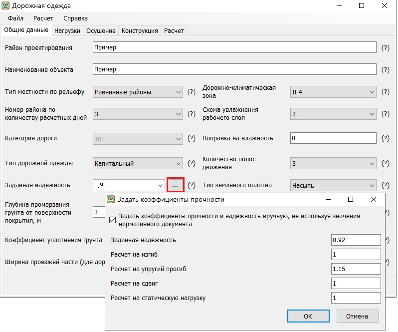

  Задайте параметры и нажмите ОК.

  

  {#542-2021-polotno}

  Возможны следующие варианты:

  * **Насыпь**;
  * **Нулевые места (рабочая отметка меньше 1 м)**;
  * **Выемка**.

  Учитывается в качестве поправки на влажность при определении расчетных характеристик грунта земляного полотна (согласно **ПНСТ 542-2021**, прил. В, формула В.1).

  $$W_p = (\overline{W}_{табл}+Δ + Δ_1 W – Δ_2 W)(1 + V_r t) – Δ_3$$

  где:

  * $W_{табл}$ — среднее многолетнее значение относительной (в долях от влажности на границе текучести) влажности грунта в наиболее неблагоприятный (весенний) период года в рабочем слое земляного полотна, определяемое по таблице В.1 в зависимости от ДКЗ и подзоны (см. рисунок В.1), схемы увлажнения грунта рабочего слоя и типа грунта;
  * $Δ$ — поправка, равная 0,00 – для участков насыпей и 0,03 - для участков дороги, проходящих в выемке или в низкой насыпи с рабочей отметкой менее руководящей отметки для данного типа грунта и типа местности по характеру увлажнения;
  * $Δ_1 W$ — поправка на особенности рельефа территории, принимаемая для равнинных условий - 0,00, предгорных - 0,03, горных - 0,05;
  * $Δ_2 W$ — поправка на конструктивные особенности проезжей части и обочин, определяемая по таблице В.2;
  * $V_r$ — коэффициент вариации, равный 0,10;
  * $t$ — коэффициент нормированного отклонения, принимаемый в зависимости от уровня надежности $K_н$ (см. таблицу В.3);
  * $Δ_3$ — поправка, учитывающая толщину слоев, превышающую 0,75 м, определяемая по рисунку В.2 (в случае если толщина слоев менее 0,75 м, поправка не принимается).

  

  {#542-2021-promerzanie}

  В данном поле задается величина глубины промерзания грунта, считая от поверхности покрытия. Данная величина принимается по данным изысканий или по карте изолиний глубин промерзаний грунтов (согласно **ПНСТ 542-2021**, рис.9).

  #|
  || 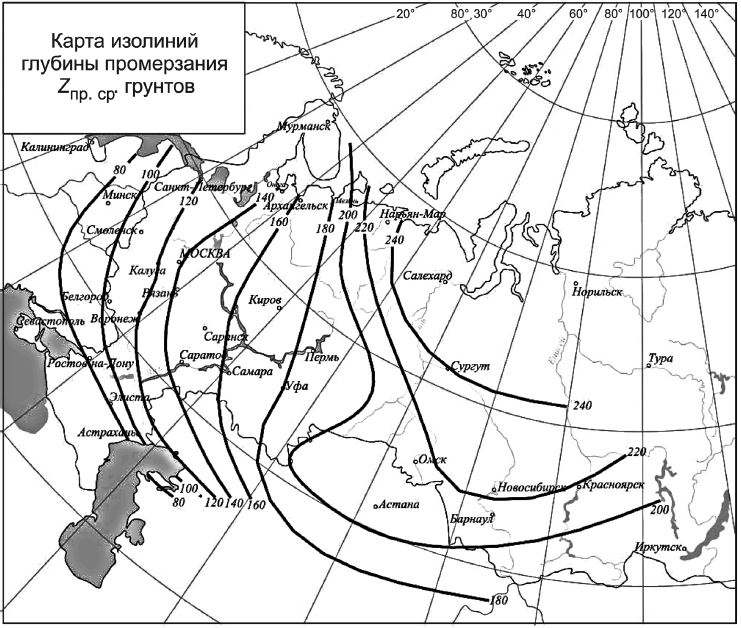 {.cell-align-center}||
  || **Карта изолиний средней глубины промерзания $Z_{пр.ср}$ грунтов** ||
  |#
  
  Учитывается при определении величины возможного морозного пучения (согласно **ПНСТ 542-2021**, рис. 8)

  #|
  || 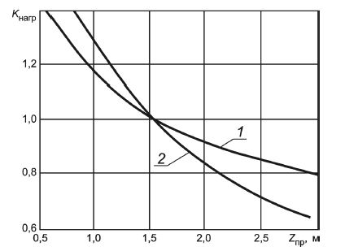 {.cell-align-center}||
  || _1_ — пылеватая супесь, тяжелая пылеватая супесь, легкий и тяжелый суглинок, легкий и тяжелый пылеватый суглинок, глина; _2_ — песок, легкая крупная супесь, легкая супесь 
  
  **Зависимость коэффициента $K_{нагр}$ от глубины промерзания $Z_{пр}$ от поверхности покрытия**||
  |#

  

  {#542-2021-ugv}

  В данном поле задается величина расстояния от низа дорожной одежды до расчетного уровня грунтовой воды или длительно стоящей поверхностной воды, определяемое по данным изысканий. Учитывается при определении величины возможного морозного пучения (согласно **ПНСТ 542-2021**, рис.7).

  #|
  || 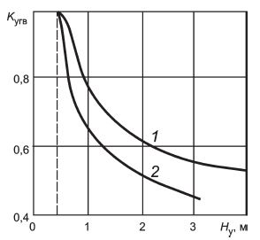 {.cell-align-center}||
  || _1_ — пылеватая супесь, тяжелая пылеватая супесь, легкий и тяжелый суглинок, легкий и тяжелый пылеватый суглинок, глина; _2_ — песок, легкая крупная супесь, легкая супесь. 
  
  **Зависимость коэффициента $K_{угв}$ от расстояния от низа дорожной одежды до расчетного уровня $H_{у}$ (УГВ или УПВ)**||
  |#

  

  {#542-2021-uplotnenie}

  Значение коэффициента уплотнения грунта рабочего слоя земляного полотна выбирается из выпадающего списка. Учитывается при определении величины возможного морозного пучения (согласно **ПНСТ 542-2021**, табл. 11).

  #|
  || **Коэффициент уплотнения $К_{упл}$** {.cell-align-center} | **$К_{пл}$ для грунта** {.cell-align-center} | > ||
  || ^ | **пылеватого песка, легкой супеси, пылеватой супеси, тяжелой пылеватой супеси, легкого и тяжелого суглинка, легкого и тяжелого пылеватого суглинка, глины** | **легкой крупной супеси, песка** {.cell-align-center}||
  || 1 {.cell-align-center} | 2 {.cell-align-center} | 3 {.cell-align-center} ||
  || 1,03 - 1,00 {.cell-align-center} | 0,8 {.cell-align-center} | 1,0 {.cell-align-center} ||
  || 1,01 - 0,98 {.cell-align-center} | 1,0 {.cell-align-center} | 1,0 {.cell-align-center} ||
  || 0,97 - 0,95 {.cell-align-center} | 1,2 {.cell-align-center} | 1,1 {.cell-align-center} ||
  || 0,94 - 0,90 {.cell-align-center} | 1,3 {.cell-align-center} | 1,2 {.cell-align-center} ||
  || Св. 0,90 {.cell-align-center} | 1,5 {.cell-align-center} | 1,3 {.cell-align-center} ||
  |#

  

  {#542-2021-shirina}

  Для дренирующего слоя, работающего по принципу осушения, толщину слоя, полностью насыщенного водой, $h_{нас}$ устанавливают в зависимости от длины пути фильтрации $L$ и расчетной величины притока воды $q_p$.
  
  Для мелких песков, средней крупности и крупных с коэффициентом фильтрации менее 10 м/сут расчет выполняют по номограмме (Согласно **ПНСТ 542-2021**. рис. 14).

  #|
  ||  {.cell-align-center}||
  || $i$ — поперечный уклон низа дренирующего слоя; $L$ — длина пути фильтрации; $q'$ — погонный приток воды; $К_ф$ — коэффициент фильтрации песка, м/сут 
  
  **Номограмма для расчета толщины дренирующего слоя, полностью насыщенного водой, $h_{нас}$ из мелких песков, песков средней крупности и крупных песков с коэффициентом фильтрации менее 10 м/сут**||
  |#

  Для крупных песков с коэффициентом фильтрации более 10 м/сут толщину дренирующего слоя, полностью насыщенного водой, $h_{нас}$ определяют по рисунку 15

  #|
  ||  {.cell-align-center}||
  || $i$ — поперечный уклон низа дренирующего слоя; $L$ — длина пути фильтрации; $q_p$ — расчетный объем притока воды, м3/м² в сутки; $К_ф$ — коэффициент фильтрации песка, м/сут 
  
  **Номограмма для расчета толщины дренирующего слоя, полностью насыщенного водой, $h_{нас}$ из крупных песков с коэффициентом фильтрации более 10 м/сут**||
  |#

  

- ПНСТ 265-2018 {#pnst-265-2018}

  

  На вкладке **Общие данные** задаются основные параметры дороги, а также характеристики района ее проектирования.

  {#265-2018-raion}

  В данном поле вводится название района проектируемого объекта. Его заполнение не является обязательным, т.к. не влияет на результат расчета, а лишь заносится в названия выходных документов и ведомостей.

  

  {#265-2018-obekt}

  В данном поле задается название объекта (участка) рассчитываемой дорожной одежды. Его заполнение также не является обязательным.

  

  {#265-2018-relef}

  Возможны следующие типы местности по рельефу:

  * **Равнинные районы;**
  * **Предгорные районы (до 1000 м над у.м.);**
  * **Горные районы (более 1000 м над у.м.)**

  Учитывается в качестве первой поправки на влажность при определении расчетных характеристик грунта земляного полотна (согласно **ПНСТ 265-2018**, прил. А, формула A.1).

  $$W_p = (\overline{W}_{табл}+Δ + Δ_1 W – Δ_2 W)(1 + V_r t) – Δ_3,$$

  где:

  * $W_{табл}$ — среднее многолетнее значение относительной (в долях от влажности на границе текучести) влажности грунта в наиболее неблагоприятный (весенний) период года в рабочем слое земляного полотна, определяемое по таблице А.2 в зависимости от дорожно-климатической зоны и подзоны (см. рисунок А.1), схемы увлажнения грунта рабочего слоя и типа грунта;
  * $Δ$ — поправка, равная 0,00, для участков насыпей и 0,03 — для участков дороги, проходящих в выемке или в низкой насыпи с рабочей отметкой менее руководящей отметки для данного типа грунта и типа местности по характеру увлажнения;
  * $Δ_1W$ — поправка на особенности рельефа территории;

  #|
  || **№ п/п** | **Тип местности по рельефу** | **Поправка $Δ_1W$** ||
  || 1 {.cell-align-center} | 2 {.cell-align-center} | 3 {.cell-align-center} ||
  || 1 {.cell-align-center} | Равнинные районы | 0,00 {.cell-align-center} ||
  || 2 {.cell-align-center} | Предгорные районы (до 1000 м в.у.м.) | 0,03 {.cell-align-center} ||
  || 3 {.cell-align-center} | Горные районы (более 1000 м в.у.м.) | 0.05 {.cell-align-center}||
  |#

  * $Δ_2 W$ — поправка на конструктивные особенности проезжей части и обочин, определяемая по таблице А.3;
  * $V_r$ — коэффициент вариации, равный 0,10;
  * $t$ — коэффициент нормированного отклонения, принимаемый в зависимости от уровня надежности $K\_н$ (см. таблицу А.4);
  * $Δ_3$ — поправка, учитывающая толщину слоев, превышающую 0,75 м, определяемая по рисунку А.2.

  

  {#265-2018-klimat}

  Выбор дорожно - климатической зоны осуществляется по карте ( **ПНСТ 265-2018**, прил. А, рис. A.1).
  
  **Дорожно-климатические зоны и подзоны Российской Федерации**
  
  
  
   - Границы дорожно-климатических зон; 
   - Границы дорожно-климатических подзон
  
  
  
  1. Кубань и западную часть Северного Кавказа следует относить к III ДКЗ, Крым — IV ДКЗ.
  2. При проектировании участков дорог в приграничных зонах при обосновании данных о грунтово-гидрологических и почвенных условиях, а также исходя из практики эксплуатации дорог в районе, допускается принимать проектные решения как для смежной (северной или южной) зоны.
  3. В горных районах дорожно-климатические зоны следует определять с учетом высотного расположения объектов проектирования, принимая во внимание природные условия на данной высоте.
  
  

  

  {#265-2018-raschetnye-dni}

  Принимается согласно **ПНСТ 265-2018** , табл.7 или рис.1. Используется при определении суммарного числа приложений расчетной нагрузки, к точке на поверхности конструкции, за срок ее службы.

  #|
  || **Номера районов на карте** {.cell-align-center} | **Географические границы районов** {.cell-align-center} | **Рекомендуемое количество расчётных дней в году ($Т_{РДГ}$)** {.cell-align-center} ||
  || 1 {.cell-align-center} | 2 {.cell-align-center} | 3 {.cell-align-center} ||
  || 1 {.cell-align-center} | Зона распространения вечномёрзлых грунтов севернее семидесятой параллели | 70 {.cell-align-center} ||
  || 2 {.cell-align-center} | Севернее линии, соединяющей Онегу - Архангельск - Мезень - Нарьян-Мар - шестидесятый меридиан - до побережья Европейской части | 145 {.cell-align-center} ||
  || 3 {.cell-align-center} | Севернее линии, соединяющей Смоленск - Калугу - Рязань - Саранск - сорок восьмой меридиан - до линии, соединяющей Онегу - Архангельск - Мезень - Нарьян-Мар | 125 {.cell-align-center} ||
  || 4 {.cell-align-center} | Севернее линии, соединяющей Белгород - Воронеж - Саратов - Самару - Оренбург - шестидесятый меридиан до линии районов 2 и 3 | 135 {.cell-align-center} ||
  || 5 {.cell-align-center} | Севернее линии, соединяющей Ростов-на-Дону - Элисту - Астрахань - Белгород - Воронеж - Саратов - Самара | 145 {.cell-align-center} ||
  || 6 {.cell-align-center} | Южнее линии Ростов-на-Дону - Элиста - Астрахань для Европейской части, южнее сорок шестой параллели для остальных территорий | 205 {.cell-align-center} ||
  || 7 {.cell-align-center} | Восточная и Западная Сибирь, Дальний Восток (кроме Хабаровского и Приморского краев, Камчатской области), ограниченные с севера семидесятой параллелью, с юга сорок шестой параллелью | 130-150 (меньшие значения для центральной части) {.cell-align-center} ||
  || 8 {.cell-align-center}| Хабаровский и Приморский края, Камчатская область | 140 {.cell-align-center} ||
  |#

  

  Значения величины $Т_{РДГ}$ на границах районов следует принимать по наибольшему из значений.

  

  Карта районирования по количеству расчетных дней в году, $Т_{РДГ}$

  

  

  {#265-2018-uvlazhnenie}

  Принимается согласно **ПНСТ 265-2018**, табл. 18. Учитывается при определении расчетной влажности грунта земляного полотна (прил. А, формула A.1).

  Возможны следующие схемы увлажнения:

  1 – **сухие места** (источники увлажнения- атмосферные осадки);
  2 – **сырые места с избыточным увлажнением в отдельные периоды года** (источники увлажнения - кратковременно стоящие (до 30 сут) поверхностные воды, атмосферные осадки);
  3 – **мокрые места с постоянным избыточным увлажнением** (источники увлажнения- грунтовые или длительно стоящие (более 30 сут) поверхностные воды, атмосферные осадки).

  #|
  || **Схема увлажнения рабочего слоя** {.cell-align-center} | **Источники увлажнения** {.cell-align-center} | **Условия отнесения к данному типу увлажнения** {.cell-align-center} ||
  || 1 {.cell-align-center} | 2 {.cell-align-center} | 3 {.cell-align-center} ||
  || 1 {.cell-align-center} | Атмосферные осадки | Для насыпей на участках 1-го типа местности по условиям увлажнения. ||
  || ^ | ^ | Для насыпей на участках местности 2-го и 3-го типов по условиям увлажнения при возвышении поверхности покрытия над расчетным уровнем грунтовых и поверхностных вод или над поверхностью земли, более чем в 1,5 раза превышающем требования таблицы 17 ||
  || ^ | ^ | Для насыпей на участках 2-го типа при расстоянии от уреза поверхностной воды (отсутствующей не менее 2/3 летнего периода) более 5 - 10 м. при супесях; 2 - 5 м. при легких пылеватых суглинках и 2 м. при тяжелых пылеватых суглинках и глинах (меньшие значения следует принимать для грунтов с большим числом пластичности; при залегании различных грунтов - принимать большие значения). ||
  || ^ | ^ | В выемках в песчаных и глинистых грунтах при уклонах кюветов более 20 %о (в I - III дорожно-климатических зонах) и при возвышении поверхности покрытия над расчетным горизонтом грунтовых вод более чем в 1,5 раза превышающем требования таблицы 17. ||
  || ^ | ^ | При применении специальных методов регулирования водно-теплового режима (капиляропрерывающие, гидроизолирующие, теплоизолирующие и армирующие прослойки, дренаж и т.п.), назначаемых по специальным расчетам. ||
  || 2 {.cell-align-center} | Кратковременно стоящие (до 30 сут.) поверхностные воды, атмосферные осадки | Для насыпей на участках 2-го типа местности по условиям увлажнения при возвышении поверхности покрытия не менее требуемого по таблице 16 и не более чем в 1,5 раза превышающем эти требования и при крутизне откосов не менее 1:1,5 и простом (без берм) поперечном профиле насыпи. ||
  || ^ | ^ | Для насыпей на участках 3-го типа местности при применении специальных мероприятий по защите от грунтовых вод (капилляропрерывающие слои и гидроизолирующие слои, дренаж), назначаемых по специальным расчетам, отсутствии длительно (более 30 сут) стоящих поверхностных вод и выполнении условий предыдущего абзаца. В выемках в песчаных и глинистых грунтах при уклонах кюветов менее 20 % (в I, II Д.К.зонах) и возвышении поверхности покрытия над расчетным уровнем грунтовых вод более чем в 1,5 рази превышающем требования таблицы 17 ||
  || 3 {.cell-align-center} | Грунтовые или длительно (более 30 сут.) стоящие поверхностные воды; атмосферные осадки | Для насыпей на участках 3-го типа местности по условиям увлажнения при возвышении поверхности покрытия, отвечающем требованиям таблицы 17, но не превышающем их более чем в 1,5 раза. То же, для выемок, в основании которых имеется уровень грунтовых вод, расположение которого по глубине не превышает требований таблицы 17 более чем в 1,5 раза ||
  |#

  

  {#265-2018-kategoriya}

  Принимается от 1 до 5 по заданию на проектирование.

  

  {#265-2018-vlazhnost}

  Принимается согласно **ПНСТ 265-2018**, (прил. А, табл. A.3).

  #|
  || **Конструктивная особенность** {.cell-align-center} | **Поправка $Δ_2W$ в дорожно-климатических зонах** {.cell-align-center} |>|>|>||
  || ^ | II {.cell-align-center}| III {.cell-align-center}| IV {.cell-align-center}| V {.cell-align-center}||
  || Устройство гидроизолирующих прослоек из полимерных материалов | 0,05 {.cell-align-center} | 0,05 {.cell-align-center} | 0,03 {.cell-align-center} | 0,03 {.cell-align-center} ||
  || Устройство теплоизолирующего слоя, предотвращающего промерзание | Снижение расчетной влажности до полной влагоемкости при требуемом $К_{упл}$грунта |>|>|>||
  || Грунт рабочего слоя земляного полотна в «обойме» | Снижение расчетной влажности до оптимальной |>|>|>||
  || Грунт рабочего слоя, уплотненный до значения коэффициента уплотнения от более 1,00 в слое толщиной от 0,3 до 0,5 м от низа дорожной одежды, если он расположен ниже границы промерзания | - {.cell-align-center} | 0,03 {.cell-align-center} | 0,03 {.cell-align-center} | 0,03 {.cell-align-center} ||
  |#

  Учитывается в качестве второй поправки на влажность при определении расчетных характеристик грунта земляного полотна (прил. А, формула A.1) .

  

  {#265-2018-odezhda}

  Возможны следующие варианты (согласно **ПНСТ 265-2018**, табл. 1):

  * **Капитальный**;
  * **Облегченный**;
  * **Переходный**.

  #|
  || **Типы дорожных одежд** | **Виды покрытий, материал и способы его укладки** {.cell-align-center} ||
  || 1 {.cell-align-center} | 2 {.cell-align-center} ||
  || Усовершенствованные покрытия {.cell-align-center} |>||
  || Капитальные | Из асфальтобетонных смесей, в том числе щебеночно-мастичных ||
  || Облегченные | Из органоминеральных смесей ||
  || ^ | Из щебеночных (гравийных) материалов, обработанных органическим вяжущим ||
  || Покрытия переходные {.cell-align-center}|>||
  || Переходные | Из щебеночно-гравийно-песчаных смесей ||
  || ^ | Из грунтов и малопрочных каменных материалов, укрепленных вяжущими ||
  || ^ | Из грунтов, укрепленных различными вяжущими и местными материалами ||
  || ^ | Из булыжного и колотого камня (мостовые) ||
  |#

  

  Дорожные одежды низшего типа конструируются и рассчитываются в соответствии с нормативными документами, регламентирующими проектирование дорожных одежд с низкой интенсивностью движения. 

  

  

  {#265-2018-polosy}

  Принимается согласно заданию на проектирование.

  В зависимости от количества полос движения назначается коэффициент полостности (согласно **ПНСТ 265-2018**, табл. 4)

  #|
  || **Число полос движения** | **Коэффициент распределения интенсивности движения для самой нагруженной полосы движения $f_{пол}$** ||
  || 1 {.cell-align-center} | 1,00 {.cell-align-center} ||
  || 2 {.cell-align-center} | 0,55 {.cell-align-center} ||
  || 3 {.cell-align-center} | 0,50 {.cell-align-center} ||
  || 4 {.cell-align-center} | 0,45 {.cell-align-center} ||
  || 5 {.cell-align-center} | 0,40 {.cell-align-center} ||
  || 6 и более {.cell-align-center} | 0.35 {.cell-align-center} ||
  |#

  

  На перекрестках и подходах к ним (в местах перестройки потока автомобилей для выполнения левых поворотов и др.) при расчете одежды в пределах всех полос движения следует принимать $f_{пол}$ = 0,50, если общее число полос проезжей части проектируемой дороги более трех.

  

  Данный коэффициент учитывается при определении приведенной интенсивности движения к воздействию расчетной нагрузки на полосу двиижения на конец межремонтного срока проведения работ по капитальному ремонту (формула 3).

  

  {#265-2018-nadezhnost}

  Требуемый уровень надежности указан в задании на проектирование в зависимости от категории дороги и типа дорожных одежд или выбирается согласно **ПНСТ 265-2018**, табл.10.

  #|
  || **Категория дороги** | **Тип дорожных одежд** | **Коэффициент надежности $K_н$** ||
  || IА, IБ, IВ {.cell-align-center} | Капитальный | 0.98 {.cell-align-center} ||
  || II {.cell-align-center} | Капитальный | 0.95 {.cell-align-center} ||
  || III {.cell-align-center} | Капитальный | 0,92 {.cell-align-center} ||
  || ^ | Облегченный | 0.90 {.cell-align-center} ||
  || IV {.cell-align-center} | Капитальный | 0,90 {.cell-align-center} ||
  || ^ | Облегченный | 0.85 {.cell-align-center} ||
  || ^ | Переходный | 0.82 {.cell-align-center} ||
  || V {.cell-align-center} | Облегченный | 0.82 {.cell-align-center} ||
  || ^ | Переходный | 0.65 {.cell-align-center} ||
  |#

  

  {#265-2018-polotno}

  Возможны следующие варианты:

  * **Насыпь**;
  * **Нулевые места (рабочая отметка меньше 1 м)**;
  * **Выемка**.

  Учитывается в качестве поправки на влажность при определении расчетных характеристик грунта земляного полотна (согласно **ПНСТ 265-2018**, прил. А, формула A.1).

  $$W_p = (\overline{W}_{табл}+Δ + Δ_1 W – Δ_2 W)(1 + V_r t) – Δ_3$$

  где:

  * $W_{табл}$ — среднее многолетнее значение относительной (в долях от влажности на границе текучести) влажности грунта в наиболее неблагоприятный (весенний) период года в рабочем слое земляного полотна, определяемое по таблице А.2 в зависимости от дорожно-климатической зоны и подзоны (см. рисунок А.1), схемы увлажнения грунта рабочего слоя и типа грунта;
  * $Δ$ — поправка, равная 0,00, для участков насыпей и 0,03 — для участков дороги, проходящих в выемке или в низкой насыпи с рабочей отметкой менее руководящей отметки для данного типа грунта и типа местности по характеру увлажнения;
  * $Δ_1 W$ — поправка на особенности рельефа территории, принимаемая для равнинных условий 0,00, предгорных — 0,03, горных — 0,05;
  * $Δ_2 W$ — поправка на конструктивные особенности проезжей части и обочин, определяемая по таблице А.3;
  * $V_r$ — коэффициент вариации, равный 0,10;
  * $t$ — коэффициент нормированного отклонения, принимаемый в зависимости от уровня надежности Kн (см. таблицу А.4);
  * $Δ_3$ — поправка, учитывающая толщину слоев, превышающую 0,75 м, определяемая по рисунку А.2.

  

  {#265-2018-promerzanie}

  В данном поле задается величина глубины промерзания грунта, считая от поверхности покрытия. Данная величина принимается по данным изысканий или по карте изолиний глубин промерзаний грунтов (согласно **ПНСТ 265-2018**, рис.14).

  #|
  ||  {.cell-align-center}||
  || **Карта изолиний средней глубины промерзания $Z_{пр.ср}$ грунтов** ||
  |#
 
  Учитывается при определении величины возможного морозного пучения (согласно ПНСТ 265-2018, рис. 13)

  #|
  ||  {.cell-align-center}||
  || _1_ — пылеватая супесь, тяжелая пылеватая супесь, легкий и тяжелый суглинок, легкий и тяжелый пылеватый суглинок, глина; _2_ — песок, легкая крупная супесь, легкая супесь 
  
  **Зависимость коэффициента Kнагр от глубины промерзания $Z_{пр}$ от поверхности покрытия**||
  |#

  

  {#265-2018-ugv}

  В данном поле задается величина расстояния от низа дорожной одежды до расчетного уровня грунтовой воды или длительно стоящей поверхностной воды, определяемое по данным изысканий. Учитывается при определении величины возможного морозного пучения (согласно **ПНСТ 265-2018**, рис.12).

  #|
  ||  {.cell-align-center}||
  || _1_ — пылеватая супесь, тяжелая пылеватая супесь, легкий и тяжелый суглинок, легкий и тяжелый пылеватый суглинок, глина; _2_ — песок, легкая крупная супесь, легкая супесь. 
  
  **Зависимость коэффициента $K_{угв}$ от расстояния от низа дорожной одежды до расчетного УГВ или УПВ**||
  |#

  

  {#265-2018-uplotnenie}

  Значение коэффициента уплотнения грунта рабочего слоя земляного полотна выбирается из выпадающего списка. Учитывается при определении величины возможного морозного пучения (согласно **ПНСТ 265-2018**, табл. 19.).

  #|
  || **Коэффициент уплотнения $К_{упл}$** {.cell-align-center} | **$К_{пл}$ для грунта** {.cell-align-center} |>||
  || ^ | **пылеватого песка, легкой супеси, пылеватой супеси, тяжелой пылеватой супеси, легкого и тяжелого суглинка, легкого и тяжелого пылеватого суглинка, глины** | **легкой крупной супеси, песка** ||
  || 1 {.cell-align-center} | 2 {.cell-align-center} | 3 {.cell-align-center} ||
  || 1,03 - 1,00 {.cell-align-center} | 0,8 {.cell-align-center} | 1,0 {.cell-align-center} ||
  || 1,01 - 0,98 {.cell-align-center} | 1,0 {.cell-align-center} | 1,0 {.cell-align-center} ||
  || 0,97 - 0,95 {.cell-align-center} | 1,2 {.cell-align-center} | 1,1 {.cell-align-center} ||
  || 0,94 - 0,90 {.cell-align-center} | 1,3 {.cell-align-center} | 1,2 {.cell-align-center} ||
  || Св. 0,90 {.cell-align-center} | 1,5 {.cell-align-center} | 1,3 {.cell-align-center} ||
  |#

  

  {#265-2018-shirina}

  Для дренирующего слоя, работающего по принципу осушения, толщину слоя, полностью насыщенного водой, $h_{нас}$ устанавливают в зависимости от длины пути фильтрации $L$ и расчетной величины притока воды $q_p$.

  Для мелких песков, средней крупности и крупных с коэффициентом фильтрации менее 10 м/сут расчет выполняют по номограмме (Согласно **ПНСТ 265-2018**. рис. 19).

  #|
  ||  {.cell-align-center}||
  || $i$ — поперечный уклон низа дренирующего слоя; $L$ — длина пути фильтрации; $q'$ — погонный приток воды; $К_ф$ — коэффициент фильтрации песка, м/сут 
  
  **Номограмма для расчета толщины дренирующего слоя, полностью насыщенного водой, $h_{нас}$ из мелких песков, песков средней крупности и крупных песков с коэффициентом фильтрации менее 10 м/сут**||
  |#

  Для крупных песков с коэффициентом фильтрации более 10 м/сут толщину дренирующего слоя, полностью насыщенного водой, $h_{нас}$ определяют по рисунку 20

  #|
  ||  {.cell-align-center}||
  || $i$ — поперечный уклон низа дренирующего слоя; $L$ — длина пути фильтрации; $q_p$ — расчетный объем притока воды, м3/м² в сутки; $К_ф$ — коэффициент фильтрации песка, м/сут 
  
  **Номограмма для расчета толщины дренирующего слоя, полностью насыщенного водой, $h_{нас}$ из крупных песков с коэффициентом фильтрации более 10 м/сут**||
  |#

  

- ОДН 218.046-01, МР (взамен ВСН 197-91) {#odn-218-046-01}

  

  На вкладке **Общие данные** задаются основные параметры дороги, а также характеристики района ее проектирования.

  {#218-046-01-raion}

  В данном поле вводится название района проектируемого объекта. Его заполнение не является обязательным, т.к. не влияет на результат расчета, а лишь заносится в названия выходных документов и ведомостей.

  

  {#218-046-01-obekt}

  В данном поле задается название объекта (участка) рассчитываемой дорожной одежды. Его заполнение также не является обязательным.

  

  {#218-046-01-raschet}

  Выбирается из выпадающего списка. Возможны следующие варианты расчета:

  * **Дорожная одежда**: при выборе данного типа будет произведен расчет дорожной одежды основного покрытия дороги с использованием **ОДН 218.046-01** или **МР**, в зависимости от типа ее верхних конструктивных слоев;
  * **Краевая полоса обочины**: при выборе данного типа будет произведен расчет краевой полосы обочины с использованием положения расчетной методики **ОДН 218.3.039- 2003**;
  * **Укрепленная (остановочная) полоса обочины**: при выборе данного типа будет произведен расчет остановочной полосы обочины с использованием положения расчетной методики **ОДН 218.3.039-2003**.

  

  В зависимости от выбранного Типа покрытия используются соответствующие конструктивные слои дорожной одежды и выбирается соответствующая методика расчета.

  

  

  {#218-046-01-klimat}

  Выбор дорожно-климатической зоны осуществляется по карте (**ОДН 218.046-01**, приложение 2, рис. П 2.2) или принимается по таблице (приложение 2, табл. П 2.7).
  
  **Карта дорожно-климатических зон и подзон**
  
  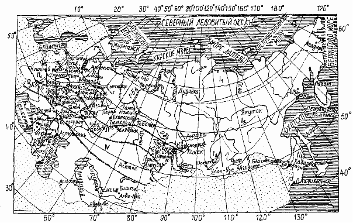
  
   - Границы дорожно-климатических зон; 
   - Границы дорожно-климатических подзон
  
  #|
  || **Дорожно-климатическая зона и подзона** {.cell-align-center}| **Примерные географические границы** {.cell-align-center}||
  || 1  {.cell-align-center}| 2 {.cell-align-center}||
  || I  {.cell-align-center}| Севернее линии, соединяющей Нивский - Сосновку - Новый Бор - Щельябож - Сыню - Суеватпуль - Белоярский - Ларьяк - Усть-Озерное - Ярцево - Канск - Выезжий Лог -Усть - Золотую - Сарыч - Сеп - Новоселово - Иню - Артыбаш - государственную границу - Симоново - Биробиджан - Болонь - Многовершиный. Включает географические зоны тундры, лесотундры и северо-восточную часть лесной зоны с распространением вечномерзлых грунтов ||
  || I1 {.cell-align-center}| Расположена севернее линии Нарьян-Мар - Салехард - Курейка - Трубка Удачная - Верхоянск - Дружина - Горный Мыс - Марково ||
  || I2 {.cell-align-center}| Расположена восточнее линии устье р. Нижней Тунгуски - Ербогачен, Ленск - Бодайбо - Богдарин и севернее линии Могоча - Сковородино - Зая - Охотск - Палатка - Слаутсткое. Ограничена с севера I1 подзоной ||
  || II {.cell-align-center}| От границы I зоны до линии, соединяющей Львов - Житомир - Тулу - Н. Новгород - Ижевск - Томск - Канск. На Дальнем Востоке от границы I зоны до государственной границы. Включает географическую зону лесов с избыточным увлажнением грунтов ||
  || II1 {.cell-align-center}| С севера и востока ограничена I зоной, с запада - подзоной II3, с юга - линией Рославль - Клин - Рыбинск - Березники - Ивдель ||
  || II2 {.cell-align-center}| Ограничена с севера подзоной II1, с запада - подзоной II4, с юга - III зоной, с востока и южной границей I зоны ||
  || II3 {.cell-align-center}| С севера ограничена государственной границей, с запада -границей с подзоной II5, с юга - линией Рославль - Клин -Рыбинск, с востока - линией Псков - Смоленск - Орел ||
  || II4 {.cell-align-center}| Ограничена с севера подзоной Из, с запада - подзоной II6, с юга - границей с III зоной, с востока - линией Смоленск - Орел - Воронеж ||
  || II5 {.cell-align-center}| С севера и запада ограничена государственной границей, с востока - линией Минск - Бобруйск - Гомель, с юга - линией Барановичи - Рославль - Клин - Рыбинск ||
  || II6 {.cell-align-center}| С севера ограничена подзоной II5, с запада - государственной границей, с юга - границей с III зоной, с востока - линией Минск - Бобруйск - Гомель ||
  || III {.cell-align-center}| От южной границы II зоны до линии, соединяющей Кишинев - Кировоград - Белгород - Самару - Магнитогорск - Омск - Бийск - Туран. Включает лесостепную географическую зону со значительным увлажнением грунтов в отдельные годы ||
  || III1 {.cell-align-center}| Ограничена с севера зоной II, с запада - подзоной III2, с юга - IV зоной, с востока - I зоной ||
  || III2 {.cell-align-center}| Ограничена с севера зоной II, с запада - подзоной III3, с юга - зоной IV, с востока - линией Смоленск - Орел - Воронеж ||
  || III3 {.cell-align-center}| Ограничена с севера зоной II, с запада - государственной границей, с юга - зоной IV, с востока - линией Бобруйск - Гомель - Харьков ||
  || IV {.cell-align-center}| Расположена от границы III зоны до линии, соединяющей Джульфу - Степанакерт - Кизляр - Волгоград и далее проходит южнее на 200 км линии, соединяющей Уральск - Актюбинск - Караганду. Включает географическую степную зону с недостаточным увлажнением грунтов ||
  || V {.cell-align-center}| Расположена к юго-западу и югу от границы IV зоны и включает пустынную и пустынно-степную географические зоны с засушливым климатом и распространением засоленных грунтов ||
  |#

  

  {#218-046-01-relef}

  Принимается согласно **ОДН 218.046-01**, приложение 2, табл. П.2.2. Учитывается в качестве первой поправки на влажность при определении расчетных характеристик грунта земляного полотна.

  Возможны следующие типы местности по рельефу:

  * **Равнинные районы**;
  * **Предгорные районы (до 1000 м над у.м.)**;
  * **Горные районы (более 1000 м над у.м.)**.

  #|
  || **№ п/п** {.cell-align-center}| **Тип местности по рельефу** {.cell-align-center}| **Поправка $Δ_1\overline{W}$** {.cell-align-center}||
  || 1 {.cell-align-center}| 2 {.cell-align-center}| 3 {.cell-align-center}||
  || 1 {.cell-align-center}| Равнинные районы | 0,00 {.cell-align-center}||
  || 2 {.cell-align-center}| Предгорные районы (до 1000 м в.у.м.) | 0,03 {.cell-align-center}||
  || 3 {.cell-align-center}| Горные районы (более 1000 м в.у.м.) | 0.05 {.cell-align-center}||
  |#

  

  {#218-046-01-uvlazhnenie}

  Принимается согласно **ОДН 218.046-01**, табл. 5.1. Учитывается при определении расчетной влажности грунта земляного полотна.

  Возможны следующие схемы увлажнения:

  * 1 – **сухие места** (источники увлажнения - атмосферные осадки);
  * 2 – **сырые места с избыточным увлажнением в отдельные периоды года** (источники увлажнения - кратковременно стоящие (до 30 сут) поверхностные воды, атмосферные осадки);
  * 3 – **мокрые места с постоянным избыточным увлажнением** (источники увлажнения - грунтовые или длительно стоящие (болеее 30 сут) поверхностные воды, атмосферные осадки).

  #|
  || **Схема увлажнения рабочего слоя** {.cell-align-center}| **Источники увлажнения** {.cell-align-center}| **Условия отнесения к данному типу увлажнения** {.cell-align-center}||
  || 1 {.cell-align-center}| 2 {.cell-align-center}| 3 {.cell-align-center}||
  || 1 {.cell-align-center}| Атмосферные осадки | Для насыпей на участках 1-го типа местности по условиям увлажнения. ||
  ||^|^| Для насыпей на участках местности 2-го и 3-го типов по условиям увлажнения, при возвышении поверхности покрытия над расчетным уровнем грунтовых и поверхностных вод или над поверхностью земли, более чем в 1,5 раза превышающем требования табл. 5.2. ||
  ||^|^| Для насыпей на участках 2-го типа, при расстоянии от уреза поверхностной воды (отсутствующей не менее 2/3 летнего периода) более 5 - 10 м. при супесях; 2 - 5 м. при легких пылеватых суглинках и 2 м. при тяжелых пылеватых суглинках и глинах (меньшие значения следует принимать для грунтов с большим числом пластичности; при залегании различных грунтов - принимать большие значения). ||
  ||^|^| В выемках в песчаных и глинистых грунтах, при уклонах кюветов более 20 %о (в I - III дорожно-климатических зонах) и при возвышении поверхности покрытия над расчетным горизонтом грунтовых вод, более чем в 1,5 раза превышающем требования табл. 5.2. При применении специальных методов регулирования водно-теплового режима (капилляропрерывающего, гидроизолирующего, теплоизолирующего; армирующих прослоек, дренажа и т.п.), назначаемых по специальным расчетам. ||
  || 2 {.cell-align-center}| Кратковременно стоящие (до 30 сут.) поверхностные воды, атмосферные осадки | Для насыпей на участках 2-го типа местности, по условиям увлажнения при возвышении поверхности покрытия не менее требуемого по табл. 5.2 и не более чем в 2 раза превышающем эти требования, при крутизне откосов не менее 1:1,5 и простом (без берм) поперечном профиле насыпи. ||
  ||^|^| Для насыпей на участках 3-го типа местности, при применении специальных мероприятий по защите от грунтовых вод (капилляропрерывающие слои, дренаж), назначаемых по специальным расчетам, отсутствии длительно (более 30 сут) стоящих поверхностных вод и выполнении условий предыдущего абзаца. В выемках в песчаных и глинистых грунтах, при уклонах кюветов менее 20 %о (в I, II .зонах) и возвышении поверхности покрытия над расчетным уровнем грунтовых вод, более чем в 1,5 раза превышающем требования табл. 5.2. ||
  || 3 {.cell-align-center}| Грунтовые или длительно (более 30 сут.) стоящие поверхностные воды; атмосферные осадки | Для насыпей на участках 3-го типа местности по условиям увлажнения, при возвышении поверхности покрытия, отвечающем требованиям табл. 5.2, но не превышающем их более чем в 1,5 раза. То же для выемок, в основании которых имеется уровень грунтовых вод, расположение которого по глубине не превышает требований табл. 5.2 более чем в 1,5 раза ||
  |#

  

  {#218-046-01-raschetnye-dni}

  Принимается согласно **ОДН 218.046-01**, табл. П.6.1. Используется при определении суммарного числа приложений расчетной нагрузки, к точке на поверхности конструкции, за срок ее службы.
  
  **Карта районирования по количеству расчетных дней в году, $Т_{РДГ}$**
  
  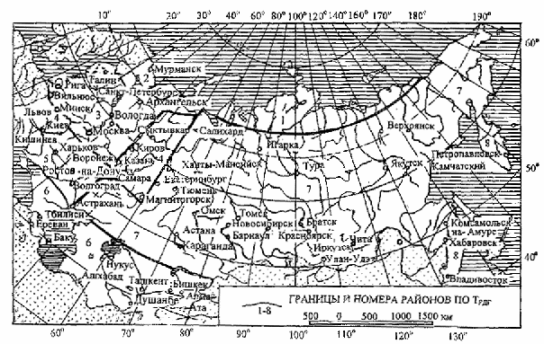
  
  Рекомендуемые значения $Т_{РДГ}$ в зависимости от местоположения дороги
  
  #|
  || **Номера районов на карте** {.cell-align-center}| **Примерные географические границы районов** {.cell-align-center}| **Рекомендуемое количество расчётных дней в году ($Т_{РДГ}$)** {.cell-align-center}||
  || 1 {.cell-align-center}| 2 {.cell-align-center}| 3 {.cell-align-center}||
  || 1 {.cell-align-center}| Зона распространения вечномёрзлых грунтов севернее семидесятой параллели | 70 {.cell-align-center}||
  || 2 {.cell-align-center}| Севернее линии, соединяющей Онегу - Архангельск - Мезень - Нарьян-Мар - шестидесятый меридиан - до побережья Европейской части | 145 {.cell-align-center}||
  || 3 {.cell-align-center}| Севернее линии, соединяющей Минск - Смоленск - Калугу - Рязань - Саранск - сорок восьмой меридиан - до линии, соединяющей Онегу - Архангельск - Мезень - Нарьян-Мар | 125 {.cell-align-center}||
  || 4 {.cell-align-center}| Севернее линии, соединяющей Львов - Киев - Белгород - Воронеж - Саратов - Самару - Оренбург - шестидесятый меридиан до линии районов 2 и 3 | 135 {.cell-align-center}||
  || 5 {.cell-align-center}| Севернее линии, соединяющей Ростов-на-Дону - Элисту - Астрахань до линии Львов - Киев - Белгород - Воронеж - Саратов - Самара | 145 {.cell-align-center}||
  || 6 {.cell-align-center}| Южнее линии Ростов-на-Дону - Элиста - Астрахань для Европейской части, южнее сорок шестой параллели для остальных территорий | 205 {.cell-align-center}||
  || 7 {.cell-align-center}| Восточная и Западная Сибирь, Дальний Восток (кроме Хабаровского и Приморского краев, Камчатской области), ограниченные с севера семидесятой параллелью, с юга сорок шестой параллелью | 130-150 (меньшие значения для центральной части) {.cell-align-center}||
  || 8 {.cell-align-center}| Хабаровский и Приморский края. Камчатская область | 140 {.cell-align-center}||
  |#
  
  
  
  Значения величины $Т_{РДГ}$ на границах районов следует принимать по наибольшему из значений.
  
  

  

  {#218-046-01-vlazhnost}

  Принимается согласно **ОДН 218.046-01**, табл. П.2.3 учитывается в качестве второй поправки на влажность при определении расчетных характеристик грунта земляного полотна.

  Поправка вводится при устройстве следующих мероприятий:

  * Наличия основания из укрепленных материалов и грунтов (при 1-ой схеме увлажнения рабочего слоя);
  * Укрепления обочин асфальтобетоном или щебнем (при 1-ой схеме увлажнения рабочего слоя);
  * Наличия дренажа с продольными дренами;
  * Устройства гидроизолирующих прослоек из полимерных материалов;
  * Устройства теплоизолирующего слоя, предотвращающего промерзание при 2-ой и 3-ей схеме увлажнения рабочего слоя;
  * Устройства грунта активной зоны земляного полотна в обойме;
  * Уплотнения грунта до $К_{упл.}$ = 1,03–1,05 в слое толщиной 0,3–0,5 м. от низа дорожной одежды, расположенном ниже границы промерзания.

  #|
  || **№ п/п** {.cell-align-center}| **Конструктивная особенность** {.cell-align-center}| **Поправка $Δ_2\overline{W}$ в дорожно-климатических зонах** {.cell-align-center}|>|>|>||
  || ^ | ^ | **II** {.cell-align-center}| **III** {.cell-align-center}| **IV** {.cell-align-center}| **V** {.cell-align-center}||
  || 1 {.cell-align-center}| 2 {.cell-align-center}| 3 {.cell-align-center}| 4 {.cell-align-center}| 5 {.cell-align-center}| 6 {.cell-align-center}||
  || 1 {.cell-align-center}| Наличие основания дорожной одежды, включая слои на границе раздела с земляным полотном, из укрепленных материалов и грунтов: |>|>|>|>||
  || ^ | - крупнообломочного грунта и песка | 0,04 {.cell-align-center}| 0,04 {.cell-align-center}| 0,03 {.cell-align-center}| 0,03 {.cell-align-center}||
  || ^ | - супеси | 0,05 {.cell-align-center}| 0,05 {.cell-align-center}| 0,05 {.cell-align-center}| 0,04 {.cell-align-center}||
  || ^ | - пылеватых песков и супесей, суглинка, зологрунта | 0,08 {.cell-align-center}| 0,08 {.cell-align-center}| 0,06 {.cell-align-center}| 0.05 {.cell-align-center}||
  || 2 {.cell-align-center}| Укрепление обочин (не менее 2/3 их ширины): |>|>|>|>||
  || ^ | - асфальтобетоном | 0,05 {.cell-align-center}| 0,04 {.cell-align-center}| 0,03 {.cell-align-center}| 0,02 {.cell-align-center}||
  || ^ | - щебнем (гравием) | 0,02 {.cell-align-center}| 0,02 {.cell-align-center}| 0,02 {.cell-align-center}| 0,02 {.cell-align-center}||
  || 3 {.cell-align-center}| Дренаж с продольными трубчатыми дренами | 0,05 {.cell-align-center}| 0.03 {.cell-align-center}| - {.cell-align-center}| - {.cell-align-center}||
  || 4 {.cell-align-center}| Устройство гидроизолирующих прослоек из полимерных материалов | 0,05 {.cell-align-center}| 0,05 {.cell-align-center}| 0,03 {.cell-align-center}| 0,03 {.cell-align-center}||
  || 5 {.cell-align-center}| Устройство теплоизолирующего слоя, предотвращающего промерзание | Снижение расчетной влажности до величины полной влагоемкости при требуемом $К_{упл.}$ грунта |>|>|>||
  || 6 {.cell-align-center}| Грунт в активной зоне земляного полотна в «обойме» | Снижение расчетной влажности до оптимальной |>|>|>||
  || 7 {.cell-align-center}| Грунт, уплотненный до $К_{упл.}$= 1,03-1,05 в слое 0,3-0,5 м от низа дорожной одежды, расположенный ниже границы промерзания | - {.cell-align-center}| 0,03-0,05 {.cell-align-center}| 0,03-0,05 {.cell-align-center}| 0,03-0,05 {.cell-align-center}||
  |#

  

  Поправки $Δ_2\overline{W}$ при мероприятиях по п.п. 1 и 2 следует принимать только при 1-й схеме увлажнения рабочего слоя, а по п. 5 - при 2-й и 3-й схемах.

  

  

  {#218-046-01-kategoriya}

  Принимается от 1 до 5 категории по заданию на проектирование.

  

  {#218-046-01-polosy}

  Принимается согласно заданию на проектирование:

  * **I категория** – 4 или 6 полос (учитываются только полосы, предназначенные для грузового движения);
  * **II–IV категории** – 2 полосы;
  * **V категория** – 1 полоса.

  В зависимости от количества полос движения назначается коэффициент полосности (согласно **ОДН 218.046-01**, табл. 3.2), учитываемый при определении суммарного расчетного числа приложений расчетной нагрузки, к точке на поверхности конструкции, за срок службы дорожной одежды.

  #|
  || **Число полос движения** {.cell-align-center}| **Значение коэффициента $f_{пол}$ для полосы с номером от обочины** {.cell-align-center}|>|>||
  || ^ | 1 {.cell-align-center}| 2 {.cell-align-center}| 3 {.cell-align-center}||
  || 1 {.cell-align-center}| 1,00 {.cell-align-center}| - {.cell-align-center}| - {.cell-align-center}||
  || 2 {.cell-align-center}| 0,55 {.cell-align-center}| - {.cell-align-center}| - {.cell-align-center}||
  || 3 {.cell-align-center}| 0,50 {.cell-align-center}| 0,50 {.cell-align-center}| - {.cell-align-center}||
  || 4 {.cell-align-center}| 0,35 {.cell-align-center}| 0,20 {.cell-align-center}| - {.cell-align-center}||
  || 6 {.cell-align-center}| 0,30 {.cell-align-center}| 0.20 {.cell-align-center}| 0,05 {.cell-align-center}||
  |# 

  

  {#218-046-01-nomer-polosy}

  * **1**;
  * **2**;
  * **3**.

  Расчет дорожной одежды может выполняться как для крайней правой полосы, считая от обочины (номер полосы – 1), так и для 2-ой или 3-ей полосы. В зависимости от номера полосы назначается коэффициент полосности, учитываемый при определении суммарного расчетного числа приложений расчетной нагрузки к точке на поверхности конструкции за срок службы (согласно **ОДН 218.046-01**, табл. 3.2).

  #|
  || **Число полос движения** {.cell-align-center}| **Значение коэффициента $f_{пол}$ для полосы с номером от обочины**|>|>||
  || ^ | 1 {.cell-align-center}| 2 {.cell-align-center}| 3 {.cell-align-center}||
  || 1 {.cell-align-center}| 1,00 {.cell-align-center}| - {.cell-align-center}| - {.cell-align-center}||
  || 2 {.cell-align-center}| 0,55 {.cell-align-center}| - {.cell-align-center}| - {.cell-align-center}||
  || 3 {.cell-align-center}| 0,50 {.cell-align-center}| 0,50 {.cell-align-center}| - {.cell-align-center}||
  || 4 {.cell-align-center}| 0,35 {.cell-align-center}| 0,20 {.cell-align-center}| - {.cell-align-center}||
  || 6 {.cell-align-center}| 0,30 {.cell-align-center}| 0.20 {.cell-align-center}| 0,05 {.cell-align-center}||
  |#

  

  1. Порядковый номер полосы считается справа по ходу движения в одном направлении.
  2. Для расчета обочин принимают $f_{пол}$ = 0,01.
  3. На многополосных дорогах допускается проектировать одежду переменной толщины по ширине проезжей части, рассчитав дорожную одежду в пределах различных полос в соответствии со значениями $N_p$, найденными по формуле (3.5).
  4. На перекрестках и подходах к ним (в местах перестройки потока автомобилей для выполнения левых поворотов и др.) при расчете одежды в пределах всех полос движения следует принимать $f_{пол}$ = 0,50, если общее число полос проезжей части проектируемой дороги более трех.

  

  

  {#218-046-01-odezhda}

  Возможны следующие варианты (согласно **ОДН 218.046-01**, табл 1.1):

  * **Капитальный**;
  * **Облегченный**;
  * **Переходный**.

  #|
  || **Типы дорожных одежд** | **Виды покрытий, материал и способы его укладки** ||
  || 1 {.cell-align-center}| 2 {.cell-align-center}||
  || Усовершенствованные покрытия {.cell-align-center}|>||
  || Капитальные | из горячих асфальтобетонных смесей ||
  || Облегченные | а. из горячих асфальтобетонных смесей ||
  || ^ | б. из холодных асфальтобетонных смесей ||
  || ^ | в. из органоминеральных смесей с жидкими, органическими, вяжущими; с жидкими, органическими, вяжущими совместно с минеральными; с вязкими, в том числе эмульгированными, органическими, вяжущими; с эмульгированными, органическими, вяжущими совместно с минеральными; из каменных материалов и грунтов, обработанных методами пропитки или битумом по способу смешения на дороге; из каменных материалов, обработанных органическими, вяжущими методами пропитки; черного щебня, приготовленного в установке и уложенного по способу заклинки; из пористой и высокопористой асфальтобетонной смеси с поверхностной обработкой; из прочного щебня с двойной поверхностной обработкой ||
  || Покрытия переходные {.cell-align-center}|>||
  || Переходные | из щебня прочных пород, устроенные по способу заклинки без применения вяжущих материалов; из фунтов и малопрочных каменных материалов, укрепленных вяжущими; булыжного и колотого камня (мостовые) ||
  || Низшие | из щебеночно-гравийно-песчаных смесей; малопрочных каменных материалов и шлаков; грунтов, укрепленных или улучшенных различными местными материалами; древесных материалов и др. ||
  |#

  

  Если необходимо выполнить расчет для дорожной одежды низшего типа, то в данном поле следует выбрать тип **Переходный**. 

  

  

  {#218-046-01-nadezhnost}

  Требуемый уровень надежности указан в задании на проектирование или выбирается по таблице (**ОДН 218.046-01**, табл. 3.1).
 
  #|
  || **Тип дорожной одежды** {.cell-align-center}|>| **Капитальный** {.cell-align-center}|>|>|>|>|>|>|>|>|>|>||
  || Категория дороги |>| I {.cell-align-center}|>| II {.cell-align-center}|>| III {.cell-align-center}|>|>| IV {.cell-align-center}|>|>|>||
  || Предельный коэффициент разрушения $K_{р}^{пp}$ |>| 0.05 {.cell-align-center} |>|>|>| 0.10 {.cell-align-center}|>|>|>|>|>|>||
  || Заданная надежность $К_н$ |>| 0,98 | 0,95 | 0,98 | 0,95 | 0,98 | 0,95 | 0,90 | 0,95 | 0,90 | 0,85 | 0,80 ||
  || Требуемый коэффициент прочности $K_{пр}^{Тp}$ по критерию: | упругого прогиба | 1,50 | 1,30 | 1,38 | 1,20 | 1,29 | 1,17 | 1,10 | 1,17 | 1,10 | 1,06 ||
  || ^ | сдвига и растяжения при изгибе | 1,10 | 1,00 | 1,10 | 1,00 | 1,10 | 1,00 | 0,94 | 1,00 | 0,94 | 0,90 | 0,87 ||
  |#

  #|
  || **Тип дорожной одежды** {.cell-align-center}|>| **Облегченный** {.cell-align-center}|>|>|>|>|>|>|>|>|>|>||
  || Категория дороги |>| III {.cell-align-center}|>|>| IV {.cell-align-center}|>|>|>| V {.cell-align-center}|>|>|>||
  || Предельный коэффициент разрушения $K_{р}^{пp}$ |>| 0.15 {.cell-align-center} |>|>|>|>|>|>|>|>|>|>||
  || Заданная надежность $К_н$ |>| 0,98 | 0,95 | 0,90 | 0,95 | 0,90 | 0,85 | 0,80 | 0,95 | 0,90 | 0,80 | 0,70 ||
  || Требуемый коэффициент прочности $K_{пр}^{Тp}$ по критерию: | упругого прогиба | 1,29 | 1,17 | 1,10 | 1,17 | 1,10 | 1,06 | 1,02 | 1,13 | 1,06 | 0,98 ||
  || ^ | сдвига и растяжения при изгибе | 1,10 | 1,00 | 0,94 | 1,00 | 0,94 | 0,90 | 0,87 | 1,00 | 0,94 | 0,87 | 0,80 ||
  |#

  #|
  || **Тип дорожной одежды** {.cell-align-center}|>| **Переходный** {.cell-align-center}|>|>|>|>|>|>|>||
  || Категория дороги |>| IV {.cell-align-center}|>|>|>|>| V {.cell-align-center}|>|>||
  || Предельный коэффициент разрушения $K_{р}^{пp}$ |>| 0.40 {.cell-align-center} |>|>|>|>|>|>|>||
  || Заданная надежность $К_н$ |>| 0,95 | 0,90 | 0,85 | 0,80 | 0,95 | 0,90 | 0,80 | 0,70 ||
  || Требуемый коэффициент прочности $K_{пр}^{Тp}$ по критерию: | упругого прогиба | 1,17 | 1,10 | 1,06 | 1,02 | 1,13 | 1,06 | 0,98 ||
  || ^ | сдвига и растяжения при изгибе1 | 1,00 | 0,94 | 0,90 | 0,87 | 1,00 | 0,94 | 0,87 | 0,80 ||
  |#

  

  1. Дорожные одежды переходного типа для дорог V категории по критерию растяжения при изгибе не рассчитывают.
  2. Для дорожных одежд низшего типа уровень надежности принимается таким же, как для переходного типа (дороги V категории).

  

  В соответствии с приказом Минтранса России от 01 ноября 2007 г. № 157, в зависимости от заданных параметров (Дорожно-климатической зоны; Категории дороги; Типа дорожной одежды) значение коэффициента надежности может приниматься отличным от указанных в таблице 3.1 **ОДН 218.046-01**.

  

  {#218-046-01-polotno}

  Возможны следующие варианты:

  * **Насыпь**;
  * **Нулевые места (рабочая отметка меньше 1 м)**;
  * **Выемка**.

  Тип земляного полотна учитывается при определении среднего многолетнего значения относительной влажности грунта (согласно **ОДН 218.046-01**, табл. П. 2.1).

  #|
  || **Дорожно-климатические зоны** {.cell-align-center}| **Дорожно-климатические подзоны** {.cell-align-center}| **Схема увлажнения рабочего слоя земляного полотна** {.cell-align-center}| **Среднее значение влажности $\overline{W}$ таб грунта, доли от $W_{T}$** {.cell-align-center}|>|>|>||
  || ^ | ^ | ^ | **супесь легкая** {.cell-align-center}| **песок пылеватый** {.cell-align-center}| **суглинок легкий** {.cell-align-center}| **супесь пылеватая и суглинок пылеватый** {.cell-align-center}||
  || 1 {.cell-align-center}| 2 {.cell-align-center}| 3 {.cell-align-center}| 4 {.cell-align-center}| 5 {.cell-align-center}| 6 {.cell-align-center}| 7 {.cell-align-center}||
  || I {.cell-align-center}| I1 {.cell-align-center}| 1 {.cell-align-center}| 0,53 {.cell-align-center}| 0.57 {.cell-align-center}| 0.62 {.cell-align-center}| 0.65 {.cell-align-center}||
  ||^|^| 2 {.cell-align-center}| 0,55 {.cell-align-center}| 0.59 {.cell-align-center}| 0.65 {.cell-align-center}| 0.67 {.cell-align-center}||
  ||^|^| 3 {.cell-align-center}| 0.57 {.cell-align-center}| 0.62 {.cell-align-center}| 0.67 {.cell-align-center}| 0.70 {.cell-align-center}||
  ||^| I2 {.cell-align-center}| 1 {.cell-align-center}| 0.57 {.cell-align-center}| 0.57 {.cell-align-center}| 0.62 {.cell-align-center}| 0.65 {.cell-align-center}||
  ||^|^| 2 {.cell-align-center}| 0.59 {.cell-align-center}| 0.62 {.cell-align-center}| 0.67 {.cell-align-center}| 0.70 {.cell-align-center}||
  ||^|^| 3 {.cell-align-center}| 0.62 {.cell-align-center}| 0.65 {.cell-align-center}| 0.70 {.cell-align-center}| 0.75 {.cell-align-center}||
  ||^| I3 {.cell-align-center}| 1 {.cell-align-center}| 0.60 {.cell-align-center}| 0.62 {.cell-align-center}| 0.65 {.cell-align-center}| 0.70 {.cell-align-center}||
  ||^|^| 2 {.cell-align-center}| 0.62 {.cell-align-center}| 0.65 {.cell-align-center}| 0.70 {.cell-align-center}| 0.75 {.cell-align-center}||
  ||^|^| 3 {.cell-align-center}| 0.65 {.cell-align-center}| 0.70 {.cell-align-center}| 0.75 {.cell-align-center}| 0.80 {.cell-align-center}||
  || II {.cell-align-center}| II1 {.cell-align-center}| 1 {.cell-align-center}| 0.60 {.cell-align-center}| 0.62 {.cell-align-center}| 0.65 {.cell-align-center}| 0.70 {.cell-align-center}||
  ||^|^| 2 {.cell-align-center}| 0,63 {.cell-align-center}| 0.65 {.cell-align-center}| 0.68 {.cell-align-center}| 0.73 {.cell-align-center}||
  ||^|^| 3 {.cell-align-center}| 0.65 {.cell-align-center}| 0.67 {.cell-align-center}| 0.70 {.cell-align-center}| 0.75 {.cell-align-center}||
  ||^| II2 {.cell-align-center}| 1 {.cell-align-center}| 0.57 {.cell-align-center}| 0.59 {.cell-align-center}| 0.62 {.cell-align-center}| 0.67 {.cell-align-center}||
  ||^|^| 2 {.cell-align-center}| 0.60 {.cell-align-center}| 0.62 {.cell-align-center}| 0.65 {.cell-align-center}| 0.70 {.cell-align-center}||
  ||^|^| 3 {.cell-align-center}| 0.62 {.cell-align-center}| 0.64 {.cell-align-center}| 0.67 {.cell-align-center}| 0.72 {.cell-align-center}||
  ||^| II3 {.cell-align-center}| 1 {.cell-align-center}| 0.63 {.cell-align-center}| 0.65 {.cell-align-center}| 0.68 {.cell-align-center}| 0.73 {.cell-align-center}||
  ||^|^| 2 {.cell-align-center}| 0.66 {.cell-align-center}| 0.68 {.cell-align-center}| 0.71 {.cell-align-center}| 0.76 {.cell-align-center}||
  ||^|^| 3 {.cell-align-center}| 0.68 {.cell-align-center}| 0.70 {.cell-align-center}| 0.73 {.cell-align-center}| 0.78 {.cell-align-center}||
  ||^| II4 {.cell-align-center}| 1 {.cell-align-center}| 0.60 {.cell-align-center}| 0.62 {.cell-align-center}| 0.65 {.cell-align-center}| 0.70 {.cell-align-center}||
  ||^|^| 2 {.cell-align-center}| 0,63 {.cell-align-center}| 0.65 {.cell-align-center}| 0.68 {.cell-align-center}| 0.73 {.cell-align-center}||
  ||^|^| 3 {.cell-align-center}| 0.65 {.cell-align-center}| 0.67 {.cell-align-center}| 0.70 {.cell-align-center}| 0.75 {.cell-align-center}||
  ||^| II5 {.cell-align-center}| 1 {.cell-align-center}| 0.65 {.cell-align-center}| 0.67 {.cell-align-center}| 0.70 {.cell-align-center}| 0.75 {.cell-align-center}||
  ||^|^| 2 {.cell-align-center}| 0.68 {.cell-align-center}| 0.70 {.cell-align-center}| 0.73 {.cell-align-center}| 0.78 {.cell-align-center}||
  ||^|^| 3 {.cell-align-center}| 0.70 {.cell-align-center}| 0.72 {.cell-align-center}| 0.75 {.cell-align-center}| 0.80 {.cell-align-center}||
  ||^| II6 {.cell-align-center}| 1 {.cell-align-center}| 0.62 {.cell-align-center}| 0.64 {.cell-align-center}| 0.67 {.cell-align-center}| 0.72 {.cell-align-center}||
  ||^|^| 2 {.cell-align-center}| 0.65 {.cell-align-center}| 0.67 {.cell-align-center}| 0.70 {.cell-align-center}| 0.75 {.cell-align-center}||
  ||^|^| 3 {.cell-align-center}| 0.67 {.cell-align-center}| 0.69 {.cell-align-center}| 0.72 {.cell-align-center}| 0.77 {.cell-align-center}||
  || III {.cell-align-center}| III1 {.cell-align-center}| 1 {.cell-align-center}| 0.55 {.cell-align-center}| 0.57 {.cell-align-center}| 0.60 {.cell-align-center}| 0.63 {.cell-align-center}||
  ||^|^| 2 - 3 {.cell-align-center}| 0,59 {.cell-align-center}| 0.61 {.cell-align-center}| 0.63 {.cell-align-center}| 0.67 {.cell-align-center}||
  ||^| III2 {.cell-align-center}| 1 {.cell-align-center}| 0.58 {.cell-align-center}| 0.60 {.cell-align-center}| 0.63 {.cell-align-center}| 0.66 {.cell-align-center}||
  ||^|^| 2 - 3 {.cell-align-center}| 0.62 {.cell-align-center}| 0.64 {.cell-align-center}| 0.66 {.cell-align-center}| 0.70 {.cell-align-center}||
  ||^| III3 {.cell-align-center}| 1 {.cell-align-center}| 0.55 {.cell-align-center}| 0.57 {.cell-align-center}| 0.60 {.cell-align-center}| 0.63 {.cell-align-center}||
  ||^|^| 2 - 3 {.cell-align-center}| 0.59 {.cell-align-center}| 0.61 {.cell-align-center}| 0.63 {.cell-align-center}| 0.67 {.cell-align-center}||
  || VI {.cell-align-center}| 1 {.cell-align-center}| >| 0.53 {.cell-align-center}| 0.55 {.cell-align-center}| 0.57 {.cell-align-center}| 0.60 {.cell-align-center}||
  ||^| 2-3 {.cell-align-center}| >| 0.57 {.cell-align-center}| 0.58 {.cell-align-center}| 0.60 {.cell-align-center}| 0.64 {.cell-align-center}||
  || V {.cell-align-center}| 1 {.cell-align-center}| >| 0.52 {.cell-align-center}| 0.53 {.cell-align-center}| 0.54 {.cell-align-center}| 0.57 {.cell-align-center}||
  ||^| 2-3 {.cell-align-center}| >| 0.55 {.cell-align-center}| 0.56 {.cell-align-center}| 0.57 {.cell-align-center}| 0.60 {.cell-align-center}||
  |#

  

  Табличными значениями $\overline{W}_{таб.}$ можно пользоваться только при обеспечении возвышения земляного полотна в соответствии со СНиП. На участках, где возвышение не обеспечивается (например, в нулевых местах и в выемках с близким залеганием грунтовых вод), величина $\overline{W}_{таб.}$ назначается индивидуально по данным прогнозов, но она должна быть не менее чем на 0,03 выше табличных значений.

  

  

  {#218-046-01-promerzanie}

  В данном поле задается глубина промерзания грунта (подсчет от поверхности покрытия). Данная величина принимается по данным изысканий или по карте изолиний глубин промерзаний грунтов (согласно **ОДН 218.046-01**, рис 4.4). Учитывается при определении величины возможного морозного пучения (согласно **ОДН 218.046-01**, рис 4.2).

  #|
  || 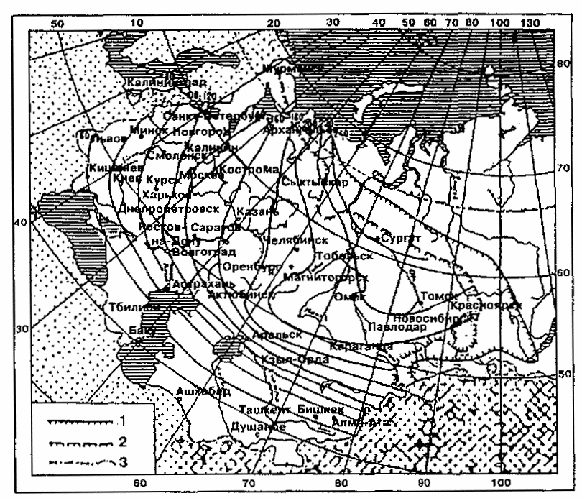 {.cell-align-center}||
  || _1_ - граница сплошного распространения вечномерзлых грунтов; _2_ - то же, островного; _3_ - границы стран СНГ. 
  
  **Карта изолиний глубины промерзания грунтов на территории СНГ** ||
  |#

  #|
  || 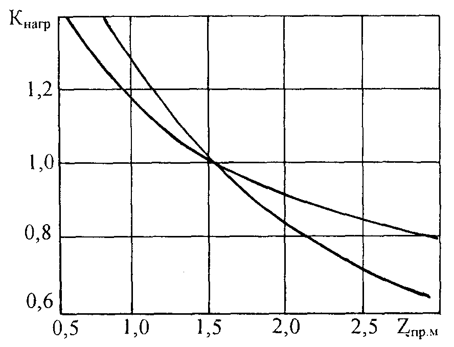 {.cell-align-center}||
  || _1_ - супесь тяжелая и пылеватая; суглинок; _2_ - песок; супесь легкая, крупная. 
  
  **Зависимость коэффициента $К_{нагр}$ от глубины промерзания $z_{пр}$ от поверхности покрытия**||
  |#

  

  {#218-046-01-ugv}

  В данном поле задается величина расстояния от низа дорожной одежды до расчетного уровня грунтовой воды или длительно стоящей поверхностной воды, определяемая по данным изысканий. Учитывается при определении величины возможного морозного пучения (согласно **ОДН 218.046-01**, рис 4.1).

  #|
  || 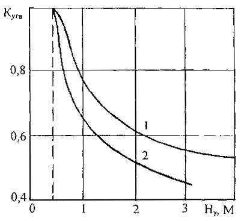 {.cell-align-center}||
  || _1_ - супесь тяжелая и тяжелая пылеватая, суглинок; _2_ - песок, супесь легкая и легкая крупная.
  
  **Зависимость коэффициента $К_{УГВ}$ расстояния от низа дорожной одежды до расчетного УГВ или УПВ**||
  |#

  

  {#218-046-01-uplotnenie}

  Значение коэффициента уплотнения грунта рабочего слоя земляного полотна выбирается из выпадающего списка. Учитывается при определении величины возможного морозного пучения (согласно **ОДН 218.046-01**, табл. 4.4).

  #|
  || **Коэффициент уплотнения $К_{упл}$** {.cell-align-center}| **$К_{пл}$** {.cell-align-center}|>||
  || ^ | **песок пылеватый, супесь легкая и пылеватая, суглинки, глины** {.cell-align-center}| **пески кроме пылеватых, супесь легкая крупная** {.cell-align-center}||
  || 1 {.cell-align-center}| 2 {.cell-align-center}| 3 {.cell-align-center}||
  || 1,03 - 1,00 {.cell-align-center}| 0,8 {.cell-align-center}| 1,0 {.cell-align-center}||
  || 1,01 - 0,98 {.cell-align-center}| 1,0 {.cell-align-center}| 1,0 {.cell-align-center}||
  || 0,97 - 0,95 {.cell-align-center}| 1,2 {.cell-align-center}| 1,1 {.cell-align-center}||
  || 0,94 - 0,90 {.cell-align-center}| 1,3 {.cell-align-center}| 1,2 {.cell-align-center}||
  || менее 0,90 {.cell-align-center}| 1,5 {.cell-align-center}| 1,3 {.cell-align-center}||
  |#

  

  {#218-046-01-shirina}

  Используется для нахождения коэффициента А ( **ОДН 218.3.039-2003**, таблица 4.2), а также для расчета параметров осушения по [номограммам расчета](draining?tabs=draining-archive_odn-218-046-01#218-046-01-nomogrammi).

  #|
  || **№ п/п** | **Средняя суточная интенсивность движения, расчетных автомобилей, авт./сут** {.cell-align-center}| **Коэффициент А** {.cell-align-center}|>|>|>|>|>|>|>||
  || ^ | ^ | **Ширина проезжей части, м.** {.cell-align-center}|>|>|>|>|>|>|>||
  || ^ | ^ | 7,0 {.cell-align-center}| 7.5 {.cell-align-center}| 10,5 {.cell-align-center}| >10,5 {.cell-align-center}| 7,0 {.cell-align-center}| 7.5 {.cell-align-center}| 10,5 {.cell-align-center}| >10,5 {.cell-align-center}||
  || ^ | ^ | **Покрытие обочин аналогично по виду покрытиям усовершенствованного типа** {.cell-align-center}|>|>|>| **Покрытие обочин не аналогично по виду покрытиям усовершенствованного типа** {.cell-align-center}|>|>|>||
  || 1 {.cell-align-center}| 1000 {.cell-align-center}| Расчет ведется при коэффициенте А, равном 0,001 {.cell-align-center}|>|>|>|>|>|>|>||
  || 2 {.cell-align-center}| 2000 {.cell-align-center}| 0,006 | ^ |>|>|>|>|>|>||
  || 3 {.cell-align-center}| 3000 {.cell-align-center}| 0,012 | 0,004 | 0,003 | 0,003 | ^ |>|>|>||
  || 4 {.cell-align-center}| 4000 {.cell-align-center}| 0,02 | 0,003 | 0,004 | 0,0035 | 0.003 | ^ |>|>||
  || 5 {.cell-align-center}| 5000 {.cell-align-center}| 0,03 | 0,012 | 0,005 | 0,004 | 0.005 | 0.004 | 0.002 | ^ ||
  || 6 {.cell-align-center}| 6000 {.cell-align-center}| 0,04 | 0,016 | 0,007 | 0,005 | 0.007 | 0.005 | 0.003 | ^ ||
  || 7 {.cell-align-center}| 7000 {.cell-align-center}| 0,055 | 0,020 | 0,01 | 0,007 | 0.01 | 0.007 | 0.004 | 0.002 ||
  || 8 {.cell-align-center}| 8000 {.cell-align-center}| - | 0.035 | 0,02 | 0,012 | 0.012 | 0.01 | 0.006 | 0.003 ||
  || 9 {.cell-align-center}| 9000 {.cell-align-center}| - | 0,05 | 0,03 | 0,018 | 0.02 | 0.02 | 0.009 | 0.004 ||
  || 10 {.cell-align-center}| 10000 {.cell-align-center}| - | - | 0,04 | 0,024 | 0.04 | 0.03 | 0.015 | 0.006 ||
  || 11 {.cell-align-center}| >10000 {.cell-align-center}| - | - | 0,05 | 0,035 | - | - | 0.02 | 0.01 ||
  |#
  
  
  
  Если значение коэффициента А располагается ниже нижней ограничительной линии, необходимо уширение проезжей части дороги, так как укрепление обочин при этих значениях коэффициента А может привести к созданию экономически неэффективных конструкций.
  
  

  

  {#218-046-01-amplituda}

  Используется для расчета напряжения от перепада температур по толщине нижнего цементно-бетонного слоя (**МР**, формула 3.31).

  #|
  || **№ п/п** {.cell-align-center}| **Административный район** {.cell-align-center}| **Расчетная амплитуда колебаний температуры $t$ за сутки на поверхности асфальтобетонного покрытия $A_п$** {.cell-align-center}||
  || 1 {.cell-align-center}| 2 {.cell-align-center}| 3 {.cell-align-center}||
  || 1 {.cell-align-center}| Мурманская обл., Ненецкий АО | 11,5 {.cell-align-center}||
  || 2 {.cell-align-center}| АО, Архангельская, Ленинградская, Псковская, Новгородская, Кировская, Костромская, Ярославская, Камчатская области, республики: Коми, Карелия | 13,0 {.cell-align-center}||
  || 3 {.cell-align-center}| Новгородская, Вологодская, Пермская, Тверская, Калининградская, Московская, Смоленская, Брянская, Тульская, Орловская, Ульяновская, Магаданская области, Хабаровский край, республики: Марий Эл, Мордовия, Чувашия, Башкорстан | 15,0 {.cell-align-center}||
  || 4 {.cell-align-center}| Калужская, Рязанская, Курская, Белгородская, Воронежская, Тамбовская, Пензенская, Саратовская, Свердловская, Челябинская, Томская области, Республика Беларусь, Приморский край, республики: Татарстан, Бурятия, Саха (Якутия) - южная часть | 15,5 {.cell-align-center}||
  || 5 {.cell-align-center}| Ростовская, Волгоградская, Астраханская, Оренбургская, Курганская, Омская, Кемеровская, Иркутская, Амурская, Сахалинская области, Красноярсий край, республики: Северная Осетия, Дагестан, Алтай | 16,5 {.cell-align-center}||
  || 6 {.cell-align-center}| Читинская обл., Краснодарский, Ставропольский края, республики Закавказья, Средней Азии | 17,5 {.cell-align-center}||
  |#

  

  Данный параметр учитывается только при расчете асфальтобетонного покрытия на цементо-бетонном основании. 

  

  

- ВСН-21-83 {#vsn-21-83}

  

  На данной вкладке описаны параметры, относящиеся к общим данным расчета. Параметры, относящиеся к [нагрузкам](loads.md?tabs=loads-archive_vsn-21-83) и [вариантам сравнения](variants_comparison.md?tabs=variants-comparison_vsn-21-83), вынесены в соответствующие разделы.

  {#21-83-klimat}

  Выбор дорожно-климатической зоны осуществляется по карте ( **ОДН 218.046-01**, приложение 2, рис. П 2.2) или принимается по таблице (приложение 2, табл. П 2.7).
  
  **Карта дорожно-климатических зон и подзон**
  
  
  
   - Границы дорожно-климатических зон; 
   - Границы дорожно-климатических подзон
    
  #|
  || **Дорожно-климатическая зона и подзона** {.cell-align-center}| **Примерные географические границы** {.cell-align-center}||
  || 1  {.cell-align-center}| 2 {.cell-align-center}||
  || I  {.cell-align-center}| Севернее линии, соединяющей Нивский - Сосновку - Новый Бор - Щельябож - Сыню - Суеватпуль - Белоярский - Ларьяк - Усть-Озерное - Ярцево - Канск - Выезжий Лог -Усть - Золотую - Сарыч - Сеп - Новоселово - Иню - Артыбаш - государственную границу - Симоново - Биробиджан - Болонь - Многовершиный. Включает географические зоны тундры, лесотундры и северо-восточную часть лесной зоны с распространением вечномерзлых грунтов ||
  || I1 {.cell-align-center}| Расположена севернее линии Нарьян-Мар - Салехард - Курейка - Трубка Удачная - Верхоянск - Дружина - Горный Мыс - Марково ||
  || I2 {.cell-align-center}| Расположена восточнее линии устье р. Нижней Тунгуски - Ербогачен, Ленск - Бодайбо - Богдарин и севернее линии Могоча - Сковородино - Зая - Охотск - Палатка - Слаутсткое. Ограничена с севера I1 подзоной ||
  || II {.cell-align-center}| От границы I зоны до линии, соединяющей Львов - Житомир - Тулу - Н. Новгород - Ижевск - Томск - Канск. На Дальнем Востоке от границы I зоны до государственной границы. Включает географическую зону лесов с избыточным увлажнением грунтов ||
  || II1 {.cell-align-center}| С севера и востока ограничена I зоной, с запада - подзоной II3, с юга - линией Рославль - Клин - Рыбинск - Березники - Ивдель ||
  || II2 {.cell-align-center}| Ограничена с севера подзоной II1, с запада - подзоной II4, с юга - III зоной, с востока и южной границей I зоны ||
  || II3 {.cell-align-center}| С севера ограничена государственной границей, с запада -границей с подзоной II5, с юга - линией Рославль - Клин -Рыбинск, с востока - линией Псков - Смоленск - Орел ||
  || II4 {.cell-align-center}| Ограничена с севера подзоной Из, с запада - подзоной II6, с юга - границей с III зоной, с востока - линией Смоленск - Орел - Воронеж ||
  || II5 {.cell-align-center}| С севера и запада ограничена государственной границей, с востока - линией Минск - Бобруйск - Гомель, с юга - линией Барановичи - Рославль - Клин - Рыбинск ||
  || II6 {.cell-align-center}| С севера ограничена подзоной II5, с запада - государственной границей, с юга - границей с III зоной, с востока - линией Минск - Бобруйск - Гомель ||
  || III {.cell-align-center}| От южной границы II зоны до линии, соединяющей Кишинев - Кировоград - Белгород - Самару - Магнитогорск - Омск - Бийск - Туран. Включает лесостепную географическую зону со значительным увлажнением грунтов в отдельные годы ||
  || III1 {.cell-align-center}| Ограничена с севера зоной II, с запада - подзоной III2, с юга - IV зоной, с востока - I зоной ||
  || III2 {.cell-align-center}| Ограничена с севера зоной II, с запада - подзоной III3, с юга - зоной IV, с востока - линией Смоленск - Орел - Воронеж ||
  || III3 {.cell-align-center}| Ограничена с севера зоной II, с запада - государственной границей, с юга - зоной IV, с востока - линией Бобруйск - Гомель - Харьков ||
  || IV {.cell-align-center}| Расположена от границы III зоны до линии, соединяющей Джульфу - Степанакерт - Кизляр - Волгоград и далее проходит южнее на 200 км линии, соединяющей Уральск - Актюбинск - Караганду. Включает географическую степную зону с недостаточным увлажнением грунтов ||
  || V {.cell-align-center}| Расположена к юго-западу и югу от границы IV зоны и включает пустынную и пустынно-степную географические зоны с засушливым климатом и распространением засоленных грунтов ||
  |#

  

  {#21-83-kategoriya}

  Принимается от 1 до 5 категории по заданию на проектирование.

  

  {#21-83-polosy}

  Принимается согласно заданию на проектирование:

  * **I категория** – 4 или 6 полос (учитываются только полосы, предназначенные для грузового движения);
  * **II–IV категории** – 2 полосы;
  * **V категория** – 1 полоса.

  В зависимости от количества полос движения назначается коэффициент полосности (согласно **ОДН 218.046-01**, табл. 3.2), учитываемый при определении суммарного расчетного числа приложений расчетной нагрузки, к точке на поверхности конструкции, за срок службы дорожной одежды.

  #|
  || **Число полос движения** | **Значение коэффициента $f_{пол}$ для полосы с номером от обочины** |>|>||
  || ^ | 1 {.cell-align-center}| 2 {.cell-align-center}| 3 {.cell-align-center}||
  || 1 {.cell-align-center}| 1,00 {.cell-align-center}| - {.cell-align-center}| - {.cell-align-center}||
  || 2 {.cell-align-center}| 0,55 {.cell-align-center}| - {.cell-align-center}| - {.cell-align-center}||
  || 3 {.cell-align-center}| 0,50 {.cell-align-center}| 0,50 {.cell-align-center}| - {.cell-align-center}||
  || 4 {.cell-align-center}| 0,35 {.cell-align-center}| 0,20 {.cell-align-center}| - {.cell-align-center}||
  || 6 {.cell-align-center}| 0,30 {.cell-align-center}| 0.20 {.cell-align-center}| 0,05 {.cell-align-center}||
  |# 

  

  {#21-83-diskont}

  Коэффициент приводящий затраты будущих лет к исходному году, задается в долях единицы. Рекомендуемые значения из Энциклопедии дорожника «Проектирование автомобильных дорог, том 5 М. 2005» представлены ниже:

  #|
  || **Сценарии прогноза ежегодно прироста ВВП** {.cell-align-center}| **Характеристика территории** {.cell-align-center}|>|>||
  || ^ | **неосвоенные и малоосвоенные территории**{.cell-align-center}| **города с численностью населения более 500 тыс. человек** {.cell-align-center}| **прочие территории** {.cell-align-center}||
  || менее 3% {.cell-align-center}| 6% {.cell-align-center}| 8% {.cell-align-center}| 7% {.cell-align-center}||
  || 3-4% {.cell-align-center}| 7% {.cell-align-center}| 11% {.cell-align-center}| 9% {.cell-align-center}||
  || 5% и более {.cell-align-center}| 8% {.cell-align-center}| 12% {.cell-align-center}| 10% {.cell-align-center}||
  |#

  

  {#21-83-shirina}

  Данное значение используется в том случае, если в качестве единицы сравнения вариантов выбран параметр - **Длина**.

  

- ОДН 218.1.052-2002 {#odn-218-1-052-2002}

  

  На вкладке **Общие данные** задаются основные параметры дороги, а также характеристики района ее проектирования.

  {#218-1-052-2002-raion}

  В данном поле вводится название области проектируемого объекта. В зависимости от указанной области определяется коэффициент, учитывающий продолжительность расчётного периода и агрессивность воздействия расчетных автомобилей в разных погодно-климатических условиях (согласно **ОДН 218.1.052-2002**, табл 5.1 и 5.2 прил. 6), на основе которого рассчитывается требуемый модуль упругости дорожной конструкции.

  

  {#218-1-052-2002-obekt}

  В данном поле задается название объекта (участка) рассчитываемой дорожной одежды. Его заполнение также не является обязательным.

  

  {#218-1-052-2002-relef}

  Принимается согласно **ОДН 218.046-01**, приложение 2, табл. П.2.2. Учитывается в качестве первой поправки на влажность при определении расчетных характеристик грунта земляного полотна.

  Возможны следующие типы местности по рельефу:

  * **Равнинные районы**;
  * **Предгорные районы (до 1000 м над у.м.)**;
  * **Горные районы (более 1000 м над у.м.)**.

  #|
  || **№ п/п** {.cell-align-center}| **Тип местности по рельефу** {.cell-align-center}| **Поправка $Δ_1\overline{W}$** {.cell-align-center}||
  || 1 {.cell-align-center}| 2 {.cell-align-center}| 3 {.cell-align-center}||
  || 1 {.cell-align-center}| Равнинные районы {.cell-align-center}| 0,00 {.cell-align-center}||
  || 2 {.cell-align-center}| Предгорные районы (до 1000 м в.у.м.) {.cell-align-center}| 0,03 {.cell-align-center}||
  || 3 {.cell-align-center}| Горные районы (более 1000 м в.у.м.) {.cell-align-center}| 0.05 {.cell-align-center}||
  |#

  

  {#218-1-052-2002-klimat}

  Выбор дорожно-климатической зоны осуществляется по карте ( **ОДН 218.046-01**, приложение 2, рис. П 2.2) или принимается по таблице (приложение 2, табл. П 2.7).

  **Карта дорожно-климатических зон и подзон**

  

   - Границы дорожно-климатических зон; 
   - Границы дорожно-климатических подзон

  #|
  || **Дорожно-климатическая зона и подзона** {.cell-align-center}| **Примерные географические границы** {.cell-align-center}||
  || 1 {.cell-align-center}| 2 {.cell-align-center}||
  || I {.cell-align-center}| Севернее линии, соединяющей Нивский - Сосновку - Новый Бор - Щельябож - Сыню - Суеватпуль - Белоярский - Ларьяк - Усть-Озерное - Ярцево - Канск - Выезжий Лог -Усть - Золотую - Сарыч - Сеп - Новоселово - Иню - Артыбаш - государственную границу - Симоново - Биробиджан - Болонь - Многовершиный. Включает географические зоны тундры, лесотундры и северо-восточную часть лесной зоны с распространением вечномерзлых грунтов ||
  || I1 {.cell-align-center}| Расположена севернее линии Нарьян-Мар - Салехард - Курейка - Трубка Удачная - Верхоянск - Дружина - Горный Мыс - Марково ||
  || I2 {.cell-align-center}| Расположена восточнее линии устье р. Нижней Тунгуски - Ербогачен, Ленск - Бодайбо - Богдарин и севернее линии Могоча - Сковородино - Зая - Охотск - Палатка - Слаутсткое. Ограничена с севера I1 подзоной ||
  || II {.cell-align-center}| От границы I зоны до линии, соединяющей Львов - Житомир - Тулу - Н. Новгород - Ижевск - Томск - Канск. На Дальнем Востоке от границы I зоны до государственной границы. Включает географическую зону лесов с избыточным увлажнением грунтов ||
  || II1 {.cell-align-center}| С севера и востока ограничена I зоной, с запада - подзоной II3, с юга - линией Рославль - Клин - Рыбинск - Березники - Ивдель ||
  || II2 {.cell-align-center}| Ограничена с севера подзоной II1, с запада - подзоной II4, с юга - III зоной, с востока и южной границей I зоны ||
  || II3 {.cell-align-center}| С севера ограничена государственной границей, с запада -границей с подзоной II5, с юга - линией Рославль - Клин -Рыбинск, с востока - линией Псков - Смоленск - Орел ||
  || II4 {.cell-align-center}| Ограничена с севера подзоной Из, с запада - подзоной II6, с юга - границей с III зоной, с востока - линией Смоленск - Орел - Воронеж ||
  || II5 {.cell-align-center}| С севера и запада ограничена государственной границей, с востока - линией Минск - Бобруйск - Гомель, с юга - линией Барановичи - Рославль - Клин - Рыбинск ||
  || II6 {.cell-align-center}| С севера ограничена подзоной II5, с запада - государственной границей, с юга - границей с III зоной, с востока - линией Минск - Бобруйск - Гомель ||
  || III {.cell-align-center}| От южной границы II зоны до линии, соединяющей Кишинев - Кировоград - Белгород - Самару - Магнитогорск - Омск - Бийск - Туран. Включает лесостепную географическую зону со значительным увлажнением грунтов в отдельные годы ||
  || III1 {.cell-align-center}| Ограничена с севера зоной II, с запада - подзоной III2, с юга - IV зоной, с востока - I зоной ||
  || III2 {.cell-align-center}| Ограничена с севера зоной II, с запада - подзоной III3, с юга - зоной IV, с востока - линией Смоленск - Орел - Воронеж ||
  || III3 {.cell-align-center}| Ограничена с севера зоной II, с запада - государственной границей, с юга - зоной IV, с востока - линией Бобруйск - Гомель - Харьков ||
  || IV {.cell-align-center}| Расположена от границы III зоны до линии, соединяющей Джульфу - Степанакерт - Кизляр - Волгоград и далее проходит южнее на 200 км линии, соединяющей Уральск - Актюбинск - Караганду. Включает географическую степную зону с недостаточным увлажнением грунтов ||
  || V {.cell-align-center}| Расположена к юго-западу и югу от границы IV зоны и включает пустынную и пустынно-степную географические зоны с засушливым климатом и распространением засоленных грунтов ||
  |#

  

  {#218-1-052-2002-uvlazhnenie}

  Принимается согласно **ОДН 218.046-01**, табл. 5.1. Учитывается при определении расчетной влажности грунта земляного полотна.

  Возможны следующие схемы увлажнения:

  * 1 – **сухие места** (источники увлажнения - атмосферные осадки);
  * 2 – **сырые места с избыточным увлажнением в отдельные периоды года** (источники увлажнения - кратковременно стоящие (до 30 сут) поверхностные воды, атмосферные осадки);
  * 3 – **мокрые места с постоянным избыточным увлажнением** (источники увлажнения - грунтовые или длительно стоящие (болеее 30 сут) поверхностные воды, атмосферные осадки).

  #|
  || **Схема увлажнения рабочего слоя** {.cell-align-center}| **Источники увлажнения** {.cell-align-center}| **Условия отнесения к данному типу увлажнения** {.cell-align-center}||
  || 1 {.cell-align-center}| 2 {.cell-align-center}| 3 {.cell-align-center}||
  || 1 {.cell-align-center}| Атмосферные осадки | Для насыпей на участках 1-го типа местности по условиям увлажнения. ||
  || ^ | ^ | Для насыпей на участках местности 2-го и 3-го типов по условиям увлажнения, при возвышении поверхности покрытия над расчетным уровнем грунтовых и поверхностных вод или над поверхностью земли, более чем в 1,5 раза превышающем требования табл. 5.2. ||
  || ^ | ^ | Для насыпей на участках 2-го типа, при расстоянии от уреза поверхностной воды (отсутствующей не менее 2/3 летнего периода) более 5 - 10 м. при супесях; 2 - 5 м. при легких пылеватых суглинках и 2 м. при тяжелых пылеватых суглинках и глинах (меньшие значения следует принимать для грунтов с большим числом пластичности; при залегании различных грунтов - принимать большие значения). ||
  || ^ | ^ | В выемках в песчаных и глинистых грунтах, при уклонах кюветов более 20 %о (в I - III дорожно-климатических зонах) и при возвышении поверхности покрытия над расчетным горизонтом грунтовых вод, более чем в 1,5 раза превышающем требования табл. 5.2. При применении специальных методов регулирования водно-теплового режима (капилляропрерывающего, гидроизолирующего, теплоизолирующего; армирующих прослоек, дренажа и т.п.), назначаемых по специальным расчетам. ||
  || 2 {.cell-align-center}| Кратковременно стоящие (до 30 сут.) поверхностные воды, атмосферные осадки | Для насыпей на участках 2-го типа местности, по условиям увлажнения при возвышении поверхности покрытия не менее требуемого по табл. 5.2 и не более чем в 2 раза превышающем эти требования, при крутизне откосов не менее 1:1,5 и простом (без берм) поперечном профиле насыпи. ||
  || ^ | ^ | Для насыпей на участках 3-го типа местности, при применении специальных мероприятий по защите от грунтовых вод (капилляропрерывающие слои, дренаж), назначаемых по специальным расчетам, отсутствии длительно (более 30 сут) стоящих поверхностных вод и выполнении условий предыдущего абзаца. В выемках в песчаных и глинистых грунтах, при уклонах кюветов менее 20 %о (в I, II .зонах) и возвышении поверхности покрытия над расчетным уровнем грунтовых вод, более чем в 1,5 раза превышающем требования табл. 5.2. ||
  || 3 {.cell-align-center}| Грунтовые или длительно (более 30 сут.) стоящие поверхностные воды; атмосферные осадки | Для насыпей на участках 3-го типа местности по условиям увлажнения, при возвышении поверхности покрытия, отвечающем требованиям табл. 5.2, но не превышающем их более чем в 1,5 раза. То же для выемок, в основании которых имеется уровень грунтовых вод, расположение которого по глубине не превышает требований табл. 5.2 более чем в 1,5 раза ||
  |#

  

  {#218-1-052-2002-kategoriya}

  Принимается от 1 до 5 категории по заданию на проектирование.

  

  {#218-1-052-2002-vlazhnost}

  Принимается согласно **ОДН 218.046-01**, табл. П.2.3 Учитывается в качестве второй поправки на влажность при определении расчетных характеристик грунта земляного полотна.

  Поправка вводится при устройстве следующих мероприятий:

  * Наличия основания из укрепленных материалов и грунтов (при 1-ой схеме увлажнения рабочего слоя);
  * Укрепления обочин асфальтобетоном или щебнем (при 1-ой схеме увлажнения рабочего слоя);
  * Наличия дренажа с продольными дренами;
  * Устройства гидроизолирующих прослоек из полимерных материалов;
  * Устройства теплоизолирующего слоя, предотвращающего промерзание при 2-ой и 3-ей схеме увлажнения рабочего слоя;
  * Устройства грунта активной зоны земляного полотна в обойме;
  * Уплотнения грунта до $К_{упл.}$= 1,03–1,05 в слое толщиной 0,3–0,5 м. от низа дорожной одежды, расположенном ниже границы промерзания.

  #|
  || **№ п/п** {.cell-align-center}| **Конструктивная особенность** {.cell-align-center}| **Поправка $Δ_2\overline{W}$ в дорожно-климатических зонах** {.cell-align-center}|>|>|>||
  || ^ | ^ | II {.cell-align-center}| III {.cell-align-center}| IV {.cell-align-center}| V {.cell-align-center}||
  || 1 {.cell-align-center}| 2 {.cell-align-center}| 3 {.cell-align-center}| 4 {.cell-align-center}| 5 {.cell-align-center}| 6 {.cell-align-center}||
  || 1 {.cell-align-center}| Наличие основания дорожной одежды, включая слои на границе раздела с земляным полотном, из укрепленных материалов и грунтов: |>|>|>|>||
  || ^ | - крупнообломочного грунта и песка | 0,04 {.cell-align-center}| 0,04 {.cell-align-center}| 0,03 {.cell-align-center}| 0,03 {.cell-align-center}||
  || ^ | - супеси | 0,05 {.cell-align-center}| 0,05 {.cell-align-center}| 0,05 {.cell-align-center}| 0,04 {.cell-align-center}||
  || ^ | - пылеватых песков и супесей, суглинка, зологрунта | 0,08 {.cell-align-center}| 0,08 {.cell-align-center}| 0,06 {.cell-align-center}| 0.05 {.cell-align-center}||
  || 2 {.cell-align-center}| Укрепление обочин (не менее 2/3 их ширины): |>|>|>|>||
  || ^ | - асфальтобетоном | 0,05 {.cell-align-center}| 0,04 {.cell-align-center}| 0,03 {.cell-align-center}| 0,02 {.cell-align-center}||
  || ^ | - щебнем (гравием) | 0,02 {.cell-align-center}| 0,02 {.cell-align-center}| 0,02 {.cell-align-center}| 0,02 {.cell-align-center}||
  || 3 {.cell-align-center}| Дренаж с продольными трубчатыми дренами | 0,05 {.cell-align-center}| 0.03 {.cell-align-center}| - {.cell-align-center}| - {.cell-align-center}||
  || 4 {.cell-align-center}| Устройство гидроизолирующих прослоек из полимерных материалов | 0,05 {.cell-align-center}| 0,05 {.cell-align-center}| 0,03 {.cell-align-center}| 0,03 {.cell-align-center}||
  || 5 {.cell-align-center}| Устройство теплоизолирующего слоя, предотвращающего промерзание | Снижение расчетной влажности до величины полной влагоемкости при требуемом $К_{упл.}$ грунта |>|>|>||
  || 6 {.cell-align-center}| Грунт в активной зоне земляного полотна в «обойме» | Снижение расчетной влажности до оптимальной |>|>|>||
  || 7 {.cell-align-center}| Грунт, уплотненный до $К_{упл.}$= 1,03-1,05 в слое 0,3-0,5 м от низа дорожной одежды, расположенный ниже границы промерзания | - {.cell-align-center}| 0,03-0,05 {.cell-align-center}| 0,03-0,05 {.cell-align-center}| 0,03-0,05 {.cell-align-center}||
  |#

  

  Поправки $Δ_2\overline{W}$ при мероприятиях по п.п. 1 и 2 следует принимать только при 1-й схеме увлажнения рабочего слоя, а по п. 5 - при 2-й и 3-й схемах.

  

  

  {#218-1-052-2002-odezhda}

  Возможны следующие варианты (согласно **ОДН 218.046-01**, табл 1.1):

  * **Капитальный**;
  * **Облегченный**;
  * **Переходный**.

  #|
  || **Типы дорожных одежд** {.cell-align-center}| **Виды покрытий, материал и способы его укладки** {.cell-align-center}||
  || 1 {.cell-align-center}| 2 {.cell-align-center}||
  || Усовершенствованные покрытия |>||
  || Капитальные | из горячих асфальтобетонных смесей ||
  || Облегченные | а) из горячих асфальтобетонных смесей ||
  || ^ | б) из холодных асфальтобетонных смесей ||
  || ^ | в) из органоминеральных смесей с жидкими, органическими, вяжущими; с жидкими, органическими, вяжущими совместно с минеральными; с вязкими, в том числе эмульгированными, органическими, вяжущими; с эмульгированными, органическими, вяжущими совместно с минеральными; из каменных материалов и грунтов, обработанных методами пропитки или битумом по способу смешения на дороге; из каменных материалов, обработанных органическими, вяжущими методами пропитки; черного щебня, приготовленного в установке и уложенного по способу заклинки; из пористой и высокопористой асфальтобетонной смеси с поверхностной обработкой; из прочного щебня с двойной поверхностной обработкой ||
  || Покрытия переходные |>||
  || Переходные | из щебня прочных пород, устроенные по способу заклинки без применения вяжущих материалов; из фунтов и малопрочных каменных материалов, укрепленных вяжущими; булыжного и колотого камня (мостовые) ||
  || Низшие | из щебеночно-гравийно-песчаных смесей; малопрочных каменных материалов и шлаков; грунтов, укрепленных или улучшенных различными местными материалами; древесных материалов и др. ||
  |#

  

  Если необходимо выполнить расчет для дорожной одежды низшего типа, то в данном поле следует выбрать тип **Переходный**. 

  

  

  {#218-1-052-2002-polosy}

  Принимается согласно заданию на проектирование:

  * **I категория** – 4 или 6 полос (учитываются только полосы, предназначенные для грузового движения);
  * **II–IV категории** – 2 полосы;
  * **V категория** – 1 полоса.

  В зависимости от количества полос движения назначается коэффициент полосности (согласно **ОДН 218.046-01**, табл. 3.2), учитываемый при определении суммарного расчетного числа приложений расчетной нагрузки, к точке на поверхности конструкции, за срок службы дорожной одежды.

  #|
  || **Число полос движения** {.cell-align-center}| **Значение коэффициента $f_{пол}$ для полосы с номером от обочины** {.cell-align-center}|>|>||
  || ^ | 1 {.cell-align-center}| 2 {.cell-align-center}| 3 {.cell-align-center}||
  || 1 {.cell-align-center}| 1,00 {.cell-align-center}| - {.cell-align-center}| - {.cell-align-center}||
  || 2 {.cell-align-center}| 0,55 {.cell-align-center}| - {.cell-align-center}| - {.cell-align-center}||
  || 3 {.cell-align-center}| 0,50 {.cell-align-center}| 0,50 {.cell-align-center}| - {.cell-align-center}||
  || 4 {.cell-align-center}| 0,35 {.cell-align-center}| 0,20 {.cell-align-center}| - {.cell-align-center}||
  || 6 {.cell-align-center}| 0,30 {.cell-align-center}| 0.20 {.cell-align-center}| 0,05 {.cell-align-center}||
  |#

  

  {#218-1-052-2002-polotno}

  Возможны следующие варианты:

  * **Насыпь**;
  * **Нулевые места (рабочая отметка меньше 1 м)**;
  * **Выемка**.

  Тип земляного полотна учитывается при определении среднего многолетнего значения относительной влажности грунта (согласно **ОДН 218.046-01**, табл. П. 2.1).

  #|
  || **Дорожно-климатические зоны** {.cell-align-center}| **Дорожно-климатические подзоны** {.cell-align-center}| **Схема увлажнения рабочего слоя земляного полотна** {.cell-align-center}| **Среднее значение влажности $\overline{W}$ таб грунта, доли от $W_{T}$** {.cell-align-center}|>|>|>||
  || ^ | ^ | ^ | **супесь легкая** {.cell-align-center}| **песок пылеватый** {.cell-align-center}| **суглинок легкий** {.cell-align-center}| **супесь пылеватая и суглинок пылеватый** {.cell-align-center}||
  || 1 {.cell-align-center}| 2 {.cell-align-center}| 3 {.cell-align-center}| 4 {.cell-align-center}| 5 {.cell-align-center}| 6 {.cell-align-center}| 7 {.cell-align-center}||
  || I {.cell-align-center}| I1 {.cell-align-center}| 1 {.cell-align-center}| 0,53 {.cell-align-center}| 0.57 {.cell-align-center}| 0.62 {.cell-align-center}| 0.65 {.cell-align-center}||
  || ^ | ^ | 2 {.cell-align-center}| 0,55 {.cell-align-center}| 0.59 {.cell-align-center}| 0.65 {.cell-align-center}| 0.67 {.cell-align-center}||
  || ^ | ^ | 3 {.cell-align-center}| 0.57 {.cell-align-center}| 0.62 {.cell-align-center}| 0.67 {.cell-align-center}| 0.70 {.cell-align-center}||
  || ^ | I2 {.cell-align-center}| 1 {.cell-align-center}| 0.57 {.cell-align-center}| 0.57 {.cell-align-center}| 0.62 {.cell-align-center}| 0.65 {.cell-align-center}||
  || ^ | ^ | 2 {.cell-align-center}| 0.59 {.cell-align-center}| 0.62 {.cell-align-center}| 0.67 {.cell-align-center}| 0.70 {.cell-align-center}||
  || ^ | ^ | 3 {.cell-align-center}| 0.62 {.cell-align-center}| 0.65 {.cell-align-center}| 0.70 {.cell-align-center}| 0.75 {.cell-align-center}||
  || ^ | I3 {.cell-align-center}| 1 {.cell-align-center}| 0.60 {.cell-align-center}| 0.62 {.cell-align-center}| 0.65 {.cell-align-center}| 0.70 {.cell-align-center}||
  || ^ | ^ | 2 {.cell-align-center}| 0.62 {.cell-align-center}| 0.65 {.cell-align-center}| 0.70 {.cell-align-center}| 0.75 {.cell-align-center}||
  || ^ | ^ | 3 {.cell-align-center}| 0.65 {.cell-align-center}| 0.70 {.cell-align-center}| 0.75 {.cell-align-center}| 0.80 {.cell-align-center}||
  || II {.cell-align-center}| II1 {.cell-align-center}| 1 {.cell-align-center}| 0.60 {.cell-align-center}| 0.62 {.cell-align-center}| 0.65 {.cell-align-center}| 0.70 {.cell-align-center}||
  || ^ | ^ | 2 {.cell-align-center}| 0,63 {.cell-align-center}| 0.65 {.cell-align-center}| 0.68 {.cell-align-center}| 0.73 {.cell-align-center}||
  || ^ | ^ | 3 {.cell-align-center}| 0.65 {.cell-align-center}| 0.67 {.cell-align-center}| 0.70 {.cell-align-center}| 0.75 {.cell-align-center}||
  || ^ | II2 {.cell-align-center}| 1 {.cell-align-center}| 0.57 {.cell-align-center}| 0.59 {.cell-align-center}| 0.62 {.cell-align-center}| 0.67 {.cell-align-center}||
  ||^ | ^ | 2 {.cell-align-center}| 0.60 {.cell-align-center}| 0.62 {.cell-align-center}| 0.65 {.cell-align-center}| 0.70 {.cell-align-center}||
  || ^ | ^ | 3 {.cell-align-center}| 0.62 {.cell-align-center}| 0.64 {.cell-align-center}| 0.67 {.cell-align-center}| 0.72 {.cell-align-center}||
  || ^ | II3 {.cell-align-center}| 1 {.cell-align-center}| 0.63 {.cell-align-center}| 0.65 {.cell-align-center}| 0.68 {.cell-align-center}| 0.73 {.cell-align-center}||
  || ^ | ^ | 2 {.cell-align-center}| 0.66 {.cell-align-center}| 0.68 {.cell-align-center}| 0.71 {.cell-align-center}| 0.76 {.cell-align-center}||
  || ^ | ^ | 3 {.cell-align-center}| 0.68 {.cell-align-center}| 0.70 {.cell-align-center}| 0.73 {.cell-align-center}| 0.78 {.cell-align-center}||
  || ^ | II4 {.cell-align-center}| 1 {.cell-align-center}| 0.60 {.cell-align-center}| 0.62 {.cell-align-center}| 0.65 {.cell-align-center}| 0.70 {.cell-align-center}||
  || ^ | ^ | 2 {.cell-align-center}| 0,63 {.cell-align-center}| 0.65 {.cell-align-center}| 0.68 {.cell-align-center}| 0.73 {.cell-align-center}||
  || ^ | ^ | 3 {.cell-align-center}| 0.65 {.cell-align-center}| 0.67 {.cell-align-center}| 0.70 {.cell-align-center}| 0.75 {.cell-align-center}||
  || ^ | II5 {.cell-align-center}| 1 {.cell-align-center}| 0.65 {.cell-align-center}| 0.67 {.cell-align-center}| 0.70 {.cell-align-center}| 0.75 {.cell-align-center}||
  || ^ | ^ | 2 {.cell-align-center}| 0.68 {.cell-align-center}| 0.70 {.cell-align-center}| 0.73 {.cell-align-center}| 0.78 {.cell-align-center}||
  || ^ | ^ | 3 {.cell-align-center}| 0.70 {.cell-align-center}| 0.72 {.cell-align-center}| 0.75 {.cell-align-center}| 0.80 {.cell-align-center}||
  || ^ | II6 {.cell-align-center}| 1 {.cell-align-center}| 0.62 {.cell-align-center}| 0.64 {.cell-align-center}| 0.67 {.cell-align-center}| 0.72 {.cell-align-center}||
  || ^ | ^ | 2 {.cell-align-center}| 0.65 {.cell-align-center}| 0.67 {.cell-align-center}| 0.70 {.cell-align-center}| 0.75 {.cell-align-center}||
  || ^ | ^ | 3 {.cell-align-center}| 0.67 {.cell-align-center}| 0.69 {.cell-align-center}| 0.72 {.cell-align-center}| 0.77 {.cell-align-center}||
  || III {.cell-align-center}| III1 {.cell-align-center}| 1 {.cell-align-center}| 0.55 {.cell-align-center}| 0.57 {.cell-align-center}| 0.60 {.cell-align-center}| 0.63 {.cell-align-center}||
  || ^ | ^ | 2 - 3 {.cell-align-center}| 0,59 {.cell-align-center}| 0.61 {.cell-align-center}| 0.63 {.cell-align-center}| 0.67 {.cell-align-center}||
  || ^ | III2 {.cell-align-center}| 1 {.cell-align-center}| 0.58 {.cell-align-center}| 0.60 {.cell-align-center}| 0.63 {.cell-align-center}| 0.66 {.cell-align-center}||
  || ^ | ^ | 2 - 3 {.cell-align-center}| 0.62 {.cell-align-center}| 0.64 {.cell-align-center}| 0.66 {.cell-align-center}| 0.70 {.cell-align-center}||
  || ^ | III3 {.cell-align-center}| 1 {.cell-align-center}| 0.55 {.cell-align-center}| 0.57 {.cell-align-center}| 0.60 {.cell-align-center}| 0.63 {.cell-align-center}||
  || ^ | ^ | 2 - 3 {.cell-align-center}| 0.59 {.cell-align-center}| 0.61 {.cell-align-center}| 0.63 {.cell-align-center}| 0.67 {.cell-align-center}||
  || VI {.cell-align-center}| 1 {.cell-align-center}|>| 0.53 {.cell-align-center}| 0.55 {.cell-align-center}| 0.57 {.cell-align-center}| 0.60 {.cell-align-center}||
  || ^ | 2-3 {.cell-align-center}|>| 0.57 {.cell-align-center}| 0.58 {.cell-align-center}| 0.60 {.cell-align-center}| 0.64 {.cell-align-center}||
  || V {.cell-align-center}| 1 {.cell-align-center}|>| 0.52 {.cell-align-center}| 0.53 {.cell-align-center}| 0.54 {.cell-align-center}| 0.57 {.cell-align-center}||
  || ^ | 2-3 {.cell-align-center}|>| 0.55 {.cell-align-center}| 0.56 {.cell-align-center}| 0.57 {.cell-align-center}| 0.60 {.cell-align-center}||
  |#

  

  Табличными значениями $\overline{W}_{таб.}$ можно пользоваться только при обеспечении возвышения земляного полотна в соответствии со СНиП. На участках, где возвышение не обеспечивается (например, в нулевых местах и в выемках с близким залеганием грунтовых вод), величина $\overline{W}_{таб.}$ назначается индивидуально по данным прогнозов, но она должна быть не менее чем на 0,03 выше табличных значений.

  

  

